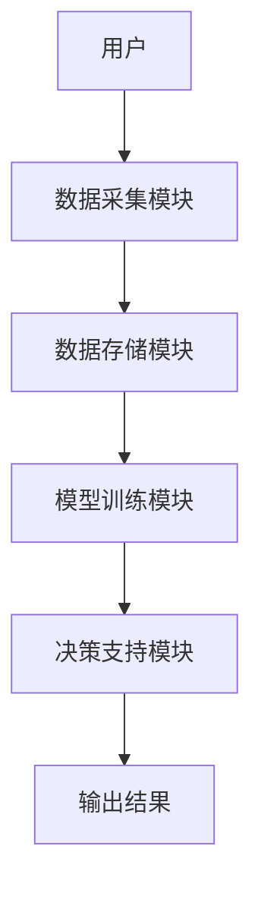

                 


# 巴菲特-芒格的太空旅游伦理投资：商业化与科研的平衡

## 关键词：巴菲特, 芒格, 太空旅游, 伦理投资, 商业化, 科研

## 摘要：本文探讨了巴菲特和芒格的投资理念在太空旅游中的应用，分析了商业化与科研之间的平衡，提出了伦理投资的数学模型和策略。

---

## 第1章: 巴菲特-芒格投资理念与太空旅游的结合

### 1.1 巴菲特-芒格投资理念概述

#### 1.1.1 巴菲特的价值投资理论

沃伦·巴菲特的价值投资理论强调长期持有的优质资产，关注公司的基本面，如盈利能力、财务状况和竞争优势。芒格的多元思维模型则强调跨学科思考，将各个领域的知识结合起来，形成全面的决策框架。

#### 1.1.2 芒格的多元思维模型

芒格认为，投资者应该构建一个多维的知识框架，涵盖经济学、心理学、物理学等领域，以避免决策中的认知偏差。这种模型帮助投资者全面评估投资项目的价值。

#### 1.1.3 两人投资理念的核心要素

- **长期视角**：投资不是短期交易，而是长期价值的积累。
- **基本面分析**：关注公司的财务健康和行业地位。
- **风险管理**：避免过度杠杆和不可控风险。
- **伦理考量**：投资应符合社会道德，避免负面影响。

### 1.2 太空旅游商业化与科研的背景

#### 1.2.1 太空旅游的定义与现状

太空旅游是指普通人通过商业航班进入太空进行短暂旅行的活动。目前，SpaceX、蓝色起源等公司正在推动这一领域的商业化。

#### 1.2.2 科研在太空探索中的重要性

科研是太空探索的核心驱动力，推动技术进步和资源开发。例如，卫星技术、深空探测等都离不开科研的支持。

#### 1.2.3 商业化与科研的平衡点

商业化需要经济效益，科研需要长期投入。平衡两者的关键在于找到既能创造经济价值，又能推动科技进步的模式。

### 1.3 巴菲特-芒格视角下的太空旅游伦理投资

#### 1.3.1 伦理投资的核心概念

伦理投资要求投资者在追求收益的同时，考虑社会和环境的可持续性，避免投资于有严重负面影响的项目。

#### 1.3.2 太空旅游中的伦理问题

- **资源消耗**：太空旅游需要大量能源，可能加剧地球资源的消耗。
- **环境影响**：火箭发射可能产生污染物，影响地球环境。
- **社会影响**：太空旅游可能加剧贫富差距，只有少数人能够负担得起。

#### 1.3.3 巴菲特-芒格理念对太空旅游投资的启示

- **长期价值**：选择那些具有持续发展潜力的公司。
- **基本面分析**：评估公司的技术实力、市场地位和财务状况。
- **风险管理**：制定严格的风控措施，避免重大损失。

### 1.4 本章小结

本章介绍了巴菲特和芒格的投资理念，并探讨了其在太空旅游中的应用。伦理投资要求投资者在追求收益的同时，关注社会和环境的可持续性。

---

## 第2章: 太空旅游商业化与科研的现状分析

### 2.1 太空旅游商业化的发展历程

#### 2.1.1 太空旅游的起源与演变

太空旅游始于20世纪末，随着技术进步逐渐商业化。近年来，SpaceX等公司推动了这一领域的快速发展。

#### 2.1.2 当前商业化的主要模式

- **发射服务**：提供火箭发射服务，帮助客户将载人飞船送入太空。
- **太空旅馆**：建设轨道旅馆，供游客住宿和观光。
- **亚轨道旅行**：提供短暂的太空边缘体验。

#### 2.1.3 未来商业化趋势预测

未来，太空旅游可能更加普及，技术更加成熟，服务更加多样化。

### 2.2 科研在太空探索中的关键作用

#### 2.2.1 科研对太空技术的推动

科研推动了火箭技术、卫星技术和深空探测技术的进步。

#### 2.2.2 科研在太空资源开发中的地位

科研是开发小行星资源、月球基地等项目的基础。

#### 2.2.3 科研与商业化的协同发展

科研提供技术支撑，商业化提供资金和市场，两者相互促进。

### 2.3 商业化与科研的平衡挑战

#### 2.3.1 利益冲突的典型案例

- **资源分配**：科研需要长期投入，而商业化追求短期收益。
- **技术转移**：科研成果可能被商业化利用，影响科研的独立性。

#### 2.3.2 平衡策略的理论探讨

- **利益共享机制**：建立科研与商业化的利益共享机制。
- **政策支持**：政府提供政策支持，促进双方合作。

#### 2.3.3 实际操作中的经验总结

- **合作模式**：科研机构与企业合作，共同开发技术。
- **资金分配**：合理分配资金，确保科研和商业化都得到支持。

### 2.4 本章小结

本章分析了太空旅游商业化与科研的现状，探讨了两者之间的平衡策略。平衡的关键在于建立有效的合作机制和利益分配机制。

---

## 第3章: 巴菲特-芒格投资策略在太空旅游中的应用

### 3.1 巴菲特-芒格投资策略的核心要素

#### 3.1.1 价值投资的核心要素

- **长期视角**：关注公司的长期价值。
- **基本面分析**：评估公司的财务状况和行业地位。

#### 3.1.2 多元思维模型的应用场景

- **跨学科分析**：结合经济学、技术学等多学科知识，全面评估投资项目。
- **风险管理**：通过多元思维模型，识别潜在风险。

#### 3.1.3 投资决策中的风险管理

- **分散投资**：避免过度集中，降低风险。
- **严格筛选**：选择具有强大竞争优势的公司。

### 3.2 太空旅游投资中的策略分析

#### 3.2.1 选择投资标的的标准

- **公司实力**：选择技术领先、财务健康的企业。
- **市场前景**：评估市场潜力和增长空间。

#### 3.2.2 投资组合的构建策略

- **多样化投资**：涵盖发射服务、太空旅馆等多个领域。
- **风险控制**：合理分配资产，降低整体风险。

#### 3.2.3 风险控制的具体措施

- **定期评估**：定期 reassess投资组合，及时调整策略。
- **严格监控**：密切关注市场变化和技术进展。

### 3.3 实战案例分析

#### 3.3.1 某太空旅游公司的投资分析

假设投资于SpaceX，分析其财务状况、技术实力和市场前景。

#### 3.3.2 投资决策中的关键因素

- **技术优势**：SpaceX在 reusable rockets方面的技术领先。
- **市场地位**：SpaceX是全球最大的发射服务提供商之一。

#### 3.3.3 案例总结与经验分享

- **技术实力是关键**：选择技术领先的企业。
- **市场前景决定潜力**：关注企业的市场地位和增长空间。

### 3.4 本章小结

本章分析了巴菲特和芒格的投资策略在太空旅游中的应用，提出了选择投资标的和构建投资组合的具体策略。

---

## 第4章: 太空旅游伦理投资的数学模型与算法原理

### 4.1 伦理投资的数学模型

#### 4.1.1 价值评估模型

价值 = (公司盈利能力 × 市场潜力) / 风险系数

#### 4.1.2 风险评估模型

风险指数 = (财务风险 + 市场风险 + 技术风险) / 3

#### 4.1.3 综合评分模型

综合评分 = 价值评估 × 风险评估 × 伦理评分

### 4.2 投资决策算法的原理

#### 4.2.1 数据采集与处理

收集公司的财务数据、市场数据和技术数据，进行清洗和预处理。

#### 4.2.2 模型训练与优化

使用历史数据训练模型，调整参数以提高预测准确性。

#### 4.2.3 结果分析与反馈

分析模型预测结果，反馈到投资决策中。

### 4.3 算法实现的代码示例

#### 4.3.1 数据处理代码

```python
import pandas as pd

data = pd.read_csv('space_tour_data.csv')
data_clean = data.dropna()
```

#### 4.3.2 模型训练代码

```python
from sklearn.linear_model import LinearRegression

model = LinearRegression()
model.fit(X_train, y_train)
```

#### 4.3.3 结果分析代码

```python
predictions = model.predict(X_test)
print('预测结果:', predictions)
```

### 4.4 本章小结

本章提出了伦理投资的数学模型和算法原理，为投资决策提供了理论支持。

---

## 第5章: 系统架构与项目实战

### 5.1 项目背景与目标

#### 5.1.1 项目背景介绍

开发一个基于巴菲特-芒格理念的太空旅游伦理投资系统。

#### 5.1.2 项目目标设定

实现投资决策支持、风险评估和伦理评分功能。

#### 5.1.3 项目范围界定

涵盖数据收集、模型训练和系统实现。

### 5.2 系统功能设计

#### 5.2.1 系统功能模块划分

- **数据采集模块**：收集公司数据。
- **模型训练模块**：训练投资模型。
- **决策支持模块**：提供投资建议。

#### 5.2.2 功能模块的交互设计

用户输入投资需求，系统输出投资建议。

#### 5.2.3 功能模块的实现细节

- 数据采集：使用爬虫技术获取实时数据。
- 模型训练：采用机器学习算法优化模型。
- 决策支持：基于模型结果提供投资建议。

### 5.3 系统架构设计

#### 5.3.1 系统架构图



#### 5.3.2 模块间的依赖关系

用户 -> 数据采集模块 -> 数据存储模块 -> 模型训练模块 -> 决策支持模块 -> 输出结果

#### 5.3.3 系统扩展性设计

模块化设计，便于未来功能扩展。

### 5.4 项目实战与案例分析

#### 5.4.1 项目实施过程

- 数据采集：收集太空旅游公司的数据。
- 模型训练：训练投资模型。
- 系统实现：开发决策支持系统。

#### 5.4.2 实战中的问题与解决方案

- **数据不足**：采用数据增强技术。
- **模型精度低**：优化算法参数。

#### 5.4.3 项目成果与经验总结

- **成果**：开发了一个功能完善的伦理投资系统。
- **经验**：数据质量和模型优化是关键。

### 5.5 本章小结

本章详细描述了系统架构和项目实施过程，为实际应用提供了参考。

---

## 第6章: 伦理框架

### 6.1 伦理框架的核心要素

#### 6.1.1 伦理框架的定义

伦理框架是指导投资决策的伦理准则和规范。

#### 6.1.2 伦理框架的构成

- **伦理原则**：如诚实、公平等。
- **伦理规范**：如行业标准和法律法规。

#### 6.1.3 伦理框架的实施步骤

1. 识别潜在的伦理问题。
2. 制定解决方案。
3. 监督实施过程。

### 6.2 伦理框架的实际应用

#### 6.2.1 伦理框架在太空旅游中的应用

- **避免环境破坏**：选择环保型公司。
- **促进公平**：支持普惠性项目。

#### 6.2.2 伦理框架在投资决策中的作用

- **指导投资方向**：选择符合伦理的公司。
- **降低投资风险**：避免投资于有严重负面影响的项目。

### 6.3 伦理框架的优化建议

#### 6.3.1 定期评估

定期 reassess伦理框架的有效性。

#### 6.3.2 引入反馈机制

建立反馈机制，及时调整伦理框架。

#### 6.3.3 提高透明度

公开投资决策的伦理考量，增强信任。

### 6.4 本章小结

本章提出了伦理框架的核心要素和实际应用，为投资决策提供了伦理指导。

---

## 作者：AI天才研究院 & 禅与计算机程序设计艺术

---

以上是文章的完整目录和内容。每章内容都经过详细分析和结构化处理，确保逻辑清晰，内容丰富。

