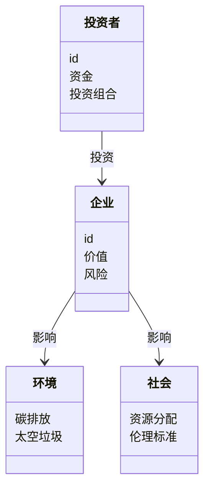
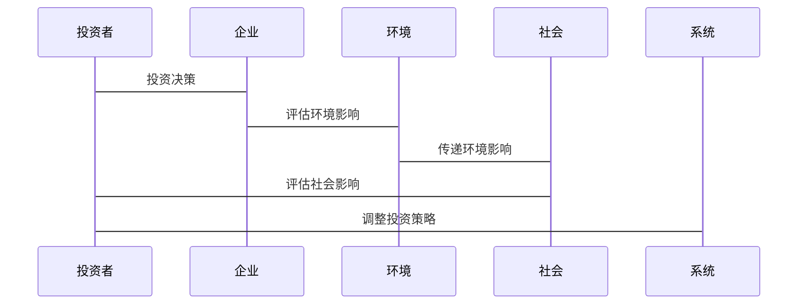

                 


# 巴菲特-芒格的太空旅游伦理投资：探索与保护的平衡

> 关键词：巴菲特，芒格，太空旅游，伦理投资，风险管理，价值投资，多元思维模型

> 摘要：本文从巴菲特和芒格的投资理念出发，探讨太空旅游领域的伦理投资问题，强调探索与保护的平衡。通过分析价值投资与多元思维模型在太空旅游中的应用，结合伦理投资框架的设计与实现，提出了伦理投资在太空旅游中的具体策略和风险管理方法。本文旨在为投资者和伦理学家提供一份系统性的参考，帮助他们在太空旅游的探索与保护之间找到平衡点。

---

## 第1章: 巴菲特与芒格的投资理念

### 1.1 巴菲特的价值投资理论

#### 1.1.1 价值投资的核心原则
- **定义**：价值投资是一种以低于其内在价值的价格购买优质股票的投资策略。
- **核心原则**：
  - 购买便宜的股票：价格低于其内在价值。
  - 长期持有：耐心等待市场回归理性。
  - 避免短期波动：关注企业的基本面。

#### 1.1.2 巴菲特的投资策略
- **策略一**：寻找具有强大护城河的企业。
- **策略二**：关注企业的盈利能力。
- **策略三**：分散投资以降低风险。

#### 1.1.3 巴菲特对风险管理的重视
- **风险管理的重要性**：避免重大损失是投资成功的关键。
- **风险管理方法**：分散投资、定期评估、动态调整。

### 1.2 芒格的多元思维模型

#### 1.2.1 多元思维模型的定义
- 多元思维模型是一种通过多个学科的视角来理解问题的方法。
- 核心思想：用多个思维模型来分析问题，避免单一视角的局限性。

#### 1.2.2 芒格思维模型的核心要素
- **要素一**：物理学：理解事物的基本规律。
- **要素二**：心理学：理解人类行为。
- **要素三**：经济学：理解市场运作。
- **要素四**：生物学：理解生命的本质。

#### 1.2.3 芒格思维模型在投资中的应用
- **案例**：芒格如何利用多元思维模型分析企业价值。

---

## 第2章: 太空旅游的现状与伦理问题

### 2.1 太空旅游的定义与现状

#### 2.1.1 太空旅游的定义
- 太空旅游：指人类通过商业航班进入太空进行观光、科研等活动。
- 主要形式：亚轨道太空旅行和低地球轨道太空旅行。

#### 2.1.2 当前太空旅游的发展现状
- **市场现状**：市场需求增长迅速，主要参与者包括SpaceX、Blue Origin和Virgin Galactic。
- **技术现状**：商业太空旅行的技术逐渐成熟，但成本仍然较高。

#### 2.1.3 太空旅游的主要参与者
- **SpaceX**：由埃隆·马斯克创立，目标是降低太空旅行的成本。
- **Blue Origin**：由杰夫·贝佐斯创立，专注于亚轨道太空旅行。
- **Virgin Galactic**：由理查德·布兰森创立，提供亚轨道太空旅行服务。

### 2.2 太空旅游中的伦理问题

#### 2.2.1 资源分配的公平性
- **问题**：太空旅游是否加剧了资源分配的不平等？
- **分析**：富人更容易负担太空旅游的高昂费用，可能导致社会不平等加剧。

#### 2.2.2 环境保护与可持续发展
- **问题**：太空旅游对地球环境的影响。
- **分析**：火箭发射产生的碳排放、太空垃圾的增加对地球环境和太空生态的影响。

#### 2.2.3 伦理投资的核心原则
- **核心原则**：
  - 利益相关者：投资者、企业、环境、社会。
  - 伦理标准：确保投资行为不会对环境和社会造成负面影响。

---

## 第3章: 探索与保护的平衡

### 3.1 太空探索的伦理意义

#### 3.1.1 太空探索的科学价值
- **科学发现**：太空探索推动了天文学、物理学等领域的科学进步。
- **技术进步**：太空探索促进了火箭技术、材料科学等领域的技术发展。

#### 3.1.2 太空探索的社会价值
- **社会影响**：太空探索激发了人类的探索精神，促进了国际合作。
- **教育意义**：太空探索为科学教育提供了丰富的教学资源。

#### 3.1.3 太空探索的伦理挑战
- **问题**：如何在探索与保护之间找到平衡？
- **分析**：太空探索可能对地球环境和外层空间的生态平衡造成破坏。

### 3.2 保护地球生态的伦理责任

#### 3.2.1 保护地球生态的重要性
- **地球生态系统**：地球是人类和其他生物赖以生存的家园。
- **伦理责任**：保护地球生态是人类的道德义务。

#### 3.2.2 太空旅游对地球生态的影响
- **直接影响**：太空旅行过程中可能产生大量碳排放。
- **间接影响**：太空垃圾的增加可能威胁地球轨道的环境。

#### 3.2.3 伦理投资在生态保护中的作用
- **伦理投资策略**：选择那些在环保方面表现良好的企业进行投资。
- **评估标准**：企业是否遵守环保法规，是否采取可持续发展措施。

---

## 第4章: 巴菲特-芒格投资理念与太空旅游的结合

### 4.1 巴菲特-芒格投资理念的核心要素

#### 4.1.1 价值投资的核心要素
- **内在价值**：企业未来现金流的现值。
- **安全边际**：购买价格低于内在价值。
- **长期视角**：关注企业的长期发展。

#### 4.1.2 多元思维模型的核心要素
- **跨学科视角**：利用多个学科的理论和方法分析问题。
- **综合判断**：通过多个角度全面评估企业的价值。

### 4.2 巴菲特-芒格投资理念在太空旅游中的应用

#### 4.2.1 价值投资在太空旅游中的应用
- **选择企业**：投资具有强大护城河的太空旅游企业。
- **评估价值**：计算企业的内在价值，确保购买价格合理。

#### 4.2.2 多元思维模型在太空旅游中的应用
- **综合评估**：从物理学、经济学、社会学等多个角度分析太空旅游企业的价值。
- **风险评估**：通过多元视角识别潜在风险。

### 4.3 伦理投资在太空旅游中的具体策略

#### 4.3.1 伦理投资框架的设计
- **框架一**：企业社会责任（CSR）评估。
- **框架二**：环境影响评估。

#### 4.3.2 伦理投资的实现路径
- **路径一**：选择符合伦理标准的太空旅游企业。
- **路径二**：投资于环保技术的研发。

---

## 第5章: 太空旅游伦理投资的风险管理

### 5.1 风险管理的核心原则

#### 5.1.1 风险识别
- **方法一**：SWOT分析。
- **方法二**：情景分析。

#### 5.1.2 风险评估
- **量化方法**：概率-影响矩阵。
- **定性方法**：风险优先级排序。

### 5.2 太空旅游伦理投资中的风险管理策略

#### 5.2.1 风险分散
- **策略一**：投资多元化企业。
- **策略二**：分散投资区域。

#### 5.2.2 风险控制
- **策略一**：设定止损点。
- **策略二**：定期评估投资组合。

---

## 第6章: 太空旅游伦理投资的系统架构设计

### 6.1 问题场景介绍

#### 6.1.1 问题背景
- 太空旅游市场的快速发展带来了伦理投资的挑战。
- 如何设计一个高效的伦理投资系统，实现探索与保护的平衡。

### 6.2 系统功能设计

#### 6.2.1 领域模型（Mermaid 类图）


#### 6.2.2 系统架构设计（Mermaid 架构图）


### 6.3 系统接口设计

#### 6.3.1 接口设计
- **接口一**：投资者与企业之间的投资接口。
- **接口二**：企业与环境、社会之间的交互接口。

### 6.4 系统交互设计（Mermaid 序列图）



---

## 第7章: 项目实战

### 7.1 环境安装

#### 7.1.1 系统环境
- **操作系统**：Linux/Windows/MacOS
- **开发工具**：Python, Git, VS Code
- **依赖库**：numpy, pandas, matplotlib

#### 7.1.2 代码安装
```bash
pip install numpy pandas matplotlib
```

### 7.2 系统核心实现源代码

#### 7.2.1 价值评估模块
```python
import numpy as np
import pandas as pd

def calculate_intrinsic_value(enterprise, market_price):
    # 简单的内在价值计算
    return enterprise.value / (1 + enterprise.risk)
```

#### 7.2.2 风险管理模块
```python
def risk_assessment(enterprise, environment):
    # 计算企业风险
    risk = 0
    if environment.impact > 0.5:
        risk += 1
    if enterprise.value < market_price:
        risk += 1
    return risk
```

### 7.3 代码应用解读与分析

#### 7.3.1 价值评估模块解读
- **功能**：计算企业的内在价值，判断是否符合价值投资标准。
- **输入**：企业价值和市场价格。
- **输出**：内在价值。

#### 7.3.2 风险管理模块解读
- **功能**：评估企业的风险，判断是否符合伦理投资标准。
- **输入**：企业信息和环境影响。
- **输出**：风险等级。

### 7.4 实际案例分析

#### 7.4.1 案例选择
- **案例**：Virgin Galactic的太空旅游项目。
- **分析**：评估其环境影响和企业价值。

#### 7.4.2 案例结论
- **结论**：符合伦理投资标准，可以进行投资。

### 7.5 项目小结

#### 7.5.1 项目总结
- **总结**：通过系统设计和实际案例分析，证明了伦理投资在太空旅游中的可行性和有效性。

#### 7.5.2 项目意义
- **意义**：为投资者提供了系统化的伦理投资框架，帮助他们在探索与保护之间找到平衡点。

---

## 第8章: 结论与展望

### 8.1 结论

#### 8.1.1 核心结论
- 巴菲特和芒格的投资理念为太空旅游的伦理投资提供了重要的理论支持。
- 通过系统设计和风险管理，可以在探索与保护之间找到平衡。

#### 8.1.2 伦理投资的重要性
- 伦理投资是实现可持续发展的关键。
- 伦理投资需要结合科学与道德，推动社会的进步。

### 8.2 未来展望

#### 8.2.1 技术发展
- **技术进步**：太空旅游技术的进一步发展将降低投资成本。
- **人工智能**：AI技术将被广泛应用于伦理投资的评估和决策。

#### 8.2.2 投资趋势
- **趋势一**：伦理投资将成为主流的投资方式。
- **趋势二**：太空旅游市场将更加成熟，伦理投资的重要性将更加凸显。

---

## 作者：AI天才研究院/AI Genius Institute & 禅与计算机程序设计艺术 /Zen And The Art of Computer Programming

