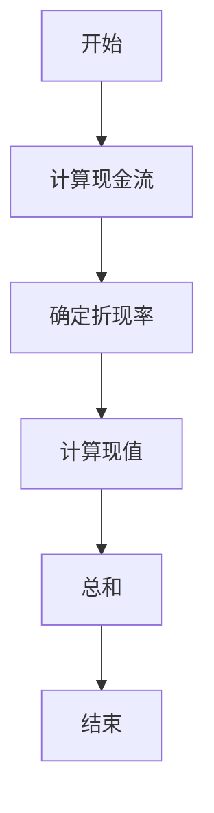

                 


# 巴菲特-芒格的太空经济投资：未来前沿的潜力

---

## 关键词：
太空经济、巴菲特、芒格、投资策略、技术驱动、未来趋势

---

## 摘要：
本文深入分析巴菲特和芒格在太空经济领域的投资策略，探讨其背后的逻辑与潜力。通过背景介绍、核心概念、算法原理、系统架构设计以及项目实战，全面解析太空经济的投资机会与挑战。文章结合技术与商业视角，为投资者提供有价值的投资策略和未来趋势展望。

---

## 第一部分：背景介绍

### 1.1 太空经济的概念与定义
太空经济是指与太空相关的商业活动，涵盖卫星互联网、火箭技术、深空探索等领域。它不仅是科技发展的产物，也是全球经济的重要组成部分。

#### 核心领域：
- **卫星互联网**：提供全球互联网服务，市场需求巨大。
- **火箭技术**：降低发射成本，推动商业航天发展。
- **深空探索**：资源开发和科学研究的潜力。

### 1.2 巴菲特与芒格的投资理念
- **巴菲特**：价值投资，注重企业基本面和长期价值。
- **芒格**：多元思维模型，关注多个领域的相互联系。

### 1.3 太空经济投资的潜力与挑战
- **潜力**：技术进步和市场需求推动增长。
- **挑战**：高投入、高风险、技术壁垒。

---

## 第二部分：核心概念与联系

### 2.1 核心概念对比
| **属性**       | **太空经济**          | **传统经济**         |
|----------------|----------------------|----------------------|
| 主要驱动力     | 技术创新             | 人力资源             |
| 市场规模       | 全球性                | 地区性                |
| 投资风险       | 高                   | 中低                 |

### 2.2 ER实体关系图
```mermaid
erDiagram
    customer[投资者] {
        id
        名称
        投资金额
    }
    company[企业] {
        id
        名称
        业务领域
    }
    investment[investments] {
        id
        投资者id
        企业id
        投资金额
        时间
    }
    customer --> investment : 进行投资
    company --> investment : 获得资金
```

---

## 第三部分：算法原理讲解

### 3.1 数学模型：基于现金流的评估
现金流模型用于评估企业的投资价值：

$$ \text{内在价值} = \sum_{t=1}^{n} \frac{\text{现金流}_t}{(1 + r)^t} $$

其中，$r$为折现率，$n$为投资期限。

### 3.2 代码实现
```python
def calculate_intrinsic_value(cash_flows, discount_rate, periods):
    iv = 0
    for t in range(periods):
        iv += cash_flows[t] / (1 + discount_rate) ** t
    return iv

# 示例
cash_flows = [100, 200, 300]
discount_rate = 0.1
periods = 3

iv = calculate_intrinsic_value(cash_flows, discount_rate, periods)
print(f"内在价值：{iv}")
```

### 3.3 流程图


---

## 第四部分：系统分析与架构设计方案

### 4.1 系统功能需求
- **数据收集**：收集太空经济相关数据。
- **分析模块**：使用现金流模型评估企业价值。
- **可视化模块**：展示分析结果。

### 4.2 系统架构设计


### 4.3 接口设计
- **输入接口**：接收投资者数据。
- **输出接口**：展示分析结果。

---

## 第五部分：项目实战与最佳实践

### 5.1 项目实战
创建一个虚拟投资案例，分析某卫星互联网企业的投资价值，应用现金流模型进行评估。

### 5.2 最佳实践
- **持续学习**：关注行业动态和技术进步。
- **分散投资**：降低风险。
- **长期视角**：注重企业的长期价值。

---

## 小结
通过本文的分析，读者可以深入了解巴菲特和芒格在太空经济的投资策略，掌握相关的技术驱动因素和未来趋势。结合数学模型和系统架构设计，为投资者提供科学的投资决策支持。

---

## 作者：AI天才研究院 & 禅与计算机程序设计艺术

---

