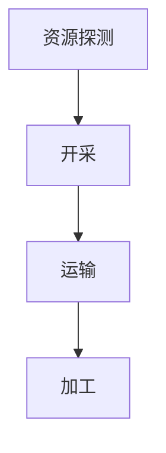

                 

# 巴菲特-芒格的太空资源开发投资：星际经济的先行者

## 关键词

- 巴菲特，芒格，太空资源，投资策略，星际经济，风险管理

## 摘要

本文探讨了巴菲特和芒格在太空资源开发投资中的策略与见解，分析了他们在星际经济中的先驱作用。文章从投资理念、技术应用、经济模式和风险管理等方面展开，结合实际案例，详细阐述了巴菲特和芒格如何将传统投资哲学应用于新兴的太空经济领域，为投资者提供了深刻的见解和借鉴。

---

### 第一部分：巴菲特和芒格的投资理念

#### 第1章：巴菲特和芒格的投资哲学

##### 1.1 巴菲特的投资理念

###### 1.1.1 价值投资的核心原则

价值投资是巴菲特投资哲学的核心，他强调购买具有内在价值的公司，而非关注市场的短期波动。他的投资理念可以用以下公式表示：

$$
\text{内在价值} = \sum_{t=1}^{\infty} \frac{\text{现金流}_t}{(1 + r)^t}
$$

其中，\( r \) 是折现率，现金流是公司未来产生的现金流。巴菲特通过分析公司的财务报表、管理层能力和竞争优势，寻找具有持续盈利能力的企业。

###### 1.1.2 巴菲特的长期投资策略

巴菲特主张长期持有优质资产，避免频繁交易。他认为市场的短期波动不应影响长期投资决策，而是应该关注企业的基本面。以下是他的长期投资策略的关键点：

1. **买入并持有**：选择具有强大竞争优势的企业，长期持有。
2. **集中投资**：将资金集中在少数优质企业上，而非分散投资。
3. **安全边际**：买入价格低于内在价值的企业，以确保安全边际。

###### 1.1.3 巴菲特的选股标准

巴菲特选股注重企业的财务健康、管理层素质和行业地位。他提出的“五护城河”模型（经济护城河、管理层护城河、财务护城河、竞争优势护城河、治理结构护城河）帮助企业识别具备长期竞争优势的企业。

##### 1.2 芒格的多元思维模型

###### 1.2.1 多元思维模型的定义

芒格提出多元思维模型，强调将不同学科的基本原理结合起来，形成跨领域的思维框架。这种模型帮助投资者避免单一视角的局限性。例如，物理学中的能量守恒定律、心理学中的行为偏见等。

###### 1.2.2 芒格的决策框架

芒格的决策框架包括以下步骤：

1. **问题识别**：明确问题的本质。
2. **逆向思考**：从反方向思考，寻找问题的解决方案。
3. **跨学科分析**：运用多个学科的知识进行分析。
4. **决策判断**：基于多维度分析做出决策。

###### 1.2.3 芒格的逆向思维

逆向思维是芒格投资策略的重要组成部分。他建议投资者思考“什么情况下投资是不安全的”，从而避免潜在风险。例如，在考虑投资太空资源开发时，芒格会先分析可能失败的原因，再评估成功的机会。

##### 1.3 巴菲特和芒格的决策过程

###### 1.3.1 巴菲特的“安全边际”概念

安全边际是指企业市场价格与其内在价值之间的差距。巴菲特认为，安全边际提供了抵御市场波动的缓冲空间。

###### 1.3.2 芒格的“第二层思维”

芒格的第二层思维是指思考市场参与者的心理和行为，而非仅仅分析企业的财务数据。例如，在太空资源开发中，他可能会考虑投资者的心理预期对市场的影响。

###### 1.3.3 巴菲特和芒格的团队合作

巴菲特和芒格的合作基于互补性：巴菲特擅长企业评估，芒格擅长风险管理和决策框架。他们的合作模式为投资决策提供了双重保障。

---

### 第二部分：太空资源开发的背景与现状

#### 第2章：太空资源开发的背景

##### 2.1 太空资源开发的历史回顾

###### 2.1.1 太空探索的早期阶段

太空探索始于20世纪中叶，早期以政府主导的探月任务为主。例如，美国的阿波罗计划是人类首次登月的壮举。

###### 2.1.2 现代太空探索的兴起

随着技术进步和成本降低，私人企业如SpaceX和Blue Origin开始主导太空探索，推动了商业化进程。

###### 2.1.3 太空资源开发的现状

目前，小行星采矿和月球资源利用仍处于技术研发阶段，但已有一些公司和机构开始布局。

##### 2.2 太空资源开发的技术现状

###### 2.2.1 火星探测技术的发展

火星探测技术的进步为未来建立火星基地奠定了基础。例如，NASA的毅力号探测器发现了火星上可能存在液态水的证据。

###### 2.2.2 小行星采矿技术的进展

小行星采矿技术尚处于研发阶段，但已在实验室中取得了一些突破。例如， asteroid mining公司计划在2030年前实现小行星采矿商业化。

###### 2.2.3 月球资源利用的可能性

月球的水资源和矿产资源为未来建立月球基地提供了可能性。例如，登月任务中发现了月球南极可能存在大量水冰。

##### 2.3 太空资源开发的经济价值

###### 2.3.1 太空资源的潜在价值

小行星中的贵金属和稀有金属价值巨大，月球的资源可用于支持深空探测任务。

###### 2.3.2 太空资源开发的经济可行性

尽管技术门槛高，但一旦成功，回报可能非常丰厚。例如，小行星中的铂族金属价值可能超过百亿美元。

###### 2.3.3 太空资源开发的市场前景

随着技术进步和商业化进程，太空资源开发市场将逐步扩大。例如，SpaceX的星舰项目可能为未来的星际探索奠定基础。

---

### 第三部分：太空资源开发的技术应用

#### 第3章：小行星采矿技术

##### 3.1 小行星采矿的基本原理

###### 3.1.1 小行星的组成与资源分布

小行星主要由金属和硅基物质组成，可能含有丰富的贵金属和稀有金属。

###### 3.1.2 小行星采矿的技术挑战

采矿技术在太空中面临极端环境，如微重力、辐射和高温。

###### 3.1.3 小行星采矿的经济可行性

尽管技术难度高，但一旦成功，回报可能非常巨大。

##### 3.2 小行星采矿的技术流程

小行星采矿的技术流程包括资源探测、开采、运输和加工。以下是流程图：

---

### 第四部分：星际经济模式与商业生态

#### 第4章：星际经济模式

##### 4.1 太空资源开发的商业模式

###### 4.1.1 资源开发与销售

企业从小行星或月球上开采资源并出售给其他企业和政府机构。

###### 4.1.2 空间服务

提供太空运输、卫星发射等服务，为其他企业进入太空市场提供支持。

##### 4.2 太空资源开发的生态系统

###### 4.2.1 产业链整合

从资源开采到市场应用的完整产业链整合。

###### 4.2.2 技术合作与共享

企业之间通过技术合作降低开发成本，共享资源。

---

### 第五部分：风险管理与投资策略

#### 第5章：太空资源开发的风险管理

##### 5.1 太空资源开发的主要风险

###### 5.1.1 技术风险

技术研发失败可能导致项目失败。

###### 5.1.2 市场风险

市场需求不足可能导致投资失败。

##### 5.2 巴菲特和芒格的风险管理策略

###### 5.2.1 巴菲特的安全边际策略

通过安全边际降低投资风险。

###### 5.2.2 芒格的逆向思维

通过分析失败的可能性避免潜在风险。

##### 5.3 投资策略

###### 5.3.1 价值投资策略

寻找具有长期竞争优势的企业。

###### 5.3.2 风险分散策略

通过多样化投资降低风险。

---

### 第六部分：实际案例分析

#### 第6章：实际案例分析

##### 6.1 巴菲特和芒格的太空投资案例

###### 6.1.1 投资SpaceX

SpaceX是目前最成功的私人太空公司之一，巴菲特和芒格可能通过间接方式投资。

###### 6.1.2 其他太空资源开发公司

如 asteroid mining公司和Blue Origin等。

##### 6.2 案例分析总结

通过案例分析，可以发现巴菲特和芒格在太空投资中注重企业的长期竞争优势和风险管理。

---

### 结论与展望

巴菲特和芒格在太空资源开发投资中展现了卓越的洞察力和战略眼光。他们的投资策略为投资者提供了宝贵的借鉴。未来，随着技术进步和市场发展，太空资源开发将变得更加可行，投资机会也将不断增加。

---

### 作者信息

作者：AI天才研究院/AI Genius Institute & 禅与计算机程序设计艺术 /Zen And The Art of Computer Programming

