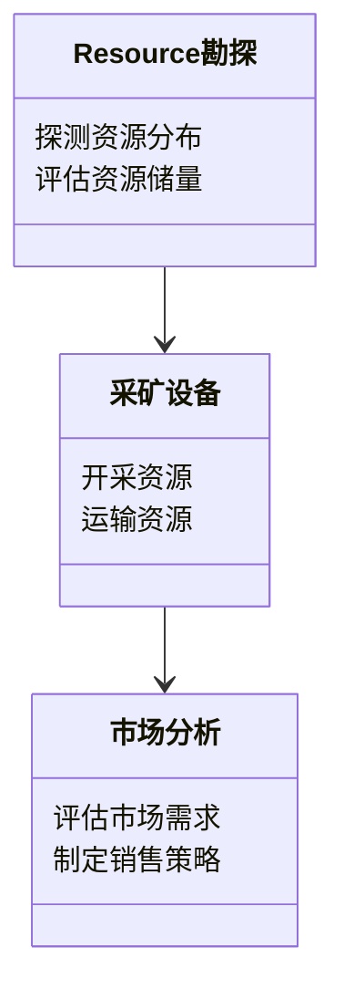
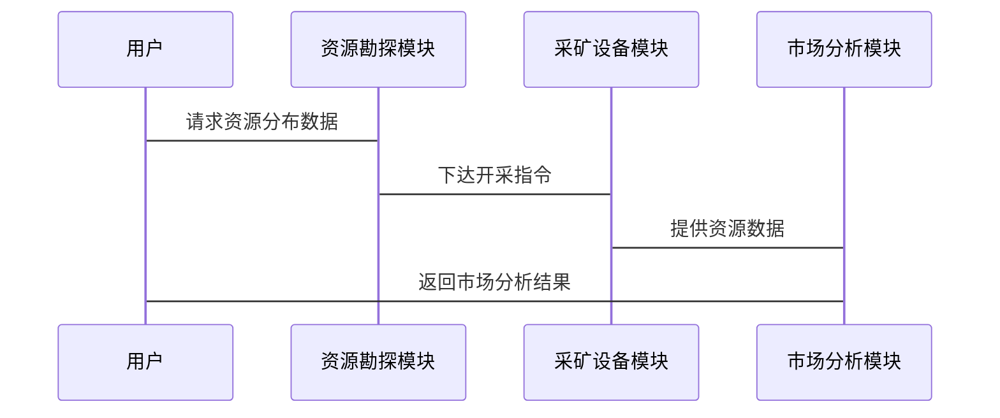

                 


```markdown
# 巴菲特-芒格的太空采矿伦理投资：资源开发与环境保护的平衡

## 关键词：巴菲特，芒格，太空采矿，伦理投资，资源开发，环境保护，可持续发展

## 摘要：  
本文探讨了巴菲特和芒格的投资理念在太空采矿领域的应用，重点分析了资源开发与环境保护的平衡问题。通过结合伦理投资框架、系统分析和实际案例，本文提出了实现可持续发展的策略和方法，为投资者和企业提供了宝贵的参考。

---

# 第一部分：引言

## 第1章：巴菲特与芒格的投资理念

### 1.1 巴菲特的价值投资理论

#### 1.1.1 巴菲特投资理念的核心思想  
巴菲特的价值投资理论强调长期主义、安全边际和企业内在价值。他主张投资那些具有强大竞争优势、良好治理和可持续盈利能力的企业。这种理念不仅关注财务回报，还注重企业的社会责任和长期发展。

#### 1.1.2 芒格的多元思维模型  
芒格的多元思维模型强调通过跨学科思考来理解复杂问题。他认为，投资者需要从物理学、心理学、经济学等多个角度分析问题，以避免认知偏差和错误决策。

#### 1.1.3 巴菲特与芒格投资理念的结合  
巴菲特和芒格的理念共同点在于长期主义和价值创造。他们的投资策略不仅关注短期收益，更注重企业的社会价值和可持续发展能力。

---

## 第2章：太空采矿的背景与现状

### 2.1 太空资源开发的背景

#### 2.1.1 太空资源的种类与分布  
太空资源主要包括 asteroidal metals（小行星金属）、lunar regolith（月球土壤）和 Martian minerals（火星矿物）。这些资源富含铂族金属、金、银和其他稀有元素，具有巨大的经济价值。

#### 2.1.2 太空采矿的技术挑战  
太空采矿的技术难点包括极端环境适应、资源勘探技术、自动化采矿设备开发和深空通信技术。这些技术的突破是实现太空采矿的前提条件。

#### 2.1.3 太空采矿的经济可行性  
尽管太空采矿的初始投资巨大，但其潜在回报也非常可观。随着技术进步和成本下降，太空资源开发的经济可行性将逐步提高。

### 2.2 当前太空采矿的发展现状

#### 2.2.1 国际太空采矿项目的进展  
近年来，美国、俄罗斯和欧洲国家都在积极推进太空采矿项目。例如，美国的Artemis计划旨在通过月球基地建设带动相关资源开发。

#### 2.2.2 主要参与者与投资动态  
SpaceX、Blue Origin和NASA等机构是太空采矿的主要参与者。私人企业的参与为太空采矿注入了新的活力，同时也带来了更多的投资机会。

#### 2.2.3 太空采矿的法律与政策框架  
目前，太空采矿的法律框架尚不完善。国际社会需要制定相关政策，明确资源所有权和开发权限。

---

# 第二部分：伦理投资框架

## 第3章：伦理投资的核心概念

### 3.1 伦理投资的定义与特征

#### 3.1.1 伦理投资的定义  
伦理投资是一种以社会责任和可持续发展为导向的投资方式。它不仅关注财务回报，还注重企业的社会价值和环境影响。

#### 3.1.2 伦理投资与传统投资的区别  
传统投资主要关注财务回报，而伦理投资则强调企业的社会责任和可持续发展能力。伦理投资更注重长期价值创造，而非短期收益。

#### 3.1.3 伦理投资的核心要素  
伦理投资的核心要素包括企业治理、社会责任、环境影响和透明披露。这些要素共同构成了伦理投资的框架。

### 3.2 巴菲特与芒格的伦理投资原则

#### 3.2.1 长期价值创造  
巴菲特和芒格认为，企业应该注重长期价值创造，而非短期利润。他们主张投资那些具有可持续发展能力的企业。

#### 3.2.2 社会责任与企业治理  
企业治理是伦理投资的重要组成部分。巴菲特和芒格强调企业应该承担社会责任，关注员工福利、环境保护和消费者权益。

#### 3.2.3 可持续发展与资源效率  
可持续发展是伦理投资的核心原则之一。企业应该通过技术创新和管理优化，提高资源利用效率，减少环境影响。

---

## 第4章：太空采矿中的伦理挑战

### 4.1 资源开发的伦理问题

#### 4.1.1 资源分配的公平性  
太空资源的开发应该公平分配，确保所有国家都能受益。如何在国际层面实现资源分配的公平性是一个重要问题。

#### 4.1.2 对其他星球生态的影响  
太空采矿可能对其他星球的生态系统造成破坏。企业应该采取措施，减少对其他星球环境的影响。

#### 4.1.3 资源开发的透明度  
透明度是伦理投资的重要原则。企业应该公开资源开发的详细信息，确保利益相关者的知情权。

### 4.2 环境保护与可持续发展

#### 4.2.1 太空采矿对地球环境的影响  
太空采矿可能会对地球环境产生间接影响，例如资源开发过程中产生的废弃物和污染物。

#### 4.2.2 可持续资源开发的策略  
企业应该制定可持续资源开发策略，确保资源开发不会对地球环境造成重大影响。

#### 4.2.3 环境保护的法律与道德标准  
国际社会应该制定统一的环境保护标准，规范太空资源开发行为，确保环境保护与资源开发的平衡。

---

# 第三部分：资源开发与环境保护的平衡

## 第5章：资源开发的经济与社会影响

### 5.1 太空资源开发的经济效益

#### 5.1.1 资源开发的直接经济价值  
太空资源的开发可以直接创造经济价值，例如铂族金属的开采可以用于高科技产业。

#### 5.1.2 对相关产业的带动效应  
太空采矿可以带动相关产业的发展，例如航天技术、材料科学和能源技术。

#### 5.1.3 对就业市场的潜在影响  
太空采矿项目可以创造大量就业机会，从技术研发到项目实施，都需要大量专业人才。

### 5.2 社会责任与企业治理

#### 5.2.1 企业的社会责任框架  
企业应该建立社会责任框架，确保资源开发过程中关注员工福利、社区发展和环境保护。

#### 5.2.2 股东利益与公共利益的平衡  
企业应该在股东利益和公共利益之间找到平衡点，确保资源开发既创造经济价值，又满足社会需求。

#### 5.2.3 企业治理中的伦理考量  
企业治理是伦理投资的重要组成部分。企业应该通过透明治理和良好管理，实现资源开发与社会价值的统一。

---

## 第6章：环境保护的伦理与技术解决方案

### 6.1 环境保护的技术创新

#### 6.1.1 环保技术的发展现状  
当前，环保技术已经取得了显著进展，例如碳捕获技术、清洁能源技术等。

#### 6.1.2 太空采矿中的环保技术应用  
在太空采矿过程中，企业可以采用环保技术，例如绿色能源技术、无害化处理技术等，减少对环境的影响。

#### 6.1.3 技术创新对环境保护的推动作用  
技术创新是实现环境保护的关键。通过技术创新，企业可以提高资源利用效率，减少污染物排放。

### 6.2 伦理投资中的环境保护策略

#### 6.2.1 环境影响评估的方法  
企业应该进行环境影响评估，预测资源开发对环境的潜在影响，并制定相应的 mitigation措施。

#### 6.2.2 环境保护目标的设定与实现  
企业应该设定明确的环境保护目标，并通过技术创新、管理优化和国际合作实现这些目标。

#### 6.2.3 环境保护的长期规划与持续改进  
环境保护是一个长期过程。企业应该制定长期规划，通过持续改进实现环境保护目标。

---

# 第四部分：系统分析与架构设计

## 第7章：太空采矿系统的系统分析

### 7.1 问题场景介绍  
太空采矿系统的开发需要考虑资源勘探、开采、运输和市场分析等多个方面。

### 7.2 系统功能设计

#### 7.2.1 领域模型（Mermaid 类图）  


#### 7.2.2 系统架构设计（Mermaid 架构图）  
```mermaid
container 太空采矿系统 {
    Resource勘探模块
    采矿设备模块
    市场分析模块
}
```

### 7.3 系统接口设计  
系统接口包括资源勘探模块与采矿设备模块之间的数据接口，以及采矿设备模块与市场分析模块之间的数据接口。

### 7.4 系统交互设计（Mermaid 序列图）  


---

# 第五部分：项目实战

## 第8章：太空采矿项目实战

### 8.1 环境影响评估

#### 8.1.1 评估方法  
企业可以通过环境影响评估矩阵（EIA Matrix）对资源开发的环境影响进行评估。

#### 8.1.2 实施步骤  
1. 确定评估范围
2. 收集相关数据
3. 分析潜在影响
4. 制定 mitigation措施
5. 实施监控与评估

### 8.2 资源分配策略

#### 8.2.1 分配原则  
资源分配应该遵循公平、合理和透明的原则。

#### 8.2.2 实施方案  
1. 建立资源分配委员会
2. 制定分配规则
3. 实施分配方案
4. 监控与调整

### 8.3 伦理审查流程

#### 8.3.1 审查标准  
伦理审查应该基于企业治理、社会责任和环境保护等标准。

#### 8.3.2 实施步骤  
1. 提交审查申请
2. 组织伦理审查会议
3. 征求利益相关者意见
4. 审批与反馈

---

# 第六部分：总结与展望

## 第9章：总结与展望

### 9.1 核心观点回顾  
本文探讨了巴菲特和芒格的投资理念在太空采矿领域的应用，提出了实现资源开发与环境保护平衡的策略。

### 9.2 未来展望  
未来，太空采矿的发展需要国际社会的共同努力。通过技术创新和制度完善，我们可以实现资源开发与环境保护的双赢。

---

# 作者：AI天才研究院/AI Genius Institute & 禅与计算机程序设计艺术 /Zen And The Art of Computer Programming
```

