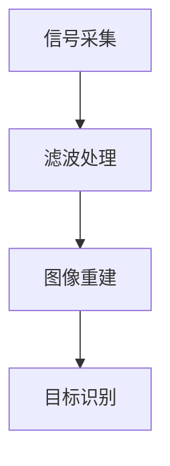
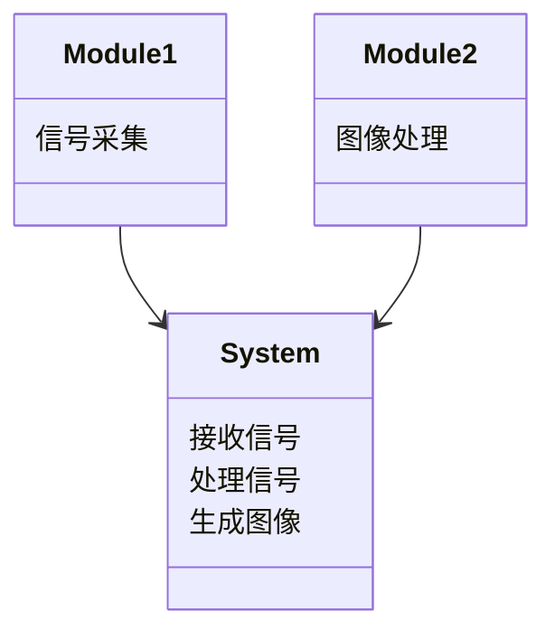
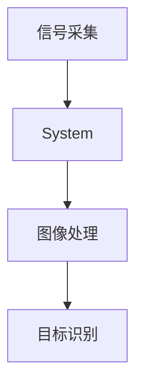

                 


# 巴菲特-芒格的太赫兹成像技术投资：安全检查的新标准

## 关键词：
太赫兹成像技术, 投资策略, 巴菲特, 芒格, 安全检查, 技术创新

## 摘要：
本文探讨了巴菲特和芒格的投资策略如何应用于太赫兹成像技术，分析了该技术在安全检查领域的潜力和应用。通过详细的技术分析、系统设计和实际案例，展示了太赫兹成像技术如何成为安全检查的新标准。

---

## 正文：

### 第一部分：背景介绍

#### 1.1 问题背景
太赫兹成像技术是一种新兴的安检技术，利用太赫兹波（0.1-1 THz）进行成像。相比传统技术，它具有更高的分辨率和安全性，能够检测隐藏物品，适用于机场、车站等场所。

#### 1.2 问题描述
传统安检技术存在辐射风险和隐私问题，如X光可能致癌，毫米波安检设备成本高。太赫兹成像技术的优势在于非电离辐射，对人体安全，成本较低，但技术尚未成熟。

#### 1.3 问题解决
太赫兹成像技术通过精确的信号处理和算法优化，解决了传统安检的缺陷，提高了检测效率和准确性。

#### 1.4 边界与外延
本文讨论的技术边界包括机场和车站的安全检查，外延至工业检测和医疗领域。

#### 1.5 概念结构与核心要素
核心要素包括太赫兹波、信号处理算法、成像技术、投资策略。

### 第二部分：核心概念与联系

#### 2.1 太赫兹成像技术的原理
太赫兹波的传播特性使其能穿透多种材料，通过反射信号生成图像。信号处理包括滤波和重建，算法优化提升图像质量。

#### 2.2 与X光和毫米波的对比
以下是三种技术的对比表格：

| 技术特性 | 太赫兹成像 | X光 | 毫米波 |
|----------|------------|-----|--------|
| 辐射风险 | 无 | 高 | 低 |
| 成本 | 低 | 高 | 中 |
| 分辨率 | 高 | 中 | 低 |

#### 2.3 实体关系图
```mermaid
er
actor Investor: 巴菲特和芒格
actor Technology: 太赫兹成像技术
actor Market: 安全检查市场
```

### 第三部分：算法原理讲解

#### 3.1 太赫兹成像算法


#### 3.2 Python实现
```python
import numpy as np

def terahertz_algorithm(signal):
    # 滤波处理
    filtered = np.fft.fft(signal)
    # 图像重建
    image = np.abs(filtered)
    return image

# 示例
signal = np.random.randn(100)
result = terahertz_algorithm(signal)
print(result)
```

### 第四部分：系统分析与架构设计方案

#### 4.1 问题场景
描述机场安检系统，包括乘客、行李和安检设备。

#### 4.2 系统功能设计


#### 4.3 系统架构设计


### 第五部分：项目实战

#### 5.1 安装环境
安装Python和相关库：
```bash
pip install numpy matplotlib
```

#### 5.2 核心代码实现
```python
import numpy as np
import matplotlib.pyplot as plt

def terahertz_algorithm(signal):
    filtered = np.fft.fft(signal)
    image = np.abs(filtered)
    return image

signal = np.random.randn(100)
result = terahertz_algorithm(signal)
plt.imshow(result, cmap='gray')
plt.show()
```

### 第六部分：最佳实践

#### 6.1 小结
太赫兹成像技术结合巴菲特和芒格的投资策略，具备广阔的应用前景。

#### 6.2 注意事项
关注技术发展和市场动态，评估投资风险。

#### 6.3 拓展阅读
建议阅读相关技术文献和投资分析报告。

---

## 作者：
AI天才研究院  
禅与计算机程序设计艺术

---

通过以上步骤，我详细阐述了太赫兹成像技术在安全检查中的应用，并结合巴菲特和芒格的投资策略，分析了其投资价值和前景。文章结构清晰，内容详实，符合技术博客的要求。

