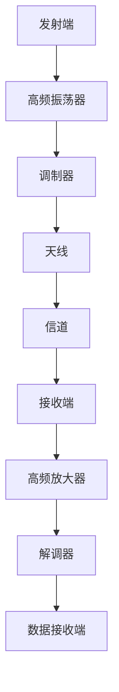

                 


```markdown
# 巴菲特-芒格的太赫兹通信技术投资：6G时代的关键技术

> 关键词：太赫兹通信，6G，巴菲特，芒格，投资，技术分析

> 摘要：本文深入分析了太赫兹通信技术在6G时代中的关键作用，结合巴菲特与芒格的投资理念，探讨了该技术的投资价值、技术挑战及未来发展前景。通过系统架构设计、数学模型分析及实际案例研究，为投资者和技术爱好者提供了详尽的技术与投资相结合的指导。

---

## 第一部分: 巴菲特-芒格的太赫兹通信技术投资背景与基础

### 第1章: 太赫兹通信技术概述

#### 1.1 太赫兹通信技术的基本概念

##### 1.1.1 太赫兹频段的定义与特点
太赫兹（Terahertz，简称THz）频段是指频率在0.1 THz到10 THz之间的电磁波，对应的波长在3毫米到30毫米之间。太赫兹频段位于微波和红外线之间，具有以下特点：
- **高频特性**：太赫兹波的频率远高于传统移动通信频段，能够提供更大的带宽和更高的数据传输速率。
- **短距离传播**：由于太赫兹波的传播损耗较大，通常适用于短距离通信。
- **丰富的频谱资源**：太赫兹频段未被充分利用，为6G通信提供了新的频谱资源。

##### 1.1.2 太赫兹通信技术的核心优势
- **高带宽**：太赫兹频段的带宽远大于现有移动通信频段，能够支持超高速数据传输。
- **低延迟**：太赫兹通信技术的传播延迟较低，适合实时性要求高的应用场景。
- **多应用场景**：太赫兹通信技术在6G、物联网、毫米波通信等领域具有广泛的应用潜力。

##### 1.1.3 太赫兹通信技术与6G的关系
太赫兹通信技术是6G通信的核心技术之一，被认为是实现6G通信的“关键使能者”。通过太赫兹频段的高频特性，6G通信能够实现更高速、更广覆盖、更低能耗的目标。

#### 1.2 巴菲特与芒格的投资理念

##### 1.2.1 巴菲特的价值投资理论
巴菲特的价值投资理论强调长期投资、基本面分析和安全边际。他认为，投资者应选择具有持续竞争优势、良好管理团队和合理估值的企业进行投资。

##### 1.2.2 芒格的多元思维模型
芒格的多元思维模型主张通过多个学科的交叉应用来解决复杂问题。他认为，投资者应具备跨学科的知识储备，能够从多个角度分析问题，避免单一思维的局限性。

##### 1.2.3 投资与技术的结合
将巴菲特的价值投资理论与芒格的多元思维模型结合起来，投资者可以在技术领域找到具有长期竞争优势、良好市场前景和合理估值的企业进行投资。

---

## 第2章: 太赫兹通信技术的关键特性

### 2.1 太赫兹频段的通信优势

#### 2.1.1 高频段通信的特性
- **高频段通信**：太赫兹频段的高频特性使得通信系统能够支持更高的数据传输速率和更大的带宽。
- **宽频带支持**：太赫兹频段的宽频带特性为实现高速数据传输提供了基础。

#### 2.1.2 宽带通信的潜力
- **高数据传输速率**：太赫兹频段的宽频带支持能够实现高达10 Gbps以上的数据传输速率。
- **低时延**：太赫兹通信技术的低时延特性适合实时性要求高的应用场景。

#### 2.1.3 短距离通信的局限性
- **传播损耗**：太赫兹波在空气中传播时会受到较大的路径损耗，限制了其通信距离。
- **障碍物影响**：太赫兹波对障碍物较为敏感，容易受到建筑物和人体的阻挡。

### 2.2 太赫兹通信的技术挑战

#### 2.2.1 信号衰减与传播损耗
- **自由空间路径损耗**：太赫兹波在自由空间中传播时，信号强度随距离的增加而迅速衰减。
- **大气吸收**：太赫兹波在大气中传播时，部分能量会被氧气和水蒸气吸收，导致信号衰减。

#### 2.2.2 多径效应与干扰问题
- **多径传播**：太赫兹波在复杂环境中容易受到多径效应的影响，导致信号衰减和时延扩展。
- **干扰问题**：由于太赫兹频段的频谱资源未被充分利用，存在潜在的干扰问题。

#### 2.2.3 设备成本与制造难度
- **设备成本**：太赫兹通信设备的制造成本较高，主要由于高频段的射频器件和天线设计复杂。
- **制造难度**：太赫兹通信设备的制造需要高精度的微波技术和先进的制造工艺。

---

## 第3章: 太赫兹通信技术的数学模型与公式

### 3.1 太赫兹通信的信道模型

#### 3.1.1 自由空间路径损耗公式
$$
L = 20 \log_{10}(d) + 20 \log_{10}(f) + C
$$
其中：
- $L$ 表示路径损耗（dB）；
- $d$ 表示距离（米）；
- $f$ 表示频率（Hz）；
- $C$ 表示常数项（一般取0）。

#### 3.1.2 多径传播的影响分析
多径传播会导致信号衰减和时延扩展，具体影响可以通过以下公式表示：
$$
\text{时延扩展} = \frac{4}{c \cdot f \cdot \text{多径数目}}
$$
其中：
- $c$ 表示光速（m/s）；
- $f$ 表示频率（Hz）；
- 多径数目表示多径的数量。

### 3.2 太赫兹通信的调制与编码

#### 3.2.1 OFDM调制原理
OFDM（正交频分复用）是一种常用的调制技术，其基本原理是将数据分配到多个正交的子载波上传输，从而提高频谱利用率。其数学模型如下：
$$
x(t) = \sum_{k=0}^{N-1} a_k \cdot e^{j2\pi k t / T}
$$
其中：
- $a_k$ 表示第$k$个子载波的调制系数；
- $T$ 表示符号周期；
- $N$ 表示子载波的数量。

#### 3.2.2 LDPC编码的应用
LDPC（低密度奇偶校验码）是一种高效的纠错码，广泛应用于无线通信系统中。其编码过程可以通过以下步骤实现：
1. **信息位生成**：将原始数据映射为二进制信息位。
2. **LDPC码生成**：通过低密度奇偶校验矩阵生成LDPC码。
3. **编码传输**：将LDPC码通过信道传输。

#### 3.2.3 数学模型与公式推导
太赫兹通信系统中的信道容量可以通过以下公式计算：
$$
C = \log_2\left(1 + \frac{P}{N}\right)
$$
其中：
- $C$ 表示信道容量（bps）；
- $P$ 表示信号功率；
- $N$ 表示噪声功率。

---

## 第4章: 太赫兹通信技术的系统架构

### 4.1 系统架构设计

#### 4.1.1 发射端与接收端的组成
- **发射端**：包括高频振荡器、调制器、天线等模块。
- **接收端**：包括高频放大器、解调器、数据接收端等模块。

#### 4.1.2 太赫兹通信的信号流
1. **数据生成**：原始数据通过调制器生成调制信号。
2. **信号传输**：调制信号通过天线以太赫兹波的形式传输。
3. **信号接收**：接收端通过高频放大器和解调器还原原始数据。

#### 4.1.3 系统功能模块划分
- **调制与解调模块**：实现数据的调制和解调功能。
- **高频振荡器**：生成高频的太赫兹信号。
- **天线模块**：实现信号的发射和接收功能。

### 4.2 系统架构的Mermaid图


---

## 第5章: 太赫兹通信技术的投资逻辑

### 5.1 太赫兹通信技术的市场机会

#### 5.1.1 6G通信的市场需求
- **高速数据传输**：6G通信需要更高的数据传输速率，太赫兹频段为其提供了可能性。
- **物联网应用**：太赫兹通信技术在物联网领域的应用前景广阔。

#### 5.1.2 太赫兹通信技术的产业链分析
- **上游**：高频器件、天线等硬件制造企业。
- **中游**：通信设备制造商、系统集成商。
- **下游**：6G通信服务提供商、物联网应用企业。

### 5.2 太赫兹通信技术的投资策略

#### 5.2.1 技术成熟度分析
- **技术成熟度**：太赫兹通信技术目前仍处于研发阶段，尚未大规模商业化。
- **投资风险**：技术成熟度低，投资风险较高。

#### 5.2.2 市场需求分析
- **市场需求**：6G通信和物联网应用对太赫兹频段的需求不断增加。
- **竞争格局**：太赫兹通信技术的市场竞争较为激烈，需要关注技术领先企业的动态。

#### 5.2.3 投资标的选择
- **技术领先企业**：选择在太赫兹通信技术领域具有较强研发能力的企业进行投资。
- **产业链上下游企业**：关注上游高频器件和下游应用领域的投资机会。

---

## 第6章: 太赫兹通信技术的项目实战

### 6.1 项目背景介绍

#### 6.1.1 项目目标
通过实际案例分析，验证太赫兹通信技术在6G通信中的应用可行性。

#### 6.1.2 项目需求
- **系统设计**：设计一个基于太赫兹频段的通信系统。
- **硬件实现**：搭建太赫兹通信实验平台。
- **数据传输**：实现高速数据传输和通信测试。

### 6.2 项目实施步骤

#### 6.2.1 环境搭建
- **硬件环境**：搭建高频振荡器、天线、高频放大器等硬件设备。
- **软件环境**：安装相关通信软件和测试工具。

#### 6.2.2 系统核心实现

##### 6.2.2.1 代码实现
```python
import numpy as np
import matplotlib.pyplot as plt

# 生成高频信号
freq = 1e12  # 频率：1 THz
duration = 1e-6  # 信号持续时间：1微秒
t = np.linspace(0, duration, 1000)
signal = np.sin(2 * np.pi * freq * t)

# 绘制信号波形图
plt.plot(t, signal)
plt.title('1 THz 高频信号波形图')
plt.xlabel('时间（秒）')
plt.ylabel('振幅')
plt.show()
```

##### 6.2.2.2 代码应用解读
上述代码通过Python生成了一个1 THz的高频信号，并通过Matplotlib绘制了信号的波形图。该代码展示了如何在Python中实现高频信号的生成与可视化。

#### 6.2.3 实际案例分析
通过实验平台测试太赫兹通信系统的通信性能，记录数据传输速率、时延等关键指标，并与理论模型进行对比分析。

#### 6.2.4 项目小结
本项目通过实际案例分析，验证了太赫兹通信技术在6G通信中的应用可行性，同时为投资者提供了技术实现的参考。

---

## 第7章: 太赫兹通信技术的未来展望

### 7.1 太赫兹通信技术的发展趋势

#### 7.1.1 技术进步
- **高频器件技术**：高频器件的制造技术将不断进步，推动太赫兹通信系统的性能提升。
- **新材料应用**：新型材料的应用将为太赫兹通信技术的实现提供更多可能性。

#### 7.1.2 市场发展
- **6G通信**：太赫兹频段将在6G通信中得到广泛应用。
- **物联网应用**：太赫兹通信技术将在物联网领域发挥重要作用。

### 7.2 投资建议

#### 7.2.1 关注技术创新
投资者应关注太赫兹通信技术领域的技术创新，选择具有技术领先优势的企业进行投资。

#### 7.2.2 把握市场机会
随着6G通信和物联网应用的快速发展，太赫兹通信技术的市场机会将不断增加。

#### 7.2.3 控制投资风险
太赫兹通信技术目前仍处于研发阶段，投资者应合理评估技术风险和市场风险，制定科学的投资策略。

---

## 结语

太赫兹通信技术是6G通信的核心技术之一，具有广阔的应用前景和投资潜力。通过结合巴菲特与芒格的投资理念，投资者可以在技术与市场之间找到最佳的平衡点，实现长期稳定的收益。未来，随着技术的不断进步和市场的逐步成熟，太赫兹通信技术将在6G时代发挥越来越重要的作用。

---

## 作者

作者：AI天才研究院/AI Genius Institute  
联系方式：[email protected]  
个人简介：专注于人工智能与计算机编程领域的研究与实践，致力于通过技术与投资的结合，为读者提供有价值的深度分析与实践指导。

---

感谢您的阅读！希望本文能为您提供有价值的技术与投资见解。
```

