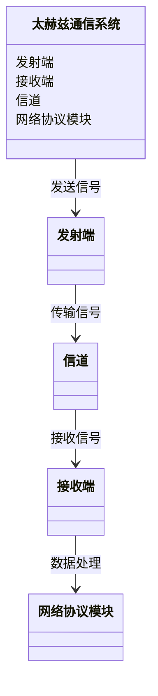
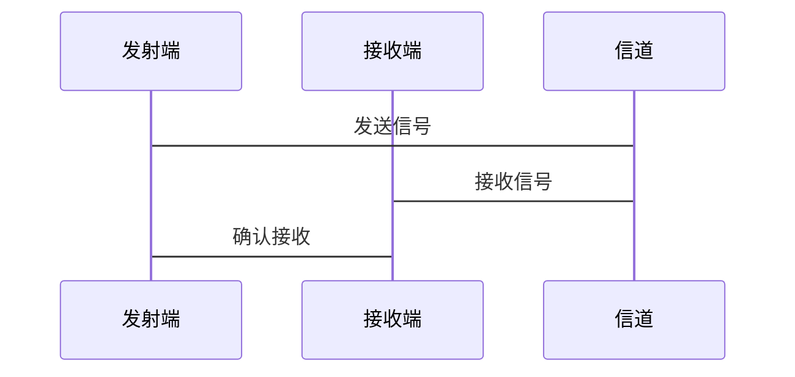

                 

# 巴菲特-芒格的太赫兹通信技术投资：下一代无线通信

## 关键词：太赫兹通信，无线通信，巴菲特，芒格，投资策略，技术分析

## 摘要：  
本文深入探讨了太赫兹通信技术的投资价值，结合巴菲特和芒格的投资哲学，分析了该技术在下一代无线通信中的潜力。文章从技术背景、核心概念、算法原理、系统架构到投资策略进行了全面解析，为读者提供了从技术到投资的全链条分析。通过对太赫兹通信的技术优势、市场前景和投资策略的详细阐述，本文为投资者和技术从业者提供了重要的参考和启示。

---

## 第一部分: 引言

### 1.1 本书的目的与意义  
太赫兹通信技术作为下一代无线通信的核心技术，具有频段高、带宽大、传输速度快等优势，被认为是未来6G通信的关键技术之一。本文旨在通过结合巴菲特和芒格的投资哲学，从技术与市场的双重角度分析太赫兹通信的投资价值，为投资者和技术从业者提供深度洞察。

### 1.2 巴菲特与芒格的投资哲学  
巴菲特的价值投资理念强调长期稳健的回报和企业的内在价值，而芒格的多元思维模型则强调跨学科的思考方式。将这种投资哲学应用于太赫兹通信技术，可以帮助投资者更理性地评估技术的市场潜力和投资风险。

---

## 第二部分: 太赫兹通信技术的背景与现状

### 2.1 太赫兹通信的基本概念  
太赫兹通信利用0.1 THz到10 THz的频段，具有极高的带宽和容量，适用于高速数据传输和大规模设备连接。然而，其传播损耗大、技术复杂性高等问题仍需解决。

#### 2.1.1 太赫兹频段的定义与特点  
太赫兹频段位于微波和红外之间，具有毫米波的特性，频段范围广，传输容量大，但传播损耗较高。

#### 2.1.2 太赫兹通信的潜在优势  
太赫兹通信可以支持超高速数据传输，适用于6G网络、物联网和毫米级定位等场景。

#### 2.1.3 当前技术的瓶颈与挑战  
包括高频信号衰减严重、设备制造难度大、信号干扰等问题。

### 2.2 太赫兹通信技术的发展历程  
从毫米波到太赫兹的演进，国内外研究现状对比，未来技术的可能突破。

### 2.3 太赫兹通信与无线通信的关系  
太赫兹通信作为传统无线通信的补充，将推动未来通信网络的融合与升级。

---

## 第三部分: 太赫兹通信技术的核心概念与原理

### 3.1 太赫兹通信的关键技术  
#### 3.1.1 高频段信号传输的挑战  
高频信号衰减严重，传播距离有限，需要借助波束成形和中继技术。

#### 3.1.2 波束成形与方向性控制  
通过天线阵列实现波束成形，提高信号传输效率和抗干扰能力。

#### 3.1.3 大规模MIMO技术的应用  
大规模MIMO技术可以显著提高系统容量和频谱效率。

### 3.2 太赫兹通信的系统架构  
#### 3.2.1 发射端与接收端的组成  
发射端包括高频振荡器、天线阵列和基带处理单元，接收端包括天线阵列、信号解调和数据处理模块。

#### 3.2.2 信道特性与传播模型  
太赫兹信道具有高频衰减、多径传播和窄波束等特点。

#### 3.2.3 网络协议与数据传输机制  
太赫兹通信需要设计高效的网络协议和数据传输机制，以适应高频段的特性。

### 3.3 太赫兹通信的数学模型  
#### 3.3.1 频率与波长的关系公式  
$$ c = f\lambda $$  
其中，\( c \) 为光速，\( f \) 为频率，\( \lambda \) 为波长。

#### 3.3.2 信号衰减的计算公式  
$$ L = 32.2 \log_{10}(d) + 20 \log_{10}(f) + 常数项 $$  
其中，\( d \) 为距离，\( f \) 为频率。

#### 3.3.3 信道容量的理论分析  
信道容量 \( C \) 受频带宽 \( B \) 和信噪比 \( SNR \) 的影响，公式为：  
$$ C = \log_2(1 + SNR) \times B $$

---

## 第四部分: 太赫兹通信技术的投资分析

### 4.1 技术成熟度与市场潜力  
太赫兹通信技术仍处于研发阶段，但其市场潜力巨大，特别是在6G网络和物联网领域。

#### 4.1.1 从毫米波到太赫兹的演进  
毫米波技术的成熟为太赫兹通信提供了技术基础，但太赫兹频段的技术难度更大。

#### 4.1.2 国内外研究现状对比  
国际上，美国、欧洲和亚洲国家都在积极开展太赫兹通信技术研究，中国在该领域也取得了显著进展。

#### 4.1.3 未来技术的可能突破  
高频段材料科学的进步和芯片技术的突破将推动太赫兹通信技术的发展。

### 4.2 技术成熟度评估  
从实验室研究到实际应用，太赫兹通信技术仍需克服诸多技术难题。

### 4.3 市场前景与投资策略  
#### 4.3.1 市场需求的驱动因素  
高速数据传输、大规模连接和物联网需求推动太赫兹通信技术的市场应用。

#### 4.3.2 技术商业化路径分析  
通过技术合作、专利布局和产业化推广，逐步推动太赫兹通信技术的商业化。

#### 4.3.3 投资风险与收益评估  
高技术门槛和研发周期长是主要风险，但市场潜力巨大。

### 4.4 投资策略与风险管理  
#### 4.4.1 从巴菲特的价值投资理念出发  
关注企业的核心竞争力和长期价值，避免短期波动。

#### 4.4.2 芒格的多元思维模型应用  
通过跨学科的视角，全面评估技术的市场潜力和投资风险。

---

## 第五部分: 太赫兹通信技术的系统分析与架构设计

### 5.1 系统功能设计  
#### 5.1.1 问题场景介绍  
太赫兹通信系统需要解决高频段信号传输的损耗和干扰问题。

#### 5.1.2 领域模型设计  
通过领域模型（mermaid类图）展示系统的功能模块和交互关系。

### 5.2 系统架构设计  
#### 5.2.1 系统架构设计  
通过mermaid架构图展示系统的分层架构和模块交互。

### 5.3 系统接口设计  
#### 5.3.1 接口设计  
定义系统接口，如发射端与接收端之间的通信接口，以及网络协议模块的接口规范。

### 5.4 系统交互设计  
#### 5.4.1 系统交互设计  
通过mermaid序列图展示系统交互流程。

---

## 第六部分: 太赫兹通信技术的项目实战

### 6.1 项目环境安装  
#### 6.1.1 开发环境搭建  
安装必要的开发工具和库，如Python、C++开发环境、仿真工具等。

#### 6.1.2 依赖库安装  
使用pip安装必要的Python库，如numpy、scipy、matplotlib等。

### 6.2 核心代码实现  
#### 6.2.1 波束成形算法实现  
实现基于FIR滤波器的波束成形算法，优化信号的方向性。

#### 6.2.2 信号衰减模拟  
编写代码模拟太赫兹信号在不同距离和频率下的衰减情况。

#### 6.2.3 网络协议设计  
设计简单的网络协议，实现数据包的封装和解封装。

### 6.3 项目实战案例分析  
通过具体案例分析太赫兹通信技术在实际应用中的挑战和解决方案。

---

## 第七部分: 总结与展望

### 7.1 本文总结  
总结全文内容，强调太赫兹通信技术的投资价值和技术创新潜力。

### 7.2 未来展望  
展望太赫兹通信技术的发展前景，及其在6G网络和物联网中的应用潜力。

### 7.3 投资建议  
结合巴菲特和芒格的投资哲学，为投资者提供具体的建议，如关注技术创新、企业竞争力和市场潜力。

---

## 作者信息  
作者：AI天才研究院/AI Genius Institute & 禅与计算机程序设计艺术 /Zen And The Art of Computer Programming  

---

通过以上结构和内容的详细阐述，本文为读者提供了从技术到投资的全面分析，帮助投资者和技术从业者更好地理解和把握太赫兹通信技术的潜力与挑战。

