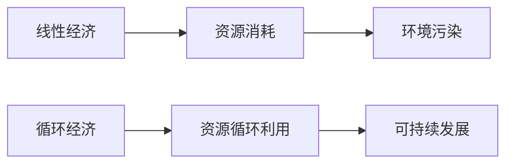
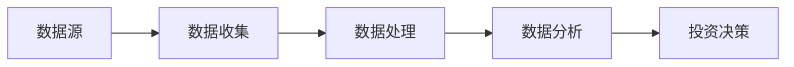

                 


# 巴菲特-芒格的循环经济投资：可持续发展的新方向

---

## 关键词：
- 巴菲特投资理念，芒格投资策略，循环经济，可持续发展，价值投资，ESG评分，多因子模型

---

## 摘要：
本文探讨了巴菲特和芒格的投资理念如何与循环经济相结合，分析了循环经济的模式及其在投资中的应用。通过构建多因子模型和ESG评分系统，展示了如何量化评估企业的可持续性，为投资者提供新的视角和策略。文章结合实际案例，详细讲解了系统架构和算法实现，为可持续投资提供了理论和实践指导。

---

## 第一部分：背景与基础

### 第1章：循环经济与巴菲特芒格投资理念的背景

#### 1.1 循环经济的定义与现状
- **1.1.1 循环经济的基本概念**
  循环经济是一种以资源高效利用和循环利用为核心的发展模式，强调减少资源消耗和环境污染。
- **1.1.2 循环经济的发展现状**
  当前全球正面临资源枯竭和环境问题的挑战，循环经济成为解决这些问题的重要途径。
- **1.1.3 循环经济与可持续发展的关系**
  循环经济是实现可持续发展的重要支柱，强调经济与环境的和谐共生。

#### 1.2 巴菲特芒格投资理念的演变
- **1.2.1 巴菲特芒格的传统投资策略**
  价值投资强调寻找具有持续竞争优势和良好管理的公司，注重长期稳健的回报。
- **1.2.2 价值投资理念的现代发展**
  随着环境问题的加剧，价值投资逐渐将企业的可持续性作为重要考量因素。
- **1.2.3 可持续发展对投资策略的影响**
  企业是否具备循环经济模式成为评估其长期价值的重要指标。

---

## 第二部分：核心概念与理论

### 第2章：循环经济投资的核心概念

#### 2.1 循环经济的模式与特征
- **2.1.1 循环经济的三种主要模式**
  - **生产模式**：采用循环生产技术，减少资源消耗。
  - **消费模式**：倡导循环经济消费，延长产品生命周期。
  - **回收模式**：建立完善的回收体系，实现资源再利用。
- **2.1.2 循环经济与线性经济的对比分析**
  使用mermaid图展示两种经济模式的对比。



#### 2.2 巴菲特芒格投资策略的循环经济属性
- **2.2.1 价值投资中的长期视角**
  巴菲特和芒格注重企业的长期价值，这与循环经济的长期可持续性不谋而合。
- **2.2.2 企业可持续性对投资决策的影响**
  企业是否具备循环经济模式直接影响其长期竞争力和投资价值。

---

## 第三部分：算法与数学模型

### 第3章：循环经济投资的量化分析

#### 3.1 多因子投资模型
- **3.1.1 多因子模型的构建**
  将循环经济相关因素（如资源利用效率、废弃物回收率）纳入因子体系。
- **3.1.2 循环经济因子的引入**
  通过数据分析，量化企业循环经济表现，作为投资决策的重要参考。
- **3.1.3 模型的验证与优化**
  使用历史数据验证模型的有效性，并不断优化因子权重。

#### 3.2 ESG评分系统
- **3.2.1 ESG评分的定义与计算**
  ESG评分包括环境、社会和治理三个维度，量化企业的可持续性表现。
- **3.2.2 ESG评分在投资决策中的应用**
  将ESG评分与传统财务指标结合，构建全面的投资评估体系。

---

## 第四部分：系统分析与架构设计

### 第4章：循环经济投资评估系统

#### 4.1 系统功能设计
- **4.1.1 数据收集模块**
  收集企业的资源利用、废弃物处理等数据。
- **4.1.2 数据处理模块**
  对收集的数据进行清洗和标准化处理。
- **4.1.3 数据分析模块**
  应用多因子模型和ESG评分系统进行评估。

#### 4.2 系统架构设计
- 使用mermaid图展示系统架构。



---

## 第五部分：项目实战

### 第5章：循环经济投资实战分析

#### 5.1 环境安装
- 安装必要的Python库：pandas、numpy、scikit-learn。

#### 5.2 核心代码实现
- **数据清洗代码**

```python
import pandas as pd
import numpy as np

# 加载数据
data = pd.read_csv('enterprise_data.csv')

# 数据清洗
data.dropna(inplace=True)
data['Recycling_Rate'] = data['Recycling_Rate'].astype(float)
```

- **多因子模型实现**

```python
from sklearn.linear_model import LinearRegression

# 构建因子矩阵
X = data[['Recycling_Rate', 'Energy_Efficiency']]
y = data['Stock_Return']

# 模型训练
model = LinearRegression()
model.fit(X, y)

# 预测
predictions = model.predict(X)
```

#### 5.3 案例分析
- 选择某企业，分析其循环经济实践，并预测投资回报。

---

## 第六部分：总结与展望

### 第6章：总结与未来展望

#### 6.1 最佳实践与注意事项
- 投资者应结合企业财务表现和ESG评分，全面评估投资价值。
- 风险提示：循环经济投资需关注政策变化和企业转型风险。

#### 6.2 未来展望
- 循环经济投资将成为主流趋势，技术创新和政策支持将推动其进一步发展。

---

## 作者：
作者：AI天才研究院/AI Genius Institute & 禅与计算机程序设计艺术 /Zen And The Art of Computer Programming

---

以上是文章的详细目录和部分章节内容，涵盖了从理论到实践的各个方面，为投资者提供了全面的指导和分析。

