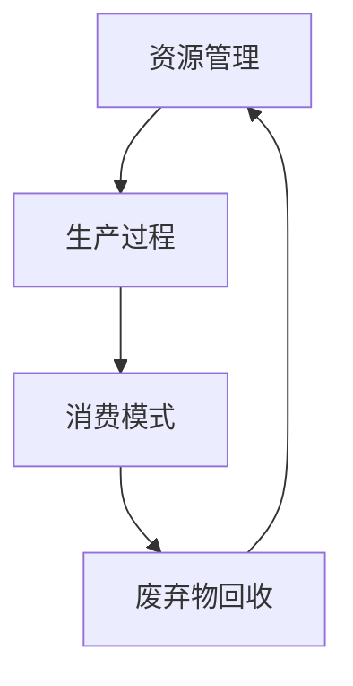
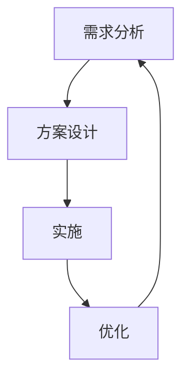

                 


# 巴菲特-芒格的循环经济投资：可持续发展的新范式

## 关键词：巴菲特，芒格，循环经济，可持续发展，投资策略，经济模式

## 摘要：  
本文探讨了巴菲特和芒格的投资理念如何与循环经济相结合，分析了循环经济的经济模式及其优势，详细阐述了巴菲特和芒格的投资策略在循环经济中的应用，并通过实际案例展示了这种投资模式对可持续发展的重要意义。

---

# 第一部分: 巴菲特-芒格的循环经济投资概述

## 第1章: 巴菲特与芒格的投资理念

### 1.1 巴菲特与芒格的投资哲学

#### 1.1.1 巴菲特的价值投资理念  
巴菲特的价值投资理念强调长期持有具有强大护城河和持续盈利能力的公司。他注重公司的基本面分析，寻找那些能够持续创造价值的企业。这种理念的核心是“以合理的价格买入优秀的公司”，而不是追求短期收益。

#### 1.1.2 芒格的多元思维模型  
芒格的多元思维模型强调通过多个学科的交叉应用来做出更全面的决策。他认为，投资者应该具备跨学科的知识，能够从不同的角度分析问题，从而避免认知偏差和错误决策。

#### 1.1.3 两人投资理念的异同  
尽管巴菲特和芒格的投资理念有许多相似之处，但也有细微差别。巴菲特更注重企业的财务指标和估值，而芒格则更强调企业的竞争优势和管理层的智慧。

### 1.2 循环经济的基本概念

#### 1.2.1 循环经济的定义与特点  
循环经济是一种以资源高效利用和循环利用为核心的发展模式。与传统的线性经济（资源-产品-废弃物）不同，循环经济强调通过设计、生产、消费和回收等环节的协同作用，实现资源的闭环利用。

#### 1.2.2 循环经济与传统经济的区别  
循环经济注重资源的节约和循环利用，强调减少废弃物的产生和排放，而传统经济则更关注生产的规模和效率，往往忽视资源的可持续利用和环境保护。

#### 1.2.3 循环经济的核心要素  
循环经济的核心要素包括资源的高效利用、产品的循环设计、废弃物的再生利用以及商业模式的创新。这些要素共同构成了循环经济的系统框架。

### 1.3 巴菲特-芒格投资与循环经济的结合

#### 1.3.1 循环经济投资的背景  
随着全球资源短缺和环境问题的加剧，循环经济作为一种可持续的发展模式，逐渐受到投资者的关注。巴菲特和芒格的投资理念与循环经济的核心思想有诸多契合点。

#### 1.3.2 巴菲特投资理念与循环经济的契合点  
巴菲特的价值投资理念强调长期持有优质企业，这与循环经济的长期性和系统性特点相契合。他倾向于投资那些能够在循环经济体系中占据优势地位的企业。

#### 1.3.3 循环经济投资的未来趋势  
随着全球向可持续发展转型，循环经济投资将成为未来的重要趋势。巴菲特和芒格的投资理念为循环经济投资提供了理论基础和实践指导。

---

## 第2章: 巴菲特与芒格的投资策略

### 2.1 巴菲特的价值投资策略

#### 2.1.1 价值投资的核心原则  
巴菲特的价值投资策略强调寻找那些被市场低估的优秀企业。他关注企业的盈利能力、财务状况和管理层的素质，认为这些因素是决定企业长期价值的关键。

#### 2.1.2 巴菲特选股的标准  
巴菲特选股的标准包括：强大的竞争优势、持续的盈利能力、合理的估值和安全的财务状况。这些标准为企业在循环经济中的投资提供了明确的方向。

#### 2.1.3 巴菲特投资组合的构建  
巴菲特的投资组合通常集中在少数几家优秀企业上，这些企业在各自的行业中具有领先地位，并且能够持续为股东创造价值。

### 2.2 芒格的多元思维模型

#### 2.2.1 多元思维模型的定义  
多元思维模型是一种通过多个学科的交叉应用来解决问题的方法。芒格认为，投资者需要具备跨学科的知识，才能更好地理解和预测市场的变化。

#### 2.2.2 芒格思维模型的具体应用  
芒格的多元思维模型在投资决策中应用广泛，例如通过心理学、经济学、物理学等学科的交叉分析，帮助投资者更好地识别风险和机会。

#### 2.2.3 多元思维模型对投资决策的影响  
多元思维模型帮助投资者避免单一思维的局限性，能够更全面地分析问题，从而做出更科学的投资决策。

### 2.3 巴菲特与芒格投资策略的对比

#### 2.3.1 价值投资与多元思维模型的异同  
价值投资注重企业的内在价值和长期盈利能力，而多元思维模型则强调跨学科的综合分析。两者在方法上有一定的差异，但在目标上都是为了实现长期的超额收益。

#### 2.3.2 巴菲特与芒格在投资决策中的角色分工  
巴菲特更注重企业的财务指标和估值，而芒格则更关注企业的竞争优势和管理层的智慧。两人在投资决策中形成了互补的关系。

#### 2.3.3 两人策略在实际投资中的协同效应  
巴菲特和芒格的投资策略在实践中形成了协同效应，他们的合作不仅提高了投资决策的科学性，还增强了投资组合的抗风险能力。

---

## 第3章: 循环经济的经济模式

### 3.1 循环经济的经济特征

#### 3.1.1 循环经济的资源效率  
循环经济通过资源的高效利用和循环利用，显著提高了资源的利用效率。这种模式能够减少资源浪费，降低企业的成本。

#### 3.1.2 循环经济的环境效益  
循环经济通过减少废弃物的产生和排放，显著降低了对环境的污染。这种模式有助于实现绿色发展，推动可持续发展。

#### 3.1.3 循环经济的社会效益  
循环经济通过创造就业机会、提高资源利用效率和促进社会公平，带来了显著的社会效益。这种模式有助于构建更加和谐的社会。

### 3.2 循环经济与传统经济的对比

#### 3.2.1 传统线性经济的局限性  
传统线性经济注重生产的规模和效率，往往忽视资源的可持续利用和环境保护。这种模式导致了资源浪费和环境污染问题。

#### 3.2.2 循环经济的优势与挑战  
循环经济的优势在于资源的高效利用和环境的保护，但其发展也面临技术和成本的挑战。例如，循环利用的技术难度较高，初期投资较大。

#### 3.2.3 从线性经济向循环经济转型的路径  
从线性经济向循环经济转型需要政府、企业和个人的共同努力。政府需要制定相关政策和法规，企业需要创新技术和管理模式，个人需要改变消费习惯。

### 3.3 循环经济的商业模式

#### 3.3.1 产品服务化  
产品服务化是一种以服务为核心，通过提供产品使用价值的商业模式。这种模式能够减少资源的浪费，提高产品的利用率。

#### 3.3.2 资源循环利用  
资源循环利用是指通过技术手段将废弃物转化为可利用的资源，从而实现资源的闭环利用。这种模式能够显著减少资源的浪费。

#### 3.3.3 共享经济与循环经济的结合  
共享经济通过共享资源的使用权，实现资源的高效利用。这种模式与循环经济的理念高度契合，能够进一步推动资源的循环利用。

---

## 第4章: 巴菲特与芒格投资策略在循环经济中的应用

### 4.1 巴菲特的价值投资与循环经济企业的选择

#### 4.1.1 循环经济企业的核心竞争力  
循环经济企业的核心竞争力在于其资源利用效率和技术创新能力。巴菲特倾向于投资那些具有强大竞争优势和持续盈利能力的企业。

#### 4.1.2 巴菲特选股标准在循环经济中的应用  
巴菲特选股的标准在循环经济投资中同样适用。他关注企业的财务状况、盈利能力以及管理层的素质，寻找那些能够在循环经济中占据领先地位的企业。

#### 4.1.3 循环经济企业的长期投资价值  
循环经济企业的长期投资价值在于其可持续的盈利能力和社会影响力。巴菲特认为，这些企业能够为股东创造长期的超额收益。

### 4.2 芒格的多元思维模型在循环经济投资中的应用

#### 4.2.1 多元思维模型在循环经济风险评估中的应用  
芒格的多元思维模型在循环经济风险评估中具有重要作用。他通过跨学科的综合分析，能够更好地识别和应对投资风险。

#### 4.2.2 多元思维模型在循环经济机会捕捉中的应用  
多元思维模型帮助投资者更好地识别循环经济中的投资机会。芒格通过综合分析市场的变化和企业的竞争优势，能够发现那些具有潜在投资价值的企业。

#### 4.2.3 多元思维模型对投资决策的影响  
多元思维模型在循环经济投资中具有重要的指导作用。它帮助投资者做出更科学、更全面的投资决策，从而提高投资的成功率。

### 4.3 巴菲特与芒格策略在循环经济中的协同效应

#### 4.3.1 价值投资与多元思维模型的协同效应  
巴菲特的价值投资理念与芒格的多元思维模型在循环经济投资中形成了协同效应。两者结合能够更好地识别投资机会，降低投资风险。

#### 4.3.2 巴菲特与芒格策略在循环经济中的应用案例  
通过具体的案例分析，我们可以看到，巴菲特和芒格的投资策略在循环经济中的应用效果显著。例如，他们投资的某些企业在循环经济模式中表现优异，为股东创造了可观的收益。

#### 4.3.3 循环经济投资的未来发展趋势  
随着全球向可持续发展转型，循环经济投资将成为未来的重要趋势。巴菲特和芒格的投资理念为循环经济投资提供了理论基础和实践指导。

---

## 第5章: 巴菲特-芒格循环经济投资的可持续发展新范式

### 5.1 循环经济投资的可持续发展价值

#### 5.1.1 循环经济投资对环境保护的贡献  
循环经济投资通过减少资源浪费和环境污染，显著提高了环境保护的效果。这种模式有助于实现绿色发展，推动可持续发展。

#### 5.1.2 循环经济投资对社会发展的促进作用  
循环经济投资通过创造就业机会、提高资源利用效率和促进社会公平，带来了显著的社会效益。这种模式有助于构建更加和谐的社会。

#### 5.1.3 循环经济投资的经济价值  
循环经济投资不仅具有环境和社会价值，还具有显著的经济价值。通过资源的高效利用和循环利用，企业能够降低成本，提高盈利能力。

### 5.2 巴菲特-芒格投资策略的可持续发展新范式

#### 5.2.1 巴菲特-芒格投资策略的可持续发展内涵  
巴菲特和芒格的投资策略具有鲜明的可持续发展内涵。他们注重企业的长期盈利能力和社会影响力，这种理念与循环经济的核心思想高度契合。

#### 5.2.2 循环经济投资的未来发展趋势  
随着全球向可持续发展转型，循环经济投资将成为未来的重要趋势。巴菲特和芒格的投资理念为循环经济投资提供了理论基础和实践指导。

#### 5.2.3 巴菲特-芒格投资策略的创新与突破  
巴菲特和芒格的投资策略在循环经济投资中不断创新和突破，为投资者提供了新的思路和方法。他们的成功经验为其他投资者提供了宝贵的借鉴。

---

## 第6章: 巴菲特-芒格循环经济投资的系统分析与架构设计

### 6.1 系统分析

#### 6.1.1 循环经济投资的系统结构  
循环经济投资的系统结构包括资源利用、产品设计、生产过程、消费模式和废弃物回收等环节。这些环节相互关联，共同构成了循环经济的系统框架。

#### 6.1.2 循环经济投资的系统功能  
循环经济投资的系统功能包括资源的高效利用、产品的循环设计、废弃物的再生利用和商业模式的创新。这些功能共同推动了循环经济的可持续发展。

#### 6.1.3 循环经济投资的系统属性  
循环经济投资的系统属性包括整体性、动态性和复杂性。这些属性决定了系统分析的复杂性和挑战性。

### 6.2 系统架构设计

#### 6.2.1 循环经济投资的系统架构  
循环经济投资的系统架构包括资源管理、生产过程、消费模式和废弃物回收四个模块。这些模块通过信息流和物质流的协同作用，实现系统的优化运行。

#### 6.2.2 系统架构的可视化表示  
通过Mermaid图，我们可以清晰地展示循环经济投资的系统架构。例如：



#### 6.2.3 系统架构的优化策略  
系统架构的优化策略包括资源的高效利用、过程的协同优化和废弃物的再生利用。这些策略能够显著提高系统的运行效率和经济效益。

### 6.3 系统接口设计

#### 6.3.1 循环经济投资系统的接口设计  
循环经济投资系统的接口设计需要考虑不同模块之间的信息传递和资源共享。例如，资源管理模块需要与生产过程模块进行实时信息交换。

#### 6.3.2 接口设计的挑战与解决方案  
接口设计的挑战在于不同模块之间的数据格式和通信协议不一致。解决方案包括制定统一的数据标准和开发高效的通信协议。

#### 6.3.3 接口设计的优化策略  
接口设计的优化策略包括模块化设计、标准化接口和动态配置。这些策略能够显著提高系统的灵活性和可扩展性。

### 6.4 系统交互设计

#### 6.4.1 循环经济投资系统的交互流程  
循环经济投资系统的交互流程包括需求分析、方案设计、实施和优化。这些流程相互关联，共同推动系统的优化运行。

#### 6.4.2 交互流程的可视化表示  
通过Mermaid图，我们可以清晰地展示循环经济投资系统的交互流程。例如：



#### 6.4.3 交互流程的优化策略  
交互流程的优化策略包括流程的简化、任务的并行化和资源的动态分配。这些策略能够显著提高系统的运行效率和经济效益。

---

## 第7章: 巴菲特-芒格循环经济投资的项目实战

### 7.1 项目环境安装

#### 7.1.1 系统环境要求  
系统环境要求包括操作系统、编程语言和相关工具的安装。例如，需要安装Python 3.8及以上版本，并安装Mermaid和相关开发工具。

#### 7.1.2 项目依赖管理  
项目依赖管理需要使用虚拟环境和包管理工具。例如，可以使用pipenv或venv来管理项目的依赖关系。

#### 7.1.3 项目开发环境配置  
项目开发环境配置包括代码编辑器、版本控制系统和调试工具的配置。例如，可以使用VS Code作为代码编辑器，并配置Git进行版本控制。

### 7.2 系统核心实现源代码

#### 7.2.1 循环经济投资系统的核心代码  
循环经济投资系统的核心代码包括资源管理、生产过程、消费模式和废弃物回收模块的实现。例如：

```python
# 资源管理模块
def manage_resources():
    return "资源管理模块"

# 生产过程模块
def production_process():
    return "生产过程模块"

# 消费模式模块
def consumption_mode():
    return "消费模式模块"

# 废弃物回收模块
def waste_recycling():
    return "废弃物回收模块"
```

#### 7.2.2 代码实现的关键技术  
代码实现的关键技术包括模块化设计、异步编程和并行计算。这些技术能够显著提高系统的运行效率和可扩展性。

#### 7.2.3 代码实现的优化策略  
代码实现的优化策略包括代码的简洁性、可读性和可维护性。例如，可以通过命名规范、代码注释和单元测试来提高代码的质量。

### 7.3 代码实现与解读

#### 7.3.1 代码实现的具体步骤  
代码实现的具体步骤包括需求分析、模块设计、编码实现和测试优化。例如：

1. **需求分析**：明确系统的功能需求和性能指标。
2. **模块设计**：将系统划分为资源管理、生产过程、消费模式和废弃物回收四个模块。
3. **编码实现**：根据模块设计，编写相应的代码。
4. **测试优化**：通过单元测试和集成测试，优化系统的性能和稳定性。

#### 7.3.2 代码实现的详细解读  
代码实现的详细解读包括每个模块的功能实现和代码结构的分析。例如，资源管理模块负责资源的分配和监控，生产过程模块负责产品的制造和质量控制。

#### 7.3.3 代码实现的优化建议  
代码实现的优化建议包括代码的模块化设计、异步编程和并行计算。例如，可以通过使用多线程或分布式计算来提高系统的处理能力。

### 7.4 实际案例分析

#### 7.4.1 循环经济投资的实际案例  
循环经济投资的实际案例包括某企业通过资源循环利用实现成本降低和效率提升的成功经验。例如，某制造企业通过废弃物的再生利用，显著降低了生产成本。

#### 7.4.2 案例分析的详细解读  
案例分析的详细解读包括企业的背景介绍、循环经济投资的具体实施步骤和取得的成效。例如，企业通过循环经济投资实现了资源的高效利用和环境的保护。

#### 7.4.3 案例分析的启示  
案例分析的启示包括循环经济投资的可行性和可持续性，以及巴菲特和芒格投资策略在实际中的应用效果。例如，企业的成功经验为其他投资者提供了宝贵的借鉴。

### 7.5 项目小结

#### 7.5.1 项目实施的关键点  
项目实施的关键点包括需求分析、模块设计和代码实现。这些关键点的顺利实施是项目成功的基础。

#### 7.5.2 项目实施的挑战与解决方案  
项目实施的挑战在于模块之间的协同优化和系统的动态调整。解决方案包括模块化的设计和动态配置的实现。

#### 7.5.3 项目实施的成果与总结  
项目实施的成果包括系统的优化运行和投资收益的显著提高。总结经验教训，为未来的项目实施提供了宝贵的参考。

---

## 第8章: 巴菲特-芒格循环经济投资的总结与展望

### 8.1 总结

#### 8.1.1 巴菲特-芒格投资策略的核心思想  
巴菲特-芒格投资策略的核心思想在于长期持有优质企业，注重企业的竞争优势和社会影响力。这种理念与循环经济的核心思想高度契合。

#### 8.1.2 循环经济投资的可持续发展价值  
循环经济投资的可持续发展价值在于资源的高效利用和环境的保护。这种模式能够实现经济发展与环境保护的双赢。

#### 8.1.3 巴菲特-芒格投资策略的创新与突破  
巴菲特-芒格投资策略的创新与突破在于将价值投资与多元思维模型相结合，为循环经济投资提供了新的思路和方法。

### 8.2 展望

#### 8.2.1 循环经济投资的未来发展趋势  
随着全球向可持续发展转型，循环经济投资将成为未来的重要趋势。巴菲特和芒格的投资理念为循环经济投资提供了理论基础和实践指导。

#### 8.2.2 巴菲特-芒格投资策略的未来发展  
巴菲特和芒格的投资策略在未来的循环经济投资中将继续发挥重要作用。他们的成功经验为其他投资者提供了宝贵的借鉴。

#### 8.2.3 巴菲特-芒格投资策略的全球化应用  
随着全球化的深入，巴菲特和芒格的投资策略将在全球范围内得到更广泛的应用。他们的理念将为全球的可持续发展做出更大的贡献。

---

## 结语

巴菲特和芒格的投资理念与循环经济的核心思想高度契合，为可持续发展提供了新的思路和方法。通过本文的探讨，我们看到，循环经济投资不仅具有环境和社会价值，还具有显著的经济价值。未来，随着全球向可持续发展转型，巴菲特和芒格的投资策略将在循环经济投资中继续发挥重要作用。

---

## 作者：AI天才研究院/AI Genius Institute & 禅与计算机程序设计艺术 /Zen And The Art of Computer Programming

