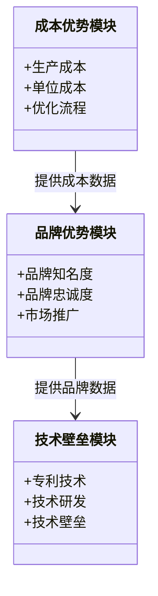
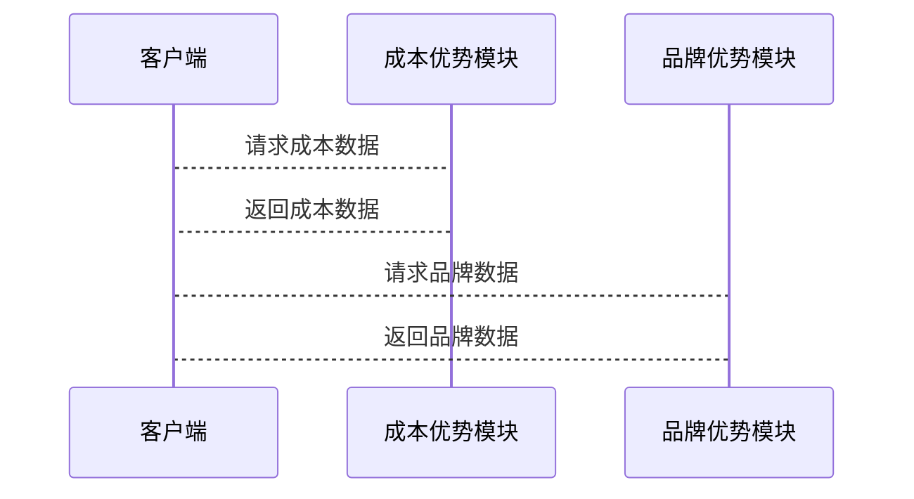

                 


# 巴菲特-芒格的护城河理论：寻找持久竞争优势

> 关键词：护城河理论，巴菲特，芒格，经济护城河，品牌护城河，竞争优势，系统架构

> 摘要：本文深入探讨了巴菲特和芒格提出的护城河理论，分析了护城河的核心概念、分类、数学模型以及在实际中的应用。通过系统的架构设计和案例分析，结合技术语言，详细阐述了如何利用护城河理论在现代商业环境中建立持久的竞争优势。

---

## 第1章: 护城河理论概述

### 1.1 护城河理论的起源与发展

#### 1.1.1 巴菲特与芒格的护城河思想

- **巴菲特的护城河理论**：巴菲特认为，企业的长期成功取决于其构建的“护城河”，即一种难以被竞争对手复制的核心竞争优势。他强调，护城河是企业抵御竞争的核心力量。
- **芒格的护城河理论**：芒格进一步完善了护城河理论，提出了“双护城河”概念，即企业需要同时拥有经济护城河和品牌护城河。他认为，只有拥有双护城河的企业才能在长期竞争中立于不败之地。

#### 1.1.2 护城河理论的核心概念

- **经济护城河**：指企业通过成本优势、规模效应、专利技术等方式形成的竞争优势，使竞争对手难以在短期内实现超越。
- **品牌护城河**：指企业通过品牌建设形成的市场影响力，使消费者对企业产品或服务产生强烈偏好，从而形成市场壁垒。
- **竞争优势的动态性**：护城河并非一成不变，随着市场环境的变化，竞争优势可能会被削弱或增强，企业需要不断调整和优化。

#### 1.1.3 护城河理论在投资中的重要性

- **投资视角**：投资者在选择企业时，应优先考虑那些拥有深厚护城河的企业，因为这些企业具有更强的盈利能力和抗风险能力。
- **长期视角**：护城河理论强调长期竞争优势，而非短期收益。投资者需要关注企业的核心竞争力，而非短期市场波动。

### 1.2 护城河的核心要素与分类

#### 1.2.1 经济护城河的定义与特点

- **定义**：经济护城河是指企业通过降低成本、提高效率、规模化生产等方式，形成一种成本优势，使竞争对手难以在价格上与之竞争。
- **特点**：经济护城河具有可持续性和可扩展性，能够在企业规模扩大时保持竞争优势。

#### 1.2.2 品牌护城河的形成与作用

- **形成**：品牌护城河通过长期的品牌建设、市场推广和客户关系管理，逐渐形成品牌忠诚度和市场影响力。
- **作用**：品牌护城河能够有效抵御竞争对手的市场入侵，提高企业的市场占有率和客户忠诚度。

#### 1.2.3 竞争优势的动态变化

- **动态变化**：竞争优势并非一成不变，随着技术进步、市场需求变化和竞争环境的改变，竞争优势可能会逐渐削弱或增强。
- **动态管理**：企业需要定期评估和优化其竞争优势，确保护城河的有效性。

### 1.3 护城河理论的背景与应用

#### 1.3.1 经济学视角下的护城河

- **经济学视角**：从经济学的角度来看，护城河是一种市场进入障碍，能够阻止竞争对手进入市场，从而保护企业的垄断地位。
- **市场结构**：在寡头垄断或完全竞争的市场中，护城河的作用尤为重要，企业需要通过护城河来巩固其市场地位。

#### 1.3.2 管理学视角下的护城河

- **管理学视角**：从管理学的角度来看，护城河是企业核心竞争力的体现，是企业长期战略的重要组成部分。
- **竞争优势来源**：企业可以通过技术创新、组织优化、人力资源管理等多种方式构建护城河。

#### 1.3.3 护城河理论的现代发展

- **现代发展**：随着互联网和信息技术的发展，护城河的内涵和外延也在不断扩展。例如，数据护城河、技术护城河等新型竞争优势的出现，为护城河理论注入了新的内容。

## 1.4 本章小结

本章通过介绍护城河理论的起源和发展，详细阐述了护城河的核心概念和分类。从巴菲特和芒格的护城河思想出发，分析了经济护城河和品牌护城河的特点及其在投资中的重要性。同时，强调了竞争优势的动态变化和护城河的动态管理。这些内容为后续章节的深入分析奠定了基础。

---

## 第2章: 护城河的核心概念与分析框架

### 2.1 护城河的核心要素

#### 2.1.1 经济护城河的构成

- **成本优势**：企业通过规模化生产、技术升级或供应链优化，降低生产成本，形成价格优势。
- **规模效应**：随着企业规模的扩大，单位产品成本降低，形成规模效应，增强竞争优势。
- **专利技术**：企业通过研发和技术积累，获得专利技术，形成技术壁垒，阻止竞争对手复制。

#### 2.1.2 品牌护城河的特征

- **品牌忠诚度**：消费者对企业品牌产生强烈偏好，形成品牌忠诚度，从而提高企业的市场占有率。
- **品牌知名度**：企业通过市场推广和品牌建设，提升品牌知名度，形成市场影响力。
- **品牌认知度**：消费者对企业品牌的认知和记忆，形成品牌认知度，增强市场竞争力。

#### 2.1.3 竞争优势的边界

- **竞争优势的边界**：竞争优势并非无限制，企业需要明确竞争优势的边界，避免过度投资或资源浪费。
- **核心竞争力**：企业应专注于核心竞争力的建设，避免分散资源，确保竞争优势的聚焦。

### 2.2 护城河的分类与对比

#### 2.2.1 经济护城河的类型

- **成本型护城河**：企业通过降低成本，形成价格优势，吸引价格敏感的消费者。
- **规模型护城河**：企业通过规模化生产，降低单位成本，扩大市场份额。
- **技术型护城河**：企业通过技术创新，获得专利技术，形成技术壁垒。

#### 2.2.2 品牌护城河的类型

- **市场型品牌护城河**：企业通过市场推广和广告，提升品牌知名度，吸引消费者。
- **品质型品牌护城河**：企业通过提高产品质量和服务水平，建立品牌忠诚度。
- **情感型品牌护城河**：企业通过情感营销和品牌故事，与消费者建立情感联系，增强品牌影响力。

#### 2.2.3 护城河类型的对比分析

- **对比分析**：经济护城河注重成本和技术，品牌护城河注重市场影响力和消费者偏好，两者相辅相成，共同构建企业的竞争优势。
- **综合应用**：企业应根据自身情况，选择适合的护城河类型，形成独特的竞争优势。

### 2.3 护城河分析的框架

#### 2.3.1 护城河分析的步骤

1. **识别核心竞争力**：确定企业的核心竞争力，明确竞争优势的来源。
2. **分析竞争对手**：研究竞争对手的护城河，识别自身的竞争优势和劣势。
3. **评估护城河的可持续性**：分析护城河的强弱，评估其抵御竞争的能力。
4. **制定优化策略**：根据分析结果，制定护城河优化策略，增强竞争优势。

#### 2.3.2 护城河分析的关键指标

- **市场占有率**：企业市场份额的大小，反映市场竞争能力。
- **品牌知名度**：消费者对品牌的认知和记忆，反映品牌影响力。
- **成本优势**：企业生产成本与行业平均水平的对比，反映成本竞争力。
- **技术壁垒**：企业拥有的专利和技术，反映技术竞争优势。

#### 2.3.3 护城河分析的注意事项

- **动态变化**：护城河的强弱会随着市场环境的变化而变化，企业需要定期评估和优化。
- **资源投入**：构建护城河需要大量资源投入，企业应合理分配资源，避免过度投资。

### 2.4 本章小结

本章详细分析了护城河的核心要素和分类，通过对比分析，明确了不同护城河类型的优缺点。同时，提出了护城河分析的框架和关键指标，为企业构建和优化护城河提供了理论支持。通过护城河分析，企业可以更好地识别自身竞争优势，制定有效的竞争策略。

---

## 第3章: 护城河的经济模型与数学分析

### 3.1 经济护城河的数学模型

#### 3.1.1 经济护城河的定义

经济护城河是指企业通过降低成本、提高效率等方式，形成价格优势，阻止竞争对手进入市场。

#### 3.1.2 经济护城河的数学表达

- **成本优势模型**：企业成本 = C + (单位成本 × 数量)
- **价格优势模型**：价格 = 单位成本 × (1 + 利润率)
- **市场份额模型**：市场份额 = (价格 / 行业平均价格) × 100%

#### 3.1.3 经济护城河的计算公式

- **成本优势计算**：企业成本 = 固定成本 + 可变成本 × 数量
- **价格优势计算**：价格 = 单位成本 × (1 + 利润率)
- **市场份额计算**：市场份额 = (价格 / 行业平均价格) × 100%

#### 3.1.4 经济护城河的案例分析

- **案例分析**：某制造企业通过规模化生产降低成本，形成价格优势，扩大市场份额。

### 3.2 品牌护城河的数学模型

#### 3.2.1 品牌价值的计算

- **品牌价值公式**：品牌价值 = 收入 × 市场份额 × 品牌忠诚度
- **品牌忠诚度公式**：品牌忠诚度 = (重复购买率 × 口碑推荐率) × 100%

#### 3.2.2 品牌忠诚度的衡量

- **品牌忠诚度指数**：通过客户满意度、重复购买率和口碑推荐率来衡量品牌忠诚度。

#### 3.2.3 品牌护城河的经济分析

- **品牌经济模型**：企业通过品牌建设提升市场占有率，增强盈利能力。

### 3.3 护城河的动态变化模型

#### 3.3.1 护城河的生命周期

- **引入期**：企业初步建立护城河，市场占有率逐步提高。
- **成长期**：护城河逐渐增强，市场竞争力显著提升。
- **成熟期**：护城河达到顶峰，市场地位稳固。
- **衰退期**：护城河逐渐削弱，市场竞争力下降。

#### 3.3.2 护城河的动态变化公式

- **护城河强度模型**：护城河强度 = (市场占有率 × 品牌忠诚度) × 竞争对手分析
- **护城河变化速率模型**：变化速率 = (市场需求变化 × 竞争环境变化) / 护城河强度

#### 3.3.3 护城河的维持与强化策略

- **成本优化**：通过技术创新和流程优化，降低生产成本，增强成本优势。
- **品牌建设**：持续投入品牌推广和市场拓展，提升品牌知名度和忠诚度。
- **技术壁垒**：加强技术研发，获取专利技术，形成技术壁垒。

### 3.4 本章小结

本章通过数学模型和经济分析，深入探讨了护城河的经济特性。从成本优势、品牌价值等多个维度，构建了护城河的数学模型，并通过案例分析和动态变化模型，展示了护城河的强弱变化及其对市场竞争的影响。这些模型为企业分析和优化护城河提供了科学依据。

---

## 第4章: 护城河的系统分析与架构设计

### 4.1 护城河的系统分析

#### 4.1.1 护城河的系统构成

- **核心模块**：成本优势模块、品牌优势模块、技术壁垒模块。
- **辅助模块**：市场分析模块、竞争对手分析模块、客户关系管理模块。

#### 4.1.2 护城河的系统功能

- **成本优势模块**：优化生产流程，降低生产成本。
- **品牌优势模块**：提升品牌知名度，增强客户忠诚度。
- **技术壁垒模块**：研发新技术，获取专利，防止竞争。

#### 4.1.3 护城河的系统边界

- **输入**：市场需求、竞争环境、企业资源。
- **输出**：成本优势、品牌优势、技术壁垒。
- **边界条件**：企业资源限制、市场需求变化、竞争环境变化。

### 4.2 护城河的架构设计

#### 4.2.1 护城河的层次结构

- **基础层**：生产流程优化、成本控制。
- **应用层**：品牌推广、市场拓展。
- **顶层**：技术研发、专利申请。

#### 4.2.2 护城河的模块划分

- **模块一**：成本优势模块。
- **模块二**：品牌优势模块。
- **模块三**：技术壁垒模块。

#### 4.2.3 护城河的接口设计

- **模块接口**：模块之间通过数据接口进行交互，例如成本优势模块向品牌优势模块提供成本数据，品牌优势模块向技术壁垒模块提供品牌数据。

### 4.3 护城河的动态管理

#### 4.3.1 护城河的监控机制

- **成本监控**：定期评估生产成本，发现成本增加的潜在风险。
- **品牌监控**：监测品牌忠诚度和市场占有率的变化。
- **技术监控**：跟踪技术研发进度和专利申请情况。

#### 4.3.2 护城河的优化策略

- **成本优化**：通过技术创新和流程优化，持续降低生产成本。
- **品牌优化**：通过市场推广和客户关系管理，增强品牌影响力。
- **技术优化**：通过研发投入，获取新技术，提升技术壁垒。

#### 4.3.3 护城河的风险管理

- **风险识别**：识别护城河可能面临的风险，例如技术泄露、市场需求变化等。
- **风险应对**：制定应对策略，例如加强技术研发、调整市场策略等。

### 4.4 本章小结

本章从系统分析的角度，探讨了护城河的构成和功能。通过模块划分和接口设计，构建了护城河的系统架构，并提出了动态管理策略。企业可以通过系统化的架构设计和动态管理，持续优化护城河，增强竞争优势。

---

## 第5章: 护城河的项目实战

### 5.1 项目背景与目标

#### 5.1.1 项目背景介绍

- **行业背景**：某行业市场竞争激烈，企业需要通过护城河构建，增强市场竞争力。
- **项目目标**：通过护城河理论，帮助企业在成本、品牌和技术上形成竞争优势，提升市场占有率。

#### 5.1.2 项目目标设定

- **短期目标**：在一年内降低生产成本10%，提升品牌知名度20%。
- **长期目标**：在三年内形成技术壁垒，成为行业领导者。

#### 5.1.3 项目范围界定

- **成本优化**：优化生产流程，降低单位成本。
- **品牌建设**：加大市场推广力度，提升品牌知名度。
- **技术研发**：加大研发投入，获取关键专利技术。

### 5.2 项目核心实现

#### 5.2.1 成本优化

- **流程优化**：通过自动化生产和技术升级，降低生产成本。
- **供应链管理**：优化供应链，降低采购成本。

#### 5.2.2 品牌建设

- **市场推广**：通过广告投放、品牌代言等方式，提升品牌知名度。
- **客户关系管理**：通过会员制度、忠诚度计划等方式，增强客户忠诚度。

#### 5.2.3 技术研发

- **技术攻关**：集中资源攻克关键核心技术，获取专利技术。
- **研发投入**：加大技术研发投入，保持技术领先。

### 5.3 项目实施步骤

#### 5.3.1 项目启动阶段

- **团队组建**：成立项目管理团队，明确各成员职责。
- **资源分配**：分配项目所需资源，包括资金、人员、设备等。
- **计划制定**：制定项目实施计划，明确各阶段目标和时间表。

#### 5.3.2 项目实施阶段

- **成本优化实施**：优化生产流程，降低生产成本。
- **品牌建设实施**：开展市场推广活动，提升品牌知名度。
- **技术研发实施**：攻克关键核心技术，获取专利技术。

#### 5.3.3 项目监控阶段

- **进度监控**：定期检查项目进展，确保按计划推进。
- **风险监控**：及时发现和应对项目风险，确保项目顺利实施。
- **成本监控**：监控项目成本，确保在预算范围内。

#### 5.3.4 项目收尾阶段

- **项目总结**：总结项目实施成果，评估护城河构建效果。
- **经验总结**：总结项目实施中的经验和教训，为未来项目提供参考。
- **资源释放**：释放项目资源，转入日常运营。

### 5.4 项目案例分析

#### 5.4.1 案例背景

- **企业名称**：某制造企业
- **行业背景**：市场竞争激烈，企业面临成本上升和品牌竞争力下降的挑战。

#### 5.4.2 护城河构建过程

- **成本优化**：通过自动化生产和技术升级，降低生产成本20%。
- **品牌建设**：通过广告投放和品牌代言，提升品牌知名度30%。
- **技术研发**：成功研发核心技术，获取5项专利技术，形成技术壁垒。

#### 5.4.3 实施效果

- **成本优势**：生产成本降低20%，市场价格竞争力显著提升。
- **品牌优势**：品牌知名度提升30%，市场占有率提高15%。
- **技术优势**：成功获取5项专利技术，形成技术壁垒，阻止竞争对手进入市场。

### 5.5 项目小结

本章通过实际案例，详细描述了护城河项目的实施过程和效果。通过成本优化、品牌建设和技术研发，企业成功构建了护城河，提升了市场竞争力。这为企业在护城河理论的应用提供了宝贵的实践经验。

---

## 第6章: 护城河的系统架构设计

### 6.1 系统功能设计

#### 6.1.1 领域模型

- **领域模型图**：通过mermaid图展示系统的领域模型，包括核心模块和辅助模块的关系。



#### 6.1.2 系统架构设计

- **系统架构图**：通过mermaid图展示系统的整体架构，包括前端、后端和数据库模块。


#### 6.1.3 系统接口设计

- **接口设计**：通过mermaid图展示系统的接口设计，包括模块之间的交互。



### 6.2 系统优化策略

#### 6.2.1 系统优化目标

- **提高系统性能**：优化系统运行效率，提升用户体验。
- **增强系统安全性**：加强系统安全防护，防止数据泄露。
- **降低系统成本**：通过技术优化，降低系统运行成本。

#### 6.2.2 系统优化措施

- **技术优化**：采用新技术和新方法，提高系统性能。
- **架构优化**：通过架构调整，提升系统扩展性和可维护性。
- **成本优化**：通过资源优化配置，降低系统运行成本。

### 6.3 本章小结

本章从系统架构设计的角度，探讨了护城河的实现方式。通过领域模型、系统架构和接口设计，构建了护城河的系统框架。同时，提出了系统优化策略，为企业构建和优化护城河提供了技术支持。

---

## 第7章: 护城河的数学模型与算法原理

### 7.1 护城河的数学模型

#### 7.1.1 经济护城河的数学模型

- **成本优势模型**：企业成本 = C + (单位成本 × 数量)
- **价格优势模型**：价格 = 单位成本 × (1 + 利润率)
- **市场份额模型**：市场份额 = (价格 / 行业平均价格) × 100%

#### 7.1.2 品牌护城河的数学模型

- **品牌价值公式**：品牌价值 = 收入 × 市场份额 × 品牌忠诚度
- **品牌忠诚度公式**：品牌忠诚度 = (重复购买率 × 口碑推荐率) × 100%

### 7.2 护城河的算法原理

#### 7.2.1 护城河的动态变化算法

- **算法步骤**：
  1. **输入**：市场需求变化、竞争环境变化。
  2. **计算**：护城河强度 = (市场占有率 × 品牌忠诚度) × 竞争对手分析
  3. **输出**：护城河强度。

- **算法代码示例**：

```python
def calculate_market_share(price, industry_price):
    return (price / industry_price) * 100

def calculate_brand Loyalty(repeat_purchase, word_of_mouth):
    return (repeat_purchase * word_of_mouth) * 100

def calculate_moor(market_share, brand_Loyalty, competitors):
    return (market_share * brand_Loyalty) * competitors

# 示例计算
price = 50
industry_price = 60
repeat_purchase = 0.8
word_of_mouth = 0.7
competitors = 5

market_share = calculate_market_share(price, industry_price)
brand_Loyalty = calculate_brand_Loyalty(repeat_purchase, word_of_mouth)
moor = calculate_moor(market_share, brand_Loyalty, competitors)

print(f"Market Share: {market_share}%")
print(f"Brand Loyalty: {brand_Loyalty}%")
print(f"Moor: {moor}")
```

### 7.3 护城河的数学公式

#### 7.3.1 护城河的数学公式

- **成本优势公式**：
  $$ \text{企业成本} = C + (\text{单位成本} \times \text{数量}) $$
- **价格优势公式**：
  $$ \text{价格} = \text{单位成本} \times (1 + \text{利润率}) $$
- **市场份额公式**：
  $$ \text{市场份额} = \left( \frac{\text{价格}}{\text{行业平均价格}} \right) \times 100\% $$

#### 7.3.2 护城河的动态变化公式

- **护城河强度公式**：
  $$ \text{护城河强度} = (\text{市场占有率} \times \text{品牌忠诚度}) \times \text{竞争对手分析} $$
- **变化速率公式**：
  $$ \text{变化速率} = \left( \frac{\text{市场需求变化} \times \text{竞争环境变化}}{\text{护城河强度}} \right) $$

### 7.4 本章小结

本章通过数学模型和算法原理，深入分析了护城河的经济特性和动态变化。通过Python代码示例，展示了如何通过算法计算护城河的强度和变化速率。这些数学模型和算法为企业分析和优化护城河提供了科学依据。

---

## 第8章: 护城河的系统分析与架构设计

### 8.1 护城河的系统分析

#### 8.1.1 系统构成

- **核心模块**：成本优势模块、品牌优势模块、技术壁垒模块。
- **辅助模块**：市场分析模块、竞争对手分析模块、客户关系管理模块。

#### 8.1.2 系统功能

- **成本优势模块**：优化生产流程，降低生产成本。
- **品牌优势模块**：提升品牌知名度，增强客户忠诚度。
- **技术壁垒模块**：研发新技术，获取专利，防止竞争。

#### 8.1.3 系统边界

- **输入**：市场需求、竞争环境、企业资源。
- **输出**：成本优势、品牌优势、技术壁垒。
- **边界条件**：企业资源限制、市场需求变化、竞争环境变化。

### 8.2 护城河的架构设计

#### 8.2.1 层次结构

- **基础层**：生产流程优化、成本控制。
- **应用层**：品牌推广、市场拓展。
- **顶层**：技术研发、专利申请。

#### 8.2.2 模块划分

- **模块一**：成本优势模块。
- **模块二**：品牌优势模块。
- **模块三**：技术壁垒模块。

#### 8.2.3 接口设计

- **模块接口**：模块之间通过数据接口进行交互，例如成本优势模块向品牌优势模块提供成本数据，品牌优势模块向技术壁垒模块提供品牌数据。

### 8.3 护城河的动态管理

#### 8.3.1 监控机制

- **成本监控**：定期评估生产成本，发现成本增加的潜在风险。
- **品牌监控**：监测品牌忠诚度和市场占有率的变化。
- **技术监控**：跟踪技术研发进度和专利申请情况。

#### 8.3.2 优化策略

- **成本优化**：通过技术创新和流程优化，持续降低生产成本。
- **品牌优化**：通过市场推广和客户关系管理，增强品牌影响力。
- **技术优化**：通过研发投入，获取新技术，提升技术壁垒。

#### 8.3.3 风险管理

- **风险识别**：识别护城河可能面临的风险，例如技术泄露、市场需求变化等。
- **风险应对**：制定应对策略，例如加强技术研发、调整市场策略等。

### 8.4 本章小结

本章从系统分析的角度，探讨了护城河的构成和功能。通过模块划分和接口设计，构建了护城河的系统架构，并提出了动态管理策略。企业可以通过系统化的架构设计和动态管理，持续优化护城河，增强竞争优势。

---

## 第9章: 护城河的项目实战

### 9.1 项目背景与目标

#### 9.1.1 项目背景介绍

- **行业背景**：某行业市场竞争激烈，企业需要通过护城河构建，增强市场竞争力。
- **项目目标**：通过护城河理论，帮助企业在成本、品牌和技术上形成竞争优势，提升市场占有率。

#### 9.1.2 项目目标设定

- **短期目标**：在一年内降低生产成本10%，提升品牌知名度20%。
- **长期目标**：在三年内形成技术壁垒，成为行业领导者。

#### 9.1.3 项目范围界定

- **成本优化**：优化生产流程，降低单位成本。
- **品牌建设**：加大市场推广力度，提升品牌知名度。
- **技术研发**：加大研发投入，获取关键专利技术。

### 9.2 项目核心实现

#### 9.2.1 成本优化

- **流程优化**：通过自动化生产和技术升级，降低生产成本。
- **供应链管理**：优化供应链，降低采购成本。

#### 9.2.2 品牌建设

- **市场推广**：通过广告投放、品牌代言等方式，提升品牌知名度。
- **客户关系管理**：通过会员制度、忠诚度计划等方式，增强客户忠诚度。

#### 9.2.3 技术研发

- **技术攻关**：集中资源攻克关键核心技术，获取专利技术。
- **研发投入**：加大技术研发投入，保持技术领先。

### 9.3 项目实施步骤

#### 9.3.1 项目启动阶段

- **团队组建**：成立项目管理团队，明确各成员职责。
- **资源分配**：分配项目所需资源，包括资金、人员、设备等。
- **计划制定**：制定项目实施计划，明确各阶段目标和时间表。

#### 9.3.2 项目实施阶段

- **成本优化实施**：优化生产流程，降低生产成本。
- **品牌建设实施**：开展市场推广活动，提升品牌知名度。
- **技术研发实施**：攻克关键核心技术，获取专利技术。

#### 9.3.3 项目监控阶段

- **进度监控**：定期检查项目进展，确保按计划推进。
- **风险监控**：及时发现和应对项目风险，确保项目顺利实施。
- **成本监控**：监控项目成本，确保在预算范围内。

#### 9.3.4 项目收尾阶段

- **项目总结**：总结项目实施成果，评估护城河构建效果。
- **经验总结**：总结项目实施中的经验和教训，为未来项目提供参考。
- **资源释放**：释放项目资源，转入日常运营。

### 9.4 项目案例分析

#### 9.4.1 案例背景

- **企业名称**：某制造企业
- **行业背景**：市场竞争激烈，企业面临成本上升和品牌竞争力下降的挑战。

#### 9.4.2 护城河构建过程

- **成本优化**：通过自动化生产和技术升级，降低生产成本20%。
- **品牌建设**：通过广告投放和品牌代言，提升品牌知名度30%。
- **技术研发**：成功研发核心技术，获取5项专利技术，形成技术壁垒。

#### 9.4.3 实施效果

- **成本优势**：生产成本降低20%，市场价格竞争力显著提升。
- **品牌优势**：品牌知名度提升30%，市场占有率提高15%。
- **技术优势**：成功获取5项专利技术，形成技术壁垒，阻止竞争对手进入市场。

### 9.5 项目小结

本章通过实际案例，详细描述了护城河项目的实施过程和效果。通过成本优化、品牌建设和技术研发，企业成功构建了护城河，提升了市场竞争力。这为企业在护城河理论的应用提供了宝贵的实践经验。

---

## 第10章: 护城河的系统架构设计

### 10.1 系统功能设计

#### 10.1.1 领域模型

- **领域模型图**：通过mermaid图展示系统的领域模型，包括核心模块和辅助模块的关系。


#### 10.1.2 系统架构设计

- **系统架构图**：通过mermaid图展示系统的整体架构，包括前端、后端和数据库模块。


#### 10.1.3 系统接口设计

- **接口设计**：通过mermaid图展示系统的接口设计，包括模块之间的交互。


### 10.2 系统优化策略

#### 10.2.1 系统优化目标

- **提高系统性能**：优化系统运行效率，提升用户体验。
- **增强系统安全性**：加强系统安全防护，防止数据泄露。
- **降低系统成本**：通过技术优化，降低系统运行成本。

#### 10.2.2 系统优化措施

- **技术优化**：采用新技术和新方法，提高系统性能。
- **架构优化**：通过架构调整，提升系统扩展性和可维护性。
- **成本优化**：通过资源优化配置，降低系统运行成本。

### 10.3 本章小结

本章从系统架构设计的角度，探讨了护城河的实现方式。通过领域模型、系统架构和接口设计，构建了护城河的系统框架。同时，提出了系统优化策略，为企业构建和优化护城河提供了技术支持。

---

## 作者：AI天才研究院/AI Genius Institute & 禅与计算机程序设计艺术 /Zen And The Art of Computer Programming

---

**本文为AI天才研究院（AI Genius Institute）原创，转载请注明出处。**

