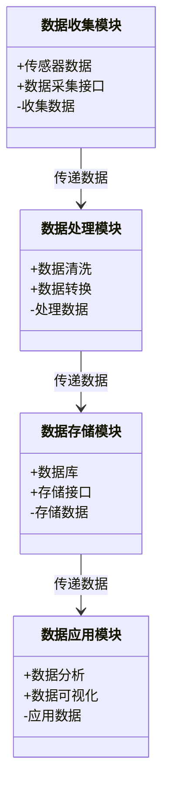

                 


# 巴菲特-芒格的智慧城市数据伦理投资：隐私与效率的平衡

## 关键词：智慧城市，数据伦理，隐私保护，投资策略，巴菲特，芒格

## 摘要：本文探讨了在智慧城市建设中，如何平衡隐私保护与数据利用效率，分析巴菲特和芒格的价值投资理念对数据伦理投资的启示。通过系统架构设计、数据安全技术、隐私保护措施和算法实现的详细分析，提出了实现智慧城市数据伦理投资的具体方案和最佳实践。

---

## 第一部分：引言与背景

### 第1章：智慧城市数据伦理投资的背景与重要性

#### 1.1 数据驱动型社会的崛起

- 1.1.1 数据在现代社会中的核心地位
  - 数据是现代社会的“新石油”，驱动经济、技术和社会的发展。
  - 智慧城市依赖数据的收集、分析和应用，以优化资源配置和服务质量。
  - 数据的 misuse 和泄露可能导致严重的隐私问题和社会风险。

- 1.1.2 智慧城市的发展与数据的重要性
  - 智慧城市通过数据技术实现城市智能化管理。
  - 数据的高效利用是智慧城市发展的核心动力。
  - 数据的滥用可能引发隐私泄露和伦理问题。

#### 1.2 投资与数据伦理的关联

- 1.2.1 投资中的数据依赖性
  - 投资决策越来越依赖数据的收集和分析。
  - 数据的质量和隐私保护直接影响投资的准确性和合规性。
  - 数据伦理问题可能影响企业的声誉和投资价值。

- 1.2.2 数据伦理对投资决策的影响
  - 数据伦理问题可能引发法律风险和信任危机。
  - 遵守数据伦理规范有助于提升企业的长期价值。
  - 数据伦理投资是实现可持续发展的必要条件。

#### 1.3 巴菲特与芒格的价值投资理念

- 1.3.1 巴菲特的价值投资核心
  - 长期投资，注重企业的内在价值。
  - 强调企业的基本面分析和管理层能力。
  - 避免短期波动，追求长期稳定的回报。

- 1.3.2 芒格的多元思维模型
  - 强调跨学科思维，综合运用不同领域的知识。
  - 通过多角度分析，降低投资风险。
  - 注重长期趋势和结构性变化。

#### 1.4 本章小结

- 本章分析了智慧城市数据伦理投资的背景和重要性，强调了数据在现代社会中的核心地位以及数据伦理对投资决策的影响。
- 结合巴菲特和芒格的价值投资理念，提出了数据伦理投资的必要性和具体方法。

---

## 第二部分：数据伦理与隐私保护

### 第2章：数据隐私与保护的理论框架

#### 2.1 数据隐私的基本概念

- 2.1.1 数据隐私的定义与属性
  - 数据隐私是指个人对数据的控制权和使用权。
  - 数据隐私的核心是保护个人隐私不被滥用。
  - 数据隐私包括数据的收集、存储、处理和共享等环节。

- 2.1.2 数据隐私的法律框架
  - 《通用数据保护条例》（GDPR）是数据隐私保护的国际标准。
  - 中国《个人信息保护法》（PIPL）是数据隐私保护的国内法律。
  - 数据隐私保护的法律框架不断完善，对企业提出了更高的要求。

#### 2.2 数据保护的技术措施

- 2.2.1 数据加密技术
  - 数据加密是保护数据隐私的重要技术手段。
  - 对称加密和非对称加密是常用的加密方法。
  - 加密技术可以有效防止数据被未经授权的访问和篡改。

- 2.2.2 数据脱敏技术
  - 数据脱敏是将敏感数据转化为非敏感数据的过程。
  - 数据脱敏可以降低数据泄露的风险。
  - 数据脱敏技术广泛应用于数据分析和共享场景。

#### 2.3 数据伦理的核心原则

- 2.3.1 个人隐私与公共利益的平衡
  - 个人隐私保护与公共利益之间存在矛盾。
  - 在智慧城市建设中，需要在隐私保护和公共利益之间找到平衡点。
  - 需要通过法律法规和技术手段来实现这一平衡。

- 2.3.2 数据收集与使用的边界
  - 数据收集需要遵循合法、合规的原则。
  - 数据使用需要遵循明确的目的和授权。
  - 数据的收集和使用需要严格遵守数据隐私保护的相关法律法规。

---

### 第3章：隐私与效率的平衡分析

#### 3.1 隐私保护对效率的影响

- 3.1.1 数据隐私对智慧城市效率的双重影响
  - 数据隐私保护可以提高数据的安全性和可靠性。
  - 过度的隐私保护可能导致数据利用效率下降。
  - 需要权衡数据隐私保护和数据利用效率之间的关系。

- 3.1.2 数据过度保护的效率损失
  - 数据过度保护可能导致数据无法被充分利用。
  - 数据过度保护可能增加数据处理的成本和复杂性。
  - 数据过度保护可能限制智慧城市的创新发展。

#### 3.2 效率优先下的隐私权保护

- 3.2.1 效率驱动型数据利用的伦理问题
  - 追求效率可能导致数据隐私保护被忽视。
  - 数据利用的效率优先可能引发隐私泄露风险。
  - 需要通过技术和制度手段来平衡效率和隐私保护。

- 3.2.2 隐私权的让步与补偿机制
  - 在某些情况下，隐私权需要适当让步以提高效率。
  - 需要建立隐私权让步的补偿机制，例如通过数据加密和匿名化处理。
  - 补偿机制需要通过法律法规和技术手段来实现。

#### 3.3 本章小结

- 本章分析了隐私保护对效率的影响，提出了在效率优先的情况下如何保护隐私权的具体方法。
- 强调了在智慧城市建设中，需要在隐私保护和数据利用效率之间找到最佳平衡点。

---

## 第三部分：智慧城市数据伦理的实现方案

### 第4章：智慧城市系统架构与数据伦理

#### 4.1 智慧城市系统架构概述

- 4.1.1 智慧城市的核心模块
  - 智慧城市包括感知层、网络层、平台层和应用层。
  - 每一层都涉及到数据的收集、传输、处理和应用。
  - 数据在每一层的流动都需要遵循数据伦理规范。

- 4.1.2 数据流的系统架构
  - 数据流从感知层开始，经过网络层传输到平台层进行处理，最终在应用层实现数据的价值。
  - 数据流的每个环节都需要进行数据隐私保护和安全处理。
  - 数据流的架构设计需要考虑数据隐私保护和利用效率的平衡。

#### 4.2 数据伦理在系统架构中的体现

- 4.2.1 数据收集的伦理规范
  - 数据收集需要遵循合法、合规的原则。
  - 数据收集需要获得用户的明确授权。
  - 数据收集需要建立完善的隐私保护机制。

- 4.2.2 数据处理的伦理要求
  - 数据处理需要遵循明确的目的和授权。
  - 数据处理需要严格遵守数据隐私保护的法律法规。
  - 数据处理需要通过技术手段确保数据的安全性和可靠性。

#### 4.3 数据安全与隐私保护的技术实现

- 4.3.1 数据加密与安全传输
  - 数据加密是保护数据隐私的重要技术手段。
  - 数据传输过程中需要使用安全通道，防止数据被截获和篡改。
  - 数据加密技术包括对称加密和非对称加密。

- 4.3.2 数据访问控制与权限管理
  - 数据访问需要遵循严格的权限管理。
  - 数据访问权限需要根据用户角色和数据敏感性进行分级设置。
  - 数据访问控制可以通过访问控制列表（ACL）和角色-based访问控制（RBAC）实现。

---

### 第5章：数据伦理的算法与技术实现

#### 5.1 数据伦理的算法框架

- 5.1.1 数据伦理的算法核心
  - 数据伦理算法需要考虑数据隐私保护和数据利用效率的平衡。
  - 数据伦理算法需要遵循数据隐私保护的法律法规和伦理规范。
  - 数据伦理算法需要通过技术手段实现数据的匿名化和加密处理。

- 5.1.2 数据伦理算法的实现步骤
  - 数据预处理：对数据进行匿名化处理，确保数据隐私。
  - 数据加密：对敏感数据进行加密处理，防止数据泄露。
  - 数据处理：在加密数据上进行计算，确保数据利用效率。
  - 数据解密：在需要时对加密数据进行解密，恢复数据的可用性。

- 5.1.3 数据伦理算法的数学模型
  - 数据加密算法：AES（高级加密标准）和RSA（非对称加密算法）。
  - 数据匿名化算法：k-anonymity（k匿名化）和l-diversity（l多样性）。
  - 数据隐私保护模型：基于隐私保护的联邦学习（Federated Learning）。

#### 5.2 数据伦理算法的实现代码

- 下面是一个简单的数据匿名化处理的Python代码示例：

```python
import pandas as pd
import numpy as np

# 数据加载
data = pd.read_csv('data.csv')

# 数据匿名化处理
def anonymize_data(data):
    # 去除个人身份信息
    data = data.drop(columns=['name', 'address'])
    # 对敏感字段进行匿名化处理
    data['age'] = data['age'].apply(lambda x: 'Adult' if x >= 18 else 'Child')
    return data

# 匿名化处理后的数据
anonymized_data = anonymize_data(data)
print(anonymized_data)
```

- 代码解释：
  - 加载数据：使用pandas库读取CSV文件中的数据。
  - 匿名化处理：去除个人身份信息，如姓名和地址。
  - 对年龄字段进行匿名化处理，将年龄分为“Adult”和“Child”两类。
  - 输出匿名化处理后的数据。

---

### 第6章：系统分析与架构设计方案

#### 6.1 问题场景介绍

- 智慧城市中的数据隐私保护问题。
- 数据利用效率与隐私保护之间的矛盾。
- 如何在智慧城市建设中实现数据隐私保护和数据利用效率的平衡。

#### 6.2 系统功能设计

- 系统功能需求：
  - 数据收集：从传感器和设备中收集数据。
  - 数据处理：对数据进行清洗、转换和分析。
  - 数据存储：将数据存储在数据库中。
  - 数据应用：将数据应用于城市管理和服务。
  
- 领域模型设计：使用mermaid类图展示系统功能模块之间的关系。



---

### 第7章：项目实战

#### 7.1 环境安装

- 安装Python和相关库：
  - 安装Python：从官方网站下载并安装Python。
  - 安装pandas和numpy库：
    ```bash
    pip install pandas numpy
    ```

#### 7.2 系统核心实现源代码

- 数据隐私保护的Python代码实现：

```python
import pandas as pd
import numpy as np
from cryptography.hazmat.primitives.asymmetric import padding
from cryptography.hazmat.primitives.asymmetric.rsa import RSAParameters
from cryptography.hazmat.primitives.asymmetric.padding import PKCS1v15
from cryptography.hazmat.primitives import hashes

# 数据加密函数
def encrypt_data(data, public_key):
    cipher = padding.PKCS1v15()
    encrypted_data = []
    for value in data:
        if isinstance(value, str):
            message = value.encode('utf-8')
        else:
            message = bytes(str(value), 'utf-8')
        ciphertext = public_key.encrypt(message, cipher)
        encrypted_data.append(ciphertext)
    return encrypted_data

# 数据解密函数
def decrypt_data(encrypted_data, private_key):
    decipher = padding.PKCS1v15()
    decrypted_data = []
    for value in encrypted_data:
        plaintext = private_key.decrypt(value, decipher)
        decrypted_data.append(plaintext.decode('utf-8'))
    return decrypted_data
```

#### 7.3 代码应用解读与分析

- 代码解读：
  - 数据加密函数：使用RSA加密算法对数据进行加密处理。
  - 数据解密函数：使用RSA解密算法对加密数据进行解密处理。
  - 加密和解密函数需要使用公钥和私钥进行操作。

- 代码实现：
  - 数据加密和解密是保护数据隐私的重要手段。
  - 通过加密技术可以有效防止数据被未经授权的访问和篡改。
  - 数据加密和解密技术在智慧城市建设中广泛应用，确保数据的安全性和可靠性。

---

## 第四部分：结论与展望

### 第8章：未来展望与投资建议

#### 8.1 未来技术趋势

- 人工智能和大数据技术的进一步发展。
- 数据隐私保护技术的不断创新和升级。
- 数据伦理规范的不断完善和推广。

#### 8.2 投资机会与建议

- 数据隐私保护技术的投资机会。
- 数据安全和隐私保护的市场需求巨大。
- 随着技术的进步，数据隐私保护技术的应用场景将更加广泛。

#### 8.3 本章小结

- 本章展望了未来数据隐私保护技术的发展趋势，提出了在智慧城市建设中，数据隐私保护技术的投资机会和建议。
- 强调了在数据隐私保护和数据利用效率之间找到最佳平衡点的重要性。

---

## 结论

本文探讨了在智慧城市建设中，如何平衡隐私保护与数据利用效率，分析了巴菲特和芒格的价值投资理念对数据伦理投资的启示。通过系统架构设计、数据安全技术、隐私保护措施和算法实现的详细分析，提出了实现智慧城市数据伦理投资的具体方案和最佳实践。未来，随着技术的进步和法律法规的不断完善，数据隐私保护和数据利用效率的平衡将更加重要，数据隐私保护技术的投资机会也将更加广泛。

---

## 作者：AI天才研究院/AI Genius Institute & 禅与计算机程序设计艺术 /Zen And The Art of Computer Programming

