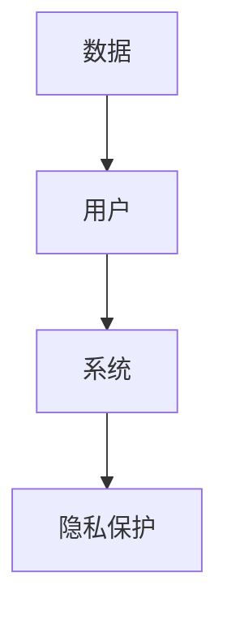
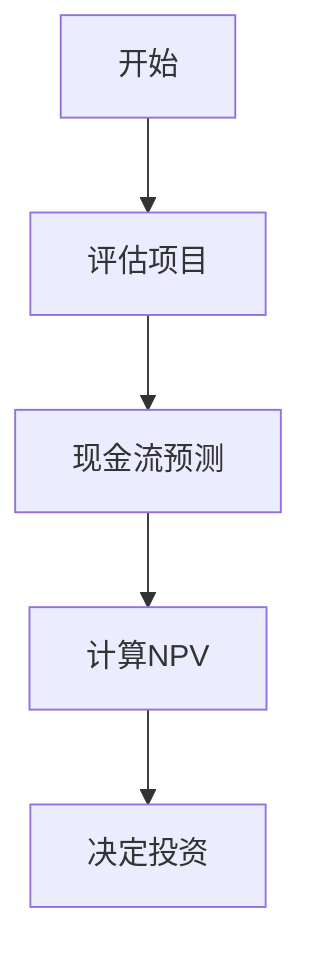
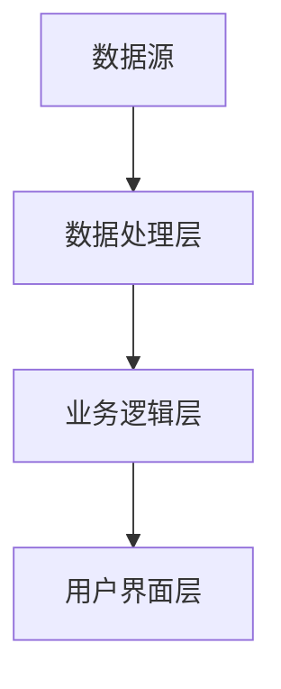

                 


# 巴菲特-芒格的智能城市安全投资：科技与隐私的平衡

> **关键词**：智能城市，安全投资，巴菲特，芒格，科技，隐私

> **摘要**：本文探讨了巴菲特和芒格的投资理念在智能城市安全投资中的应用，重点分析了科技与隐私的平衡。通过背景介绍、核心概念、算法原理、系统分析、项目实战和最佳实践等部分，详细阐述了如何在智能城市中实现安全投资，同时保护隐私。

---

# 第一部分: 背景与概述

## 第1章: 智能城市与安全投资概述

### 1.1 智能城市的定义与特征
智能城市是利用科技手段优化城市资源配置、提高居民生活质量的新型城市形态。其特征包括高效的数据处理能力、智能化的基础设施和注重可持续发展。

### 1.2 巴菲特与芒格的投资理念
巴菲特的价值投资理论强调长期稳健回报，芒格的多元思维模型则强调跨领域知识的应用。这些理念在智能城市投资中尤为重要。

### 1.3 科技与隐私的平衡
科技推动智能城市发展，但隐私问题也随之而来。本文探讨如何在技术创新中保护用户隐私。

---

# 第二部分: 核心概念与联系

## 第2章: 智能城市安全投资的核心要素

### 2.1 核心概念原理
智能城市安全投资涉及数据安全、基础设施保护和隐私保护等多个方面。

### 2.2 概念对比
通过表格对比智能城市与传统城市的差异，突出科技和隐私的重要性。

| 智能城市 | 传统城市 |
|----------|-----------|
| 高效数据处理 | 低效数据处理 | 

### 2.3 实体关系图
用Mermaid流程图展示智能城市中的实体关系，如数据、用户和系统。



---

# 第三部分: 投资模型与算法原理

## 第3章: 巴菲特-芒格投资模型

### 3.1 投资模型原理
巴菲特的CAPM模型和芒格的DCF模型用于评估智能城市项目的价值。

### 3.2 算法流程图
用Mermaid展示投资模型的步骤：



### 3.3 数学模型
CAPM公式：$$CAPM = R_f + β (R_m - R_f)$$

---

# 第四部分: 系统分析与架构设计

## 第4章: 智能城市系统架构

### 4.1 系统功能设计
包括数据收集、分析和投资决策模块。

### 4.2 系统架构图
用Mermaid展示系统架构：



### 4.3 接口设计
API接口用于数据传输和系统交互。

---

# 第五部分: 项目实战

## 第5章: 智能城市项目实施

### 5.1 环境安装
安装必要的软件和工具，如Python和数据分析库。

### 5.2 核心代码实现
代码示例：

```python
def calculate_npv(cash_flows, discount_rate):
    npv = 0
    for year, cash_flow in enumerate(cash_flows):
        npv += cash_flow / (1 + discount_rate) ** year
    return npv

# 示例计算
cash_flows = [100, 200, 300]
discount_rate = 0.10
print(calculate_npv(cash_flows, discount_rate))
```

### 5.3 案例分析
通过具体案例展示投资决策过程。

---

# 第六部分: 最佳实践与总结

## 第6章: 总结与展望

### 6.1 本章小结
总结智能城市安全投资的核心要点。

### 6.2 注意事项
强调数据安全和隐私保护的重要性。

### 6.3 拓展阅读
推荐相关书籍和资源。

---

# 作者

作者：AI天才研究院/AI Genius Institute & 禅与计算机程序设计艺术/Zen And The Art of Computer Programming

---

**本文旨在通过系统分析和实际案例，展示巴菲特和芒格的投资理念在智能城市安全投资中的应用，强调科技与隐私的平衡，为读者提供深入的技术见解和实践指导。**

