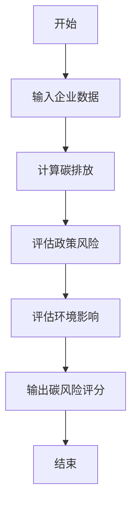
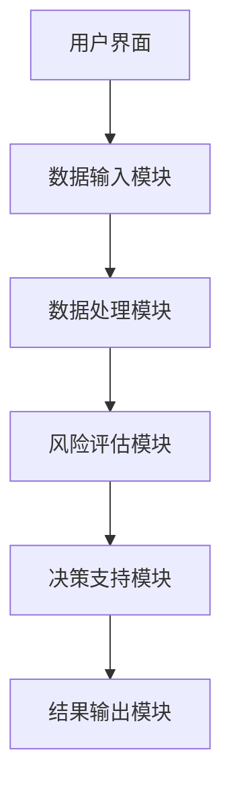

                 

# 巴菲特-芒格的气候变化投资观：风险与机遇并存

## 关键词：巴菲特, 芒格, 气候变化, 投资策略, 碳风险, 可再生能源, 环境经济学

## 摘要：  
巴菲特和芒格作为投资界的传奇人物，他们的投资理念和风险管理策略在全球气候变化的背景下显得尤为重要。本文将深入分析气候变化对投资的影响，探讨巴菲特和芒格的投资观如何帮助投资者应对气候变化带来的风险和抓住其中的机遇。通过结合环境经济学、碳风险评估、投资模型等多方面的内容，本文旨在为投资者提供一套系统化的气候变化投资策略。

---

# 第一部分：引言

## 1. 巴菲特与芒格的投资理念

### 1.1 巴菲特的价值投资原则

巴菲特的价值投资原则强调长期、基本面分析和安全边际。他主张投资那些具有强大护城河、良好管理团队和可持续竞争优势的企业。在气候变化的背景下，这种投资理念需要结合环境因素，评估企业应对气候变化的能力。

### 1.2 芒格的多元思维模型

芒格的多元思维模型强调将多个学科的知识结合起来，以全面分析问题。在气候变化投资中，芒格的思维方式可以帮助投资者将环境科学、经济学、政策和市场趋势结合起来，制定更全面的投资策略。

### 1.3 气候变化对投资的影响

气候变化不仅影响企业的运营成本和盈利能力，还可能引发政策风险和市场波动。投资者需要将气候变化视为一个长期而重要的风险因素，将其纳入投资决策中。

---

# 第二部分：气候变化的经济影响

## 2. 碳风险的评估与管理

### 2.1 碳风险的定义与分类

碳风险是指企业因气候变化政策、碳排放限制或环境事件而面临的风险。碳风险可以分为物理风险（如极端天气事件对企业运营的影响）和转型风险（如政策变化对企业商业模式的影响）。

### 2.2 环境经济学的基本概念

环境经济学研究如何将环境成本纳入经济决策中。在气候变化投资中，投资者需要评估企业的环境成本，包括碳排放、资源消耗和环境负债。

### 2.3 企业风险管理中的气候变化因素

企业风险管理需要将气候变化因素纳入考虑，评估极端天气事件对企业运营的影响，以及政策变化对企业竞争力的影响。

---

# 第三部分：巴菲特和芒格的投资策略

## 3. 价值投资与风险管理

### 3.1 价值投资的核心要素

巴菲特的价值投资原则强调企业的基本面分析，包括盈利能力、财务状况和管理团队。在气候变化投资中，投资者需要额外考虑企业的碳排放、资源使用效率和环境政策适应能力。

### 3.2 风险管理的策略

芒格的多元思维模型可以帮助投资者在气候变化投资中分散风险，通过多元化投资降低单一因素带来的风险。

### 3.3 气候变化中的风险管理

在气候变化投资中，投资者需要制定风险管理策略，包括设定碳排放目标、监控政策变化和评估企业应对气候变化的能力。

---

# 第四部分：数学模型与算法

## 4. 投资评估模型

### 4.1 CAPM模型的应用

CAPM（资本资产定价模型）可以帮助投资者评估企业在气候变化中的风险调整回报。通过将碳风险纳入CAPM模型，投资者可以更准确地评估企业的投资价值。

### 4.2 碳风险评估模型

碳风险评估模型可以通过对企业碳排放、政策风险和环境影响进行量化，评估企业在气候变化中的风险敞口。

### 4.3 算法流程图

使用Mermaid绘制碳风险评估模型的流程图：

---

# 第五部分：系统架构设计

## 5. 投资分析系统的架构

### 5.1 系统功能设计

投资分析系统需要具备数据收集、风险评估、决策支持等功能。通过收集企业的碳排放数据、政策信息和市场趋势，系统可以提供个性化的投资建议。

### 5.2 系统架构图

使用Mermaid绘制系统架构图：

---

# 第六部分：项目实战

## 6. 气候变化投资案例分析

### 6.1 可再生能源投资的分析

以某可再生能源公司为例，分析其碳排放、政策支持和市场前景。通过碳风险评估模型，评估其投资价值。

### 6.2 投资策略的制定

根据企业的碳风险评分和市场前景，制定个性化投资策略。例如，优先投资那些碳排放低、政策支持强的企业。

---

# 第七部分：最佳实践与总结

## 7. 最佳实践

### 7.1 投资策略

投资者应优先考虑那些在气候变化中具有竞争优势的企业，如可再生能源、绿色技术和环保服务。

### 7.2 风险管理

通过多元化投资和风险管理策略，降低气候变化带来的风险。同时，密切关注政策变化和市场趋势。

### 7.3 长期投资

气候变化是一个长期问题，投资者应采取长期投资策略，关注企业的可持续发展能力。

---

# 结论

气候变化是全球性的挑战，也是投资机会。巴菲特和芒格的投资理念为我们提供了应对气候变化风险和抓住机遇的策略。通过结合环境经济学、风险管理模型和系统化的投资策略，投资者可以在气候变化中实现长期稳健的投资回报。

---

# 作者：AI天才研究院/AI Genius Institute & 禅与计算机程序设计艺术 /Zen And The Art of Computer Programming

