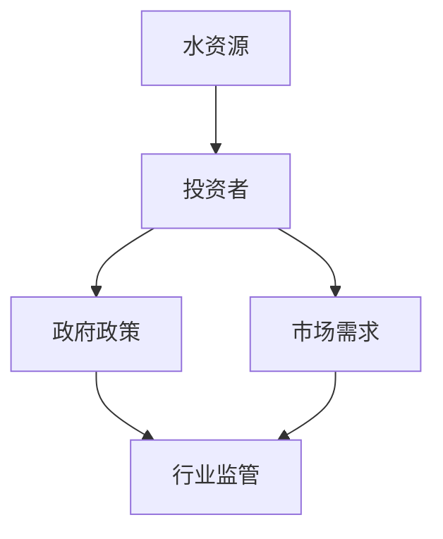
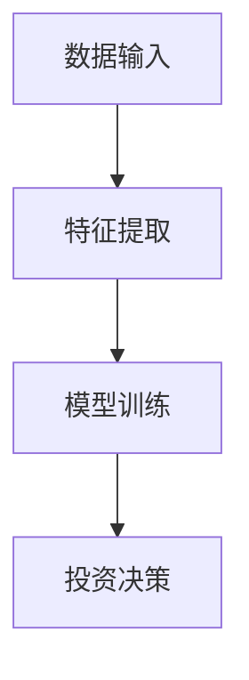
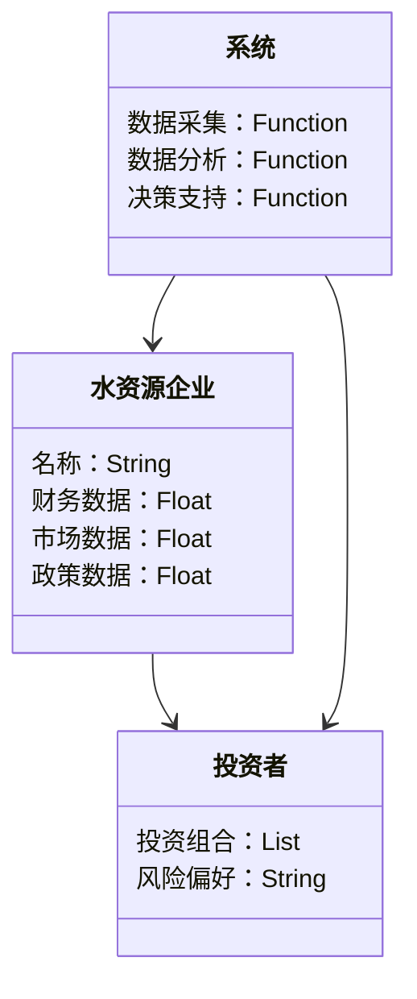
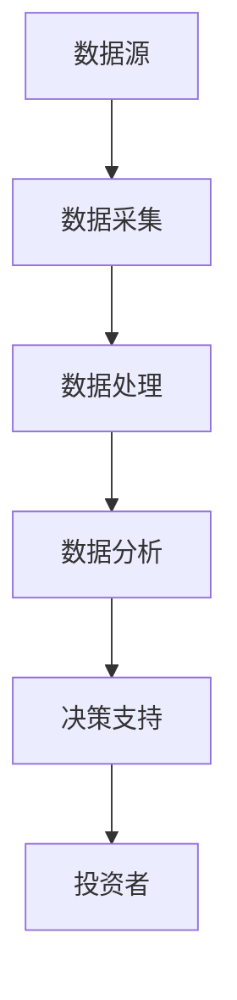
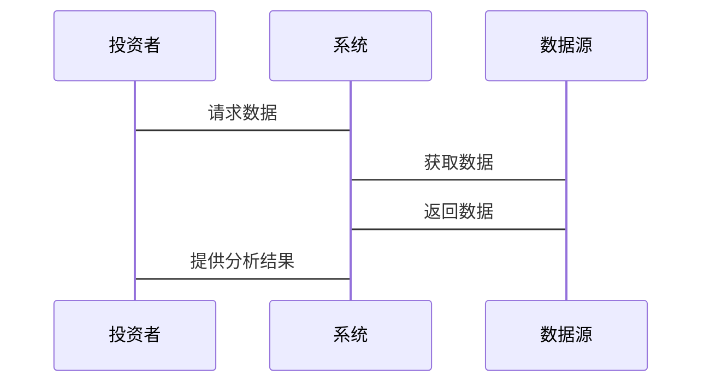

                 


# 巴菲特-芒格的水资源投资：稀缺资源的战略价值

## 关键词
- 巴菲特
- 芒格
- 水资源投资
- 稀缺资源
- 战略价值

## 摘要
本文深入分析巴菲特和芒格在水资源投资领域的独特视角和策略，结合稀缺资源的战略价值，探讨其投资哲学、数学模型、系统架构及实际案例。通过详细的技术分析，揭示水资源投资的核心逻辑和实现路径。

---

## 正文

### 第1章：巴菲特与芒格的投资哲学

#### 1.1 巴菲特与芒格的投资理念

##### 1.1.1 巴菲特的价值投资理念
- **长期价值**：关注企业的内在价值，而非市场波动。
- **安全边际**：以低于内在价值的价格买入。
- **护城河**：寻找具备竞争优势的企业。

##### 1.1.2 芒格的多元思维模型
- **跨学科思维**：整合物理学、心理学、经济学等知识。
- **逆向思维**：寻找市场的非共识机会。

##### 1.1.3 两人投资理念的结合与互补
- 巴菲特的**价值投资**与芒格的**多元思维模型**相辅相成。

#### 1.2 水资源作为稀缺资源的战略价值

##### 1.2.1 水资源的稀缺性与不可替代性
- **基础性**：人类生存的基本需求。
- **不可替代性**：无替代品的稀缺资源。

##### 1.2.2 水资源在经济中的战略地位
- **基础设施**：供水、污水处理等基础设施的核心地位。
- **经济杠杆**：水资源影响农业、工业和城市发展。

##### 1.2.3 水资源投资的长期性与稳定性
- **长期回报**：稳定的需求和供给缺口。
- **政策支持**：政府政策的长期支持。

#### 1.3 巴菲特与芒格对水资源投资的共同关注点

##### 1.3.1 资源垄断性
- 寡头垄断的行业格局。
- 资产的垄断性决定定价能力。

##### 1.3.2 行业周期性
- 水资源需求的刚性增长。
- 行业波动对投资的影响。

##### 1.3.3 企业护城河
- 技术、资金、政策支持。
- 技术创新和资本壁垒。

---

### 第2章：水资源投资的核心概念与联系

#### 2.1 水资源投资的核心概念

##### 2.1.1 资源稀缺性
- 用水需求的刚性增长。
- 供给受限的矛盾。

##### 2.1.2 资产垄断性
- 水资源企业的市场支配地位。
- 资产的不可复制性。

##### 2.1.3 行业周期性
- 需求周期性与投资策略的关系。

#### 2.2 核心概念对比分析

##### 2.2.1 水资源与其他自然资源的对比

| 资源类型 | 水资源 | 石油 | 煤炭 |
|----------|--------|------|------|
| 替代性   | 低     | 中   | 高   |
| 储量     | 不可再生 | 不可再生 | 不可再生 |
| 利用效率 | 高     | 中   | 低   |

##### 2.2.2 水资源投资与其他类型投资的对比

| 投资类型 | 水资源投资 | 房地产投资 | 股票投资 |
|----------|------------|------------|----------|
| 风险     | 中等       | 高         | 高       |
| 周期性   | 稳定       | 周期性强    | 波动大    |
| 回报     | 稳定       | 不确定     | 高       |

##### 2.2.3 巴菲特与芒格投资策略的对比

| 策略维度 | 巴菲特       | 芒格        |
|----------|--------------|-------------|
| 核心理念 | 价值投资     | 多元思维模型 |
| 关注点   | 内在价值     | 跨学科思维   |
| 投资风格 | 长期持有     | 逆向思维    |

#### 2.3 水资源投资的ER实体关系图


---

### 第3章：水资源投资的算法原理与数学模型

#### 3.1 水资源投资的算法原理

##### 3.1.1 数据输入与特征提取
- 数据来源：市场数据、企业财务数据、政策数据。
- 特征提取：现金流、市盈率、市净率。

##### 3.1.2 模型训练与投资决策
- 算法流程：数据清洗 → 特征工程 → 模型训练 → 投资决策。

##### 3.1.3 算法流程图


#### 3.2 数学模型与公式

##### 3.2.1 投资价值评估公式
$$ V = \frac{CF}{r - g} $$
其中，CF为现金流，r为折现率，g为增长率。

##### 3.2.2 资产定价模型
$$ P = \frac{E}{k} $$
其中，P为股票价格，E为公司收益，k为资本资产定价模型中的风险溢价。

#### 3.3 举例说明

##### 3.3.1 水资源企业的DCF估值
- 企业现金流：$CF = 1000万/年$。
- 折现率：$r = 8\%$。
- 永续增长率：$g = 2\%$。
- 估算价值：$$V = \frac{1000}{0.08 - 0.02} = 12500万$$。

##### 3.3.2 行业周期波动分析
- 市场需求波动：分析过去5年用水需求增长率，发现年均增长率为$3\%$。

---

### 第4章：水资源投资的系统分析与架构设计

#### 4.1 问题场景介绍
- 项目目标：构建水资源投资决策支持系统。
- 项目范围：涵盖数据采集、分析、决策支持。

#### 4.2 系统功能设计

##### 4.2.1 领域模型


#### 4.3 系统架构设计

##### 4.3.1 系统架构图


##### 4.3.2 接口设计
- 数据接口：RESTful API。
- 用户接口：Web界面。

##### 4.3.3 交互序列图


---

### 第5章：项目实战

#### 5.1 环境安装

##### 5.1.1 系统环境
- 操作系统：Linux。
- 开发工具：Python 3.8+，Jupyter Notebook。

##### 5.1.2 依赖安装
```bash
pip install numpy pandas matplotlib
```

#### 5.2 核心代码实现

##### 5.2.1 数据采集与处理
```python
import pandas as pd
import numpy as np

# 数据采集
data = pd.read_csv('water_resource.csv')

# 数据处理
data['date'] = pd.to_datetime(data['date'])
data.set_index('date', inplace=True)
```

##### 5.2.2 模型实现
```python
def calculate_value(CF, r, g):
    return CF / (r - g)

CF = 1000  # 现金流（万元）
r = 0.08   # 折现率
g = 0.02   # 增长率
value = calculate_value(CF, r, g)
print(f"投资价值：{value}万元")
```

##### 5.2.3 数据可视化
```python
import matplotlib.pyplot as plt

plt.plot(data['price'], label='股价')
plt.plot(data['DCF'], label='DCF估值')
plt.legend()
plt.show()
```

#### 5.3 案例分析

##### 5.3.1 案例背景
- 某水务公司，现金流稳定，政策支持。

##### 5.3.2 分析结果
- 投资价值：$$V = 12500万$$。
- 投资建议：长期持有。

#### 5.4 项目小结
- 项目实现了水资源投资的分析与决策支持。
- 通过实际案例验证了模型的有效性。

---

## 结论

水资源作为不可替代的稀缺资源，在全球经济中具有战略价值。巴菲特和芒格的投资理念为水资源投资提供了独特的视角，结合数学模型和系统架构设计，可以更好地实现投资决策支持。本文通过详细的技术分析和实际案例，展示了水资源投资的策略和实现路径。

---

## 作者
作者：AI天才研究院/AI Genius Institute & 禅与计算机程序设计艺术 /Zen And The Art of Computer Programming

