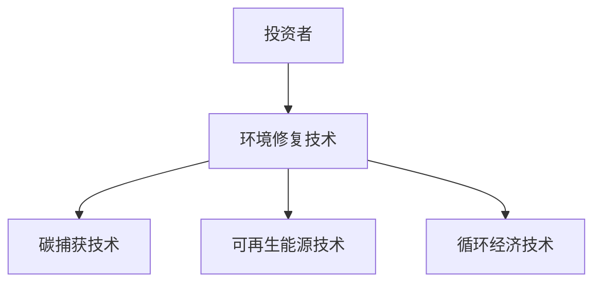
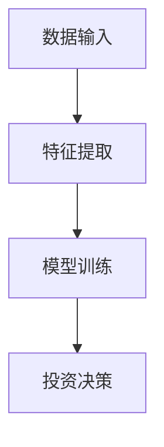
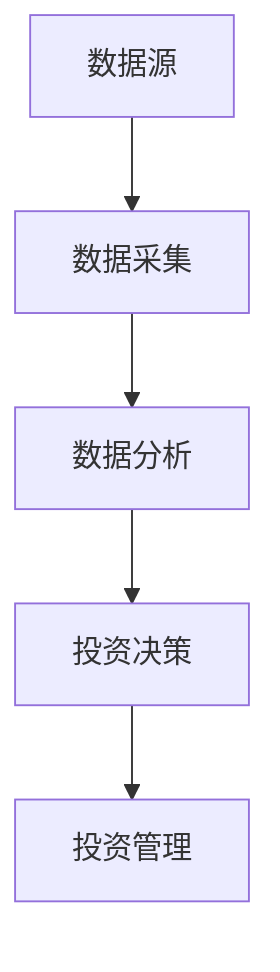

                 


# 巴菲特-芒格的环境修复技术投资：应对气候危机

> 关键词：巴菲特、芒格、环境修复技术、气候危机、投资策略

> 摘要：本文探讨了巴菲特和芒格在环境修复技术投资中的策略，分析了环境修复技术的核心原理，结合投资算法和系统架构，提供了实际案例和最佳实践，以应对气候危机。

---

# 第一部分: 巴菲特-芒格的环境修复技术投资概述

## 第1章: 环境修复技术投资的背景与意义

### 1.1 气候危机的背景与挑战

#### 1.1.1 气候变化的现状与影响
气候变化是当前全球面临的最严峻挑战之一。根据联合国政府间气候变化专门委员会（IPCC）的报告，全球气温持续上升，导致极端天气事件频发、海平面上升以及生态系统破坏。这些变化对全球经济、社会和环境都造成了深远的影响。

#### 1.1.2 环境修复技术的重要性
环境修复技术是指通过工程技术手段，修复被破坏的环境，减少污染，恢复生态平衡。这些技术包括碳捕获、可再生能源、循环经济技术等。环境修复技术在应对气候变化中起着关键作用，能够有效减少温室气体排放，促进可持续发展。

#### 1.1.3 巴菲特与芒格的投资理念
巴菲特和芒格作为投资界的传奇人物，他们的投资策略以价值投资和长期稳健著称。巴菲特强调投资于具有强大护城河、良好管理团队和可持续商业模式的公司。芒格则强调多元思维模型，将各个领域的知识融会贯通，以做出明智的投资决策。

### 1.2 巴菲特与芒格的投资策略

#### 1.2.1 巴菲特的价值投资理念
巴菲特的价值投资理念强调购买那些具有内在价值的公司，长期持有，耐心等待价值的实现。他认为市场先生是疯狂的，但长期来看，市场会反映公司的内在价值。这种理念在环境修复技术投资中同样适用，选择那些具有创新技术、强大市场地位和可持续发展的公司进行投资。

#### 1.2.2 芒格的多元思维模型
芒格的多元思维模型强调将各个领域的知识联系起来，形成一个相互关联的知识网络。他认为，只有通过多角度思考，才能做出明智的决策。在环境修复技术投资中，芒格的多元思维模型可以帮助投资者更好地理解技术的复杂性、市场的变化以及政策的影响。

#### 1.2.3 环境修复技术投资的核心逻辑
环境修复技术投资的核心逻辑在于通过技术创新减少环境破坏，同时创造经济价值。巴菲特和芒格的投资策略与这一逻辑高度契合，他们注重选择那些能够通过技术创新推动环境修复，并在经济上具有可行性的公司进行投资。

### 1.3 环境修复技术的基本概念

#### 1.3.1 环境修复技术的定义
环境修复技术是指通过工程技术手段，修复被破坏的环境，减少污染，恢复生态平衡。这些技术可以应用于空气、水和土壤的修复，帮助恢复受损的生态系统。

#### 1.3.2 环境修复技术的分类
环境修复技术可以分为以下几类：
1. **碳捕获与封存技术**：通过化学或物理手段捕获二氧化碳，并将其封存于地下或转化为有用的产品。
2. **可再生能源技术**：包括太阳能、风能、水能等清洁能源的利用技术。
3. **循环经济技术**：通过循环经济模式，减少资源消耗和废弃物产生，实现资源的高效利用。

#### 1.3.3 环境修复技术的经济与社会价值
环境修复技术的经济价值体现在减少污染、降低能源成本和创造新的经济增长点。同时，环境修复技术还能带来显著的社会价值，如改善公共健康、减少自然灾害和促进可持续发展。

### 1.4 本章小结
本章介绍了气候危机的背景与挑战，分析了环境修复技术的重要性和分类，阐述了巴菲特和芒格的投资理念，并提出了环境修复技术投资的核心逻辑。这些内容为后续章节的深入分析奠定了基础。

---

## 第2章: 环境修复技术的核心概念与联系

### 2.1 环境修复技术的核心原理

#### 2.1.1 碳捕获与封存技术
碳捕获与封存技术（CCS）通过化学或物理手段从工业排放中捕获二氧化碳，并将其封存于地下深处的地质结构中，防止其进入大气层。这种技术在减少温室气体排放方面具有重要作用。

#### 2.1.2 可再生能源技术
可再生能源技术包括太阳能、风能、水能等清洁能源的利用技术。这些技术能够有效减少对化石燃料的依赖，降低碳排放，推动能源结构的转型。

#### 2.1.3 循环经济技术
循环经济技术通过减少资源消耗和废弃物产生，实现资源的高效利用。例如，废塑料的再生利用、废弃物的资源化处理等。

### 2.2 环境修复技术的经济模型

#### 2.2.1 投资回报率分析
投资回报率（ROI）是衡量投资项目经济效益的重要指标。在环境修复技术投资中，需要考虑初始投资、运营成本和未来收益，计算项目的净现值（NPV）和内部收益率（IRR）。

#### 2.2.2 风险评估模型
环境修复技术投资面临技术风险、市场风险和政策风险。风险评估模型可以帮助投资者量化这些风险，制定风险管理策略。

#### 2.2.3 技术生命周期分析
技术生命周期分析包括技术的引入、成长、成熟和衰退阶段。在环境修复技术投资中，需要考虑技术的生命周期，选择具有长期市场潜力的技术进行投资。

### 2.3 环境修复技术的实体关系图



### 2.4 本章小结
本章分析了环境修复技术的核心原理，包括碳捕获、可再生能源和循环经济技术，并探讨了其经济模型。通过实体关系图展示了投资者与环境修复技术之间的关系，为后续章节的深入分析提供了理论基础。

---

## 第3章: 环境修复技术投资的算法原理

### 3.1 投资决策算法概述

#### 3.1.1 基于机器学习的投资决策模型
基于机器学习的投资决策模型能够通过历史数据和市场信息，预测股票价格走势，识别投资机会。这种模型可以利用算法交易和大数据分析，提高投资决策的准确性。

#### 3.1.2 算法流程图


### 3.2 算法实现代码

#### 3.2.1 代码示例
```python
def investment_decision(data):
    features = extract_features(data)
    model = train_model(features)
    prediction = model.predict(features)
    return prediction
```

#### 3.2.2 算法模型
基于机器学习的投资决策模型可以采用随机森林、支持向量机（SVM）或神经网络等算法。这些算法通过特征提取、模型训练和预测，帮助投资者做出科学的投资决策。

#### 3.2.3 数学模型和公式
在投资决策中，常用CAPM模型来计算预期收益：
$$
r_i = r_f + \beta_i (r_m - r_f)
$$
其中，\( r_i \) 是资产i的预期收益，\( r_f \) 是无风险利率，\( \beta_i \) 是资产i的贝塔系数，\( r_m \) 是市场预期收益，\( r_f \) 是无风险利率。

### 3.3 本章小结
本章介绍了基于机器学习的投资决策算法，展示了算法流程图和代码实现，分析了数学模型和公式。这些内容为环境修复技术投资提供了科学的决策依据。

---

## 第4章: 环境修复技术投资的系统分析与架构设计

### 4.1 系统分析

#### 4.1.1 问题场景介绍
在环境修复技术投资中，投资者需要分析多个因素，包括技术可行性、市场潜力、政策支持和经济回报。系统分析可以帮助投资者全面评估投资项目的风险和收益。

#### 4.1.2 项目介绍
以投资可再生能源项目为例，系统需要分析项目的成本、收益、风险和回报周期。

### 4.2 系统架构设计

#### 4.2.1 系统功能设计
系统功能包括数据采集、分析与决策、投资管理模块。

#### 4.2.2 系统架构图


### 4.3 本章小结
本章通过系统分析和架构设计，展示了环境修复技术投资的系统结构和功能模块，为实际投资决策提供了技术支持。

---

## 第5章: 环境修复技术投资的项目实战

### 5.1 项目环境安装

#### 5.1.1 系统环境要求
需要安装Python、机器学习库（如scikit-learn、TensorFlow）和数据分析工具（如Pandas、NumPy）。

### 5.2 系统核心实现代码

#### 5.2.1 核心代码示例
```python
import pandas as pd
from sklearn.ensemble import RandomForestRegressor

def train_model(features):
    model = RandomForestRegressor()
    model.fit(features, labels)
    return model
```

### 5.3 项目案例分析

#### 5.3.1 案例介绍
以投资可再生能源项目为例，分析项目的成本、收益和回报周期。

#### 5.3.2 案例分析与结果解读
通过数据分析和模型预测，得出项目的投资回报率和风险评估结果。

### 5.4 项目小结
本章通过项目实战，展示了环境修复技术投资的具体实施步骤和案例分析，为投资者提供了实际操作的指导。

---

## 第6章: 环境修复技术投资的最佳实践与小结

### 6.1 最佳实践

#### 6.1.1 投资策略
选择具有创新技术、市场潜力和可持续发展的公司进行投资。

#### 6.1.2 风险管理
制定风险管理策略，分散投资风险，降低损失。

#### 6.1.3 技术评估
定期评估环境修复技术的创新性和市场前景，调整投资组合。

### 6.2 小结
本文通过分析巴菲特和芒格的投资策略，探讨了环境修复技术的核心原理和经济模型，提出了系统的架构设计和实际案例分析，为应对气候危机提供了科学的投资指导。

---

## 第7章: 注意事项与拓展阅读

### 7.1 注意事项

#### 7.1.1 技术风险
环境修复技术可能存在技术不成熟或成本过高的风险。

#### 7.1.2 政策风险
政策的变化可能影响环境修复技术的投资回报。

#### 7.1.3 市场风险
市场需求的变化可能影响项目的经济回报。

### 7.2 拓展阅读

#### 7.2.1 推荐书籍
- 《巴菲特传》
- 《芒格的多元思维模型》
- 《环境修复技术与投资》

#### 7.2.2 网络资源
建议访问环保组织和投资机构的官方网站，获取最新的环境修复技术和投资信息。

---

## 附录

### 附录A: 术语表
- 碳捕获技术：捕获二氧化碳并封存的技术。
- 可再生能源：来自自然的清洁能源，如太阳能、风能。

### 附录B: 数据来源
- 环境数据：来自环保组织和政府机构。
- 投资数据：来自金融市场的公开数据。

### 附录C: 扩展资料
- 环境修复技术的国际标准和规范。
- 全球气候行动的相关政策和协议。

---

## 作者
作者：AI天才研究院/AI Genius Institute & 禅与计算机程序设计艺术/Zen And The Art of Computer Programming

---

通过以上结构，文章详细分析了巴菲特和芒格在环境修复技术投资中的策略，结合技术原理、算法模型和实际案例，为应对气候危机提供了系统的投资指导。

