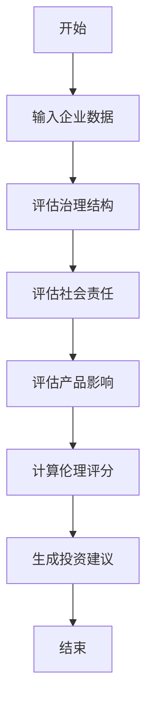
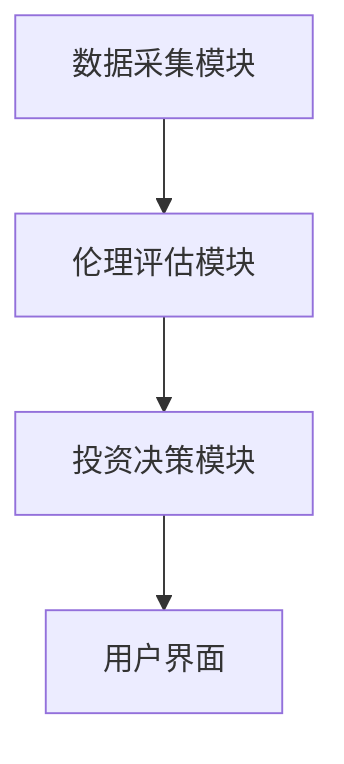

                 


# 巴菲特-芒格的生物技术伦理投资：科技进步与道德平衡

---

## 关键词：巴菲特，芒格，生物技术，伦理投资，科技进步，道德平衡

---

## 摘要： 
本文探讨了生物技术领域的伦理投资策略，结合巴菲特和芒格的投资理念，分析了科技进步与道德平衡的结合。通过构建伦理评估模型和算法，本文为投资者提供了在生物技术领域进行负责任投资的方法，强调在追求收益的同时，考虑社会和环境的长远影响。

---

## 第一部分：背景介绍

### 第1章：生物技术的发展与伦理挑战

#### 1.1 生物技术的定义与现状
生物技术是指利用生物科学知识和工程技术来改良或利用生物体或其组成部分的技术。当前，生物技术在医疗、农业和环境领域快速发展，例如基因编辑技术CRISPR-Cas9的出现，使得基因治疗成为可能。

| 应用领域 | 技术实例 | 影响 |
|----------|-----------|------|
| 医疗     | 基因治疗  | 改善疾病治疗效果 |
| 农业     | 转基因作物 | 提高产量和抗病性 |
| 环境     | 生物修复  | 治理污染 |

#### 1.2 生物技术的伦理问题
生物技术的发展带来了一系列伦理问题，如基因编辑的道德争议和生态平衡破坏的风险。

**伦理争议**：
- 基因编辑可能导致人类设计婴儿，引发伦理问题。
- 生物技术可能被滥用，用于制造生物武器。

**生态影响**：
- 转基因生物可能对生态系统造成不可预测的影响。

#### 1.3 巴菲特与芒格的投资理念
巴菲特的价值投资强调长期价值和企业基本面，而芒格的多元思维模型则注重跨学科思考，避免短期波动。

**共同点**：
- 强调长期价值和社会责任。
- 重视企业治理和道德风险。

---

## 第二部分：核心概念

### 第2章：生物技术伦理投资的定义与原则

#### 核心概念
生物技术伦理投资是将伦理考量纳入投资决策的过程，确保投资既创造经济价值，又符合社会道德标准。

**伦理考量**：
- 企业行为是否符合伦理标准。
- 产品是否对社会有益。

#### 核心原则
- **道德风险识别**：评估企业在研发和生产中的伦理问题。
- **长期价值评估**：考虑投资对社会的长期影响。
- **社会责任承担**：企业应承担减少负面影响的责任。

---

## 第三部分：模型与方法

### 第3章：生物技术伦理评估模型

#### 模型构建
模型旨在评估企业在生物技术领域的伦理表现，由输入变量、处理步骤和输出结果组成。

**输入变量**：
- 企业伦理表现：包括治理结构、社会责任。
- 产品影响：包括对环境和社会的影响。
- 财务表现：包括盈利能力、成长性。

**输出结果**：
- 伦理评分：1-10分，1分最低，10分最高。
- 投资建议：建议投资、观望或避免。

#### 伦理评分系统
通过多维度评估企业，确保评分的全面性。

**评分维度**：
- 治理结构（30%）
- 社会责任（30%）
- 产品影响（40%）

**评分权重**：通过权重分配，确保每个维度的重要性。

---

### 第4章：伦理投资的算法与数学模型

#### 伦理评估算法
使用mermaid流程图展示算法步骤：



#### 数学模型
**伦理评分公式**：
$$ \text{伦理评分} = 0.3 \times (\text{治理结构评分}) + 0.3 \times (\text{社会责任评分}) + 0.4 \times (\text{产品影响评分}) $$

**投资建议规则**：
- 评分≥7：建议投资。
- 评分5-7：建议观望。
- 评分≤5：建议避免。

---

## 第四部分：系统架构与实现

### 第5章：系统架构设计

#### 功能模块
系统由数据采集、伦理评估和投资决策三个模块组成。

**数据采集模块**：
- 采集企业数据，包括财务和伦理表现。

**伦理评估模块**：
- 计算伦理评分，生成投资建议。

**投资决策模块**：
- 根据评分和建议，做出投资决策。

#### 系统架构图
使用mermaid图展示系统架构：



### 第6章：系统实现与案例分析

#### 环境配置
安装Python和相关库（如pandas、scikit-learn）。

#### 核心代码实现
```python
def calculate_ethical_score(governance, csr, impact):
    return 0.3 * governance + 0.3 * csr + 0.4 * impact

def investment_recommendation(score):
    if score >= 7:
        return "建议投资"
    elif 5 <= score < 7:
        return "建议观望"
    else:
        return "建议避免"

# 示例数据
governance = 8
csr = 7
impact = 6

score = calculate_ethical_score(governance, csr, impact)
recommendation = investment_recommendation(score)
print(f"伦理评分：{score}\n投资建议：{recommendation}")
```

#### 案例分析
以一家生物技术公司为例，计算伦理评分并给出投资建议。

---

## 第五部分：总结与展望

### 第7章：总结与最佳实践

#### 投资策略总结
在生物技术投资中，平衡伦理与收益至关重要。长期价值和社会责任是投资的核心考量。

**最佳实践Tips**：
1. 详细评估企业的伦理表现。
2. 避免短期波动，注重长期影响。
3. 定期更新评估模型，适应技术发展。

#### 未来展望
随着生物技术的进步，伦理投资将面临更多挑战和机遇。投资者需持续关注技术发展和社会影响，优化投资策略。

---

## 附录：拓展阅读与参考文献

### 附录A：相关文献与推荐阅读
- 巴菲特和芒格的著作。
- 生物技术伦理相关论文。

### 附录B：术语解释与定义
- 生物技术：利用生物科学知识和工程技术来改良或利用生物体或其组成部分的技术。

### 附录C：伦理评分系统详细说明
详细解释评分维度和权重分配。

### 附录D：系统架构与代码的详细文档
提供系统架构图和代码实现的详细说明。

---

## 作者：AI天才研究院 & 禅与计算机程序设计艺术

---

本文通过详细分析生物技术领域的伦理投资策略，结合巴菲特和芒格的投资理念，为投资者提供了在追求收益的同时兼顾社会责任的指导。希望本文能为读者在生物技术投资中找到科技与道德的平衡点提供参考。

