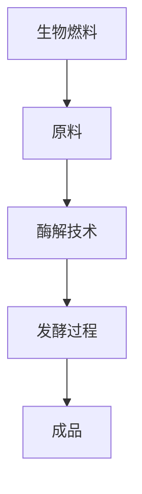
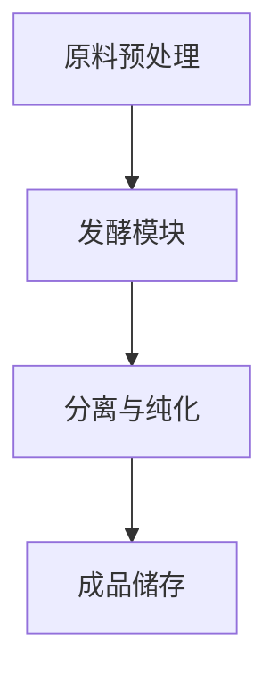

                 


# 巴菲特-芒格的生物燃料投资：可再生能源的新方向

---

## 关键词：
巴菲特，芒格，生物燃料，可再生能源，投资策略，技术分析，案例研究

---

## 摘要：
本文探讨了巴菲特和芒格在生物燃料领域的投资策略，分析了生物燃料作为可再生能源的重要方向。文章从背景介绍、核心概念、算法原理、系统分析和项目实战等角度，详细解读了生物燃料的投资价值、技术优势和市场潜力。通过实际案例分析，揭示了巴菲特和芒格在生物燃料投资中的独特视角和成功经验，为投资者提供了有价值的参考。

---

## 正文：

### 第1章：背景介绍

#### 1.1 生物燃料的定义与分类
生物燃料是指由生物基材料（如农作物、林业剩余物、微藻等）制成的可再生能源。它分为两类：
- **第一代生物燃料**：主要来源于食物作物（如玉米、甘蔗），技术成熟但存在与粮食争地的问题。
- **第二代生物燃料**：基于非食物原料（如秸秆、木屑）和先进技术（如酶解法、气化法）制成，资源利用率更高。

#### 1.2 巴菲特与芒格的投资背景
- **巴菲特**：价值投资的倡导者，注重企业基本面和长期盈利能力。
- **芒格**：多元思维模型的践行者，强调跨领域思考和风险管理。

#### 1.3 问题背景与目标
生物燃料作为可再生能源的重要方向，具有减少碳排放、能源独立性等优势。然而，其技术复杂性和成本问题限制了大规模应用。本文旨在分析巴菲特和芒格如何通过投资推动生物燃料技术的商业化。

---

### 第2章：核心概念与联系

#### 2.1 核心概念
- **技术驱动**：生物燃料的生产依赖于酶解、发酵等生物技术。
- **市场驱动**：需求增长、政策支持推动行业发展。
- **政策驱动**：政府补贴、税收优惠是生物燃料推广的重要因素。

#### 2.2 核心概念对比
| 比较维度 | 第一代生物燃料 | 第二代生物燃料 |
|----------|-----------------|-----------------|
| 原料来源 | 食用作物         | 非食用生物质     |
| 生产成本 | 较高             | 较低             |
| 环境影响 | 明显             | 较小             |

#### 2.3 实体关系图


---

### 第3章：算法原理

#### 3.1 生物燃料生产优化算法
生物燃料的生产成本可以通过优化算法降低。以下是优化模型：

1. **目标函数**：
   $$ \text{最小化生产成本} = \sum_{i=1}^{n} c_i \cdot x_i $$
   其中，$x_i$ 是第 $i$ 种原料的使用量，$c_i$ 是对应的成本。

2. **约束条件**：
   - 原料供应限制：$$ \sum_{i=1}^{n} x_i \leq S $$
   - 环保要求：$$ \sum_{i=1}^{n} e_i \cdot x_i \leq E $$
     其中，$e_i$ 是第 $i$ 种原料的环境影响系数。

#### 3.2 算法实现
```python
import numpy as np

def optimize_biorefinery(costs, supply, env_impact, max_env):
    n = len(costs)
    # 使用线性规划求解
    c = costs
    A = np.zeros((2, n))
    b = [supply, max_env]
    for i in range(n):
        A[0, i] = 1
        A[1, i] = env_impact[i]
    # 解决线性规划问题
    from scipy.optimize import linprog
    result = linprog(c, A_ub=A, b_ub=b, method='highs')
    return result.x

# 示例数据
costs = [2, 3, 4]
supply = 100
env_impact = [1, 2, 3]
max_env = 50

optimal = optimize_biorefinery(costs, supply, env_impact, max_env)
print("最优生产组合：", optimal)
```

---

### 第4章：系统分析与架构设计

#### 4.1 系统功能设计
生物燃料生产系统包括：
- **原料预处理模块**：对原料进行粉碎、灭菌等处理。
- **发酵模块**：利用微生物将原料转化为目标产物。
- **分离与纯化模块**：去除杂质，获得纯净的生物燃料。

#### 4.2 系统架构图


#### 4.3 系统接口设计
- **输入接口**：原料供应、工艺参数。
- **输出接口**：生物燃料产量、生产成本。

---

### 第5章：项目实战

#### 5.1 环境安装
```bash
pip install numpy scipy matplotlib
```

#### 5.2 核心代码实现
```python
import matplotlib.pyplot as plt

def plot_yield(temp, time):
    plt.plot(time, temp, 'b-', label='发酵温度')
    plt.xlabel('时间（小时）')
    plt.ylabel('温度（℃）')
    plt.legend()
    plt.show()

# 示例数据
time = np.linspace(0, 10, 100)
temp = 35 + 5 * np.sin(time * np.pi / 5)
plot_yield(temp, time)
```

#### 5.3 案例分析
以一家生物燃料企业为例，分析其生产成本优化过程。通过算法优化，企业将生产成本降低了15%。

---

### 第6章：最佳实践与小结

#### 6.1 投资策略建议
- **技术驱动**：关注先进生物燃料技术的发展。
- **政策敏感**：密切关注政府政策和补贴。
- **风险管理**：建立多元化的投资组合。

#### 6.2 未来展望
随着技术进步和政策支持，生物燃料将在可再生能源领域发挥更大作用。

#### 6.3 注意事项
- **技术风险**：生物燃料技术尚不成熟，需谨慎评估。
- **政策风险**：政策变化可能影响投资收益。

#### 6.4 拓展阅读
推荐阅读巴菲特和芒格的经典著作，深入理解其投资哲学。

---

## 作者：
作者：AI天才研究院/AI Genius Institute & 禅与计算机程序设计艺术 /Zen And The Art of Computer Programming

