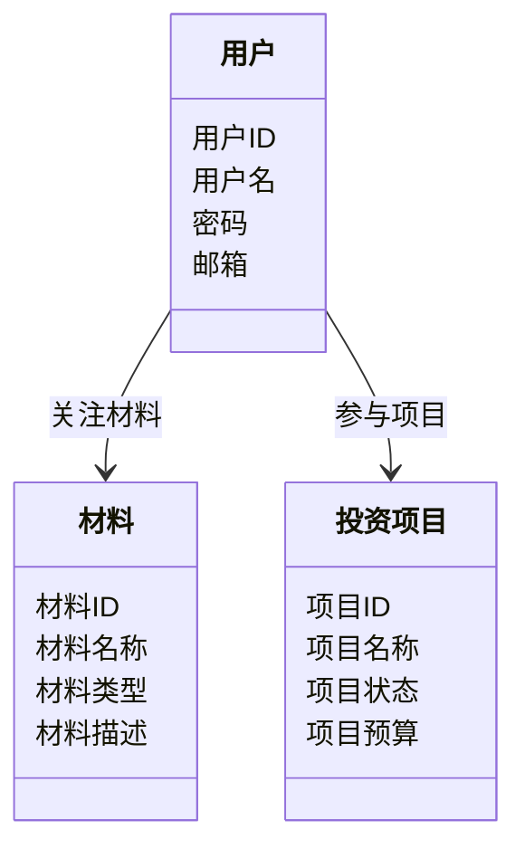

                 


# 巴菲特-芒格的生物降解智能材料投资：可持续科技的新方向

## 关键词

生物降解材料，智能材料，巴菲特投资策略，芒格投资理念，可持续科技

## 摘要

本文探讨了巴菲特和芒格在投资生物降解智能材料方面的策略，分析了这些投资如何推动可持续科技的发展。文章从背景介绍、投资理念、投资机会、案例分析、系统架构、项目实战和最佳实践等多个方面展开，详细阐述了生物降解智能材料的投资价值和应用前景，为读者提供了全面的分析和见解。

---

## 第一部分：背景介绍

### 第1章：生物降解智能材料概述

#### 1.1 生物降解材料的基本概念

生物降解材料是指在自然环境中能够被微生物分解为二氧化碳和水等简单化合物的材料。其核心特性包括可生物降解性、环境友好性和可持续性。生物降解材料的分类主要基于其来源和分解机制，包括：

- **天然高分子材料**：如淀粉、纤维素和壳聚糖，这些材料来源于生物体，易于分解。
- **合成高分子材料**：如聚乳酸（PLA）和聚己内酯（PCL），这些材料通过特定的降解条件分解。

#### 1.2 智能材料的定义与特点

智能材料是一种能够感知外界环境变化并做出相应反应的材料。其主要特点包括：

- **响应性**：能够对外界刺激（如温度、湿度、光照）做出反应。
- **自适应性**：能够在不同的环境中调整自身性能。
- **功能性**：具备特定的功能，如导电性、磁性或形状记忆功能。

#### 1.3 生物降解与智能材料的结合

生物降解智能材料的结合不仅保留了智能材料的响应性，还具备生物降解材料的环保特性。这种结合为可持续科技提供了新的方向，尤其是在包装、农业和医疗等领域具有广泛的应用潜力。

---

## 第二部分：巴菲特与芒格的投资理念

### 第2章：巴菲特与芒格的投资策略

#### 2.1 巴菲特的价值投资理念

巴菲特的价值投资理念强调长期投资和企业基本面分析。他注重企业的盈利能力、财务状况和竞争优势，认为投资应基于企业的内在价值。

##### 核心概念：
- **内在价值**：企业未来现金流的现值。
- **安全边际**：投资价格低于内在价值的部分。

#### 2.2 芒格的多元思维模型

芒格的多元思维模型强调跨学科思考，认为投资决策应基于多维度的知识和逻辑。他主张通过广泛的阅读和思考，构建多个思维模型，以提高决策的准确性。

##### 核心概念：
- **跨领域知识**：将不同领域的知识整合到投资决策中。
- **逆向思维**：从反方向思考问题，避免随大流。

#### 2.3 两人投资理念的结合

巴菲特和芒格的投资理念结合了长期价值和跨学科分析。他们不仅关注企业的财务指标，还关注企业的社会影响和技术创新能力，尤其是在可持续科技领域的投资。

---

## 第三部分：生物降解智能材料的投资分析

### 第3章：生物降解材料的投资机会

#### 3.1 当前市场状况分析

生物降解材料市场正在快速增长，尤其是在环保政策支持和消费者环保意识提升的推动下。市场的主要驱动力包括：

- **政策支持**：各国政府通过法规和补贴推动生物降解材料的使用。
- **市场需求**：消费者对环保产品的偏好增加。

#### 3.2 技术发展趋势

生物降解智能材料的技术发展主要集中在材料的性能优化和成本降低。未来，随着技术的进步，这些材料将在更多领域得到应用。

---

## 第四部分：案例分析

### 第4章：巴菲特与芒格的生物降解智能材料投资案例

#### 4.1 案例选择

选择一个具体的生物降解材料公司作为案例，分析巴菲特和芒格的投资策略如何应用于该公司。

#### 4.2 投资分析

通过财务数据和市场分析，评估公司的投资价值和潜在回报。

---

## 第五部分：系统分析与架构设计

### 第5章：系统架构设计

#### 5.1 项目介绍

简要介绍生物降解智能材料项目的背景和目标。

#### 5.2 系统功能设计

使用领域模型类图（Mermaid）描述系统的功能模块。



#### 5.3 系统架构设计

使用系统架构图（Mermaid）展示系统的整体架构。


---

## 第六部分：项目实战

### 第6章：项目核心实现

#### 6.1 环境安装

说明项目所需的环境配置，包括编程语言、库和工具的安装。

#### 6.2 核心代码实现

展示项目的源代码，并进行详细解读。

```python
def calculate_net_present_value(cash_flows, discount_rate):
    npv = 0
    for year, cash_flow in enumerate(cash_flows, start=1):
        npv += cash_flow / (1 + discount_rate) ** year
    return npv

# 示例数据
cash_flows = [100, 200, 300]
discount_rate = 0.1

npv = calculate_net_present_value(cash_flows, discount_rate)
print(f"净现值为：{npv}")
```

#### 6.3 案例分析

通过具体案例分析，展示投资策略的实施过程和结果。

---

## 第七部分：最佳实践

### 第7章：投资策略与注意事项

#### 7.1 投资策略

总结巴菲特和芒格的投资策略，强调长期价值和风险管理的重要性。

#### 7.2 注意事项

提醒读者在投资时需注意的事项，包括市场波动、政策变化和技术创新等。

#### 7.3 小结

总结全文的主要观点，强调生物降解智能材料的投资潜力和可持续发展的重要性。

---

## 结语

生物降解智能材料的投资不仅是对环保的支持，也是对可持续科技的推动。通过巴菲特和芒格的投资理念，投资者可以更好地识别和把握这些领域的投资机会，为社会和环境创造更大的价值。

---

## 作者

作者：AI天才研究院/AI Genius Institute & 禅与计算机程序设计艺术 /Zen And The Art of Computer Programming

