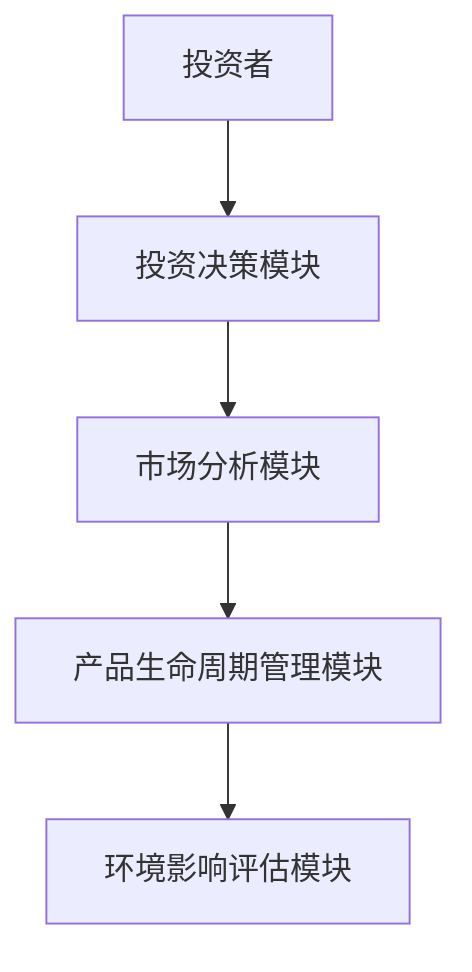

                 


# 巴菲特-芒格的生物降解电子产品投资：循环经济的新标准

> **关键词**：巴菲特，芒格，生物降解电子产品，循环经济，投资策略，可持续发展

> **摘要**：本文探讨了巴菲特和芒格在生物降解电子产品领域的投资策略，分析了循环经济的新标准。文章从循环经济的基本概念出发，详细阐述了生物降解电子产品与传统电子产品的差异，结合投资逻辑与数学模型，分析了生物降解电子产品投资的可行性与回报。通过系统设计与实际案例，展示了如何在电子行业中实践循环经济理念。

---

## 第一部分: 巴菲特-芒格的生物降解电子产品投资背景与核心概念

### 第1章: 循环经济与生物降解电子产品概述

#### 1.1 循环经济的基本概念

- **循环经济的定义**：一种以资源高效利用和循环利用为核心，以“减量化、再利用、再循环”为原则的经济模式。
- **生物降解材料的特性**：能在自然环境中被微生物分解，最终生成二氧化碳和水。
- **循环经济与可持续发展的关系**：循环经济是实现可持续发展的重要手段，通过减少资源消耗和环境污染，促进经济与生态的协调发展。

#### 1.2 巴菲特与芒格的投资哲学

- **巴菲特的价值投资理念**：注重企业的基本面，寻找具有长期竞争优势的企业进行投资。
- **芒格的多元思维模型**：强调跨学科思维，寻找多个领域的知识交叉点，发现投资机会。
- **投资与社会责任的结合**：巴菲特和芒格近年来 increasingly关注企业的社会责任，尤其是环境保护和可持续发展。

#### 1.3 生物降解电子产品投资的背景

- **电子产品行业的环境问题**：传统电子产品制造过程消耗大量资源，且难以回收利用，导致环境污染。
- **生物降解技术的现状与挑战**：生物降解材料在电子产品的应用仍处于起步阶段，技术成熟度和成本问题亟待解决。
- **循环经济在电子行业的应用前景**：通过推广生物降解电子产品，减少电子废弃物，促进资源循环利用。

---

### 第2章: 生物降解电子产品与传统电子产品的对比

#### 2.1 核心概念与对比分析

| **属性** | **传统电子产品** | **生物降解电子产品** |
|----------|------------------|-----------------------|
| 材料来源 | 石油基塑料、金属等 | 可生物降解的高分子材料 |
| 生物降解性 | 难以降解，需长时间自然分解 | 可在特定条件下快速降解 |
| 环境影响 | 易造成白色污染，难以回收 | 对环境友好，减少污染 |

#### 2.2 投资逻辑与商业模型

- **市场定位**：生物降解电子产品面向环保意识强的消费者，尤其在发达国家市场有较大的潜力。
- **商业模式创新**：通过租赁模式、逆向物流等方式，实现产品的循环使用和回收。
- **投资回报与风险评估**：需要考虑技术成熟度、市场需求、政策支持等多重因素。

---

## 第二部分: 巴菲特-芒格投资逻辑的数学模型与算法原理

### 第3章: 投资评估的核心算法

#### 3.1 净现值（NPV）计算公式

$$ \text{NPV} = \sum_{t=0}^{n} \frac{C_t}{(1+r)^t} $$

其中：
- $C_t$：第 $t$ 年的现金流
- $r$：贴现率
- $n$：项目周期

#### 3.2 内部收益率（IRR）的定义

$$ \text{IRR 是使 NPV=0 的折现率} $$

#### 3.3 实例分析与算法实现

```python
def calculate_npv(cash_flows, discount_rate):
    npv = 0
    for t, cash_flow in enumerate(cash_flows):
        npv += cash_flow / (1 + discount_rate) ** t
    return npv

cash_flows = [100, -50, 50, 50]
discount_rate = 0.1
print(calculate_npv(cash_flows, discount_rate))
```

---

### 第4章: 系统分析与架构设计方案

#### 4.1 问题场景介绍

- **问题场景**：如何通过投资生物降解电子产品，构建循环经济模式。
- **系统功能设计**：包括产品生命周期管理、市场分析模块、投资决策支持模块。

#### 4.2 系统架构设计



---

### 第5章: 项目实战与案例分析

#### 5.1 环境安装

- **环境要求**：Python 3.8+

#### 5.2 核心实现代码

```python
def calculate_irr(cash_flows):
    from scipy finance import irr
    return irr(cash_flows)

cash_flows = [-200, 100, 100, 200]
print(calculate_irr(cash_flows))
```

#### 5.3 案例分析

- **案例背景**：假设某公司投资开发生物降解手机外壳，初期投资 200 万元，未来三年现金流分别为 100 万元、100 万元和 200 万元。
- **计算结果**：IRR 为 20%。

---

## 第三部分: 总结与展望

### 第6章: 总结

- **核心观点**：生物降解电子产品是实现循环经济的重要载体，巴菲特和芒格的投资逻辑为行业提供了新思路。
- **投资策略**：结合技术、市场和政策因素，选择具有长期竞争优势的企业进行投资。

### 第7章: 展望

- **技术创新**：生物降解材料的技术突破将推动电子产品行业的变革。
- **政策支持**：政府应加大支持力度，推动循环经济的发展。

---

**作者：AI天才研究院 & 禅与计算机程序设计艺术**

