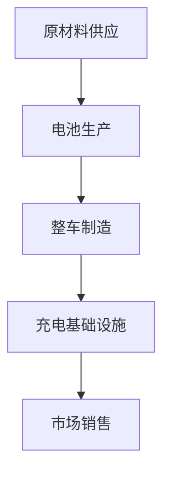

                 

# 巴菲特-芒格的电动汽车产业链投资：全面布局未来出行

---

## 关键词

- 巴菲特投资策略
- 电动汽车产业链
- 价值投资
- 巴菲特-芒格投资理念
- 电动汽车市场分析

---

## 摘要

本文将深入分析巴菲特和芒格在电动汽车产业链中的投资策略，探讨他们在电动汽车领域的布局及其背后的逻辑。通过分析产业链的各个环节，从上游的原材料到下游的整车制造，结合巴菲特和芒格的价值投资理念，揭示他们在电动汽车产业中的投资逻辑和潜在机会。文章还结合实际案例，分析如何在电动汽车产业链中寻找优质投资标的，并展望未来电动汽车市场的趋势。

---

# 第一部分：背景介绍

## 第1章：电动汽车产业链的核心概念

### 1.1 电动汽车产业链的定义与结构

#### 1.1.1 电动汽车产业链的定义

电动汽车产业链是指从原材料供应到最终产品的制造和销售的完整链条，包括以下几个主要环节：

1. **上游**：原材料供应，包括锂、镍、钴等电池材料，以及稀土材料。
2. **中游**：电池生产与组装，包括电池正极、负极、电解液等关键部件的生产。
3. **下游**：整车制造与销售，包括电动汽车的设计、组装以及充电基础设施的建设。

#### 1.1.2 电动汽车产业链的结构

电动汽车产业链的结构可以用以下 **Mermaid图** 来表示：

### 1.2 电动汽车产业链的关键技术与发展趋势

#### 1.2.1 电池技术的发展

电池技术是电动汽车的核心技术之一，以下是几种主要电池技术的对比：

| **技术参数** | **锂离子电池** | **磷酸铁锂电池** | **固态电池** |
|--------------|----------------|------------------|---------------|
| 能量密度    | 高              | 中等             | 高             |
| 安全性        | 较低            | 较高             | 极高           |
| 成本          | 中等            | 较低             | 高             |
| 周期寿命      | 较短            | 较长             | 极长           |

#### 1.2.2 充电技术的发展

电动汽车的充电技术也在不断进步，以下是几种主要充电技术的对比：

| **技术类型** | **快充技术** | **慢充技术** | **无线充电** |
|--------------|---------------|---------------|---------------|
| 充电时间    | 15-30分钟      | 4-8小时        | 30分钟        |
| 适用场景    | 公共充电站      | 家用充电桩      | 未来场景      |
| 成本          | 高             | 低             | 高             |

### 1.3 电动汽车产业链的市场现状与未来趋势

#### 1.3.1 市场现状

根据统计，全球电动汽车市场近年来呈现快速增长态势。以下是全球主要市场的电动汽车销量对比：

| **国家** | **2022年销量（万辆）** | **2023年预测销量（万辆）** |
|----------|--------------------------|-----------------------------|
| 中国     | 568                      | 650                         |
| 美国     | 93                       | 110                         |
| 欧洲     | 108                      | 120                         |
| 日本     | 20                       | 25                          |
| 其他     | 32                       | 40                          |

#### 1.3.2 未来趋势

随着技术进步和政策支持，电动汽车产业链的未来趋势将呈现以下几个特点：

1. **电池技术的突破**：固态电池和钠离子电池等新技术将逐步商业化。
2. **充电基础设施的完善**：快充网络和无线充电技术将加速普及。
3. **产业链的垂直整合**：整车制造商将更加注重对上游原材料的控制。
4. **政策支持的持续性**：各国政府将继续推动电动汽车的普及。

---

# 第二部分：巴菲特与芒格的投资策略

## 第2章：巴菲特的价值投资理念

### 2.1 巴菲特的价值投资核心理念

#### 2.1.1 价值投资的定义

价值投资是一种以低于内在价值的价格买入优质股票的投资策略。以下是价值投资的核心要素：

| **要素**       | **具体内容**                                      |
|----------------|-------------------------------------------------|
| 内在价值        | 公司未来现金流的现值                             |
| 安全边际        | 股票价格与内在价值的差异                        |
| 高质量企业      | 具备强大竞争优势和持续盈利能力的企业            |

#### 2.1.2 巴菲特的投资选股标准

以下是巴菲特选股的关键标准：

| **标准**       | **具体内容**                                      |
|----------------|-------------------------------------------------|
| 高ROE          | 净资产收益率高                                    |
| 可持续的盈利能力 | 公司具备持续盈利的能力                          |
| 强大的竞争优势  | 公司具备难以被竞争对手复制的核心优势            |
| 优秀的管理团队  | 高层管理人员具备良好的道德和管理能力            |

---

## 第3章：芒格的多元思维模型

### 3.1 芒格的多元思维模型

#### 3.1.1 多元思维模型的定义

多元思维模型是一种通过多个学科和领域的思维方式来分析问题的方法。以下是芒格多元思维模型的核心要素：

| **学科** | **具体应用**                                      |
|----------|-------------------------------------------------|
| 经济学    | 分析企业的成本结构和市场地位                    |
| 心理学    | 理解投资者的心理偏差                              |
| 工程学    | 分析技术的可行性和可靠性                        |
| 管理学    | 评估企业的组织结构和管理效率                    |

---

## 第4章：巴菲特与芒格在电动汽车产业链中的投资实践

### 4.1 巴菲特对电动汽车产业链的投资布局

#### 4.1.1 巴菲特对比亚迪的投资

以下是巴菲特对比亚迪的投资分析：

| **时间**   | **操作**       | **原因**                                       |
|------------|----------------|-----------------------------------------------|
| 2008年     | 买入比亚迪股票 | 比亚迪在电动汽车领域的技术领先和市场地位     |
| 2021年     | 清仓比亚迪股票 | 全球电动汽车市场的竞争加剧和比亚迪的估值过高 |

### 4.2 芒格对电动汽车产业链的投资布局

#### 4.2.1 芒格对特斯拉的投资

以下是芒格对特斯拉的投资分析：

| **时间**   | **操作**       | **原因**                                       |
|------------|----------------|-----------------------------------------------|
| 2020年     | 买入特斯拉股票 | 特斯拉在电动汽车市场的领导地位和技术优势     |
| 2022年     | 持股不变       | 特斯拉具备强大的技术研发能力和市场影响力     |

---

## 第5章：电动汽车产业链的投资机会与风险

### 5.1 产业链中的投资机会

#### 5.1.1 上游原材料的投资价值

以下是上游原材料的投资价值分析：

| **原材料** | **应用场景** | **投资价值** |
|------------|--------------|--------------|
| 锂          | 电池正极材料 | 高           |
| 镍          | 电池负极材料 | 中           |
| 钴          | 电池正极材料 | 高           |

#### 5.1.2 中游电池技术的创新企业

以下是中游电池技术的创新企业分析：

| **企业**       | **技术优势**               | **投资价值** |
|----------------|----------------------------|--------------|
| 宁德时代       | 固态电池技术领先           | 高           |
| 比亚迪电池     | 磷酸铁锂电池技术成熟         | 中           |
| 松下电池       | 与特斯拉合作紧密           | 高           |

#### 5.1.3 下游整车品牌的市场潜力

以下是下游整车品牌的市场潜力分析：

| **品牌**       | **市场地位**       | **投资价值** |
|----------------|-------------------|--------------|
| 特斯拉         | 全球电动汽车领导者 | 高           |
| 比亚迪         | 中国市场的领导者   | 中           |
| 大众汽车       | 欧洲市场的领导者   | 高           |

### 5.2 产业链中的主要风险

#### 5.2.1 技术风险与产品替代风险

以下是技术风险与产品替代风险的分析：

| **风险类型** | **具体表现**                   | **应对策略**               |
|--------------|-------------------------------|---------------------------|
| 技术风险     | 新技术的出现可能导致现有技术过时 | 持续关注技术创新           |
| 产品替代风险 | 替代产品的出现可能导致市场需求下降 | 多元化投资降低风险         |

#### 5.2.2 市场风险与政策变化的影响

以下是市场风险与政策变化的影响分析：

| **风险类型** | **具体表现**                   | **应对策略**               |
|--------------|-------------------------------|---------------------------|
| 市场风险     | 市场需求波动可能导致股价波动     | 分散投资降低风险           |
| 政策风险     | 政策变化可能导致行业波动       | 关注政策动向并灵活调整投资 |

---

## 第6章：电动汽车产业链的投资策略与风险管理

### 6.1 投资策略

#### 6.1.1 长期价值投资策略

以下是长期价值投资策略的关键点：

1. **选择具备强大竞争优势的企业**：重点关注具备技术领先和市场地位的企业。
2. **关注企业的财务健康状况**：重点关注企业的盈利能力、现金流和债务水平。
3. **注重企业的管理团队**：选择具备优秀管理和道德标准的企业。

#### 6.1.2 分散投资策略

以下是分散投资策略的关键点：

1. **避免过度集中投资**：将资金分散投资于不同的企业以降低风险。
2. **关注不同环节的投资机会**：在上游、中游和下游环节中寻找投资机会。

### 6.2 风险管理

#### 6.2.1 风险评估与应对

以下是风险管理的关键点：

1. **定期评估投资组合的风险**：根据市场变化和企业状况调整投资策略。
2. **设定止损点**：在投资中设定止损点以避免重大损失。
3. **关注宏观经济因素**：关注宏观经济政策和市场趋势对企业的影响。

---

## 第7章：电动汽车产业链的未来趋势

### 7.1 技术创新与市场扩展

#### 7.1.1 电池技术的突破

以下是电池技术的未来发展趋势：

1. **固态电池的商业化**：固态电池将具备更高的能量密度和安全性。
2. **钠离子电池的研发**：钠离子电池将具备更低的成本和更广泛的应用场景。

#### 7.1.2 充电技术的革新

以下是充电技术的未来发展趋势：

1. **无线充电技术的普及**：无线充电技术将使充电更加便捷和高效。
2. **快充网络的完善**：快充网络的建设将加速电动汽车的普及。

### 7.2 政策支持与行业整合

#### 7.2.1 政策支持的持续性

以下是政策支持的未来发展趋势：

1. **各国政府将继续推动电动汽车的普及**：通过补贴、税收优惠和基础设施建设等政策支持电动汽车的发展。
2. **行业整合将加速**：随着市场竞争的加剧，行业整合将加速，具备强大竞争优势的企业将胜出。

---

## 结语

巴菲特和芒格在电动汽车产业链中的投资布局不仅体现了他们的价值投资理念，也为投资者提供了重要的参考。通过分析产业链的各个环节，结合技术发展和市场趋势，投资者可以在电动汽车产业链中找到优质的投资标的，实现长期稳定的收益。

---

## 作者：AI天才研究院 & 禅与计算机程序设计艺术

---

