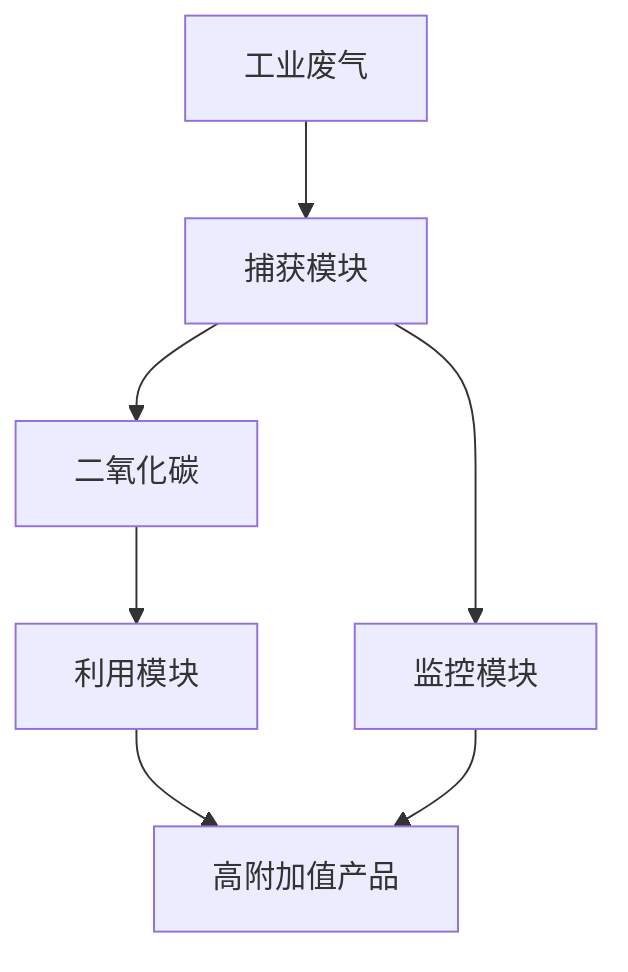

                 


# 巴菲特-芒格的碳捕获与利用投资：气候变化的积极解决方案

> 关键词：巴菲特，芒格，碳捕获，碳利用，气候变化，投资策略

> 摘要：本文探讨了巴菲特和芒格的投资理念在碳捕获与利用技术中的应用，分析了碳捕获与利用技术的原理、经济性及其在应对气候变化中的作用。通过详细的技术分析和案例研究，本文展示了如何通过投资碳捕获与利用技术来实现可持续发展目标。

---

# 第一部分: 碳捕获与利用的背景与意义

## 第1章: 碳捕获与利用的背景

### 1.1 气候变化的现状与挑战

气候变化是当前全球面临的最严峻挑战之一。根据联合国政府间气候变化专门委员会（IPCC）的报告，全球气温的上升速度远超自然变化的节奏，这将导致极端天气事件增多、海平面上升、生态系统崩溃等一系列问题。科学研究表明，人类活动，尤其是化石燃料的大量使用，是导致温室气体排放增加的主要原因。二氧化碳（CO₂）作为主要的温室气体，其浓度的持续升高直接威胁着全球气候的稳定。

### 1.2 碳捕获与利用技术的出现

为了应对气候变化，国际社会提出了多种解决方案，其中碳捕获与利用（Carbon Capture and Utilization, CCU）技术被视为一种重要的补充手段。碳捕获与利用技术的核心在于将工业过程中排放的二氧化碳捕获并转化为有价值的资源，例如用于生产化学品、建筑材料或作为燃料。这种方法不仅减少了大气中的CO₂浓度，还通过资源化利用实现了经济价值。

### 1.3 碳捕获与利用技术的重要性

碳捕获与利用技术的重要性体现在以下几个方面：

1. **减少温室气体排放**：通过捕获二氧化碳，可以有效减少工业过程中的温室气体排放，缓解气候变化的压力。
2. **资源化利用**：捕获的二氧化碳可以转化为高附加值的产品，例如合成燃料、化学品等，实现资源的循环利用。
3. **推动可持续发展**：碳捕获与利用技术的应用有助于构建低碳经济，推动全球向可持续发展的转型。

---

## 第2章: 巴菲特和芒格的投资理念

### 2.1 巴菲特的价值投资策略

沃伦·巴菲特（Warren Buffett）是全球最著名的价值投资者之一。他的投资理念强调长期价值、安全边际和企业基本面分析。巴菲特认为，投资的核心在于找到那些具有持续竞争优势、良好管理团队和合理估值的企业，并长期持有这些股票，等待其内在价值的实现。

### 2.2 芒格的多元思维模型

查理·芒格（Charlie Munger）是巴菲特的长期合作伙伴，他的投资理念强调多元思维模型（mental models）。芒格认为，投资者应该广泛涉猎各个领域的知识，形成一个完整的知识框架，从而能够更好地识别投资机会和风险。他特别强调“反人性”的思维，即在市场恐慌时保持冷静，在市场疯狂时保持理性。

### 2.3 投资理念与碳捕获与利用技术的结合

巴菲特和芒格的投资理念为碳捕获与利用技术的投资提供了重要的指导：

1. **长期视角**：碳捕获与利用技术的发展需要长期投入，但其带来的环境和经济收益也是长期的。
2. **价值发现**：通过分析碳捕获与利用技术的成本、市场前景和政策支持，投资者可以找到具有竞争优势的企业。
3. **风险管理**：芒格的多元思维模型帮助投资者识别潜在风险，例如技术瓶颈、政策变化等，从而做出更稳健的投资决策。

---

# 第二部分: 碳捕获与利用的核心概念与联系

## 第3章: 碳捕获与利用的核心概念

### 3.1 碳捕获技术的原理

碳捕获技术主要包括三种主要方法：

1. **吸收法**：利用化学吸收剂（例如胺类化合物）与二氧化碳反应，将其从气体中分离出来。
2. **膜分离法**：利用特殊材料的膜对二氧化碳进行物理分离。
3. **催化转化法**：通过催化剂将二氧化碳转化为其他物质，例如甲烷或碳纤维。

### 3.2 碳利用技术的原理

碳利用技术将捕获的二氧化碳转化为高附加值的产品，例如：

1. **合成燃料**：将二氧化碳与氢气结合，生成合成燃料（如甲醇、乙醇等）。
2. **建筑材料**：利用二氧化碳生产碳酸盐水泥或其他建筑材料。
3. **化学品生产**：将二氧化碳作为原料，生产尿素、甲酸等化学品。

### 3.3 碳捕获与利用技术的经济性分析

碳捕获与利用技术的经济性是其能否大规模应用的关键。以下是主要的经济性分析指标：

1. **技术成本**：包括捕获和利用过程中的设备投资、运行成本等。
2. **经济效益**：通过产品销售、政府补贴等方式获得的收益。
3. **投资回报率（ROI）**：衡量投资的盈利能力。

---

## 第4章: 碳捕获与利用技术的系统架构

### 4.1 碳捕获与利用系统的整体架构

碳捕获与利用系统通常包括以下几个主要模块：

1. **捕获模块**：负责从工业废气中捕获二氧化碳。
2. **利用模块**：将捕获的二氧化碳转化为高附加值的产品。
3. **监控模块**：实时监测系统的运行状态，确保其高效和安全运行。

### 4.2 碳捕获与利用系统的功能模块

- **捕获模块**：通过吸收法、膜分离法或催化转化法捕获二氧化碳。
- **利用模块**：将捕获的二氧化碳转化为合成燃料、建筑材料或其他化学品。
- **监控模块**：实时监测系统的运行参数，优化系统性能。

### 4.3 系统架构图

以下是碳捕获与利用系统的架构图：



---

# 第三部分: 碳捕获与利用技术的投资策略

## 第5章: 碳捕获与利用技术的投资评估模型

### 5.1 碳捕获与利用技术的成本模型

碳捕获与利用技术的总成本包括设备投资、运营成本和维护成本。以下是其数学模型：

$$
\text{总成本} = \text{设备投资} + \text{运营成本} + \text{维护成本}
$$

### 5.2 碳捕获与利用技术的收益模型

碳捕获与利用技术的收益主要来自产品的销售和政府补贴。收益模型如下：

$$
\text{总收益} = \text{产品销售收入} + \text{政府补贴}
$$

### 5.3 投资回报率（ROI）计算

投资回报率是衡量碳捕获与利用技术投资效益的重要指标。其计算公式为：

$$
\text{ROI} = \frac{\text{总收益} - \text{总成本}}{\text{总成本}} \times 100\%
$$

---

## 第6章: 碳捕获与利用技术的项目实战

### 6.1 环境安装

为了实施碳捕获与利用技术，需要以下环境：

1. **工业废气源**：例如化工厂、发电厂等。
2. **技术支持**：需要专业的碳捕获与利用技术团队。
3. **政策支持**：需要政府的政策支持和补贴。

### 6.2 核心代码实现

以下是碳捕获与利用技术的Python实现示例代码：

```python
import numpy as np

def calculate_cost(system_size, efficiency):
    return system_size * (1 - efficiency)

def calculate_revenue(price, quantity):
    return price * quantity

def calculate_profit(cost, revenue):
    return revenue - cost

# 示例参数
system_size = 100  # 系统规模
efficiency = 0.8    # 效率
price = 50          # 产品价格
quantity = 1000     # 产品数量

# 计算成本、收入和利润
cost = calculate_cost(system_size, efficiency)
revenue = calculate_revenue(price, quantity)
profit = calculate_profit(cost, revenue)

print(f"成本：{cost}")
print(f"收入：{revenue}")
print(f"利润：{profit}")
```

### 6.3 案例分析

假设某公司计划投资一个碳捕获与利用项目，系统规模为100单位，效率为80%，产品价格为50单位，产量为1000单位。根据上述代码，计算其成本、收入和利润：

1. **成本**：$100 \times (1 - 0.8) = 20$
2. **收入**：$50 \times 1000 = 50,000$
3. **利润**：$50,000 - 20 = 49,980$

---

## 第7章: 总结与展望

### 7.1 总结

碳捕获与利用技术是应对气候变化的重要手段，而巴菲特和芒格的投资理念为该技术的投资提供了重要的指导。通过价值投资和多元思维模型，投资者可以找到具有长期竞争优势的碳捕获与利用项目，实现环境效益和经济效益的双重目标。

### 7.2 展望

随着技术的进步和政策的支持，碳捕获与利用技术的应用前景广阔。未来，投资者需要更加关注该领域的技术创新和市场动态，抓住投资机会，为实现可持续发展目标贡献力量。

---

# 作者：AI天才研究院/AI Genius Institute & 禅与计算机程序设计艺术 /Zen And The Art of Computer Programming

