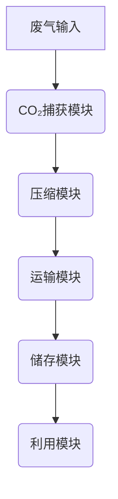

                 


# 巴菲特-芒格的碳捕获技术投资：应对气候变化的关键

## 关键词：巴菲特、芒格、碳捕获技术、气候变化、投资策略、系统架构

## 摘要：  
本文深入探讨了巴菲特和芒格在碳捕获技术领域的投资策略及其对应对气候变化的关键作用。通过分析碳捕获技术的核心原理、投资逻辑、系统架构以及实际案例，本文揭示了如何通过技术创新和价值投资相结合，推动全球碳中和目标的实现。文章结合技术细节、数学模型和实际应用场景，为读者提供了全面的视角和深度分析。

---

# 第1章: 气候变化与碳捕获技术的背景

## 1.1 气候变化的现状与挑战

### 1.1.1 气候变化的核心问题
$$\text{气候变化的核心问题：温室气体（如 CO₂）的过量排放导致全球变暖。}$$

气候变化是21世纪人类面临的最严峻挑战之一。工业革命以来，人类活动（尤其是化石燃料的大量使用）导致大气中二氧化碳（CO₂）浓度急剧上升，打破了地球的碳循环平衡。根据联合国政府间气候变化专门委员会（IPCC）的报告，全球平均气温已较工业革命前上升了约1.1°C，如果这一温度上升超过1.5°C，全球气候系统将面临不可逆转的灾难性变化。

### 1.1.2 碳排放对气候变化的影响
碳排放是导致气候变化的直接原因。燃烧化石燃料、森林砍伐和工业过程释放的CO₂等温室气体在大气中形成“温室效应”，导致全球变暖。极端天气事件（如热浪、洪水、干旱和飓风）的频率和强度显著增加，对生态系统、人类健康和经济活动造成严重威胁。

### 1.1.3 碳捕获技术的必要性
碳捕获技术（Carbon Capture and Storage，CCS）通过捕获工业过程中排放的CO₂，将其储存或再利用，从而减少大气中的温室气体浓度。作为一种重要的气候解决方案，碳捕获技术能够帮助实现“碳中和”目标，是应对气候变化的关键技术之一。

---

## 1.2 碳捕获技术的定义与分类

### 1.2.1 碳捕获技术的定义
碳捕获技术是指从工业过程或能源生产中捕获二氧化碳（CO₂），并将其储存或再利用的过程。碳捕获技术通常包括三个主要步骤：
1. **捕获**：将CO₂从废气中分离出来。
2. **运输**：将捕获的CO₂通过管道或其他方式运输到储存或利用地点。
3. **封存或利用**：将CO₂储存在地质构造中（如深层地下或海底）或用于工业过程（如生产化学品或燃料）。

### 1.2.2 碳捕获技术的主要分类
碳捕获技术可以根据捕获方式、应用领域或储存方式分为以下几类：

| **分类依据** | **具体分类** |
|--------------|--------------|
| 捕获方式      | 吸附法、化学反应法、生物法 |
| 应用领域      | 工业过程、能源生产、废物处理 |
| 储存方式      | 地质封存、海洋封存、再利用 |

### 1.2.3 碳捕获技术的关键指标
碳捕获技术的性能和经济性是衡量其可行性的关键指标，主要包括：
1. **捕获效率**：捕获系统对CO₂的捕获率。
2. **能源消耗**：捕获过程中的能量消耗。
3. **成本**：捕获、运输和储存的总成本。
4. **储存安全性**：CO₂储存的安全性和稳定性。

---

## 1.3 巴菲特与芒格的投资理念

### 1.3.1 巴菲特的价值投资策略
沃伦·巴菲特（Warren Buffett）是全球最著名的价值投资者之一。他的投资理念基于以下核心原则：
1. **长期投资**：关注企业的长期价值，而非短期市场波动。
2. **安全边际**：以低于内在价值的价格买入优质资产。
3. **企业竞争优势**：投资具有强大护城河的企业。

### 1.3.2 芒格的多元思维模型
查理·芒格（Charlie Munger）是巴菲特的长期合作伙伴，他的投资哲学基于“多元思维模型”。芒格认为，投资者需要通过跨学科的知识（如心理学、经济学、物理学等）来理解复杂的现实世界，并做出明智的决策。

### 1.3.3 两者的结合与互补
巴菲特和芒格的投资理念互补性强：
- 巴菲特注重企业的财务状况和市场地位。
- 芒格注重跨学科的思维框架和风险控制。

两人共同强调 **长期价值**、**风险管理** 和 **基本面分析**，这些原则为他们的碳捕获技术投资奠定了基础。

---

## 1.4 碳捕获技术的投资背景

### 1.4.1 碳捕获技术的市场现状
全球碳捕获技术市场正在快速发展。根据市场研究机构的预测，到2030年，全球碳捕获技术市场规模将达到数百亿美元。然而，目前碳捕获技术仍面临成本高、技术不成熟等挑战。

### 1.4.2 政策支持与行业趋势
各国政府和企业正在通过政策支持和技术创新推动碳捕获技术的发展。例如：
- 美国通过《通胀削减法案》（Inflation Reduction Act）为碳捕获技术提供财政补贴。
- 欧盟将碳捕获技术纳入“绿色新政”（Green Deal）框架。

### 1.4.3 投资者的角色与责任
投资者在碳捕获技术的发展中扮演着关键角色。通过投资碳捕获技术，投资者不仅能够实现财务回报，还能为应对气候变化做出贡献。

---

## 1.5 本章小结

本章从气候变化的现状、碳捕获技术的定义与分类，以及巴菲特和芒格的投资理念三个方面，为后续分析奠定了基础。接下来，我们将深入探讨碳捕获技术的投资策略及其对气候变化的关键作用。

---

# 第2章: 巴菲特与芒格的碳捕获技术投资策略

## 2.1 巴菲特与芒格的投资逻辑

### 2.1.1 巴菲特的长期价值投资
巴菲特的投资逻辑基于对企业长期价值的判断。他关注企业的盈利能力、财务状况和竞争优势，而非短期市场波动。

### 2.1.2 芒格的多元思维模型
芒格的多元思维模型强调跨学科的思维方式，帮助投资者全面理解复杂问题。他认为，碳捕获技术的投资需要考虑技术、经济、政策和环境等多个维度。

### 2.1.3 两者的结合与互补
巴菲特和芒格的投资逻辑结合了长期价值和多元思维，为碳捕获技术投资提供了独特的视角。

---

## 2.2 碳捕获技术的投资价值评估

### 2.2.1 技术可行性评估
技术可行性是碳捕获技术投资的核心因素。投资者需要评估以下方面：
- 捕获效率：技术是否能够高效捕获CO₂。
- 成本：捕获、运输和储存的总成本是否具有竞争力。
- 储存安全性：CO₂储存的安全性和稳定性。

### 2.2.2 市场需求分析
市场需求是碳捕获技术投资的关键驱动力。投资者需要考虑以下因素：
- 碳排放交易市场的规模和价格。
- 各国政府的政策支持和补贴。
- 企业对碳中和目标的承诺。

### 2.2.3 财务回报预测
财务回报预测是碳捕获技术投资的核心决策依据。投资者需要通过以下方法进行预测：
- 项目净现值（NPV）计算。
- 投资回收期分析。
- 内部收益率（IRR）评估。

---

## 2.3 碳捕获技术的投资风险与应对

### 2.3.1 技术风险
技术风险是碳捕获技术投资的主要风险之一。例如：
- 技术不成熟可能导致捕获效率低下。
- 成本过高可能影响项目的经济性。

### 2.3.2 市场风险
市场需求不足或政策变化可能导致碳捕获技术投资失败。

### 2.3.3 政策风险
政策变化是碳捕获技术投资的另一个重要风险。例如：
- 政府可能取消对碳捕获技术的补贴。
- 碳排放交易市场的政策变化可能影响项目的盈利能力。

### 2.3.4 风险管理策略
为了应对上述风险，投资者可以采取以下策略：
- 分散投资：将资金分配到不同的碳捕获技术项目中，降低风险。
- 技术合作：与技术开发商合作，共同分担技术风险。
- 政策跟踪：密切关注政策变化，调整投资策略。

---

## 2.4 本章小结

本章从巴菲特和芒格的投资逻辑、碳捕获技术的投资价值评估以及投资风险与应对三个方面，探讨了碳捕获技术的投资策略。下一章将深入分析碳捕获技术的核心原理与实现。

---

# 第3章: 碳捕获技术的核心原理与实现

## 3.1 碳捕获技术的基本原理

### 3.1.1 吸附法
吸附法是一种常用的碳捕获技术，其原理是利用吸附剂（如活性炭或分子筛）捕获CO₂分子。吸附法的优点是捕获效率高、操作简单，但吸附剂的再生成本较高。

### 3.1.2 化学反应法
化学反应法通过化学反应（如碳酸盐吸收法）捕获CO₂。这种方法的捕获效率较高，但需要消耗大量的化学试剂，成本较高。

### 3.1.3 生物法
生物法利用微生物或植物捕获CO₂。这种方法的生态友好性较高，但捕获效率较低，适用于小规模应用。

---

## 3.2 碳捕获技术的关键步骤

### 3.2.1 气体分离
气体分离是碳捕获技术的核心步骤之一。通过物理或化学方法（如膜分离、吸收法）将CO₂从废气中分离出来。

### 3.2.2 碳捕获剂的选择
碳捕获剂的选择是影响捕获效率和成本的关键因素。例如：
- 活性炭：吸附法常用的吸附剂。
- 氨基树状大分子：一种高效的化学捕获剂。

### 3.2.3 碳封存与利用
碳封存与利用是碳捕获技术的最终目标。例如：
- 地质封存：将CO₂注入地下构造中长期储存。
- 化学利用：将CO₂用于生产尿素、甲醇等化学品。

---

## 3.3 碳捕获技术的系统架构

### 3.3.1 系统模块划分
碳捕获技术系统通常包括以下模块：
1. **捕获模块**：负责捕获CO₂。
2. **运输模块**：负责将CO₂运输到储存或利用地点。
3. **储存模块**：负责储存或利用CO₂。

### 3.3.2 系统架构设计



---

## 3.4 碳捕获技术的数学模型

### 3.4.1 捕获效率模型
捕获效率模型用于评估捕获系统的性能。例如：
$$ \text{捕获效率} = \frac{\text{捕获的CO₂量}}{\text{废气中的CO₂总量}} $$

### 3.4.2 成本模型
成本模型用于估算碳捕获技术的总成本。例如：
$$ \text{总成本} = \text{捕获成本} + \text{运输成本} + \text{储存成本} $$

---

## 3.5 本章小结

本章从碳捕获技术的基本原理、关键步骤和系统架构三个方面，详细分析了碳捕获技术的实现过程。下一章将结合实际案例，探讨碳捕获技术的投资策略。

---

# 第4章: 碳捕获技术投资的案例分析

## 4.1 美国的碳捕获技术项目

### 4.1.1 美国国家碳捕获倡议
美国政府通过《通胀削减法案》为碳捕获技术提供财政补贴，支持多个碳捕获技术项目。

### 4.1.2 美孚公司（ExxonMobil）的碳捕获项目
美孚公司与壳牌公司合作，在德克萨斯州建设一个碳捕获和储存项目，预计每年捕获100万吨CO₂。

---

## 4.2 欧洲的碳捕获技术项目

### 4.2.1 欧盟的“绿色新政”（Green Deal）
欧盟通过“绿色新政”框架支持碳捕获技术的发展，计划到2030年实现气候中立。

### 4.2.2 挪威的碳捕获项目
挪威政府计划在北海建设一个碳捕获和储存项目，将捕获的CO₂注入海底地质构造中。

---

## 4.3 中国的碳捕获技术项目

### 4.3.1 中国碳中和目标
中国政府提出到2060年实现碳中和，碳捕获技术是实现这一目标的重要手段。

### 4.3.2 中石化碳捕获项目
中国石油化工集团（Sinopec）计划在新疆建设一个碳捕获和利用项目，利用CO₂生产尿素和其他化学品。

---

## 4.4 本章小结

本章通过分析美国、欧洲和中国的碳捕获技术项目，探讨了碳捕获技术的实际应用和投资策略。下一章将总结碳捕获技术投资的系统架构与算法原理。

---

# 第5章: 碳捕获技术系统的架构与算法

## 5.1 碳捕获系统的架构设计

### 5.1.1 系统模块划分
碳捕获系统通常包括以下模块：
1. **捕获模块**：负责捕获CO₂。
2. **运输模块**：负责将CO₂运输到储存或利用地点。
3. **储存模块**：负责储存或利用CO₂。

### 5.1.2 系统架构设计


---

## 5.2 碳捕获算法的原理

### 5.2.1 算法概述
碳捕获算法通常用于优化捕获过程中的参数设置，例如：
- 捕获剂的选择。
- 捕获模块的运行参数。

### 5.2.2 算法实现

```python
def carbon_capturing_algorithm(co2_emissions, capture_efficiency, cost):
    captured_co2 = co2_emissions * capture_efficiency
    total_cost = captured_co2 * cost
    return captured_co2, total_cost
```

---

## 5.3 碳捕获系统的数学模型

### 5.3.1 数学模型概述
碳捕获系统的数学模型用于预测系统的性能和成本。例如：
$$ \text{总成本} = \text{捕获成本} + \text{运输成本} + \text{储存成本} $$

### 5.3.2 模型实现

```python
def calculate_total_cost(co2_emissions, capture_efficiency, cost_per-ton):
    captured_co2 = co2_emissions * capture_efficiency
    total_cost = captured_co2 * cost_per-ton
    return total_cost
```

---

## 5.4 本章小结

本章从碳捕获系统的架构设计和算法原理两个方面，探讨了碳捕获技术的实现过程。下一章将总结碳捕获技术投资的系统架构与算法。

---

# 第6章: 总结与展望

## 6.1 本章总结
本文从气候变化的背景、碳捕获技术的原理、投资策略以及实际案例等方面，全面探讨了巴菲特和芒格在碳捕获技术投资中的作用。通过分析碳捕获技术的核心原理、系统架构和投资策略，本文为投资者提供了重要的参考。

## 6.2 未来展望
随着全球气候变化问题的加剧，碳捕获技术的投资将变得越来越重要。未来，投资者需要更加关注碳捕获技术的创新、政策支持和市场需求，以实现财务回报和气候变化目标的双赢。

---

# 作者：AI天才研究院/AI Genius Institute & 禅与计算机程序设计艺术 /Zen And The Art of Computer Programming

---

**注**：本文为技术博客文章的目录大纲，具体内容需要根据实际需求逐步展开。

