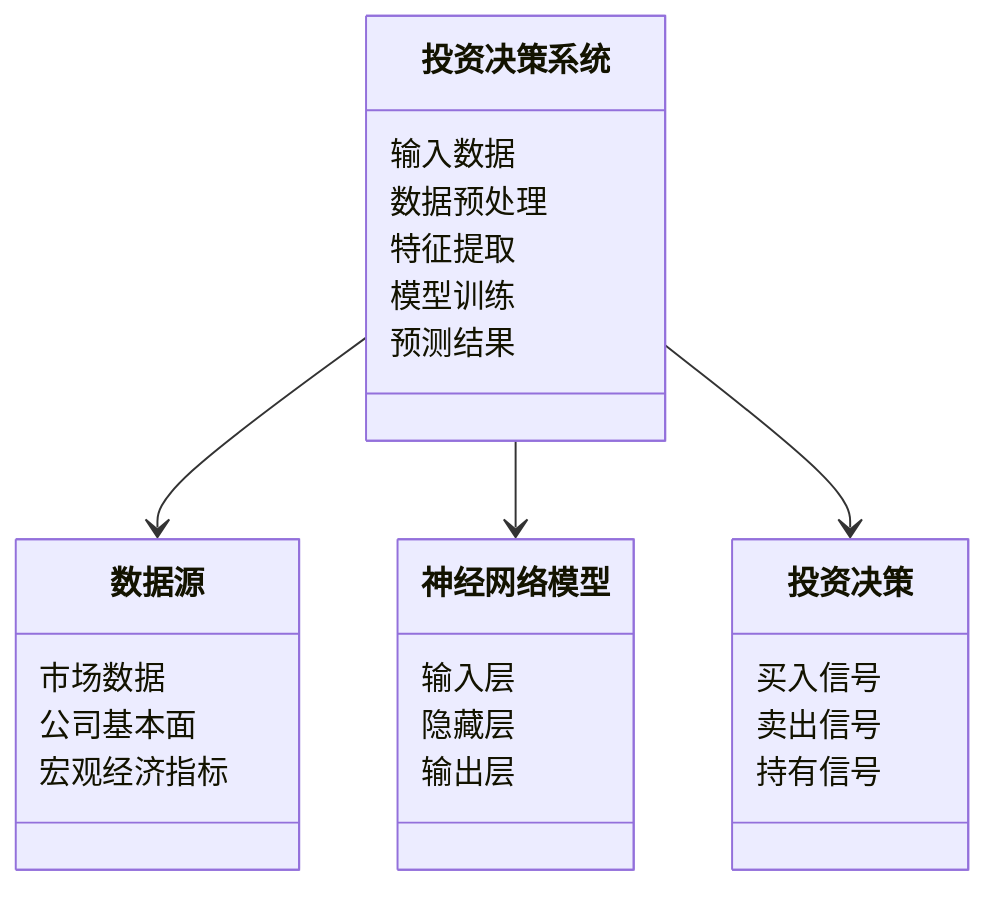
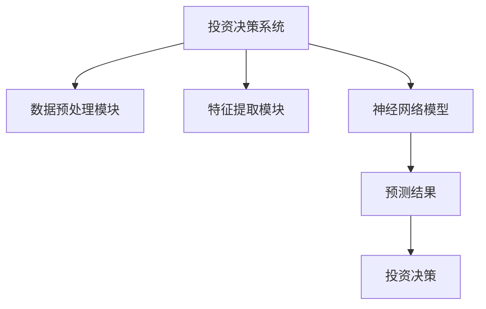
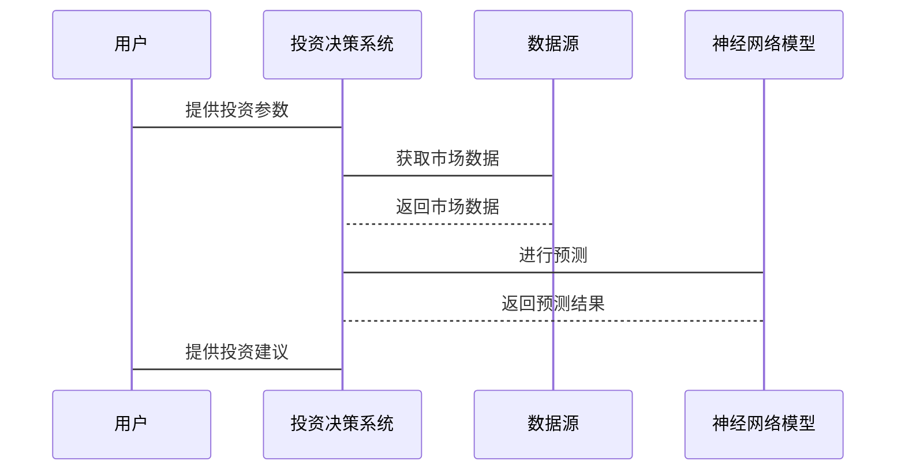

                 


# 巴菲特-芒格的神经形态计算投资：类脑计算的未来

---

## 关键词

- 巴菲特投资理念
- 芒格多元思维模型
- 神经形态计算
- 类脑计算
- 投资决策优化
- 人工智能
- 机器学习

---

## 摘要

本文探讨了巴菲特和芒格的投资理念与神经形态计算的结合，分析了神经形态计算在投资决策中的潜力。文章从传统投资方法的局限性出发，介绍了神经形态计算的基本概念、核心算法及其在投资中的应用。通过具体的算法实现、系统架构设计和项目实战，展示了神经形态计算如何优化投资决策。最后，总结了神经形态计算的优势，并展望了其在投资领域的未来发展方向。

---

# 巴菲特-芒格的神经形态计算投资：类脑计算的未来

## 第1章 巴菲特与芒格的投资哲学

### 1.1 巴菲特与芒格的背景介绍

沃伦·巴菲特和查理·芒格是投资界最受尊敬的两位人物。巴菲特以价值投资闻名，芒格则提出了“多元思维模型”。他们的投资理念强调长期价值、安全边际和对公司基本面的深入分析。

#### 1.1.1 巴菲特的价值投资理念

巴菲特的价值投资理念的核心是寻找具有持续竞争优势和良好治理结构的企业，以合理的价格买入并长期持有。他强调安全边际，即买入价格低于内在价值。

#### 1.1.2 芒格的多元思维模型

芒格强调通过多个学科的交叉思维来做出决策。他认为，投资决策需要考虑物理学、心理学、经济学等多个领域的知识，以避免认知偏差。

### 1.2 传统投资方法的局限性

#### 1.2.1 数据驱动决策的挑战

传统投资方法依赖于财务指标和市场数据，但这些数据往往具有滞后性和片面性。此外，市场参与者的情绪和行为也难以通过传统模型充分捕捉。

#### 1.2.2 投资决策的复杂性与不确定性

投资环境复杂多变，市场参与者的行为、宏观经济因素和突发事件都会影响投资结果。传统线性模型难以应对这些非线性关系。

### 1.3 投资决策的复杂性与不确定性

#### 1.3.1 投资中的非线性关系

市场波动和投资回报之间存在非线性关系，传统模型难以捕捉这些复杂关系。

#### 1.3.2 传统模型的局限性

传统模型在处理复杂的投资决策时表现不佳，尤其是在应对不确定性方面。

---

## 第2章 神经形态计算的基本概念

### 2.1 神经形态计算的定义与特点

神经形态计算是一种模拟人脑结构和功能的计算范式，具有并行性、低功耗和高容错性等特点。

#### 2.1.1 对比传统计算方式

| 特性         | 传统计算       | 神经形态计算     |
|--------------|----------------|------------------|
| 处理方式     | 线性处理       | 非线性处理       |
| 并行性       | 低             | 高               |
| 能耗         | 高             | 低               |
| 容错性       | 低             | 高               |

#### 2.1.2 神经形态计算在投资中的应用潜力

神经形态计算能够处理复杂的投资场景，捕捉市场中的非线性关系，提供更精准的投资决策支持。

---

## 第3章 神经形态计算的核心算法

### 3.1 脉冲神经网络（SNN）的基本原理

#### 3.1.1 神经元模型

神经元通过电位变化传递信号，当电位达到阈值时触发脉冲。

##### 神经元模型的数学表示

$$ V(t) = V_{\text{rest}} + (V_{\text{max}} - V_{\text{rest}}) \cdot \frac{t}{\tau} $$

其中，$V(t)$是神经元电位，$V_{\text{rest}}$是静息电位，$V_{\text{max}}$是最大电位，$\tau$是时间常数。

#### 3.1.2 脉冲传播机制

脉冲通过突触传递到下一个神经元，触发新的神经元活动。

##### 突触权重更新公式

$$ w_{\text{new}} = w_{\text{old}} + \Delta w $$

其中，$\Delta w$是权重更新量，通常基于误差反馈进行调整。

---

### 3.2 神经网络的训练与优化

#### 3.2.1 神经网络的训练过程

神经网络通过反向传播算法优化权重，以最小化预测误差。

##### 反向传播算法步骤

1. 前向传播：输入数据，计算网络输出。
2. 计算误差：比较预测输出与实际输出，计算损失函数。
3. 反向传播：计算各层权重的梯度，更新权重。

#### 3.2.2 神经网络的优化策略

使用Adam优化器进行参数更新，学习率调整等策略可以提高训练效率。

##### Adam优化器更新公式

$$ \theta_{t+1} = \theta_t - \eta \cdot \frac{\rho_1 \cdot g_t + (1-\rho_1)(g_t^2)}{\sqrt{s_t + \epsilon}} $$

其中，$\theta$是参数，$\eta$是学习率，$\rho_1$是动量系数，$g_t$是梯度，$s_t$是方差，$\epsilon$是防止除以零的常数。

---

## 第4章 神经形态计算的系统架构设计

### 4.1 投资决策系统的功能设计

#### 4.1.1 领域模型类图



#### 4.1.2 系统架构图



### 4.2 投资决策系统的实现

#### 4.2.1 环境配置

安装必要的库和框架，例如TensorFlow、Keras、Scikit-learn等。

#### 4.2.2 系统核心实现源代码

```python
import numpy as np
import tensorflow as tf

# 定义神经网络模型
model = tf.keras.Sequential([
    tf.keras.layers.Dense(64, activation='relu'),
    tf.keras.layers.Dense(1, activation='sigmoid')
])

# 编译模型
model.compile(optimizer='adam', loss='binary_crossentropy', metrics=['accuracy'])

# 训练模型
model.fit(X_train, y_train, epochs=10, batch_size=32)
```

#### 4.2.3 系统交互序列图



---

## 第5章 投资策略与神经形态计算的结合

### 5.1 投资策略的优化

#### 5.1.1 传统投资策略的优化

结合神经形态计算的非线性处理能力，优化传统投资策略。

#### 5.1.2 基于神经形态计算的投资策略

通过实时市场数据和复杂模型，提供动态的投资决策支持。

### 5.2 实际案例分析

#### 5.2.1 神经形态计算在股票预测中的应用

利用神经网络模型对股票价格进行预测，捕捉市场趋势。

#### 5.2.2 基于神经形态计算的风险评估

评估投资组合的风险，优化资产配置。

---

## 第6章 总结与展望

### 6.1 神经形态计算的优势

- 高效处理复杂投资问题
- 捕捉市场中的非线性关系
- 提高投资决策的准确性和效率

### 6.2 未来展望

神经形态计算在投资中的应用前景广阔，随着技术进步，其在实时交易、风险管理等方面将发挥更大作用。

---

## 作者

作者：AI天才研究院 & 禅与计算机程序设计艺术

---

以上是《巴菲特-芒格的神经形态计算投资：类脑计算的未来》的技术博客文章的大纲和部分内容展示。

