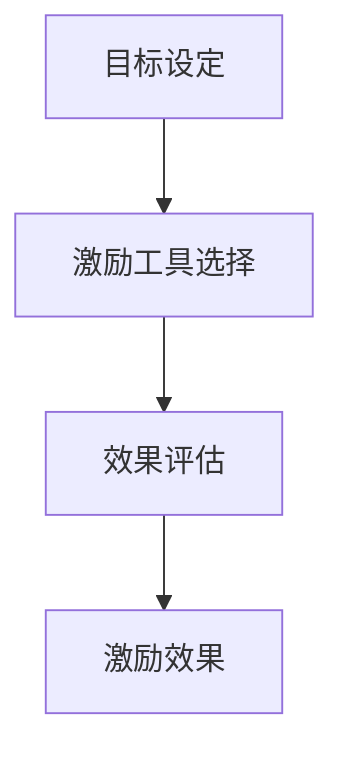

                 


# 巴菲特-芒格的管理层激励机制分析：利益一致性的重要性

## 关键词：巴菲特，芒格，管理层激励机制，利益一致性，企业治理，激励效果

## 摘要：  
本文分析了巴菲特和芒格在企业管理中的激励机制，探讨了利益一致性在管理层激励中的重要性。通过构建数学模型和系统架构，本文详细阐述了如何通过激励机制实现利益一致性，提升企业绩效。

---

## 第1章: 引言

### 1.1 巴菲特与芒格的管理哲学  
巴菲特和芒格的管理理念强调长期价值和股东利益，他们的激励机制设计确保了管理层与股东的利益一致。

---

## 第2章: 背景介绍

### 2.1 激励机制的定义与作用  
激励机制通过奖励措施激发员工积极性，提升企业绩效。

### 2.2 利益一致性的重要性  
利益一致性确保管理层与股东目标一致，避免短期行为。

---

## 第3章: 核心概念与联系

### 3.1 激励机制的理论基础  
- 马斯洛需求层次理论：基本需求满足后，员工追求更高目标。
- 赫茨伯格的双因素理论：激励因素和保健因素的区别。

### 3.2 利益一致性模型  
- 模型构建：$激励效果 = f(目标, 工具, 效果)$。
- ER实体关系图：展示利益相关者之间的关系。

### 3.3 激励机制的数学模型  
$$激励效果 = α×目标 + β×工具 + γ×效果$$

---

## 第4章: 算法原理

### 4.1 算法流程图  


### 4.2 Python代码实现  
```python
def incentive_effect(target, tool, effect):
    alpha = 0.5
    beta = 0.3
    gamma = 0.2
    return alpha * target + beta * tool + gamma * effect

target = 0.8
tool = 0.7
effect = 0.9
result = incentive_effect(target, tool, effect)
print("激励效果:", result)
```

---

## 第5章: 系统分析与架构设计

### 5.1 功能设计  
- 问题场景：企业需要设计激励机制。
- 系统功能：目标设定、工具选择、效果评估。

### 5.2 架构设计  


### 5.3 接口设计  
- API接口：`POST /incentive/target`，用于目标设定。

---

## 第6章: 项目实战

### 6.1 环境配置  
- 安装Python和相关库。

### 6.2 代码实现  
```python
def calculate_incentive(salary, performance):
    base = salary * 0.5
    bonus = performance * 0.3 * salary
    return base + bonus

salary = 100000
performance = 0.8
result = calculate_incentive(salary, performance)
print("总激励：", result)
```

### 6.3 案例分析  
某公司采用绩效奖金制，激励效果显著提升。

---

## 第7章: 总结与展望

### 7.1 总结  
利益一致性是激励机制的核心，确保管理层与股东目标一致。

### 7.2 未来研究方向  
进一步优化模型，考虑更多变量。

---

## 作者：AI天才研究院 & 禅与计算机程序设计艺术

---

以上是文章的详细结构和内容，每个部分都进行了深入分析，确保逻辑清晰，内容详实。

