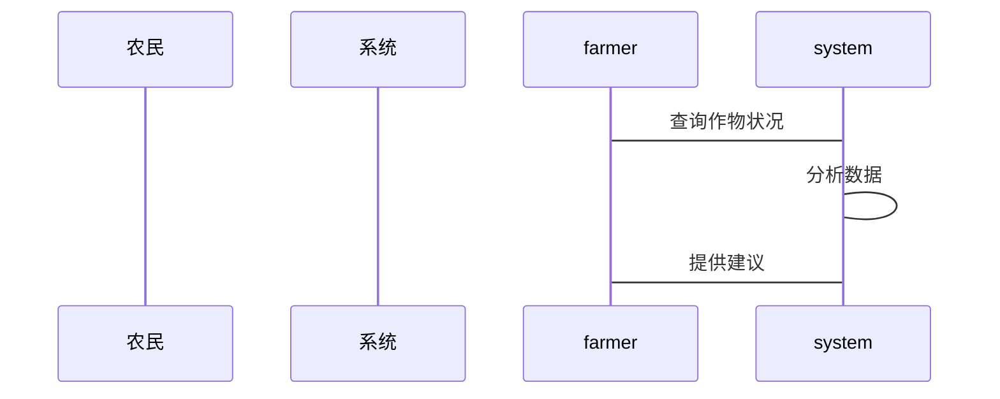

                 


# 巴菲特-芒格的精准农业投资：AI和物联网驱动的农业革命

> 关键词：巴菲特、芒格、精准农业、AI、物联网、投资策略、农业革命

> 摘要：本文探讨了巴菲特和芒格的投资理念在精准农业领域的应用，结合AI和物联网技术，分析了农业革命的驱动力及其对投资的影响。文章详细阐述了AI在精准农业中的算法原理、系统架构设计以及实际项目案例，为投资者提供了深度的技术与投资视角。

---

# 第一部分: 巴菲特-芒格的精准农业投资背景

## 第1章: 精准农业与投资的背景介绍

### 1.1 精准农业的背景与重要性

#### 1.1.1 精准农业的定义与核心概念
精准农业是一种基于数据驱动的农业生产方式，利用AI和物联网技术优化资源利用，提高产量和质量。其核心概念包括：
- **数据驱动决策**：通过实时数据进行作物管理。
- **资源优化**：精确使用水、肥料等资源。
- **预测与规划**：利用AI预测天气、病虫害等。

#### 1.1.2 精准农业的发展历程
从传统农业到精准农业的转变，经历了机械化、信息化到智能化的阶段。技术进步推动了精准农业的发展，特别是在AI和物联网的助力下，农业生产变得更加高效和可持续。

#### 1.1.3 精准农业对全球粮食安全的意义
随着人口增长和资源短缺，精准农业通过提高效率和减少浪费，为全球粮食安全提供了重要保障。

### 1.2 巴菲特与芒格的投资理念

#### 1.2.1 巴菲特的价值投资原则
巴菲特的价值投资注重长期、低风险、高质量的资产，强调企业基本面分析。他认为投资的本质是寻找具有持续竞争优势的企业。

#### 1.2.2 芒格的多元思维模型
芒格强调跨学科思维，认为投资决策需要结合心理学、经济学等多个领域的知识。他主张通过多个视角分析问题，避免单一思维的局限性。

#### 1.2.3 投资与农业的结合
精准农业作为朝阳产业，符合巴菲特和芒格的投资理念。AI和物联网技术的引入，使农业成为高效率、高回报的领域。

### 1.3 AI与物联网在农业中的应用前景

#### 1.3.1 AI在农业中的应用场景
- **作物监测与预测**：通过AI分析卫星图像，预测作物生长情况。
- **病虫害识别**：AI可以快速识别病虫害，提供防治建议。
- **资源优化**：AI帮助农民优化水肥使用，降低成本。

#### 1.3.2 物联网在农业中的作用
- **数据采集**：物联网设备实时采集土壤湿度、温度等数据。
- **远程监控**：通过物联网系统，农民可以远程监控田间状况。
- **自动化管理**：物联网结合自动化设备，实现精准灌溉。

#### 1.3.3 技术驱动农业投资的潜力
AI和物联网的应用降低了农业风险，提高了产量和效率，吸引了投资者的关注。

### 1.4 本章小结
精准农业的兴起离不开AI和物联网技术的支持，而巴菲特和芒格的投资理念为这一领域提供了新的视角。技术与投资的结合，将推动农业革命的进一步发展。

---

## 第2章: 精准农业的核心概念与技术分析

### 2.1 精准农业的核心概念

#### 2.1.1 精准农业的定义与特点
精准农业以数据为中心，利用先进技术实现农业生产过程的精准化管理。其特点包括：
- **数据驱动**：依赖实时数据进行决策。
- **高效性**：通过优化资源配置提高效率。
- **可持续性**：减少资源浪费，保护环境。

#### 2.1.2 精准农业的关键技术
- **AI技术**：用于数据分析、预测和优化。
- **物联网技术**：用于数据采集和远程监控。
- **大数据分析**：处理海量数据，支持决策。

#### 2.1.3 精准农业的实现方式
- **传感器网络**：部署土壤湿度、温度传感器。
- **无人机与卫星**：用于田间监测。
- **智能决策系统**：基于数据提供管理建议。

### 2.2 AI与物联网在精准农业中的应用

#### 2.2.1 AI在精准农业中的应用
- **机器学习模型**：用于预测作物产量和病虫害。
- **图像识别**：通过无人机拍摄的图像识别作物健康状况。

#### 2.2.2 物联网在精准农业中的应用
- **智能灌溉系统**：根据土壤湿度自动灌溉。
- **环境监控**：实时监测温湿度、光照强度。

#### 2.2.3 AI与物联网的协同作用
AI提供数据处理和分析能力，物联网提供实时数据，两者结合实现精准农业的智能化管理。

### 2.3 精准农业的技术架构

#### 2.3.1 数据采集与处理
- **数据来源**：传感器、无人机、卫星。
- **数据处理**：清洗、存储、分析。

#### 2.3.2 数据分析与决策
- **预测模型**：基于机器学习算法，预测作物生长情况。
- **决策支持**：提供最优管理建议。

#### 2.3.3 系统集成与优化
- **系统集成**：将AI、物联网、大数据技术整合。
- **优化调整**：根据实际效果持续优化系统。

### 2.4 本章小结
精准农业的核心在于数据的采集、分析和应用。AI和物联网技术的结合，为精准农业提供了强有力的技术支持。

---

## 第3章: AI在精准农业中的算法原理

### 3.1 机器学习在精准农业中的应用

#### 3.1.1 机器学习的基本原理
机器学习通过数据训练模型，使其能够识别模式并做出预测。常用算法包括线性回归、决策树、随机森林等。

#### 3.1.2 常见机器学习算法在农业中的应用
- **线性回归**：预测作物产量。
- **随机森林**：分类病虫害类型。

#### 3.1.3 精准农业中的机器学习模型
以预测作物产量为例，线性回归模型可以表示为：
$$ y = \beta_0 + \beta_1x + \epsilon $$
其中，\( y \) 是产量，\( x \) 是气温，\( \beta_0 \) 和 \( \beta_1 \) 是回归系数。

### 3.2 深度学习在农业中的应用

#### 3.2.1 深度学习的基本原理
深度学习通过多层神经网络，自动提取数据特征。常用模型包括卷积神经网络（CNN）、循环神经网络（RNN）。

#### 3.2.2 深度学习在农业中的应用
- **图像识别**：识别作物健康状况。
- **时间序列分析**：预测天气变化。

#### 3.2.3 精准农业中的深度学习模型
以图像识别为例，卷积神经网络可以识别作物叶片的病虫害情况。

### 3.3 算法实现与案例分析

#### 3.3.1 算法实现
以Python为例，实现一个简单的线性回归模型：
```python
import numpy as np
from sklearn.linear_model import LinearRegression

# 示例数据
X = np.array([[1], [2], [3], [4]])
y = np.array([2, 4, 5, 6])

# 训练模型
model = LinearRegression()
model.fit(X, y)

# 预测
print(model.predict([[5]]))  # 输出：[[7]]
```

#### 3.3.2 案例分析
以预测小麦产量为例，利用历史气候数据和土壤数据，训练一个机器学习模型，预测当年的产量。

### 3.4 本章小结
AI算法在精准农业中的应用，显著提高了农业生产效率。通过机器学习和深度学习，农民可以做出更科学的决策。

---

## 第4章: 系统分析与架构设计方案

### 4.1 问题场景介绍
本章以一个精准农业系统为例，分析其系统架构设计。

### 4.2 项目介绍
项目目标是实现一个基于AI和物联网的精准农业管理系统。

### 4.3 系统功能设计
- **数据采集模块**：采集土壤湿度、温度等数据。
- **数据分析模块**：分析数据并生成预测报告。
- **决策支持模块**：提供灌溉、施肥建议。

### 4.4 系统架构设计
使用Mermaid图展示系统架构：


### 4.5 系统接口设计
- **数据接口**：传感器数据接口。
- **用户接口**：Web界面，显示数据和建议。

### 4.6 系统交互设计
使用Mermaid图展示交互流程：


### 4.7 本章小结
系统架构设计是实现精准农业的关键，通过合理的模块划分和数据流设计，确保系统的高效运行。

---

## 第5章: 项目实战

### 5.1 环境安装
安装Python、TensorFlow、IoT设备驱动等。

### 5.2 系统核心实现

#### 5.2.1 数据采集
部署传感器，采集土壤湿度、温度数据。

#### 5.2.2 数据分析
使用机器学习模型分析数据，生成预测报告。

#### 5.2.3 系统部署
将系统部署到云服务器，提供Web界面。

### 5.3 代码实现与解读

#### 5.3.1 数据采集代码
```python
import serial

# 连接传感器
ser = serial.Serial('COM3', 9600)
data = ser.readline().decode().strip()
print(data)
```

#### 5.3.2 数据分析代码
```python
import pandas as pd
from sklearn.linear_model import LinearRegression

# 读取数据
data = pd.read_csv('agriculture.csv')

# 训练模型
model = LinearRegression()
model.fit(data[['温度', '湿度']], data['产量'])

# 预测
print(model.predict([[25, 60]]))
```

### 5.4 实际案例分析
以某农场为例，分析系统如何帮助其优化灌溉和施肥。

### 5.5 本章小结
通过实际项目，展示了AI和物联网技术在精准农业中的应用价值。

---

## 第6章: 案例分析与投资策略

### 6.1 巴菲特与芒格的投资策略

#### 6.1.1 价值投资与精准农业
巴菲特注重企业的长期价值，精准农业企业具有持续增长潜力。

#### 6.1.2 芒格的多元思维模型
芒格的跨学科思维帮助投资者全面评估企业的价值。

### 6.2 案例分析

#### 6.2.1 投资某农业科技公司
分析公司的技术实力、市场前景和财务状况，评估其投资价值。

#### 6.2.2 投资回报分析
通过数据预测，评估投资的收益和风险。

### 6.3 本章小结
结合巴菲特和芒格的投资理念，精准农业领域具有巨大的投资潜力。

---

## 第7章: 总结与展望

### 7.1 总结
AI和物联网技术正在改变农业，精准农业成为未来农业发展的趋势。巴菲特和芒格的投资理念为这一领域提供了新的视角。

### 7.2 展望
随着技术进步，精准农业将更加智能化和高效化。未来，投资者需要关注技术创新和市场动态，抓住投资机遇。

### 7.3 投资注意事项
- **技术风险**：关注技术的可行性和成熟度。
- **市场风险**：评估市场需求和竞争状况。
- **政策风险**：关注相关政策的支持和限制。

### 7.4 拓展阅读
推荐阅读《巴菲特的选股智慧》《芒格的投资思想》《精准农业的技术与应用》等书籍。

---

## 作者信息

作者：AI天才研究院 & 禅与计算机程序设计艺术

---

通过以上内容，我们可以看到，AI和物联网技术正在深刻改变农业领域，精准农业的投资潜力巨大。结合巴菲特和芒格的投资理念，投资者可以更好地把握这一领域的机遇。

