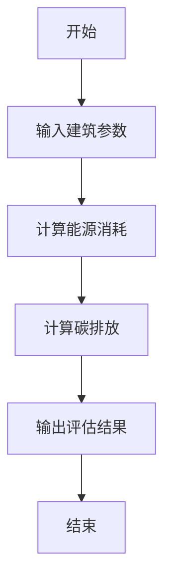

                 


# 巴菲特-芒格的绿色建筑投资：可持续发展的城市未来

---

## 关键词：
绿色建筑、巴菲特、芒格、可持续发展、投资策略、城市规划、环境影响

---

## 摘要：
绿色建筑作为可持续发展的核心领域，正逐渐成为全球投资的新热点。本文从巴菲特和芒格的投资哲学出发，探讨他们在绿色建筑领域的投资策略，分析绿色建筑的核心概念、评估标准和经济价值。通过结合实际案例，本文揭示了绿色建筑如何推动城市的可持续发展，并为投资者提供了实用的建议和未来展望。

---

## 第一部分: 绿色建筑与可持续发展概述

### 第1章: 绿色建筑与可持续发展概述

#### 1.1 绿色建筑的基本概念
##### 1.1.1 绿色建筑的定义与核心要素
绿色建筑是指在全生命周期内，最大限度地节约资源、保护环境、减少污染的建筑。其核心要素包括：
1. 能源效率：通过优化建筑设计降低能耗。
2. 可持续材料：使用环保材料，减少对环境的影响。
3. 建筑寿命：延长建筑使用寿命，减少资源浪费。

##### 1.1.2 可持续发展的城市规划理念
可持续城市规划强调：
1. 空间效率：优化土地使用，减少 sprawl。
2. 环境保护：保护自然资源和生态系统。
3. 社会公平：确保所有居民都能享有优质的生活环境。

##### 1.1.3 绿色建筑与城市未来的关系
绿色建筑不仅是环保的实践，更是推动城市转型的重要力量。通过减少碳排放、节约能源和资源，绿色建筑为城市的可持续发展提供了可行的解决方案。

#### 1.2 巴菲特与芒格的投资理念
##### 1.2.1 巴菲特的价值投资哲学
巴菲特的价值投资强调长期、安全和收益。他倾向于投资具有强大护城河和持续盈利能力的企业。

##### 1.2.2 芒格的多元思维模型
芒格的多元思维模型强调跨学科思考，将不同领域的知识结合起来，寻找投资机会。

##### 1.2.3 两人投资理念的异同点
- 巴菲特更注重企业的财务稳健性和盈利能力。
- 芒格更注重跨学科思维，寻找非显而易见的投资机会。
- 两人都重视长期价值和风险管理。

---

## 第二部分: 绿色建筑投资的核心概念与联系

### 第3章: 绿色建筑的核心要素与评估标准

#### 3.1 绿色建筑的核心要素与评估标准
##### 3.1.1 绿色建筑的核心要素
1. **能源效率**：通过优化建筑设计和设备减少能源消耗。
2. **可持续材料**：使用环保材料，减少对环境的影响。
3. **建筑寿命**：延长建筑使用寿命，减少资源浪费。

##### 3.1.2 绿色建筑的评估标准
- **LEED认证体系**：由美国绿色建筑委员会制定，涵盖能源、水、材料、室内环境等多个方面。
- **BREEAM评估方法**：英国建筑研究院环境评估方法，注重环境影响和性能表现。
- **国际绿色建筑标准对比**：不同国家的绿色建筑标准在侧重点上有所不同，但核心理念相似。

#### 3.2 巴菲特-芒格投资策略与绿色建筑的结合
##### 3.2.1 巴菲特与芒格的投资策略分析
- 巴菲特注重长期价值和企业盈利能力。
- 芒格注重跨学科思维，寻找非显而易见的投资机会。

##### 3.2.2 绿色建筑投资中的价值评估
- 绿色建筑的市场价值评估：考虑能源效率、材料环保性和建筑寿命。
- 可持续性对投资回报的影响：绿色建筑通常具有更高的市场价值和更低的运营成本。
- 绿色建筑投资的风险与机遇：政策支持、技术进步和市场趋势为绿色建筑投资提供了机遇，同时也带来了不确定性。

---

## 第三部分: 绿色建筑投资的算法原理与系统架构

### 第4章: 绿色建筑投资的算法原理

#### 4.1 算法原理讲解
##### 4.1.1 绿色建筑评估的数学模型
绿色建筑的能源消耗可以通过以下公式进行预测：
$$
E = \sum_{i=1}^{n} \frac{Q_i}{\eta_i}
$$
其中，$E$ 为总能源消耗，$Q_i$ 为第 $i$ 种能源的消耗量，$\eta_i$ 为能源效率。

##### 4.1.2 碳排放预测模型
碳排放可以通过以下公式进行估算：
$$
C = \sum_{j=1}^{m} E_j \times \text{碳排放系数}_j
$$
其中，$C$ 为总碳排放，$E_j$ 为第 $j$ 种能源的消耗量，碳排放系数取决于能源类型。

##### 4.1.3 算法流程图


### 第5章: 绿色建筑投资的系统架构设计

#### 5.1 系统架构设计
##### 5.1.1 系统功能设计
- 数据采集模块：收集建筑参数和能源消耗数据。
- 评估模型模块：基于数学模型进行绿色建筑评估。
- 投资决策模块：根据评估结果制定投资策略。

##### 5.1.2 系统架构图


#### 5.2 系统接口设计
- 数据接口：与建筑管理系统（BMS）对接，获取实时数据。
- 用户接口：提供可视化界面，供投资者查看评估结果。

---

## 第四部分: 项目实战与最佳实践

### 第6章: 绿色建筑投资的项目实战

#### 6.1 环境安装
- 安装建筑管理系统（BMS）以监控能源消耗。
- 集成传感器和数据采集设备。

#### 6.2 核心代码实现
```python
import numpy as np

def calculate_energy_consumption(energy_usage, efficiency):
    return np.sum(energy_usage / efficiency)

def calculate_carbon_emissions(consumption, carbon_coefficient):
    return np.sum(consumption * carbon_coefficient)

# 示例数据
energy_usage = np.array([100, 200, 300])
efficiency = np.array([0.8, 0.9, 1.0])
carbon_coefficient = 0.5

total_energy = calculate_energy_consumption(energy_usage, efficiency)
total_carbon = calculate_carbon_emissions(total_energy, carbon_coefficient)

print(f"总能源消耗: {total_energy}")
print(f"总碳排放: {total_carbon}")
```

#### 6.3 案例分析
以某绿色建筑项目为例，分析其能源消耗和碳排放，并评估其投资回报。

#### 6.4 项目小结
通过项目实战，验证了绿色建筑评估模型的有效性和实用性。

### 第7章: 最佳实践与未来展望

#### 7.1 最佳实践
- 投资者应关注绿色建筑的长期价值和政策支持。
- 开发商应采用可持续材料和优化设计以降低能耗。

#### 7.2 小结
绿色建筑不仅是环保的实践，也是投资的热点。通过巴菲特和芒格的投资理念，我们可以更好地把握绿色建筑的投资机会。

#### 7.3 注意事项
- 绿色建筑投资需要综合考虑经济、社会和环境效益。
- 投资者应关注政策变化和技术进步。

#### 7.4 拓展阅读
- 推荐阅读《绿色建筑评估标准》和《巴菲特投资哲学》。

---

## 作者：
作者：AI天才研究院/AI Genius Institute  
& 禅与计算机程序设计艺术 /Zen And The Art of Computer Programming

