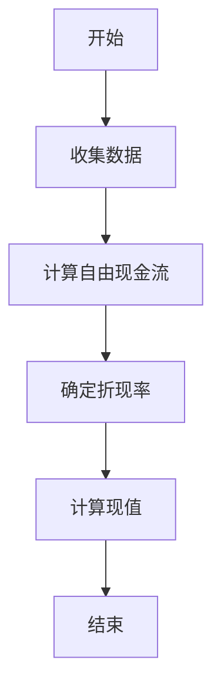
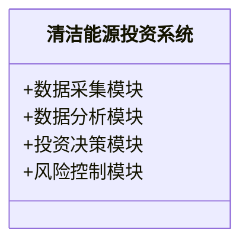

                 


# 巴菲特-芒格的能源转型投资：从化石燃料到清洁能源

> 关键词：巴菲特，芒格，能源转型，化石燃料，清洁能源，投资策略

> 摘要：本文深入分析了巴菲特和芒格在能源转型投资领域的策略，探讨了他们如何从化石燃料转向清洁能源投资，以及这一转变背后的原因、方法和未来趋势。文章结合了技术分析、投资理论和实际案例，为读者提供了全面的视角。

---

## 第一部分: 背景介绍

### 第1章: 能源转型的背景与挑战

#### 1.1 能源转型的背景
##### 1.1.1 化石燃料的现状与问题
化石燃料作为传统能源，虽然目前仍然是全球能源结构的核心，但其带来的环境问题、资源枯竭以及政策压力使其逐渐失去优势。我们可以通过以下表格对比化石燃料和清洁能源的特点：

| 特性         | 化石燃料         | 清洁能源         |
|--------------|------------------|------------------|
| 环境影响       | 高污染，温室气体排放     | 低污染或零排放      |
| 可持续性       | 非再生能源，储量有限    | 可再生能源，可持续利用 |
| 成本           | 初期投资低，运营成本高   | 初期投资高，运营成本低  |
| 技术成熟度     | 成熟，但技术改进空间有限 | 技术快速进步，潜力大    |

从上述对比可以看出，清洁能源在长期来看更具可持续性和环保性。

##### 1.1.2 清洁能源的重要性与发展趋势
清洁能源包括风能、太阳能、水能等，其发展受到政策支持和技术进步的双重推动。以下是一个简单的清洁能源占比趋势图：


清洁能源的占比逐年上升，尤其是在政策支持下，太阳能和风能发展迅速。

##### 1.1.3 能源转型的全球政策与市场驱动
全球各国纷纷制定能源转型政策，例如欧盟的碳中和目标、美国的可再生能源计划等。政策驱动和市场对环保的需求共同推动了能源转型。

#### 1.2 巴菲特与芒格的投资理念
##### 1.2.1 巴菲特的价值投资理论
巴菲特的价值投资理论强调长期持有的优质资产。他关注企业的内在价值，而非短期市场波动。以下是他的投资理念核心：

1. 选择具有持续竞争优势的企业。
2. 以合理的价格买入。
3. 长期持有。

##### 1.2.2 芒格的多元思维模型
芒格的多元思维模型强调跨学科思考，将不同领域的知识结合起来，形成完整的认知体系。他常提到的思维模型包括：

- 经济学：理解市场的供需关系。
- 心理学：理解投资者的行为偏差。
- 物理学：理解能量守恒定律。

##### 1.2.3 两人合作的投资策略
巴菲特和芒格的合作基于互补性：巴菲特擅长企业估值，芒格擅长风险控制和战略分析。他们的共同点是对长期价值的追求。

---

## 第二部分: 能源转型投资的核心概念

### 第2章: 清洁能源行业的数据分析

#### 2.1 数据分析的核心算法
##### 2.1.1 数据清洗与预处理
在分析清洁能源投资时，需要清洗数据，去除异常值和缺失值。例如：

```python
import pandas as pd

# 假设df是原始数据
df.dropna(inplace=True)
df.drop_duplicates(inplace=True)
```

##### 2.1.2 数据特征提取与选择
通过主成分分析（PCA）提取关键特征，减少维度。

##### 2.1.3 数据建模与预测
使用线性回归模型预测清洁能源的投资回报率。

```python
from sklearn.linear_model import LinearRegression

model = LinearRegression()
model.fit(X_train, y_train)
```

#### 2.2 巴菲特-芒格投资模型的构建
##### 2.2.1 投资模型的构建步骤
1. 数据收集：收集目标公司的财务数据、行业数据和市场数据。
2. 模型设计：基于现金流折现法（DCF）评估公司价值。
3. 模型验证：通过历史数据测试模型准确性。

以下是DCF模型的简化流程图：



##### 2.2.2 投资组合的优化与风险管理
通过均值-方差优化构建最优投资组合，降低风险。

---

## 第三部分: 能源转型投资的系统分析

### 第3章: 系统分析与架构设计

#### 3.1 问题场景介绍
能源转型投资涉及复杂的市场和环境因素，需要系统化的方法进行分析和决策。

#### 3.2 系统功能设计
以下是清洁能源投资系统的功能模块：



#### 3.3 系统架构设计
采用分层架构，包括数据层、业务逻辑层和用户界面层。


---

## 第四部分: 项目实战

### 第4章: 清洁能源投资实战

#### 4.1 环境安装
安装必要的工具，如Python、Pandas、Matplotlib等。

```bash
pip install pandas matplotlib seaborn scikit-learn
```

#### 4.2 核心代码实现
以下是DCF模型的Python实现：

```python
import numpy as np

def dcf_model(cash_flows, discount_rate):
    present_value = np.sum(cash_flows / (1 + discount_rate) ** np.arange(len(cash_flows)))
    return present_value

# 示例数据
cash_flows = [100, 200, 300]
discount_rate = 0.08

value = dcf_model(cash_flows, discount_rate)
print(f"DCF Value: {value}")
```

#### 4.3 项目总结
通过DCF模型可以较好地评估清洁能源公司的价值，但在实际操作中需要考虑更多因素，如政策变化和技术进步。

---

## 第五部分: 总结与展望

### 第5章: 总结与展望

#### 5.1 最佳实践 tips
- 长期投资，避免短期波动。
- 结合政策和市场趋势，选择优质企业。

#### 5.2 小结
巴菲特和芒格的能源转型投资策略展现了价值投资与长期趋势分析的结合，为投资者提供了新的思路。

#### 5.3 注意事项
- 能源转型涉及复杂因素，投资需谨慎。
- 保持对市场和政策的敏感性。

#### 5.4 拓展阅读
建议阅读巴菲特和芒格的著作，深入理解他们的投资理念。

---

作者：AI天才研究院 & 禅与计算机程序设计艺术

