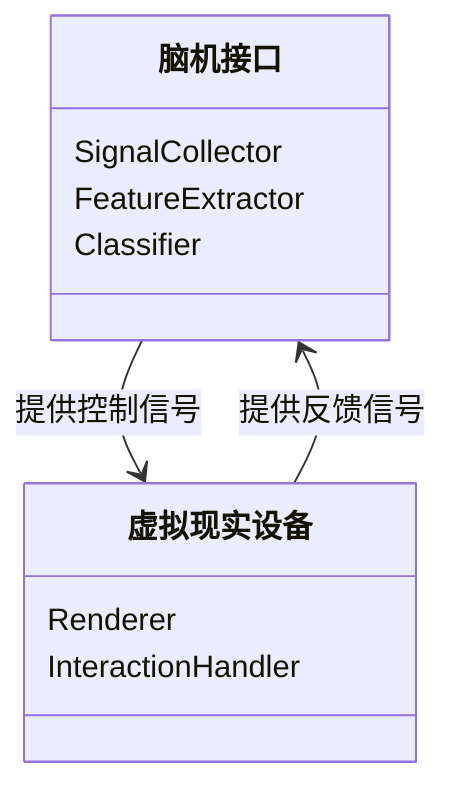
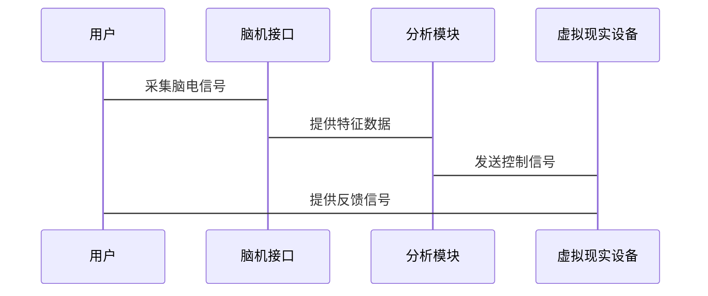

                 


# 巴菲特-芒格的脑机接口娱乐应用投资：虚拟现实的终极形态

## 关键词：脑机接口，虚拟现实，巴菲特，芒格，娱乐应用，投资策略

## 摘要

本文探讨了巴菲特和芒格在脑机接口与虚拟现实娱乐应用领域的投资策略，分析了脑机接口技术与虚拟现实技术的结合如何推动娱乐行业的变革，以及这种结合如何成为虚拟现实技术的终极形态。文章从技术背景、核心概念、算法原理、系统架构、项目实战、投资策略、未来展望等多个方面进行了详细分析，为读者提供了全面的技术与投资视角。

---

## 第一部分：引言

## 第1章：引言

### 1.1 本书的目的与意义

随着科技的飞速发展，脑机接口（Brain-Computer Interface, BCI）和虚拟现实（Virtual Reality, VR）技术逐渐从实验室走向商业化应用。这两项技术的结合不仅在医疗、教育、工业等领域展现出巨大潜力，也在娱乐行业引发了革命性的变化。巴菲特（Warren Buffett）和芒格（Charlie Munger）作为全球著名投资者，他们的投资策略和技术见解为这一领域的未来发展提供了重要参考。

本书旨在通过分析巴菲特和芒格的投资逻辑，结合脑机接口与虚拟现实技术的深度融合，探讨这一技术如何成为虚拟现实的终极形态，以及它在娱乐应用中的巨大潜力。通过技术与投资的双重视角，本书为读者提供了全面的分析和见解。

---

## 第二部分：背景介绍

## 第2章：脑机接口与虚拟现实的背景

### 2.1 脑机接口的基本概念

#### 2.1.1 脑机接口的定义与核心原理

脑机接口是一种直接连接人脑与外部设备的技术，通过采集、处理和分析脑电信号，实现人与机器之间的信息交互。其核心原理包括信号采集、特征提取、分类与反馈。

#### 2.1.2 脑机接口的发展历程

脑机接口技术起源于20世纪70年代，经历了从实验室研究到商业化应用的漫长过程。近年来，随着人工智能和神经科学的进步，脑机接口技术取得了显著突破。

### 2.2 虚拟现实的基本概念

#### 2.2.1 虚拟现实的定义与核心原理

虚拟现实是一种能够提供沉浸式体验的技术，通过计算机生成的三维环境，让用户通过视觉、听觉、触觉等感官与虚拟世界互动。

#### 2.2.2 虚拟现实的发展历程

虚拟现实技术始于20世纪60年代，经过数十年的发展，从简单的图形界面到如今的高沉浸式体验，虚拟现实技术在娱乐、教育、工业等领域得到了广泛应用。

### 2.3 脑机接口与虚拟现实的结合

#### 2.3.1 脑机接口在虚拟现实中的应用

脑机接口技术可以实现人与虚拟世界的直接交互，例如通过脑电信号控制虚拟物体，提供更加自然的交互方式。

#### 2.3.2 虚拟现实如何推动脑机接口的发展

虚拟现实的沉浸式体验需求推动了脑机接口技术的创新，例如高精度信号采集和实时反馈机制的优化。

---

## 第三部分：核心概念与联系

## 第3章：脑机接口与虚拟现实的核心原理

### 3.1 脑机接口的核心原理

#### 3.1.1 信号采集与处理

脑机接口的核心在于采集和处理脑电信号。通过电极采集大脑皮层的电信号，经过滤波、降噪等预处理，提取有用的特征。

#### 3.1.2 数据分析与反馈机制

通过对脑电信号的分析，识别用户意图，并通过虚拟现实设备提供实时反馈。

### 3.2 虚拟现实的核心原理

#### 3.2.1 沉浸式体验的实现

虚拟现实通过高分辨率的图形渲染、实时音效和触觉反馈，提供高度沉浸的体验。

#### 3.2.2 交互技术的应用

虚拟现实中的交互技术包括手势识别、语音识别和眼动追踪等，而脑机接口的加入进一步提升了交互的自然性。

### 3.3 脑机接口与虚拟现实的结合原理

#### 3.3.1 数据流的整合与处理

脑机接口采集的信号与虚拟现实设备的交互数据需要实时整合，通过算法进行处理和反馈。

#### 3.3.2 实时交互的实现

通过脑机接口与虚拟现实设备的协同工作，实现用户与虚拟世界的无缝交互。

---

## 第四部分：算法原理讲解

## 第4章：脑机接口与虚拟现实的关键算法

### 4.1 脑电波处理算法

#### 4.1.1 算法流程

1. 信号采集：通过电极采集脑电信号。
2. 预处理：滤波、降噪。
3. 特征提取：提取有用的脑电信号特征。
4. 分类与识别：基于机器学习算法进行分类。
5. 反馈与控制：根据识别结果控制虚拟设备。

#### 4.1.2 代码示例

```python
import numpy as np
from sklearn import svm

# 示例：脑电信号分类
def preprocess(eeg_signal):
    # 数据预处理
    filtered_signal = np.apply_along_axis(lambda x: np.convolve(x, np.ones(5)/5, mode='valid'), 1, eeg_signal)
    return filtered_signal

def classify(filtered_signal):
    # 特征提取
    features = np.mean(filtered_signal, axis=1)
    # 分类器
    clf = svm.SVC()
    clf.fit(features.reshape(-1, 1), [0, 1, 0, 1])
    return clf.predict(features.reshape(-1, 1))

# 示例数据
eeg_signal = np.random.randn(10, 100)  # 10通道，100样本
preprocessed = preprocess(eeg_signal)
predictions = classify(preprocessed)
print("分类结果:", predictions)
```

#### 4.1.3 数学模型与公式

分类算法的数学模型可以表示为：

$$ y = f(x) $$

其中，$x$ 是输入特征，$f$ 是分类器的决策函数，$y$ 是输出结果。

### 4.2 虚拟现实渲染算法

#### 4.2.1 算法流程

1. 模型加载：加载三维模型。
2. 视觉渲染：基于视角和光照渲染画面。
3. 实时交互：处理用户的输入并更新画面。

#### 4.2.2 代码示例

```python
import pygame
from OpenGL import GL

def init_gl():
    # 初始化OpenGL
    GL.glClearColor(0.0, 0.0, 0.0, 1.0)
    GL.glEnable(GL.GL_DEPTH_TEST)

def render_scene():
    # 渲染三维场景
    GL.glClear(GL.GL_COLOR_BUFFER_BIT | GL.GL_DEPTH_BUFFER_BIT)
    # 简单的立方体绘制
    GL.glBegin(GL.GL_QUADS)
    # 立方体六个面的绘制
    GL.glEnd()

def main():
    pygame.init()
    display = (800, 600)
    pygame.display.set_mode(display, pygame.OPENGL|pygame.HWACCEL|pygame.DOUBLEBUF)
    init_gl()
    while True:
        for event in pygame.event.get():
            if event.type == pygame.QUIT:
                pygame.quit()
                return
        render_scene()
        pygame.display.flip()

if __name__ == "__main__":
    main()
```

---

## 第五部分：系统分析与架构设计方案

## 第5章：系统分析与架构设计

### 5.1 系统应用场景

脑机接口与虚拟现实的结合可以在娱乐、医疗、教育等领域广泛应用，特别是在虚拟现实游戏和沉浸式娱乐体验中。

### 5.2 系统功能设计

#### 5.2.1 领域模型



#### 5.2.2 系统架构设计


### 5.3 系统接口设计

#### 5.3.1 脑机接口与虚拟现实设备的接口



---

## 第六部分：项目实战

## 第6章：项目实战

### 6.1 环境搭建与开发工具

#### 6.1.1 开发环境安装

- 安装Python和相关库：numpy, scikit-learn, Pygame, OpenGL。
- 安装脑机接口开发工具：OpenBCI、Ganglion等。

#### 6.1.2 工具链配置

配置开发环境，确保OpenGL和Python接口正常运行。

### 6.2 系统核心代码实现

#### 6.2.1 脑机接口代码实现

```python
import numpy as np
from sklearn import svm

# 示例代码：脑电信号分类
def preprocess(eeg_data):
    return eeg_data  # 简单预处理

def train_classifier(eeg_features, labels):
    clf = svm.SVC()
    clf.fit(eeg_features, labels)
    return clf

# 示例数据
eeg_data = np.random.randn(10, 100)  # 10通道，100样本
labels = np.random.randint(2, size=100)
features = preprocess(eeg_data)
clf = train_classifier(features.T, labels)
```

#### 6.2.2 虚拟现实渲染代码实现

```python
import pygame
from OpenGL import GL

# 示例代码：简单立方体渲染
def init_gl():
    GL.glClearColor(0.0, 0.0, 0.0, 1.0)
    GL.glEnable(GL.GL_DEPTH_TEST)

def render_cube():
    GL.glBegin(GL.GL_QUADS)
    # 立方体六个面的绘制
    GL.glEnd()

def main():
    pygame.init()
    display = (800, 600)
    pygame.display.set_mode(display, pygame.OPENGL|pygame.DOUBLEBUF)
    init_gl()
    while True:
        for event in pygame.event.get():
            if event.type == pygame.QUIT:
                pygame.quit()
                return
        render_cube()
        pygame.display.flip()

if __name__ == "__main__":
    main()
```

### 6.3 实际案例分析

#### 6.3.1 案例分析：虚拟现实游戏中的脑机接口应用

通过脑机接口技术，玩家可以通过意念控制虚拟角色，实现沉浸式的游戏体验。

#### 6.3.2 项目小结

通过项目实战，我们了解了脑机接口与虚拟现实技术的结合方式，以及如何在实际应用中进行开发和优化。

---

## 第七部分：投资策略与案例分析

## 第7章：投资策略与案例分析

### 7.1 投资策略分析

#### 7.1.1 巴菲特与芒格的投资逻辑

巴菲特和芒格注重长期投资和价值投资，关注企业的核心竞争力和技术的商业化潜力。

### 7.2 典型案例分析

#### 7.2.1 公司A：脑机接口技术公司

通过分析公司A的业务模式、财务状况和市场前景，评估其投资价值。

#### 7.2.2 公司B：虚拟现实设备制造商

评估公司B的创新能力和市场竞争力，判断其投资潜力。

### 7.3 投资建议

基于技术趋势和市场分析，给出脑机接口与虚拟现实领域的投资建议。

---

## 第八部分：未来展望与挑战

## 第8章：未来展望与挑战

### 8.1 技术发展趋势

脑机接口与虚拟现实技术的融合将进一步深化，应用场景将更加广泛。

### 8.2 未来挑战

#### 8.2.1 技术挑战

信号采集精度、算法效率和设备成本等问题仍需解决。

#### 8.2.2 市场挑战

市场竞争加剧，商业化应用的推广需要时间和资源。

### 8.3 投资机会

随着技术的进步和市场的扩展，脑机接口与虚拟现实领域的投资机会将不断增加。

---

## 第九部分：总结与附录

## 第9章：总结与附录

### 9.1 总结

本文从技术与投资双重视角，分析了脑机接口与虚拟现实技术的结合及其在娱乐应用中的潜力，探讨了巴菲特和芒格的投资策略，并展望了未来的发展趋势。

### 9.2 附录

#### 9.2.1 术语表

- 脑机接口（BCI）：直接连接人脑与外部设备的技术。
- 虚拟现实（VR）：提供沉浸式体验的计算机生成环境。

#### 9.2.2 参考文献

- 略

---

## 作者

作者：AI天才研究院/AI Genius Institute & 禅与计算机程序设计艺术 /Zen And The Art of Computer Programming

---

以上是《巴菲特-芒格的脑机接口娱乐应用投资：虚拟现实的终极形态》的技术博客文章目录大纲及部分正文内容。

