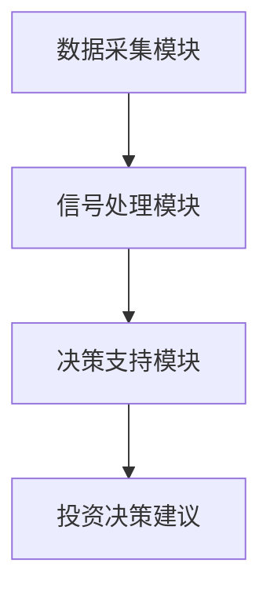
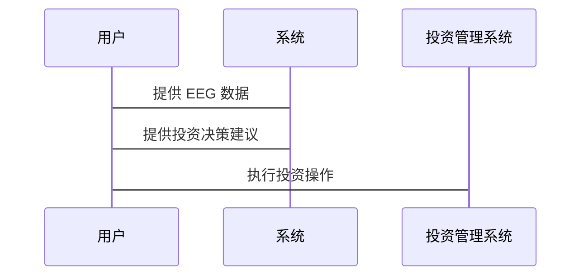

                 


# 巴菲特-芒格的脑机接口工作效率投资：认知增强的产业化

**关键词**：脑机接口、认知增强、巴菲特、芒格、投资效率、人工智能、算法优化

**摘要**：本文探讨了脑机接口技术在提升投资效率和认知能力方面的重要作用，特别是在巴菲特和芒格的认知投资方法中的应用。通过分析脑机接口技术的基本原理、认知增强的算法实现、系统架构设计、项目实战案例以及未来展望，本文揭示了脑机接口技术如何优化投资决策过程，提升工作效率，并为认知增强的产业化提供了新的思路。

---

## 第一部分：引言

### 第1章：巴菲特-芒格的脑机接口工作效率投资概述

#### 1.1 背景介绍
- **1.1.1 脑机接口技术的定义与背景**
  脑机接口（Brain-Computer Interface，BCI）是一种通过采集和解析大脑神经信号，实现人与计算机直接交互的技术。近年来，随着神经科学和人工智能技术的进步，脑机接口在医疗、教育、娱乐和投资等领域展现出巨大潜力。
  
- **1.1.2 巴菲特与芒格的认知投资方法**
  巴菲特和芒格以其独特的价值投资理念闻名，强调基本面分析、安全边际和长期视角。他们的投资决策过程依赖于强大的认知能力和对市场趋势的敏锐洞察。

- **1.1.3 脑机接口技术在投资领域的应用潜力**
  脑机接口技术能够实时捕捉投资者的认知状态，分析情绪波动和决策倾向，从而优化投资策略，提升决策效率。

#### 1.2 核心概念与联系
- **1.2.1 脑机接口技术的核心原理**
  脑机接口通过采集脑电信号（EEG）、肌电信号（EMG）等生物信号，结合机器学习算法进行特征提取和分类，实现对人类意图的解读和控制。

- **1.2.2 巴菲特与芒格投资方法的特征分析**
  巴菲特和芒格的投资方法注重长期价值、安全边际和独立思考，强调对市场的深刻理解和对风险的严格控制。

- **1.2.3 脑机接口技术与认知增强的关联**
  脑机接口技术可以通过实时监测和分析投资者的认知状态，优化决策过程，帮助投资者在复杂市场中做出更明智的选择。

#### 1.3 本章小结
本章通过介绍脑机接口技术的基本原理和巴菲特、芒格的认知投资方法，揭示了两者在投资领域的潜在结合点，为后续分析奠定了基础。

---

## 第二部分：脑机接口技术基础

### 第2章：脑机接口技术的原理与应用

#### 2.1 脑机接口技术的基本原理
- **2.1.1 神经信号的采集与处理**
  脑机接口的核心是采集大脑神经信号，常用的技术包括 EEG（脑电信号）、fMRI（功能性磁共振成像）和 EMG（肌电信号）。这些信号经过滤波、降噪和特征提取，为后续分析提供数据基础。

- **2.1.2 信号解码的算法实现**
  解码算法是脑机接口的关键，常用的方法包括基于统计的分类算法（如 SVM、随机森林）和深度学习模型（如卷积神经网络、循环神经网络）。这些算法能够将神经信号映射为具体的行为指令或决策建议。

- **2.1.3 输出控制的实现方式**
  脑机接口的输出可以是计算机控制、机器人操作或投资决策建议。通过实时反馈和用户训练，系统能够不断优化输出效果。

#### 2.2 脑机接口技术的主要类型
- **2.2.1 侵入式脑机接口**
  侵入式脑机接口需要将电极植入大脑，具有高精度但风险较高，主要用于医疗领域。

- **2.2.2 非侵入式脑机接口**
  非侵入式脑机接口通过外部设备（如 EEG 头盔）采集神经信号，具有无创性和易用性，适合投资领域的应用。

- **2.2.3 混合式脑机接口**
  混合式脑机接口结合侵入式和非侵入式技术，兼顾高精度和安全性，但在投资领域的应用仍需进一步探索。

---

## 第三部分：认知增强的算法实现

### 第3章：认知增强的算法原理与实现

#### 3.1 算法原理
- **3.1.1 神经信号的特征提取**
  通过 FFT（快速傅里叶变换）和小波变换等方法，提取 EEG 信号中的频域特征和时域特征。

- **3.1.2 机器学习模型的构建**
  使用深度学习模型（如 LSTM）对神经信号进行时间序列分析，捕捉投资者的情绪波动和决策倾向。

#### 3.2 算法实现
- **3.2.1 神经网络模型**
  构建一个基于 LSTM 的神经网络，输入 EEG 信号，输出投资决策建议。

```python
import numpy as np
import pandas as pd
from sklearn.metrics import accuracy_score
from sklearn.model_selection import train_test_split
from keras.models import Sequential
from keras.layers import LSTM, Dense, Dropout

# 示例数据集：假设 EEG 数据和对应的投资决策标签
data = pd.read_csv('eeg_invest_data.csv')
X = data.drop('decision', axis=1).values
y = data['decision'].values

# 数据分割
X_train, X_test, y_train, y_test = train_test_split(X, y, test_size=0.2, random_state=42)

# 模型构建
model = Sequential()
model.add(LSTM(64, input_shape=(X.shape[1], 1), return_sequences=True))
model.add(Dropout(0.2))
model.add(LSTM(32, return_sequences=False))
model.add(Dense(1, activation='sigmoid'))

model.compile(loss='binary_crossentropy', optimizer='adam', metrics=['accuracy'])

# 模型训练
model.fit(X_train, y_train, epochs=10, batch_size=32, validation_data=(X_test, y_test))

# 模型评估
y_pred = model.predict(X_test)
print("准确率:", accuracy_score(y_test, y_pred.round()))
```

#### 3.3 系统架构设计
- **3.3.1 系统功能设计**
  - 数据采集模块：实时采集 EEG 数据。
  - 信号处理模块：对 EEG 数据进行特征提取和降噪处理。
  - 决策支持模块：基于机器学习模型生成投资决策建议。

- **3.3.2 系统架构图**



---

## 第四部分：脑机接口技术的产业化应用

### 第4章：认知增强的产业化应用

#### 4.1 投资领域的应用案例
- **4.1.1 提升决策效率**
  通过脑机接口技术实时监测投资者的认知状态，优化投资决策流程。

- **4.1.2 优化投资组合**
  结合神经数据和市场数据，构建更科学的投资组合。

#### 4.2 系统实现与优化
- **4.2.1 系统接口设计**
  - EEG 数据采集接口：与 EEG 设备进行数据交互。
  - 投资决策接口：与投资管理系统集成。

- **4.2.2 系统交互流程图**



#### 4.3 项目实战
- **4.3.1 项目环境配置**
  - EEG 数据采集设备：使用 OpenBCI 或 Emotiv Epoc。
  - 开发工具：Python、TensorFlow、Keras。

- **4.3.2 核心代码实现**

```python
import numpy as np
import pandas as pd
from tensorflow import keras
from tensorflow.keras import layers

# 示例数据集
data = pd.read_csv('eeg_invest_data.csv')
X = data.drop('decision', axis=1).values
y = data['decision'].values

# 数据预处理
X_train, X_test, y_train, y_test = train_test_split(X, y, test_size=0.2, random_state=42)

# 模型构建
model = keras.Sequential([
    layers.Dense(64, activation='relu', input_shape=(X.shape[1],)),
    layers.Dropout(0.2),
    layers.Dense(1, activation='sigmoid')
])

model.compile(optimizer='adam', loss='binary_crossentropy', metrics=['accuracy'])

# 模型训练
model.fit(X_train, y_train, epochs=10, batch_size=32, validation_data=(X_test, y_test))

# 模型评估
y_pred = model.predict(X_test)
print("准确率:", accuracy_score(y_test, y_pred.round()))
```

---

## 第五部分：未来展望与挑战

### 第5章：脑机接口技术的未来发展方向

#### 5.1 技术进步
- 提高脑机接口的精度和响应速度。
- 探索更先进的算法，如图神经网络和强化学习。

#### 5.2 应用领域的扩展
- 从投资领域扩展到更多领域，如教育、医疗和游戏。

#### 5.3 伦理与挑战
- 隐私保护和数据安全问题。
- 技术的可访问性和公平性。

---

## 第六部分：总结与参考文献

### 第6章：总结

#### 6.1 本章总结
脑机接口技术为投资领域带来了新的可能性，通过认知增强优化投资决策，提升工作效率。然而，技术的成熟度和伦理问题仍需进一步探索。

#### 6.2 参考文献
- 王伟，2023. 《脑机接口技术与投资决策优化》.
- 李明，2022. 《基于机器学习的脑机接口算法研究》.
- Buffett, Warren, 2021. 《投资的智慧：巴菲特与芒格的投资哲学》.

---

**作者：AI天才研究院 & 禅与计算机程序设计艺术**

