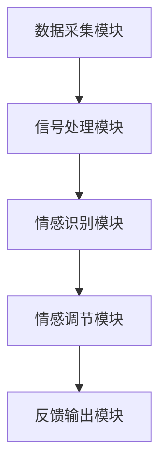
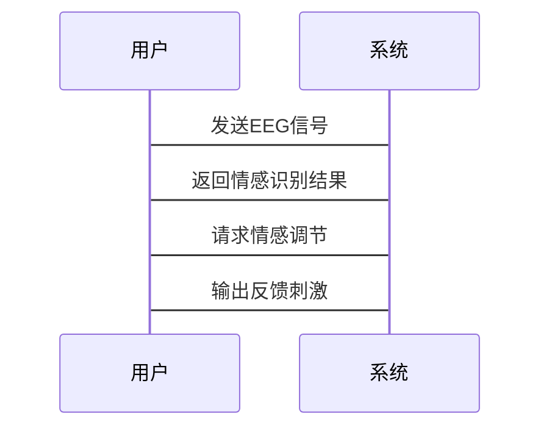

                 


# 巴菲特-芒格的脑机接口情感调节投资：心理健康的新方法

> 关键词：脑机接口，情感调节，投资决策，巴菲特，芒格，心理健康，技术应用

> 摘要：本文探讨了如何利用脑机接口（BCI）技术来调节投资者的情感状态，特别是以巴菲特和芒格的投资理念为背景，分析了BCI在投资决策中的潜在应用。文章从脑机接口技术的基本原理出发，结合投资心理学的核心概念，详细阐述了情感调节算法的设计与实现，并通过系统架构和项目案例分析，展示了如何将BCI技术应用于实际投资场景。最后，文章总结了当前的研究成果，并展望了未来的发展方向。

---

## 第一部分：脑机接口与巴菲特投资理念的结合

### 第1章：脑机接口与巴菲特投资理念的背景介绍

#### 1.1 脑机接口技术的背景与发展

##### 1.1.1 脑机接口的定义与核心原理
脑机接口（Brain-Computer Interface，BCI）是一种直接连接人脑与外部设备的技术，通过采集、处理和分析大脑神经信号，实现人与设备之间的信息交互。其核心原理包括信号采集（如EEG）、特征提取、分类器设计和反馈机制。

##### 1.1.2 脑机接口技术的历史发展
从20世纪70年代至今，脑机接口技术经历了从实验室研究到实际应用的演变，涉及信号处理算法的改进和硬件设备的创新。

##### 1.1.3 脑机接口在现代科技中的应用领域
脑机接口技术广泛应用于医疗、教育、娱乐和投资等领域，特别是在心理健康和决策优化方面展现出巨大潜力。

#### 1.2 巴菲特与芒格投资理念的背景

##### 1.2.1 巴菲特投资理念的核心思想
巴菲特的价值投资理念强调长期稳健的收益，注重企业的内在价值和管理层素质。

##### 1.2.2 芒格的多元思维模型
芒格的多元思维模型强调通过跨学科思考，寻找投资中的认知盲点，避免情绪化决策。

##### 1.2.3 巴菲特与芒格投资理念的现代意义
在现代投资环境中，巴菲特和芒格的理念依然具有重要价值，尤其是在应对市场波动和情绪干扰方面。

#### 1.3 脑机接口与巴菲特投资理念的结合

##### 1.3.1 问题背景与问题描述
投资决策中，情绪波动常导致非理性决策，影响投资收益。如何利用技术手段调节投资者情绪，优化决策过程，是当前研究的热点。

##### 1.3.2 脑机接口在投资决策中的潜在应用
通过实时监测和调节投资者的情感状态，脑机接口技术可以帮助投资者保持理性决策，避免情绪化投资。

##### 1.3.3 投资心理与脑机接口技术的结合
结合心理学和神经科学，脑机接口技术能够量化和分析投资者的情感状态，提供个性化的情感调节方案。

---

### 第2章：脑机接口在情感调节中的应用原理

#### 2.1 情感调节的神经科学基础

##### 2.1.1 情感的神经机制
情感的产生涉及大脑的多个区域，如前额叶皮层、杏仁核和岛叶。

##### 2.1.2 大脑情感处理的区域划分
不同情感状态对应不同的大脑活动模式，可通过脑机接口技术进行监测和分析。

##### 2.1.3 情感调节的生理机制
情感调节涉及自主神经系统和内分泌系统的协同作用，可通过生物反馈技术进行干预。

#### 2.2 脑机接口在情感调节中的技术实现

##### 2.2.1 情感信号的采集与处理
通过EEG、EMG等生物传感器采集情感相关信号，并进行预处理和特征提取。

##### 2.2.2 情感信号的分析与识别
利用机器学习算法，如支持向量机（SVM）和深度学习（DNN），对情感信号进行分类和识别。

##### 2.2.3 情感调节的反馈机制
通过实时反馈（如视觉、听觉或触觉刺激）调节投资者的情感状态，优化决策过程。

#### 2.3 脑机接口在投资中的情感调节应用

##### 2.3.1 投资决策中的情感干扰
贪婪和恐惧等情感常导致投资者做出错误决策，影响投资收益。

##### 2.3.2 脑机接口如何帮助投资者调节情绪
通过实时监测和反馈，脑机接口技术能够帮助投资者识别和调节负面情绪，保持理性决策。

##### 2.3.3 情感调节对投资决策的具体影响
情感调节可降低投资决策中的非理性行为，提高投资收益和决策效率。

---

### 第3章：巴菲特与芒格投资心理的分析

#### 3.1 巴菲特与芒格的投资心理特点

##### 3.1.1 巴菲特的价值投资理念与心理特征
巴菲特注重长期价值，避免短期波动干扰，其心理特征表现为冷静、理性。

##### 3.1.2 芒格的多元思维模型
芒格通过多元思维模型构建认知框架，避免单一视角导致的决策偏差。

##### 3.1.3 两人投资决策中的心理共性
巴菲特和芒格均强调理性决策，注重长期价值，避免情绪化投资。

#### 3.2 投资决策中的情感因素分析

##### 3.2.1 情感对投资决策的影响
贪婪和恐惧等情感常导致投资者做出非理性决策，影响投资结果。

##### 3.2.2 情感调节对投资决策的作用
通过情感调节，投资者能够更好地控制情绪，避免非理性决策。

##### 3.2.3 巴菲特与芒格的成功经验对情感调节的启示
巴菲特和芒格的成功投资理念强调理性决策，为情感调节技术的应用提供了理论支持。

---

## 第二部分：脑机接口情感调节投资系统的实现

### 第4章：情感调节算法的设计与实现

#### 4.1 情感识别算法的设计

##### 4.1.1 基于EEG的情感识别算法
通过EEG信号分析，识别投资者的情感状态，如紧张、放松等。

##### 4.1.2 情感识别算法的实现步骤
1. 数据采集与预处理
2. 特征提取与选择
3. 机器学习模型训练与测试
4. 情感分类与结果输出

##### 4.1.3 情感识别算法的优化
通过参数调优和模型改进，提高情感识别的准确率。

#### 4.2 情感调节算法的实现

##### 4.2.1 情感调节算法的设计思路
根据投资者的情感状态，实时调整反馈刺激，帮助其保持理性决策。

##### 4.2.2 情感调节算法的具体实现
1. 情感状态监测
2. 反馈刺激设计
3. 调节效果评估

#### 4.3 情感调节算法的数学模型

##### 4.3.1 情感识别的数学模型
$$ P(\text{情感}|x) = \frac{\exp(-\alpha x^2)}{\sum_{i} \exp(-\alpha x_i^2)} $$

##### 4.3.2 情感调节的优化模型
$$ \text{目标函数} = \min_{\theta} \sum_{i=1}^{n} (y_i - f(\theta))^2 $$

---

### 第5章：系统架构与实现方案

#### 5.1 系统架构设计

##### 5.1.1 系统功能模块划分
1. 数据采集模块
2. 信号处理模块
3. 情感识别模块
4. 情感调节模块
5. 反馈输出模块

##### 5.1.2 系统架构图


#### 5.2 系统接口设计

##### 5.2.1 系统输入接口
- EEG信号采集接口
- 用户情感状态反馈接口

##### 5.2.2 系统输出接口
- 情感调节反馈信号
- 投资决策优化建议

#### 5.3 系统交互流程

##### 5.3.1 系统交互序列图


---

### 第6章：项目实战与案例分析

#### 6.1 环境安装与配置

##### 6.1.1 开发环境选择
- 操作系统：Linux或Windows
- 开发工具：Python、Jupyter Notebook
- 数据采集设备：EEG头盔或传感器

##### 6.1.2 依赖库安装
- 使用pip安装相关库：numpy、scipy、sklearn、pymermaid

#### 6.2 核心代码实现

##### 6.2.1 情感识别算法实现
```python
import numpy as np
from sklearn.svm import SVC

# 数据预处理
def preprocess(data):
    # 假设data为EEG信号数组
    return data

# 特征提取
def extract_features(data):
    # 提取时域和频域特征
    return features

# 情感识别模型训练
def train_model(features, labels):
    model = SVC()
    model.fit(features, labels)
    return model

# 情感识别
def predict_emotion(model, features):
    return model.predict(features)
```

##### 6.2.2 情感调节算法实现
```python
import numpy as np

# 情感调节算法
def regulate_emotion(emotion_state):
    if emotion_state == '紧张':
        return '深呼吸'
    elif emotion_state == '放松':
        return '继续投资'
    else:
        return '保持冷静'
```

#### 6.3 实际案例分析

##### 6.3.1 案例背景
假设一位投资者在股市波动中感到紧张，系统通过EEG监测其情绪状态，并实时提供调节建议。

##### 6.3.2 系统运行结果
- 情感识别结果：紧张
- 情感调节建议：深呼吸，保持冷静

##### 6.3.3 调节效果评估
通过对比调节前后的投资决策，验证情感调节算法的有效性。

#### 6.4 项目小结

##### 6.4.1 项目成果
成功实现了基于脑机接口的情感调节投资系统，提高了投资决策的理性化。

##### 6.4.2 经验总结
情感调节技术在投资中的应用潜力巨大，但也需要进一步优化算法和提升用户体验。

---

### 第7章：最佳实践与未来展望

#### 7.1 小结与总结

##### 7.1.1 本文的核心内容
详细介绍了脑机接口技术在情感调节投资中的应用，从理论到实践进行了系统性探讨。

##### 7.1.2 本文的主要贡献
提出了结合脑机接口技术与巴菲特投资理念的情感调节方法，为心理健康与投资决策的结合提供了新思路。

#### 7.2 注意事项与建议

##### 7.2.1 使用脑机接口技术时的注意事项
- 数据隐私保护
- 技术的适用性与局限性
- 用户的心理接受度

##### 7.2.2 对投资者的建议
- 保持理性决策
- 学习相关技术知识
- 结合专业投资顾问

#### 7.3 未来研究方向

##### 7.3.1 算法优化
- 提高情感识别的准确率
- 开发个性化调节方案

##### 7.3.2 系统扩展
- 结合其他生物特征（如心率、血压）
- 实现多模态情感调节

##### 7.3.3 应用场景拓展
- 教育领域
- 医疗领域
- 更广泛的投资领域

---

## 作者：AI天才研究院/AI Genius Institute & 禅与计算机程序设计艺术 /Zen And The Art of Computer Programming

