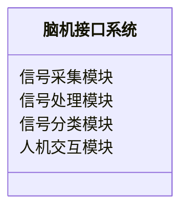
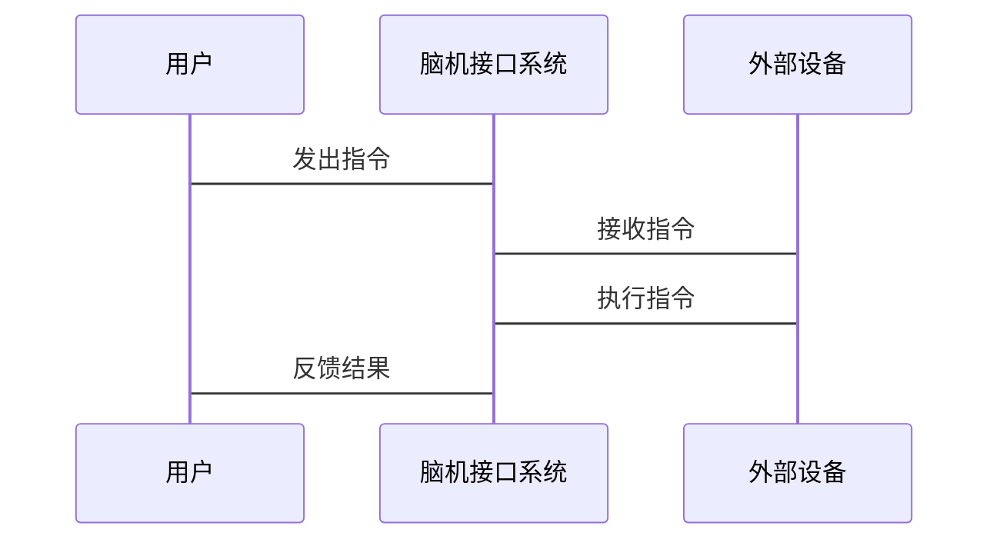

                 


# 巴菲特-芒格的脑机接口技术投资：人机交互的未来

---

## 关键词：
- 巴菲特投资理念，芒格思维模型，脑机接口技术，人机交互，人工智能，投资策略

---

## 摘要：
本文探讨了巴菲特和芒格的投资哲学与脑机接口（BCI）技术的结合，分析了脑机接口技术在人机交互中的未来发展趋势，结合投资机会与风险评估，为读者提供深度的技术与投资视角。文章从背景介绍、核心概念、算法原理、系统架构、项目实战等多方面展开，结合实例和最佳实践，为技术与投资领域的读者提供了全面的视角。

---

## 第一部分：巴菲特与芒格的投资哲学

### 第1章：巴菲特与芒格的投资理念

#### 1.1 巴菲特的价值投资原则

##### 1.1.1 价值投资的核心理念
- 价值投资的核心在于寻找市场低估的公司，关注其内在价值。
- 巴菲特的价值投资原则强调长期持有优质资产，避免短期市场波动的干扰。

##### 1.1.2 巴菲特的投资策略
- **买入并持有**：巴菲特别重于长期投资，寻找具有强大护城河的企业。
- **安全边际**：在投资中，巴菲特别注重安全边际，即买入价格低于内在价值。

##### 1.1.3 巴菲特的成功案例分析
- **可口可乐案例**：巴菲特点赞可口可乐的商业模式和持续盈利能力。
- **苹果公司案例**：巴菲特对苹果的投资展现了对科技企业的关注。

#### 1.2 芒格的多元思维模型

##### 1.2.1 多元思维模型的定义
- 多元思维模型是指将多个学科和领域的知识框架结合起来，形成一个完整的认知体系。
- 芒格强调跨学科思维，认为投资决策需要考虑多个维度的因素。

##### 1.2.2 芒格思维模型的核心要素
- **心理模型**：包括概率论、逆向思维、机会成本等。
- **决策框架**：通过简化问题，找到最优解。

##### 1.2.3 芒格思维模型在投资中的应用
- **逆向思维**：寻找市场中的非共识性机会。
- **复利思维**：长期投资的复利效应。

#### 1.3 巴菲特与芒格投资理念的结合

##### 1.3.1 巴菲特与芒格的合作历程
- 巴菲特与芒格的合作始于1971年，两人共同管理伯克希尔哈撒韦公司，芒格负责投资决策，巴菲特负责资本运作。

##### 1.3.2 巴菲特与芒格理念的互补性
- 巴菲特的价值投资与芒格的多元思维模型相辅相成，形成了独特的投资哲学。

##### 1.3.3 巴菲特与芒格投资理念的现代应用
- 在科技领域的投资中，巴菲特与芒格的理念仍然适用，尤其是对技术护城河和长期盈利能力的重视。

---

## 第二部分：脑机接口技术的现状与未来

### 第2章：脑机接口技术的基础

#### 2.1 脑机接口技术的定义与分类

##### 2.1.1 脑机接口技术的定义
- 脑机接口（BCI）是一种连接人脑与外部设备的接口技术，通过采集和解析神经信号，实现人脑与机器之间的信息交互。

##### 2.1.2 脑机接口技术的分类
- **侵入式**：直接植入大脑，如深部脑刺激技术。
- **非侵入式**：通过头皮电极采集脑电信号。

##### 2.1.3 脑机接口技术的关键技术指标
- 信号采集精度：EEG、fMRI等技术的对比。
- 信号处理算法：滤波、特征提取、分类算法。

#### 2.2 脑机接口技术的发展历程

##### 2.2.1 脑机接口技术的历史回顾
- 20世纪50年代：EEG技术的初步应用。
- 21世纪：脑机接口技术的快速发展。

##### 2.2.2 脑机接口技术的现状
- 临床应用：神经康复、疾病诊断。
- 消费市场：游戏、教育。

##### 2.2.3 脑机接口技术的未来趋势
- 高精度、低延迟、可穿戴设备的普及。

#### 2.3 脑机接口技术的核心算法

##### 2.3.1 神经信号处理算法
- 数据采集与预处理：滤波、去噪。
- 特征提取：时域、频域、空间域特征。

##### 2.3.2 信号识别与分类算法
- 常见算法：支持向量机（SVM）、随机森林、深度学习。
- 分类性能评估：准确率、召回率、F1分数。

##### 2.3.3 脑机接口系统的优化算法
- 在线自适应算法：实时调整模型参数。
- 离线训练算法：基于大量数据的模型优化。

### 第3章：脑机接口技术在人机交互中的应用

#### 3.1 医疗领域的应用

##### 3.1.1 神经康复中的应用
- 中风康复：通过脑机接口技术帮助患者恢复运动功能。
- 帕金森病治疗：通过脑机接口技术实现神经调节。

##### 3.1.2 精准医疗中的应用
- 个性化诊断：通过脑机接口技术采集患者神经信号，辅助医生制定个性化治疗方案。

##### 3.1.3 脑机接口技术在疾病诊断中的应用
- 精神疾病诊断：通过脑电信号分析，辅助诊断抑郁症、自闭症等疾病。

#### 3.2 教育领域的应用

##### 3.2.1 提高学习效率的应用
- 个性化学习：通过脑机接口技术实时监测学生注意力水平，优化学习策略。
- 智能教学系统：基于学生脑电信号，动态调整教学内容。

##### 3.2.2 个性化教学的应用
- 因材施教：通过脑机接口技术分析学生的学习状态，提供个性化教学方案。
- 教学效果评估：通过脑机接口技术实时监测学生的学习效果，提供反馈。

##### 3.2.3 在线教育中的应用
- 在线学习辅助：通过脑机接口技术实时监测学生注意力，优化在线教学体验。
- 在线互动：通过脑机接口技术实现师生之间的实时互动，提升教学效果。

#### 3.3 娱乐领域的应用

##### 3.3.1 游戏中的应用
- 无鼠标操作：通过脑机接口技术实现游戏控制。
- 虚拟现实中的应用：通过脑机接口技术提升沉浸式体验。

##### 3.3.2 虚拟现实中的应用
- 虚拟现实中的脑机接口技术：通过脑机接口技术实现与虚拟世界的交互。
- 虚拟现实中的游戏控制：通过脑机接口技术实现虚拟现实中的游戏控制。

##### 3.3.3 娱乐体验的提升
- 个性化娱乐体验：通过脑机接口技术实时监测用户情绪，优化娱乐内容。
- 虚拟现实中的社交互动：通过脑机接口技术实现虚拟现实中的社交互动。

### 第4章：脑机接口技术的投资机会与风险

#### 4.1 投资机会

##### 4.1.1 医疗领域的投资机会
- 神经康复设备：脑机接口技术在神经康复中的应用。
- 精准医疗：脑机接口技术在精准医疗中的应用。

##### 4.1.2 教育领域的投资机会
- 个性化学习系统：脑机接口技术在教育中的应用。
- 在线教育：脑机接口技术在在线教育中的应用。

##### 4.1.3 娱乐领域的投资机会
- 虚拟现实中的脑机接口技术应用。
- 游戏中的脑机接口技术应用。

#### 4.2 投资风险

##### 4.2.1 技术风险
- 技术成熟度：脑机接口技术的成熟度影响投资风险。
- 技术更新：脑机接口技术的更新换代快，投资风险较高。

##### 4.2.2 市场风险
- 市场需求：脑机接口技术的市场需求不确定。
- 竞争格局：脑机接口技术领域的竞争激烈，投资风险较高。

##### 4.2.3 政策风险
- 政策监管：脑机接口技术的政策监管不确定性较高。

#### 4.3 投资策略

##### 4.3.1 长期投资策略
- 关注具有强大技术护城河的公司。
- 选择具有长期发展潜力的脑机接口技术公司。

##### 4.3.2 风险控制策略
- 分散投资：通过分散投资降低风险。
- 定期评估：定期评估投资组合，及时调整。

---

## 第三部分：脑机接口技术的系统架构与实现

### 第5章：脑机接口技术的系统架构

#### 5.1 系统功能设计

##### 5.1.1 领域模型设计
- 领域模型：脑机接口系统的功能模块包括信号采集、信号处理、信号分类、人机交互等。

##### 5.1.2 领域模型图


#### 5.2 系统架构设计

##### 5.2.1 系统架构图
```mermaid
server
    Brain-Computer Interface System
    ├── Signal Acquisition Module
    ├── Signal Processing Module
    ├── Signal Classification Module
    └── Human-Computer Interaction Module
```

#### 5.3 系统接口设计

##### 5.3.1 接口设计
- 信号采集模块：与外部设备（如EEG电极）连接，采集神经信号。
- 信号处理模块：与信号采集模块和信号分类模块交互，提供处理后的信号特征。
- 信号分类模块：与信号处理模块和人机交互模块交互，输出分类结果。
- 人机交互模块：与用户交互，接收用户指令并反馈结果。

#### 5.4 系统交互设计

##### 5.4.1 交互流程


### 第6章：脑机接口技术的项目实战

#### 6.1 环境配置

##### 6.1.1 开发环境
- 操作系统：Linux/Windows/macOS
- 开发工具：Python、Matplotlib、Scikit-learn、TensorFlow

##### 6.1.2 硬件配置
- EEG采集设备：如OpenBCI Ganglion
- 信号采集软件：如OpenBCI GUI

#### 6.2 核心功能实现

##### 6.2.1 信号采集模块
```python
import numpy as np
from scipy.signal import butterworth

def butterworth_filter(data, fs, cutoff_freq, order=4):
    nyq = 0.5 * fs
    normal_cutoff = cutoff_freq / nyq
    b, a = butterworth(order, normal_cutoff, btype='low', analog=False)
    filtered_data = np.convolve(data, a, mode='full')[:len(data)]
    return filtered_data

# 示例数据
data = np.random.normal(size=1000)
fs = 100
cutoff_freq = 30
filtered_data = butterworth_filter(data, fs, cutoff_freq)
```

##### 6.2.2 信号分类模块
```python
from sklearn.svm import SVC
from sklearn.metrics import accuracy_score

# 示例数据
X_train = np.random.randn(100, 10)
y_train = np.array([0] * 50 + [1] * 50)

# 模型训练
model = SVC()
model.fit(X_train, y_train)

# 模型预测
X_test = np.random.randn(20, 10)
y_test = model.predict(X_test)
accuracy = accuracy_score(y_test, [0]*10)
print("Accuracy:", accuracy)
```

##### 6.2.3 人机交互模块
```python
import serial
import time

# 示例代码：与Arduino通信
ser = serial.Serial('COM3', 9600)
time.sleep(2)

def send_command(command):
    ser.write(f'{command}\n'.encode())
    response = ser.readline().decode().strip()
    return response

# 发送命令并接收反馈
send_command('ledon')
print(send_command('status'))
```

#### 6.3 项目小结

##### 6.3.1 代码实现总结
- 信号采集模块：实现了一个简单的 butterworth 滤波器，用于对 EEG 信号进行滤波处理。
- 信号分类模块：使用支持向量机（SVM）算法，实现了对 EEG 信号的分类。
- 人机交互模块：实现了与外部设备（如 Arduino）的通信，通过发送命令控制外部设备。

##### 6.3.2 实践经验总结
- 信号采集模块的实现需要注意信号采集设备的校准和噪声的处理。
- 信号分类模块的性能依赖于特征提取的准确性和模型的优化。
- 人机交互模块的实现需要考虑设备的兼容性和通信协议的实现。

#### 6.4 案例分析与详细解读

##### 6.4.1 案例分析
- 案例1：使用脑机接口技术控制机械臂。
- 案例2：使用脑机接口技术实现游戏控制。

##### 6.4.2 详细解读
- 案例1：通过脑机接口系统采集用户的神经信号，经过信号处理和分类后，控制机械臂执行特定动作。
- 案例2：通过脑机接口系统采集用户的神经信号，经过信号处理和分类后，实现游戏中的虚拟角色控制。

##### 6.4.3 实践分析
- 案例1：展示了脑机接口技术在工业控制中的应用。
- 案例2：展示了脑机接口技术在娱乐中的应用。

#### 6.5 项目总结

##### 6.5.1 项目成果
- 实现了一个简单的脑机接口系统，能够采集、处理和分类 EEG 信号，并通过人机交互模块控制外部设备。

##### 6.5.2 项目意义
- 通过本项目，读者可以理解脑机接口技术的基本原理和实现方法，为后续的深入学习和研究奠定基础。

---

## 第四部分：总结与展望

### 第7章：脑机接口技术的投资机会与挑战

#### 7.1 投资机会

##### 7.1.1 医疗领域的投资机会
- 神经康复设备：脑机接口技术在神经康复中的应用。
- 精准医疗：脑机接口技术在精准医疗中的应用。

##### 7.1.2 教育领域的投资机会
- 个性化学习系统：脑机接口技术在教育中的应用。
- 在线教育：脑机接口技术在在线教育中的应用。

##### 7.1.3 娱乐领域的投资机会
- 虚拟现实中的脑机接口技术应用。
- 游戏中的脑机接口技术应用。

#### 7.2 投资挑战

##### 7.2.1 技术挑战
- 技术成熟度：脑机接口技术的成熟度影响投资风险。
- 技术更新：脑机接口技术的更新换代快，投资风险较高。

##### 7.2.2 市场挑战
- 市场需求：脑机接口技术的市场需求不确定。
- 竞争格局：脑机接口技术领域的竞争激烈，投资风险较高。

##### 7.2.3 政策挑战
- 政策监管：脑机接口技术的政策监管不确定性较高。

#### 7.3 投资策略

##### 7.3.1 长期投资策略
- 关注具有强大技术护城河的公司。
- 选择具有长期发展潜力的脑机接口技术公司。

##### 7.3.2 风险控制策略
- 分散投资：通过分散投资降低风险。
- 定期评估：定期评估投资组合，及时调整。

### 第8章：脑机接口技术的未来展望

#### 8.1 未来趋势

##### 8.1.1 技术趋势
- 高精度、低延迟、可穿戴设备的普及。
- 人工智能与脑机接口技术的深度融合。

##### 8.1.2 应用趋势
- 医疗领域的进一步扩展。
- 教育领域的个性化学习。
- 娱乐领域的沉浸式体验。

#### 8.2 投资展望

##### 8.2.1 技术进步带来的投资机会
- 高精度脑机接口技术的应用。
- 人工智能与脑机接口技术的结合。

##### 8.2.2 市场扩展带来的投资机会
- 新兴市场的开拓。
- 新应用场景的开发。

##### 8.2.3 政策支持带来的投资机会
- 政府政策的支持。
- 行业标准的制定。

---

## 附录

### 附录A：术语表

| 术语 | 定义 |
|------|------|
| 脑机接口（BCI） | 一种连接人脑与外部设备的接口技术，通过采集和解析神经信号，实现人脑与机器之间的信息交互。 |
| 价值投资 | 一种长期投资策略，通过寻找市场低估的公司，关注其内在价值。 |
| 多元思维模型 | 一种跨学科的思维模型，通过结合多个学科和领域的知识框架，形成一个完整的认知体系。 |

### 附录B：投资工具

| 工具名称 | 描述 |
|----------|------|
| TensorFlow | 用于机器学习和深度学习的开源库。 |
| Scikit-learn | 用于机器学习的开源库。 |
| OpenBCI | 开源的脑机接口开发平台。 |

### 附录C：参考文献

1. 巴菲特，沃伦·E. 《巴菲特投资思想的形成与发展》
2. 芒格，查理. 《芒格的多元思维模型》
3. 王晓辉. 《脑机接口技术与应用》
4. 约翰·S. 希尔. 《深度学习与脑机接口技术》

---

## 作者：AI天才研究院/AI Genius Institute & 禅与计算机程序设计艺术 /Zen And The Art of Computer Programming

---

**注**：以上内容为示例，实际文章需要根据具体需求进一步扩展和完善。

