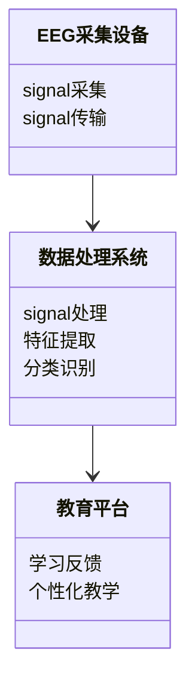

                 


# 巴菲特-芒格的脑机接口教育平台投资：认知增强的学习革命

> 关键词：脑机接口，教育平台，认知增强，巴菲特，芒格，投资理念，算法原理，系统架构

> 摘要：本文探讨了巴菲特和芒格的投资理念如何与脑机接口技术相结合，推动认知增强的学习革命。通过分析脑机接口的核心技术、算法原理、系统架构及项目实战，展示了其在教育领域的广泛应用和巨大潜力。

---

## 第一部分: 背景与概述

### 第1章: 脑机接口技术与巴菲特-芒格投资理念的结合

#### 1.1 脑机接口技术的基本概念

脑机接口（Brain-Computer Interface，BCI）是一种通过采集和解析大脑神经信号，将人类意图转化为计算机指令的技术。其核心在于理解大脑活动并将其转化为可操作的信号，从而实现人与机器的直接交互。

**1.1.1 脑机接口的基本定义**

- 脑机接口：通过采集和分析大脑神经信号，将人类意图转化为计算机指令的技术。
- 神经信号采集：通过电极或传感器捕捉大脑电信号，如EEG（脑电图）。
- 数据处理：将采集到的信号转化为可识别的模式，用于控制外部设备或触发特定行为。

**1.1.2 脑机接口的核心技术原理**

- 信号采集：使用EEG帽采集大脑电信号。
- 信号处理：通过滤波、特征提取等步骤处理原始信号。
- 信号分类：利用机器学习算法识别特定脑电特征，如注意力集中、情绪波动等。

**1.1.3 脑机接口在教育领域的应用潜力**

- 提高学习效率：通过实时监测大脑活动，优化学习策略。
- 增强注意力：帮助学生集中注意力，提升学习效果。
- 个性化学习：根据大脑反馈调整教学内容，实现因材施教。

**1.2 巴菲特与芒格的投资理念**

- 巴菲特的价值投资理论：长期投资优质资产，注重内在价值。
- 芒格的多元思维模型：通过跨学科思考，寻找投资机会。
- 投资理念与脑机接口教育平台的结合：将长期价值与技术创新相结合，推动教育领域的发展。

**1.3 脑机接口教育平台的定义与目标**

- 教育平台：整合脑机接口技术，提供智能化学习工具。
- 认知增强：通过实时反馈优化学习过程，提升认知能力。
- 平台目标：实现个性化、高效化、精准化的学习体验，推动教育公平。

---

### 第2章: 脑机接口教育平台的背景与问题分析

#### 2.1 当前教育领域的痛点

- 学习效率低下：传统教学方式难以满足个性化需求。
- 学生注意力分散：课堂注意力难以集中，影响学习效果。
- 个性化学习需求未被满足：学生个体差异大，统一教学难以覆盖所有需求。

#### 2.2 脑机接口技术如何解决教育问题

- 提高学习效率：通过实时反馈优化学习策略。
- 增强学生注意力：通过脑机接口监测注意力变化，提醒学生集中精力。
- 实现个性化学习：根据大脑反馈调整教学内容，满足个体需求。

#### 2.3 脑机接口教育平台的边界与外延

- 技术边界：基于EEG信号的采集和分析，支持注意力、情绪监测。
- 应用边界：应用于K-12教育、职业教育等领域，提供个性化学习工具。
- 社会与伦理边界：关注数据隐私、伦理问题，确保技术应用的可持续性。

#### 2.4 脑机接口教育平台的概念结构

- 核心要素：EEG采集设备、数据处理系统、学习平台、反馈机制。
- 要素关系：设备采集数据，系统处理并分析，平台根据反馈调整教学策略。
- 概念结构图：展示各要素之间的关系，形成完整的教育平台系统。

---

## 第二部分: 核心概念与技术原理

### 第3章: 脑机接口的核心技术原理

#### 3.1 脑机接口的工作原理

**3.1.1 神经信号的采集与处理**

- 数据采集：使用EEG帽采集大脑电信号，频率范围通常在1Hz到50Hz之间。
- 信号处理：通过滤波（如带通滤波器）和降噪处理，提取有用的脑电信号。

**3.1.2 信号的特征提取**

- 特征选择：提取有用的EEG特征，如功率谱密度、时域特征、频域特征。
- 特征提取方法：使用小波分析、经验模态分解等方法提取特征。

**3.1.3 信号的分类与识别**

- 分类算法：使用支持向量机（SVM）、随机森林（Random Forest）等算法进行分类。
- 分类任务：识别注意力集中状态、情绪状态等。

#### 3.2 脑机接口与教育平台的结合

**3.2.1 脑机接口在教育中的应用场景**

- 实时监测学生注意力：通过EEG信号监测学生注意力集中程度，提醒教师调整教学节奏。
- 个性化学习反馈：根据学生大脑活动，调整教学内容和节奏，实现个性化教学。
- 提高学习效果：通过实时反馈优化学习策略，提升学习效率。

#### 3.2.2 教育平台的核心功能

- 数据采集：实时采集学生EEG数据。
- 数据处理：分析EEG信号，提取特征并分类。
- 平台反馈：根据分析结果，提供个性化学习建议。

#### 3.2.3 脑机接口算法的优化

- 提高分类准确率：通过深度学习算法（如卷积神经网络）优化分类性能。
- 实时性优化：减少计算延迟，提升用户体验。
- 稳定性优化：提高设备的抗干扰能力，确保数据采集的准确性。

---

## 第三部分: 算法原理

### 第4章: 脑机接口算法的实现

#### 4.1 基于EEG信号的特征提取算法

**4.1.1 基于小波分析的特征提取**

- 小波分析：通过小波变换提取EEG信号的时频特征。
- 代码示例：

```python
import numpy as np
from scipy import signal

def compute EEGfeatures(eeg_signal):
    # 小波变换
    scales = np.arange(1, 33)
    wavelet = 'mexican'
    coeffs, freqs = signal.cwt(eeg_signal, wavelet, scales)
    # 提取特征
    max_coeff = np.max(abs(coeffs), axis=1)
    mean_coeff = np.mean(abs(coeffs), axis=1)
    return max_coeff, mean_coeff
```

**4.1.2 基于经验模态分解的特征提取**

- 经验模态分解：将信号分解为本征模态函数（IMF），提取特征。
- 代码示例：

```python
import numpy as np
from scipy import signal

def compute EEGfeatures(eeg_signal):
    # 经验模态分解
    imfs = signal.emd(eeg_signal)
    # 提取特征
    max_imf = np.max(imfs, axis=1)
    mean_imf = np.mean(imfs, axis=1)
    return max_imf, mean_imf
```

#### 4.2 基于机器学习的信号分类算法

**4.2.1 支持向量机（SVM）分类**

- 使用SVM进行EEG信号分类，识别注意力状态。
- 代码示例：

```python
from sklearn import svm

def svm_classifier(X_train, y_train, X_test):
    # 训练SVM模型
    clf = svm.SVC()
    clf.fit(X_train, y_train)
    # 预测测试集
    y_pred = clf.predict(X_test)
    return y_pred
```

**4.2.2 深度学习模型的应用**

- 使用卷积神经网络（CNN）进行EEG信号分类。
- 代码示例：

```python
import tensorflow as tf
from tensorflow.keras import layers

def cnn_model(input_shape):
    model = tf.keras.Sequential()
    model.add(layers.Conv2D(32, (1, 4), activation='relu', input_shape=input_shape))
    model.add(layers.MaxPooling2D(pool_size=(1, 2)))
    model.add(layers.Flatten())
    model.add(layers.Dense(128, activation='relu'))
    model.add(layers.Dense(2, activation='softmax'))
    return model
```

---

## 第四部分: 系统分析与架构设计

### 第5章: 脑机接口教育平台的系统架构

#### 5.1 系统功能设计

**5.1.1 领域模型设计**

- 领域模型：展示系统的主要功能模块及其关系。
- 使用Mermaid类图：



**5.1.2 功能模块划分**

- 数据采集模块：负责EEG信号的采集和传输。
- 数据处理模块：对信号进行预处理、特征提取和分类。
- 教育平台模块：根据分类结果提供个性化反馈。

#### 5.2 系统架构设计

**5.2.1 架构设计**

- 分层架构：分为采集层、处理层和应用层。
- 使用Mermaid架构图：


**5.2.2 接口设计**

- EEG采集设备接口：与数据处理系统的接口定义。
- 数据处理系统接口：与教育平台的接口定义。

#### 5.3 系统交互设计

**5.3.1 交互流程**

- 用户戴上EEG帽，开始学习。
- 系统采集EEG信号，传输到数据处理系统。
- 数据处理系统分析信号，分类结果反馈到教育平台。
- 教育平台根据反馈调整教学策略，向用户发送个性化建议。

---

## 第五部分: 项目实战

### 第6章: 脑机接口教育平台的实现

#### 6.1 环境安装与配置

**6.1.1 安装必要的库**

- Python版本：Python 3.8及以上。
- 安装库：numpy, scipy, scikit-learn, tensorflow, pymermaid。

**6.1.2 硬件配置**

- EEG采集设备：如OpenBCI或NeuroNode。
- 软件配置：安装并配置采集软件，如OpenBCI GUI。

#### 6.2 核心代码实现

**6.2.1 数据采集代码**

```python
import numpy as np
import pyqt

class EEGCollector:
    def __init__(self, sampling_rate=250):
        self.sampling_rate = sampling_rate
        self.data = []

    def start_collection(self):
        # 实现与EEG设备的通信，采集数据
        pass

    def stop_collection(self):
        # 停止采集
        pass
```

**6.2.2 数据处理代码**

```python
from sklearn import svm

class EEGProcessor:
    def __init__(self):
        self.clf = svm.SVC()

    def process_data(self, raw_data):
        # 特征提取
        features = self.extract_features(raw_data)
        # 分类
        prediction = self.clf.predict(features)
        return prediction

    def extract_features(self, raw_data):
        # 实现特征提取方法
        pass
```

#### 6.3 案例分析与结果展示

**6.3.1 案例分析**

- 实验设计：选取不同学生群体，测试系统效果。
- 数据分析：统计学习效率提升情况。

**6.3.2 结果展示**

- 使用图表展示学习效率提升情况。
- 展示分类准确率的变化。

#### 6.4 代码实现的注意事项

- 数据采集的稳定性：确保数据采集准确，避免干扰。
- 算法优化：持续优化分类算法，提高准确率。
- 用户体验：确保系统易于使用，界面友好。

---

## 第六部分: 最佳实践与总结

### 第7章: 脑机接口教育平台的优化与展望

#### 7.1 最佳实践

**7.1.1 技术优化**

- 提高数据采集的稳定性：优化硬件设计，减少干扰。
- 提升算法性能：引入深度学习模型，提高分类准确率。
- 实时性优化：优化数据处理流程，减少延迟。

**7.1.2 产品优化**

- 用户体验优化：设计友好的用户界面，提升用户体验。
- 功能扩展：增加更多学习工具，如虚拟现实教学。

#### 7.2 总结与展望

- 总结：脑机接口技术在教育领域的巨大潜力，认知增强学习的可能性。
- 展望：未来技术的发展方向，如AI与脑机接口的结合。

#### 7.3 注意事项

- 数据隐私：确保学生数据的安全性。
- 伦理问题：关注技术应用中的伦理问题，避免滥用。

#### 7.4 拓展阅读

- 推荐书籍：《深度学习》、《机器学习实战》。
- 推荐论文：相关领域的最新研究成果。

---

## 作者信息

作者：AI天才研究院/AI Genius Institute & 禅与计算机程序设计艺术/Zen And The Art of Computer Programming

联系方式：[contact@ai-genius.com](mailto:contact@ai-genius.com)

---

# 结语

脑机接口技术与巴菲特-芒格投资理念的结合，为教育领域带来了认知增强的革命。通过本文的详细分析，我们看到了这一技术在教育中的广泛应用和巨大潜力。未来，随着技术的不断进步，脑机接口教育平台将为学习者带来更加高效、个性化的学习体验。

