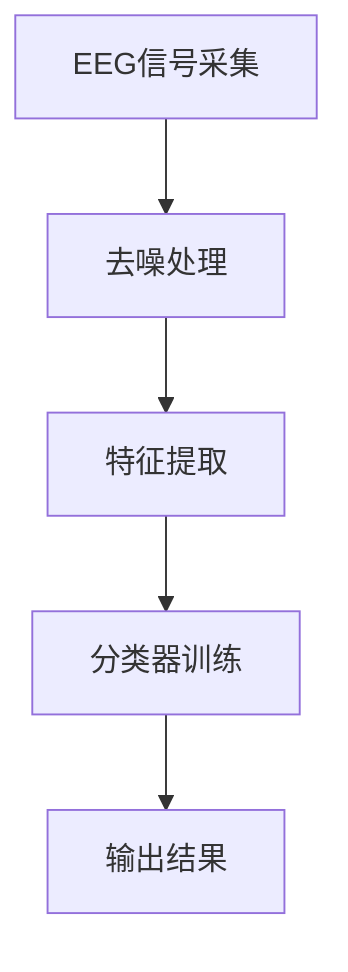
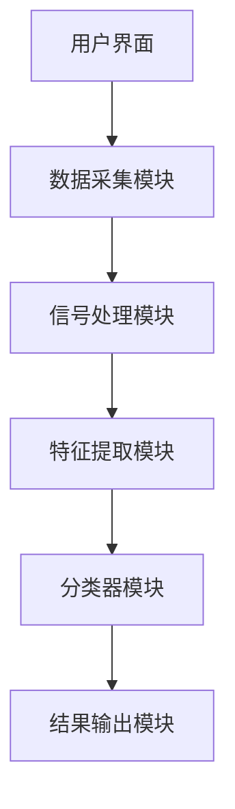

                 


# 巴菲特-芒格的脑机接口教育应用投资：学习革命的新前沿

> 关键词：脑机接口（BCI）、教育应用、巴菲特、芒格、投资分析、技术博客

> 摘要：本文探讨了脑机接口技术在教育领域的应用潜力，并结合巴菲特和芒格的投资理念，分析了该领域投资的机会与挑战。通过详细的技术分析和案例研究，本文为投资者和教育技术从业者提供了深刻的见解和实用的建议。

---

## 第1章：脑机接口技术的基本概念与教育应用背景

### 1.1 脑机接口技术的基本概念

#### 1.1.1 脑机接口的核心技术原理

脑机接口（Brain-Computer Interface，简称BCI）是一种通过采集、处理和分析脑电信号，将大脑意图转化为计算机可识别信号的技术。其核心步骤包括信号采集、预处理、特征提取和分类器设计。

- **信号采集**：通过 EEG 电极采集脑电信号。
- **预处理**：去除噪声，提取有用信号。
- **特征提取**：提取信号特征，如功率谱、时域特征。
- **分类器设计**：利用机器学习算法对特征进行分类。

#### 1.1.2 教育领域的应用潜力

脑机接口技术在教育领域的应用潜力巨大，尤其是在个性化学习、注意力监测和认知评估方面。通过实时监测学生的脑电信号，教育系统可以动态调整教学策略，优化学习效果。

---

## 第2章：脑机接口的核心算法与数学模型

### 2.1 脑电信号处理算法

#### 2.1.1 常见脑电信号特征提取方法

- **频域特征**：如功率谱密度（PSD）。
- **时域特征**：如均值、标准差。
- **时频域特征**：如小波变换。

#### 2.1.2 信号处理流程图

以下是信号处理流程图：



#### 2.1.3 算法实现代码示例

以下是一个简单的脑电信号处理代码示例：

```python
import numpy as np
from scipy.signal import butterworth

def preprocess_eeg(eeg_data, fs):
    # 去噪处理
    cutoff = 50
    order = 5
    b, a = butterworth(cutoff, order, fs)
    filtered_data = np.convolve(eeg_data, a, mode='same')
    return filtered_data

# 示例数据
eeg_data = np.random.randn(1000)
fs = 250  # 采样频率
filtered_data = preprocess_eeg(eeg_data, fs)
print(filtered_data)
```

---

## 第3章：脑机接口在教育中的应用

### 3.1 学习者特征分析

#### 3.1.1 个性化学习策略

通过分析学习者的脑电信号，教育系统可以实时调整教学内容的难度，优化学习路径。

#### 3.1.2 注意力监测与提升

脑机接口技术可以实时监测学生的注意力水平，并通过调整教学内容来提高学习效果。

---

## 第4章：巴菲特和芒格的价值投资理念

### 4.1 巴菲特的价值投资理论

巴菲特强调长期投资、安全边际和企业内在价值。在脑机接口教育应用领域，这些原则同样适用。

### 4.2 芒格的多元思维模型

芒格的多元思维模型强调跨学科思考，这对于分析脑机接口技术的投资机会至关重要。

---

## 第5章：脑机接口教育应用的投资分析

### 5.1 市场分析与竞争评估

分析当前市场现状，评估主要竞争对手的技术和商业模式。

### 5.2 投资策略与风险管理

制定合理的投资策略，评估潜在风险并制定应对措施。

---

## 第6章：项目实战

### 6.1 环境搭建与系统设计

#### 6.1.1 系统架构设计

以下是系统架构设计图：



### 6.1.2 代码实现与案例分析

以下是一个简单的系统实现代码：

```python
import numpy as np
from sklearn.svm import SVC

def train_classifier(features, labels):
    # 训练分类器
    clf = SVC()
    clf.fit(features, labels)
    return clf

# 示例数据
features = np.random.randn(100, 10)
labels = np.random.randint(0, 2, 100)

clf = train_classifier(features, labels)
print(clf.predict(features[:5]))
```

---

## 第7章：未来展望与挑战

### 7.1 技术发展与投资机会

探讨脑机接口技术的未来发展趋势，分析潜在的投资机会。

### 7.2 教育领域的挑战与解决方案

分析当前教育领域应用中的挑战，并提出可行的解决方案。

---

## 第8章：结论与建议

### 8.1 总结

总结全文，强调脑机接口技术在教育领域的巨大潜力，以及投资机会。

### 8.2 投资建议

为投资者提供具体的建议，包括技术分析、市场趋势和风险管理。

---

## 作者：AI天才研究院/AI Genius Institute & 禅与计算机程序设计艺术 /Zen And The Art of Computer Programming

