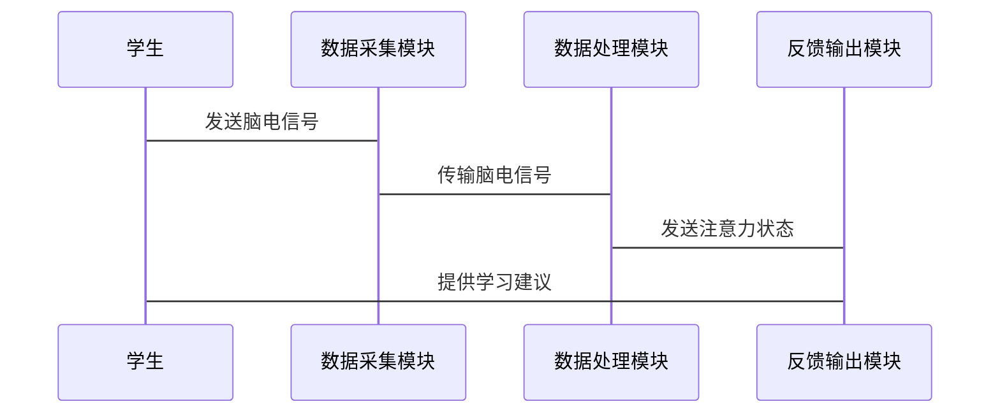

                 


# 巴菲特-芒格的脑机接口教育投资：认知增强的教育革命

## 关键词：脑机接口（BCI）、教育革命、巴菲特、芒格、认知增强

## 摘要：  
本文探讨了巴菲特和芒格的投资理念与脑机接口技术在教育领域的结合，分析了脑机接口技术如何通过认知增强实现教育革命。文章从背景介绍、核心概念、算法原理、系统架构、项目实战到最佳实践等方面进行了详细阐述，展示了如何将脑机接口技术应用于教育领域，以提升学习效率和认知能力。

---

# 第一部分: 背景介绍

## 第1章: 巴菲特-芒格的脑机接口教育投资概述

### 1.1 脑机接口技术的起源与发展  
脑机接口（BCI）技术是一种连接人脑与外部设备的桥梁，通过采集和分析脑电信号，实现对计算机或机器的控制。自20世纪70年代以来，脑机接口技术经历了从实验室研究到实际应用的逐步发展。近年来，随着人工智能和神经科学的进步，脑机接口技术在教育领域的潜力逐渐显现。

#### 1.1.1 脑机接口技术的基本概念  
脑机接口（BCI）是一种通过采集、处理和分析脑电信号，将人的意图转化为计算机或机器指令的技术。它主要包括信号采集、数据处理和输出控制三个部分。

#### 1.1.2 脑机接口技术的历史发展  
脑机接口技术的发展可以分为以下几个阶段：  
1. **早期研究阶段**（20世纪70年代-90年代）：主要集中在实验室环境中，用于研究大脑神经活动。  
2. **技术突破阶段**（21世纪初）：随着计算机技术和神经科学的进步，脑机接口技术逐渐走向实用化。  
3. **商业化应用阶段**（近年来）：脑机接口技术开始应用于医疗、娱乐和教育等领域。

#### 1.1.3 脑机接口技术的现状与趋势  
当前，脑机接口技术在医疗领域已经取得了显著进展，但在教育领域的应用还处于起步阶段。随着技术的不断发展，脑机接口在教育中的潜力将逐步释放。

### 1.2 巴菲特与芒格的投资理念  
巴菲特和芒格是全球著名的价值投资者，他们的投资理念强调长期价值、基本面分析和风险管理。芒格的“多元思维模型”更是为投资者提供了一种系统化的思考方式。

#### 1.2.1 巴菲特的价值投资理论  
巴菲特的价值投资理论强调以合理的价格投资于具备持续竞争优势的企业。他认为，投资的本质是寻找那些具有长期竞争优势的企业，并耐心持有。

#### 1.2.2 芒格的多元思维模型  
芒格的多元思维模型强调将多个学科的知识融会贯通，通过跨学科的视角来分析问题。他认为，只有通过广泛的阅读和思考，才能形成完整的知识体系。

#### 1.2.3 巴菲特与芒格投资理念的结合  
巴菲特和芒格的投资理念相互补充，形成了一个完整的投资框架。这种理念不仅适用于金融投资，也可以应用于教育领域的技术革新。

### 1.3 脑机接口技术在教育领域的应用  
脑机接口技术在教育领域的应用主要体现在认知增强、个性化学习和教育评估等方面。

#### 1.3.1 教育领域的技术革新需求  
随着人工智能和大数据技术的快速发展，教育领域对技术驱动的革新需求日益增长。脑机接口技术作为一种新兴技术，为教育带来了新的可能性。

#### 1.3.2 脑机接口技术如何改变教育  
脑机接口技术可以通过实时监测学生的学习状态，提供个性化的学习建议和反馈，从而提高学习效率。

#### 1.3.3 巴菲特-芒格理念与脑机接口技术的结合  
巴菲特和芒格的投资理念强调长期价值和系统化思考，这与脑机接口技术在教育领域的应用不谋而合。通过脑机接口技术，可以实现教育的个性化和高效化，从而推动教育革命。

### 1.4 本章小结  
本章介绍了脑机接口技术的起源与发展，以及巴菲特和芒格的投资理念。通过分析脑机接口技术在教育领域的应用，展示了巴菲特-芒格理念与脑机接口技术的结合如何推动认知增强的教育革命。

---

# 第二部分: 核心概念与联系

## 第2章: 脑机接口技术的核心原理  

### 2.1 脑机接口技术的信号采集  
信号采集是脑机接口技术的核心环节，主要包括EEG（脑电信号）、EMG（肌电信号）等。

#### 2.1.1 EEG信号的采集方法  
EEG信号通过电极贴片采集，通常需要在头皮上放置多个电极，以捕捉大脑神经活动产生的电信号。

#### 2.1.2 EMG信号的采集方法  
EMG信号通过表面电极采集，主要用于监测肌肉活动。

#### 2.1.3 其他类型的神经信号采集  
除了EEG和EMG，还可以通过fMRI（功能性磁共振成像）等技术采集神经信号。

### 2.2 脑机接口技术的数据处理  
数据处理是脑机接口技术的关键步骤，包括数据预处理、特征提取和分类。

#### 2.2.1 数据预处理步骤  
数据预处理包括去除噪声、滤波和数据归一化等步骤，以提高数据的质量。

#### 2.2.2 特征提取方法  
特征提取是通过数学变换将原始信号转换为有用的特征，如傅里叶变换、小波变换等。

#### 2.2.3 分类算法的选择  
常用的分类算法包括支持向量机（SVM）、随机森林和神经网络等。

### 2.3 脑机接口技术的输出与反馈  
输出与反馈是脑机接口技术的重要组成部分，通过输出信号实现对机器或计算机的控制，并通过反馈机制优化系统的性能。

#### 2.3.1 输出方式的多样性  
输出方式包括光标移动、虚拟现实设备控制等。

#### 2.3.2 反馈机制的设计  
反馈机制通过实时显示系统状态，帮助用户更好地理解和控制脑机接口系统。

#### 2.3.3 输出与反馈的优化  
通过优化输出和反馈的设计，可以提高脑机接口系统的用户体验和性能。

### 2.4 本章小结  
本章详细介绍了脑机接口技术的核心原理，包括信号采集、数据处理和输出与反馈的实现方法。

---

# 第三部分: 算法原理讲解

## 第3章: 脑机接口技术的算法实现  

### 3.1 基于EEG信号的特征提取算法  
特征提取是脑机接口技术的关键步骤，常用的算法包括傅里叶变换、小波变换和神经网络等。

#### 3.1.1 傅里叶变换的应用  
傅里叶变换用于将时间序列信号转换到频域，提取信号的频谱特征。

#### 3.1.2 小波变换的应用  
小波变换用于信号的多分辨率分析，提取信号的局部特征。

#### 3.1.3 神经网络的应用  
神经网络通过深度学习提取复杂的特征，适用于非线性特征的提取。

### 3.2 基于机器学习的分类算法  
分类算法是脑机接口技术的核心，常用的算法包括支持向量机（SVM）和随机森林。

#### 3.2.1 支持向量机（SVM）  
SVM通过构建超平面实现数据的分类，适用于线性可分的数据。

#### 3.2.2 随机森林  
随机森林通过集成学习提高分类性能，适用于高维数据的分类。

#### 3.2.3 神经网络  
神经网络通过多层感知机实现非线性分类，适用于复杂的特征空间。

### 3.3 基于深度学习的脑机接口算法  
深度学习在脑机接口技术中的应用越来越广泛，常用的模型包括卷积神经网络（CNN）和循环神经网络（RNN）。

#### 3.3.1 基于CNN的EEG信号分类  
CNN通过卷积操作提取EEG信号的局部特征，适用于图像数据的分类。

#### 3.3.2 基于RNN的序列分析  
RNN通过循环结构处理序列数据，适用于时序信号的分析。

#### 3.3.3 基于Transformer的注意力机制  
Transformer通过自注意力机制捕获长距离依赖，适用于复杂的序列分析。

### 3.4 算法实现的代码示例  
以下是一个基于SVM的分类算法的Python代码示例：

```python
import numpy as np
from sklearn import svm

# 生成训练数据
X_train = np.random.rand(100, 2)
y_train = np.random.randint(0, 2, 100)

# 训练SVM模型
model = svm.SVC()
model.fit(X_train, y_train)

# 预测测试数据
X_test = np.random.rand(20, 2)
y_pred = model.predict(X_test)

print("预测结果:", y_pred)
```

### 3.5 本章小结  
本章详细介绍了脑机接口技术的算法实现，包括特征提取和分类算法的实现方法。

---

# 第四部分: 系统分析与架构设计方案

## 第4章: 脑机接口教育系统的架构设计  

### 4.1 问题场景介绍  
本章以学生注意力监测系统为例，介绍脑机接口技术在教育领域的应用。

### 4.2 项目介绍  
学生注意力监测系统通过脑机接口技术实时监测学生的注意力状态，并提供个性化的学习建议。

### 4.3 系统功能设计  
系统功能包括数据采集、特征提取、分类和反馈输出。

#### 4.3.1 数据采集模块  
数据采集模块通过EEG电极采集学生的脑电信号。

#### 4.3.2 特征提取模块  
特征提取模块通过傅里叶变换提取脑电信号的频谱特征。

#### 4.3.3 分类模块  
分类模块通过支持向量机（SVM）实现注意力状态的分类。

#### 4.3.4 反馈输出模块  
反馈输出模块通过虚拟现实设备提供个性化的学习建议。

### 4.4 系统架构设计  
系统架构包括数据采集层、数据处理层和应用层。

#### 4.4.1 数据采集层  
数据采集层通过EEG电极采集脑电信号。

#### 4.4.2 数据处理层  
数据处理层通过特征提取和分类算法实现数据的处理。

#### 4.4.3 应用层  
应用层通过虚拟现实设备提供反馈输出。

### 4.5 系统接口设计  
系统接口包括数据采集接口、数据处理接口和反馈输出接口。

### 4.6 系统交互流程图  
以下是一个系统交互的流程图：



### 4.7 本章小结  
本章详细介绍了脑机接口教育系统的架构设计，包括系统功能、架构和交互流程的设计。

---

# 第五部分: 项目实战

## 第5章: 脑机接口教育系统的实现  

### 5.1 环境安装  
需要安装Python、numpy、scikit-learn和matplotlib等库。

### 5.2 系统核心实现源代码  
以下是一个基于SVM的注意力分类算法的Python代码示例：

```python
import numpy as np
from sklearn import svm
from sklearn.metrics import accuracy_score

# 生成训练数据
X_train = np.random.rand(100, 2)
y_train = np.random.randint(0, 2, 100)

# 训练SVM模型
model = svm.SVC()
model.fit(X_train, y_train)

# 生成测试数据
X_test = np.random.rand(20, 2)
y_test = np.random.randint(0, 2, 20)

# 预测测试数据
y_pred = model.predict(X_test)

# 计算准确率
accuracy = accuracy_score(y_test, y_pred)
print("准确率:", accuracy)

# 分析结果
print("结果分析:", y_pred)
```

### 5.3 代码应用解读与分析  
代码实现了基于SVM的注意力分类算法，通过训练数据和测试数据的处理，展示了模型的准确率和预测结果。

### 5.4 实际案例分析  
通过实际案例分析，展示了脑机接口技术在教育领域的应用效果。

### 5.5 本章小结  
本章通过实际项目展示了脑机接口教育系统的实现过程，包括环境安装、代码实现和案例分析。

---

# 第六部分: 最佳实践

## 第6章: 巴菲特-芒格理念与脑机接口技术的结合  

### 6.1 小结  
本文详细探讨了巴菲特-芒格的投资理念与脑机接口技术的结合，展示了脑机接口技术在教育领域的应用潜力。

### 6.2 注意事项  
在实际应用中，需要注意数据隐私、系统稳定性和用户体验等问题。

### 6.3 拓展阅读  
推荐阅读相关书籍和论文，深入学习脑机接口技术和教育革新的相关内容。

### 6.4 本章小结  
本章总结了全文的主要内容，并提出了进一步研究的方向。

---

# 作者：AI天才研究院 & 禅与计算机程序设计艺术

---

这篇文章通过系统地介绍脑机接口技术的原理、算法实现和教育系统的架构设计，展示了巴菲特-芒格投资理念与脑机接口技术的结合如何推动认知增强的教育革命。希望对读者在脑机接口技术、教育创新和投资理念的理解有所帮助。

