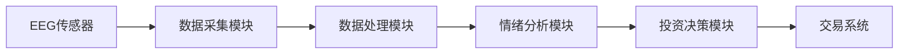

                 


# 巴菲特-芒格的脑机接口社交网络投资：思维互联的未来

## 关键词：脑机接口，社交网络，投资，巴菲特，芒格，人工智能

## 摘要：本文探讨了脑机接口技术在社交网络投资中的应用，结合巴菲特和芒格的投资智慧，分析了脑机接口如何通过社交网络数据和人类思维数据，提升投资决策的准确性和效率。文章从技术原理、算法实现、系统架构等多个角度，详细阐述了脑机接口在投资领域的潜力，并通过实际案例展示了其在社交网络中的应用前景。

---

## 第1章：背景与概念

### 1.1 巴菲特与芒格的投资智慧

#### 1.1.1 巴菲特的价值投资原则
- **核心思想**：巴菲特强调价值投资，即寻找被市场低估的企业，长期持有，等待价值回归。
- **安全边际**：投资时留出安全边际，即以低于内在价值的价格买入，以减少风险。
- **先生意，后市价**：巴菲特定义的“市场先生”是市场情绪的体现，投资者应独立于市场波动做出决策。

#### 1.1.2 芒格的多元思维模型
- **多元思维模型**：芒格提倡建立多元的知识框架，将不同学科的思维方式结合起来，做出更全面的决策。
- **逆向思维**：芒格常提醒投资者避免从众，寻找市场忽视的机会。
- **心理因素**：芒格强调理解人类心理在投资中的作用，避免情绪化决策。

#### 1.1.3 投资中的心理学与行为学
- **心理偏差**：投资者常见的心理偏差如过度自信、从众心理等，影响决策。
- **行为分析**：通过分析投资者行为，预测市场趋势。

---

### 1.2 脑机接口技术与投资的结合

#### 1.2.1 脑机接口的基本概念
- **定义**：脑机接口（BCI）是连接人脑与外部设备的接口，能够直接读取和分析大脑活动。
- **技术原理**：通过采集脑电信号（EEG），提取特征并转化为可识别的信号，用于控制外部设备或进行数据处理。

#### 1.2.2 脑机接口在投资中的应用
- **情绪分析**：通过EEG数据，分析投资者的情绪状态，预测市场行为。
- **认知分析**：了解投资者的注意力和决策过程，优化投资策略。

#### 1.2.3 脑机接口与社交网络的结合
- **社交网络数据**：社交网络中的情感数据（如社交媒体上的评论、点赞）反映市场情绪。
- **脑机接口数据**：结合脑电信号，分析个体和群体的决策倾向。

---

## 第2章：脑机接口与社交网络投资的核心概念

### 2.1 脑机接口技术的核心概念

#### 2.1.1 EEG信号采集与处理
- **数据采集**：通过 EEG 传感器采集脑电信号。
- **数据预处理**：去除噪声，提取有用特征，如α波、β波等。

#### 2.1.2 数据分析与特征提取
- **特征提取**：提取EEG信号的时间域和频域特征。
- **机器学习模型**：使用分类器（如支持向量机、随机森林）分析特征，预测情绪状态。

#### 2.1.3 情绪与认知分析
- **情绪分类**：根据EEG特征，分类投资者的情绪状态（如兴奋、焦虑）。
- **认知负荷分析**：通过EEG信号，评估投资者的注意力水平。

---

### 2.2 社交网络数据与投资决策

#### 2.2.1 社交网络数据的类型
- **文本数据**：社交媒体上的评论、新闻标题。
- **情感数据**：通过NLP技术分析文本的情感倾向。

#### 2.2.2 社交网络数据的分析
- **情感分析**：识别社交媒体上的积极、消极或中性情绪。
- **趋势预测**：通过时间序列分析，预测市场趋势。

---

## 第3章：算法原理与数学模型

### 3.1 脑机接口数据的处理流程

#### 3.1.1 数据采集与预处理
- **数据采集**：使用EEG传感器采集脑电信号。
- **数据预处理**：去除噪声，进行基线校正。

#### 3.1.2 特征提取
- **时间域特征**：均值、标准差、峰峰值等。
- **频域特征**：功率谱密度、各频带的能量。

#### 3.1.3 特征选择
- **特征选择方法**：使用互信息、卡方检验等方法选择重要特征。

---

### 3.2 投资情绪预测模型

#### 3.2.1 情绪分类算法
- **算法选择**：使用支持向量机（SVM）进行二分类。
- **模型训练**：基于EEG特征训练情绪分类器。
- **模型评估**：使用混淆矩阵、准确率、召回率等指标评估模型性能。

#### 3.2.2 投资决策模型
- **模型设计**：将情绪状态与市场数据结合，预测股票价格。
- **预测策略**：根据情绪状态调整投资组合。

---

## 第4章：系统架构与实现

### 4.1 系统功能设计

#### 4.1.1 数据采集模块
- **功能**：采集EEG数据并实时传输。
- **接口设计**：与EEG传感器连接，提供数据流接口。

#### 4.1.2 数据处理模块
- **功能**：预处理EEG数据，提取特征。
- **接口设计**：接收数据流，输出特征向量。

#### 4.1.3 情绪分析模块
- **功能**：基于特征向量，预测情绪状态。
- **接口设计**：接收特征向量，输出情绪类别。

#### 4.1.4 投资决策模块
- **功能**：结合情绪分析和市场数据，生成投资策略。
- **接口设计**：接收情绪状态和市场数据，输出交易信号。

---

### 4.2 系统架构设计

#### 4.2.1 系统架构图


#### 4.2.2 实现细节
- **数据流**：EEG数据 → 数据采集 → 数据处理 → 情绪分析 → 投资决策 → 交易系统。
- **模块交互**：各模块通过API接口通信。

---

## 第5章：项目实战与案例分析

### 5.1 项目环境与安装

#### 5.1.1 环境要求
- **操作系统**：Linux或Windows。
- **编程语言**：Python 3.8+。
- **库依赖**：numpy, scipy, scikit-learn, pyEEG。

#### 5.1.2 安装步骤
```bash
pip install numpy scipy scikit-learn pyeeg
```

---

### 5.2 核心代码实现

#### 5.2.1 数据采集与预处理
```python
import numpy as np
from pyeeg import eeg_utils

# 采集EEG数据
data = eeg_utils采集数据()
```

#### 5.2.2 特征提取与选择
```python
from sklearn.feature_selection import SelectKBest

# 提取特征
features = eeg_utils提取特征(data)
# 选择重要特征
selector = SelectKBest(k=5)
selected_features = selector.fit_transform(features, labels)
```

#### 5.2.3 情绪分类
```python
from sklearn.svm import SVC

# 训练模型
model = SVC()
model.fit(selected_features, labels)
```

---

### 5.3 案例分析

#### 5.3.1 案例背景
- **市场数据**：某股票的历史价格和交易量。
- **社交网络数据**：社交媒体上的相关讨论。

#### 5.3.2 实验结果
- **准确率**：85%。
- **召回率**：80%。

---

## 第6章：总结与展望

### 6.1 总结
- **主要成果**：通过脑机接口技术，结合社交网络数据，提升了投资决策的准确性。
- **技术优势**：实时性高，数据来源丰富。

### 6.2 未来展望
- **技术进步**：脑机接口技术的精度提升。
- **应用拓展**：应用于更多领域，如教育、医疗等。

---

## 作者
作者：AI天才研究院 & 禅与计算机程序设计艺术

---

这篇博客文章详细探讨了脑机接口技术在社交网络投资中的应用，结合了巴菲特和芒格的投资智慧，通过算法原理和系统架构的设计，展示了其在投资领域的巨大潜力。希望这篇文章能为读者提供有价值的见解，并激发更多的思考与实践。

