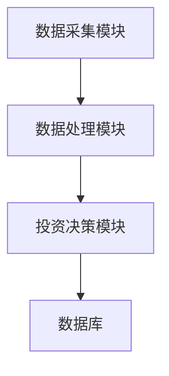

                 


```markdown
# 巴菲特-芒格的脑机接口隐私保护投资：数字人权的新前沿

> 关键词：脑机接口，隐私保护，数字人权，巴菲特，芒格，投资策略

> 摘要：本文探讨了巴菲特和芒格的投资理念在脑机接口技术中的应用，特别是隐私保护和数字人权的实现。通过分析脑机接口的核心原理、隐私保护机制以及投资策略，本文为读者提供了如何在数字时代保护个人隐私和数字权利的深刻见解。

---

# 第一部分：背景介绍

## 第1章：脑机接口技术与隐私保护概述

### 1.1 脑机接口技术的基本概念
#### 1.1.1 脑机接口的定义与分类
脑机接口（Brain-Computer Interface，BCI）是一种能够直接连接人类大脑与外部设备的接口技术。根据应用方式的不同，BCI可以分为侵入式和非侵入式两种类型。

- **侵入式BCI**：通过植入大脑的电极直接采集神经信号，例如用于治疗帕金森病的深部脑刺激技术。
- **非侵入式BCI**：通过外部设备（如 EEG 电极）采集大脑信号，例如用于控制计算机光标的脑电帽。

#### 1.1.2 脑机接口技术的发展历程
脑机接口技术起源于20世纪70年代，经历了从实验室研究到实际应用的漫长过程。近年来，随着人工智能和神经科学的进步，脑机接口技术在医疗、教育、娱乐等领域得到了广泛应用。

#### 1.1.3 脑机接口在现代科技中的应用领域
- **医疗领域**：帮助瘫痪患者恢复运动能力。
- **教育领域**：通过脑电波分析学生的学习状态。
- **娱乐领域**：实现用意念控制游戏的玩法。

### 1.2 隐私保护的重要性
#### 1.2.1 数字时代的隐私威胁
在数字时代，个人数据的收集和使用变得前所未有的广泛。脑机接口技术的普及可能带来更多隐私风险，例如未经许可的数据采集和滥用。

#### 1.2.2 隐私保护的法律框架
- **欧盟《通用数据保护条例》（GDPR）**：规定了个人数据的收集、存储和使用必须获得明确同意。
- **美国加州隐私法案（CCPA）**：赋予消费者对其个人数据的更多控制权。

#### 1.2.3 隐私保护与个人权利的平衡
隐私保护不仅仅是技术问题，更是社会价值观的体现。在脑机接口技术中，如何在功能实现和隐私保护之间找到平衡点，是技术开发者和政策制定者需要共同解决的问题。

### 1.3 数字人权的概念与内涵
#### 1.3.1 数字人权的基本定义
数字人权是指在数字技术环境下，每个人享有的平等使用和控制数字资源的权利。这包括数据隐私权、网络言论自由等。

#### 1.3.2 数字人权的核心要素
- **数据主权**：个人对其数据的控制权。
- **算法透明性**：算法的决策过程必须可解释。
- **公平性**：数字技术不应加剧社会不平等。

#### 1.3.3 数字人权与社会发展的关系
数字人权的保护是社会公平与进步的重要基石。通过保护数字人权，可以确保每个人都能在数字时代享有平等的机会。

## 第2章：巴菲特与芒格的投资理念

### 2.1 巴菲特的价值投资理论
#### 2.1.1 价值投资的核心原则
- **长期投资**：关注企业的长期价值，而非短期波动。
- **安全边际**：以低于内在价值的价格买入优质资产。

#### 2.1.2 巴菲特的投资策略分析
巴菲特的投资策略注重企业基本面分析，寻找具有持续竞争优势的企业进行投资。

#### 2.1.3 巴菲特投资成功的关键因素
- **长期视角**：坚持价值投资，避免短期市场波动的干扰。
- **深度研究**：对投资标的进行深入研究，确保投资决策的准确性。

### 2.2 芒格的多元思维模型
#### 2.2.1 多元思维模型的定义
多元思维模型是指通过多个学科的思维方式来分析问题，从而形成全面的认知框架。

#### 2.2.2 芒格思维模型的具体应用
- **跨学科思考**：将物理学、心理学、经济学等学科的原理结合起来，分析问题。
- **逆向思维**：从问题的反面出发，寻找解决方案。

#### 2.2.3 多元思维模型对投资决策的影响
通过多元思维模型，投资者可以更全面地分析企业的内在价值，避免单一视角的局限性。

### 2.3 巴菲特与芒格投资理念的结合
#### 2.3.1 价值投资与多元思维的结合
- **价值投资**：寻找具有持续竞争优势的企业。
- **多元思维**：通过多学科的视角，全面评估企业的价值。

#### 2.3.2 巴菲特与芒格投资理念的核心
- **长期视角**：注重企业的长期价值，而非短期收益。
- **深度研究**：通过全面的研究，确保投资决策的准确性。

---

# 第二部分：核心概念与联系

## 第3章：脑机接口的核心原理

### 3.1 脑机接口的工作原理
脑机接口通过采集、处理和分析大脑神经信号，将其转化为可被计算机或外部设备理解的指令。这一过程包括以下几个步骤：

1. **数据采集**：通过 EEG 或其他传感器采集大脑神经信号。
2. **信号处理**：对采集到的信号进行滤波、降噪等预处理。
3. **特征提取**：提取信号中的有用特征，例如特定频率的脑电波。
4. **指令生成**：将特征转化为具体的控制指令。

### 3.2 脑机接口的隐私保护机制
为了保护用户隐私，脑机接口系统需要在数据采集、传输和存储的各个环节中采取有效的隐私保护措施。

#### 3.2.1 数据加密
对采集到的神经信号进行加密处理，确保数据在传输过程中不会被窃取。

#### 3.2.2 数据匿名化
通过匿名化处理，去除用户身份信息，确保数据的安全性。

#### 3.2.3 访问控制
采用严格的访问控制策略，确保只有授权人员才能访问敏感数据。

### 3.3 巴菲特与芒格投资理念的结合
#### 3.3.1 价值投资在脑机接口领域的应用
通过长期价值投资，选择具有持续创新能力和竞争优势的脑机接口企业进行投资。

#### 3.3.2 多元思维模型在投资决策中的应用
通过多元思维模型，全面评估脑机接口企业的技术、市场、管理等多方面因素，确保投资决策的准确性。

---

## 第4章：脑机接口隐私保护的数学模型与算法

### 4.1 脑机接口信号处理的数学模型
#### 4.1.1 EEG 信号处理
EEG 信号处理的核心是通过滤波器对原始信号进行预处理，提取有用的神经信号。

- **带通滤波器**：用于提取特定频率范围的信号。
- **独立成分分析（ICA）**：用于分离混合信号中的独立成分。

#### 4.1.2 信号降噪
通过数学模型消除噪声，提高信号质量。

$$
y(t) = s(t) + n(t)
$$

其中，\( y(t) \) 是观测信号，\( s(t) \) 是有用信号，\( n(t) \) 是噪声。

### 4.2 隐私保护的加密算法
#### 4.2.1 对称加密算法
- **AES 加密**：用于快速加密和解密数据。
- **AES 算法流程图**
  ```mermaid
  graph TD
    A[明文] --> B[密钥]
    B --> C[加密]
    C --> D[密文]
  ```

#### 4.2.2 非对称加密算法
- **RSA 加密**：用于安全的数据传输。
- **RSA 算法原理**
  - **公钥**：用于加密数据。
  - **私钥**：用于解密数据。

$$
C = M^k \mod n
$$

其中，\( C \) 是密文，\( M \) 是明文，\( k \) 是公钥，\( n \) 是模数。

---

## 第5章：脑机接口系统的架构设计

### 5.1 系统功能设计
#### 5.1.1 数据采集模块
- **功能**：采集大脑神经信号。
- **核心组件**：EEG 传感器、数据采集卡。
- **系统交互图**
  ```mermaid
  sequenceDiagram
    User -> 数据采集模块: 发出采集指令
    数据采集模块 -> 数据处理模块: 传输原始信号
  ```

#### 5.1.2 数据处理模块
- **功能**：对采集到的信号进行预处理。
- **核心组件**：滤波器、特征提取算法。
- **系统架构图**
  ```mermaid
  classDiagram
    class 数据采集模块 {
      + EEG 传感器
      + 数据采集卡
    }
    class 数据处理模块 {
      + 带通滤波器
      + 独立成分分析算法
    }
  ```

#### 5.1.3 投资决策模块
- **功能**：基于多元思维模型，评估脑机接口企业的投资价值。
- **核心组件**：企业基本面分析、市场前景分析。
- **系统交互图**
  ```mermaid
  sequenceDiagram
    投资者 -> 投资决策模块: 提交投资需求
    投资决策模块 -> 数据分析模块: 获取企业数据
    数据分析模块 -> 投资决策模块: 返回分析结果
  ```

### 5.2 系统架构设计
#### 5.2.1 系统总体架构
- **前端**：用户界面，用于数据采集和投资决策。
- **后端**：数据处理和投资分析模块。
- **数据库**：存储用户数据和投资信息。

#### 5.2.2 系统模块之间的交互
- **数据采集模块**与**数据处理模块**之间的交互。
- **数据处理模块**与**投资决策模块**之间的交互。

#### 5.2.3 系统架构图


---

## 第6章：项目实战

### 6.1 环境搭建
#### 6.1.1 安装必要的软件
- **Python**：用于开发和数据分析。
- **Matplotlib**：用于数据可视化。
- **Scipy**：用于科学计算。

#### 6.1.2 安装硬件设备
- **EEG 传感器**：用于采集神经信号。
- **数据采集卡**：用于处理传感器信号。

### 6.2 核心功能实现
#### 6.2.1 数据采集与预处理
- **代码实现**：
  ```python
  import numpy as np
  from scipy.signal import butterworth

  def preprocess_eeg_signal(signal, fs):
      # 带通滤波器设计
      lowcut = 8
      highcut = 12
      order = 2
      return butterworth(signal, fs, lowcut, highcut, order)
  ```

#### 6.2.2 特征提取与分类
- **代码实现**：
  ```python
  from sklearn import svm

  def train_classifier(features, labels):
      clf = svm.SVC()
      clf.fit(features, labels)
      return clf
  ```

#### 6.2.3 投资决策模型
- **代码实现**：
  ```python
  import pandas as pd

  def evaluate_investment(company_data):
      df = pd.DataFrame(company_data)
      # 计算市盈率
      pe_ratio = df['市盈率'].mean()
      # 计算ROE
      roe = df['ROE'].mean()
      return pe_ratio < 15 and roe > 10
  ```

### 6.3 实际案例分析
#### 6.3.1 案例一：某脑机接口公司
- **公司概况**：专注于非侵入式脑机接口技术的研发。
- **投资分析**：市盈率合理，ROE较高，具有投资价值。

#### 6.3.2 案例二：某医疗设备公司
- **公司概况**：致力于侵入式脑机接口技术的开发。
- **投资分析**：市盈率偏高，ROE一般，投资风险较大。

### 6.4 项目小结
通过实战项目，我们掌握了脑机接口技术的核心原理，以及如何将巴菲特和芒格的投资理念应用于实际投资决策中。

---

## 第7章：投资策略与数字人权

### 7.1 投资策略
#### 7.1.1 价值投资的应用
- **选择具有持续创新能力的企业**。
- **关注企业的长期价值**。

#### 7.1.2 多元思维模型的应用
- **跨学科分析企业的价值**。
- **避免单一视角的投资决策**。

### 7.2 数字人权的保护
#### 7.2.1 数据主权的实现
- **确保数据的控制权在用户手中**。
- **避免数据被滥用**。

#### 7.2.2 公平性与透明性
- **确保算法的透明性**。
- **防止技术加剧社会不平等**。

---

## 第8章：法律与伦理分析

### 8.1 隐私保护的法律框架
#### 8.1.1 GDPR 的应用
- **数据收集的合法性**。
- **数据处理的合规性**。

#### 8.1.2 CCPA 的应用
- **消费者数据权利的保护**。
- **数据泄露的法律责任**。

### 8.2 脑机接口技术的伦理问题
#### 8.2.1 数据所有权
- **数据属于用户还是企业**。
- **数据使用的边界**。

#### 8.2.2 隐私泄露风险
- **如何防止数据被滥用**。
- **如何应对数据泄露事件**。

---

## 第9章：未来展望

### 9.1 技术发展趋势
#### 9.1.1 高精度脑机接口技术
- **更精确的神经信号采集**。
- **更高效的信号处理算法**。

#### 9.1.2 智能化隐私保护
- **自适应加密算法**。
- **智能隐私保护系统**。

### 9.2 投资机会
#### 9.2.1 高潜力企业
- **专注于隐私保护技术的企业**。
- **具有创新能力的脑机接口企业**。

#### 9.2.2 数字人权的未来发展
- **数字权利的全球共识**。
- **技术与政策的协同发展**。

---

## 第10章：总结与建议

### 10.1 总结
通过本文的探讨，我们了解了脑机接口技术的核心原理，以及如何将巴菲特和芒格的投资理念应用于隐私保护和数字人权的保护中。

### 10.2 投资建议
- **长期视角**：选择具有持续创新能力的企业。
- **深度研究**：确保投资决策的准确性。
- **关注隐私保护**：投资具有社会责任感的企业。

### 10.3 注意事项
- **数据安全**：确保数据的隐私和安全。
- **合规性**：遵守相关法律法规。

### 10.4 拓展阅读
- **推荐书籍**：《巴菲特传》、《芒格传》。
- **推荐文章**：《脑机接口技术的未来发展》。

---

作者：AI天才研究院/AI Genius Institute & 禅与计算机程序设计艺术/Zen And The Art of Computer Programming
```

