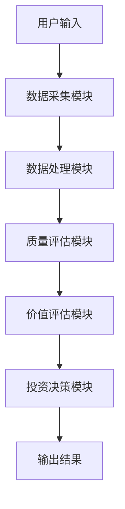

                 


# 巴菲特-芒格的质量优先原则：好公司vs便宜股票

> 关键词：巴菲特，芒格，质量优先，好公司，便宜股票，投资策略，价值投资

> 摘要：本文深入探讨了巴菲特和芒格提出的质量优先原则，分析了“好公司”与“便宜股票”的核心区别，并结合实际案例，详细阐述了如何通过质量优先原则在投资中实现长期稳健收益。文章从理论到实践，结合技术语言和专业分析，帮助读者理解并掌握这一投资策略。

---

## 第一部分：质量优先原则的背景与重要性

### 第1章：背景介绍

#### 1.1 价值投资的起源与发展
- 价值投资的起源可以追溯到本杰明·格雷厄姆和戴维·多德的学术研究。
- 巴菲特师承格雷厄姆，将价值投资的理念发扬光大。
- 芒格的加入为巴菲特的投资理念注入了新的思维方式，形成了独特的质量优先原则。

#### 1.2 巴菲特与芒格的投资哲学
- 巴菲特的“彼得林原则”：只投资自己理解的领域。
- 芒格的“格栅理论”：通过跨学科思考构建决策框架。
- 两人共同强调的长期主义和安全边际。

#### 1.3 质量优先原则的核心思想
- 质量优先原则的核心是选择优秀的公司，而不是仅仅关注价格。
- 通过长期持有优质资产，实现财富的稳健增长。

---

### 第2章：好公司与便宜股票的核心概念

#### 2.1 好公司的定义与特征
- **好公司**的定义：具有持续竞争优势、稳健财务状况和优秀管理团队的公司。
- 核心特征：
  - 竞争优势：护城河（如品牌、技术、成本优势）。
  - 财务健康：低负债率、高现金流、稳定的盈利能力。
  - 管理团队：管理层诚信、能力强，注重股东利益。

#### 2.2 便宜股票的定义与特征
- **便宜股票**的定义：价格低于内在价值的股票。
- 核心特征：
  - 低市盈率（P/E）：市盈率低于行业平均水平。
  - 低市净率（P/B）：市净率低于行业平均水平。
  - 高股息率：股息收益率远高于行业平均水平。

#### 2.3 好公司与便宜股票的关系
- 质量优先原则强调：选择好公司比选择便宜股票更重要。
- 动态平衡：好公司的价格波动可能带来便宜股票的机会。
- 长期收益分析：好公司通过持续增长，最终会体现在股价中。

---

### 第3章：质量优先原则的理论基础

#### 3.1 投资学的基本原理
- 资产定价理论：资产的价值取决于其未来现金流的现值。
- 股票估值方法：DCF模型（ discounted cash flow model）、市盈率、市净率等。
- 质量优先原则的理论支撑：基于公司质量的长期价值增长。

#### 3.2 质量优先原则的数学模型
- **公司质量评估的数学公式**：
  - 质量指数 = α × 竞争优势 + β × 财务健康 + γ × 管理团队
  - 其中，α、β、γ为权重系数，通常根据行业特点和具体情况进行调整。

- **股票价值的计算模型**：
  - 内在价值 = 现金流折现值 + 股东权益
  - 现金流折现值 = ∑(CF_t / (1 + r)^t)，其中r为折现率，CF_t为第t年的现金流。

- **质量与价格的量化关系分析**：
  - 质量指数与股价呈正相关关系。
  - 价格偏离内在价值时，质量高的公司更可能通过业绩增长回归合理价值。

---

### 第4章：巴菲特与芒格的投资策略

#### 4.1 巴菲特的投资策略
- **安全边际**：买入价格低于内在价值的股票，以降低风险。
- **竞争优势**：只投资具有护城河的公司，确保长期增长。
- **长期持有**：通过时间复利效应，实现财富增长。

#### 4.2 芒格的决策框架
- **格栅理论**：通过跨学科思考，构建决策框架。
- **逆向思维**：寻找市场忽视的机会。
- **避免情绪化决策**：基于理性分析做出投资决策。

#### 4.3 质量优先原则的实施步骤
1. 确定投资目标：明确投资期限、风险承受能力。
2. 构建投资组合：选择具有竞争优势的公司。
3. 长期持有：耐心等待价值实现。
4. 定期调整：根据市场变化和公司情况，优化投资组合。

---

## 第二部分：质量优先原则的系统分析与实战应用

### 第5章：质量优先原则的系统架构

#### 5.1 系统功能设计
- **数据采集**：收集公司基本面数据（财务报表、行业数据等）。
- **质量评估**：基于质量指数模型，计算公司质量评分。
- **价值评估**：计算股票的内在价值，判断价格是否合理。
- **投资决策**：根据质量评分和价值评估结果，生成投资建议。

#### 5.2 系统架构设计


#### 5.3 系统接口设计
- 数据接口：与金融数据源（如Yahoo Finance、东方财富）对接。
- 用户接口：提供直观的投资建议和可视化报告。

---

### 第6章：项目实战

#### 6.1 实战环境安装
- 安装Python和必要的库（Pandas、Matplotlib、Scikit-learn）。
- 数据源：获取某行业的公司数据（如科技行业）。

#### 6.2 核心代码实现
```python
import pandas as pd
import numpy as np

# 示例数据：公司A和公司B的财务数据
data = {
    '公司': ['公司A', '公司B'],
    '营业收入': [100, 80],
    '净利润': [20, 15],
    '研发投入': [10, 5],
    '负债率': [30, 40]
}

df = pd.DataFrame(data)

# 竞争优势评分（研发投入/营业收入）
df['竞争优势'] = df['研发投入'] / df['营业收入']

# 财务健康评分（净利润/营业收入）
df['财务健康'] = df['净利润'] / df['营业收入']

# 质量指数计算
alpha = 0.5
beta = 0.3
gamma = 0.2

df['质量指数'] = alpha * df['竞争优势'] + beta * df['财务健康'] + gamma * (1 - df['负债率'] / 100)

print(df)
```

#### 6.3 案例分析
- 公司A：质量指数 = 0.5×(10/100) + 0.3×(20/100) + 0.2×(1 - 30/100) = 0.05 + 0.06 + 0.14 = 0.25
- 公司B：质量指数 = 0.5×(5/80) + 0.3×(15/80) + 0.2×(1 - 40/100) = 0.03125 + 0.05625 + 0.12 = 0.2075
- 结论：公司A的质量指数更高，更具投资价值。

---

## 第三部分：质量优先原则的总结与展望

### 第7章：总结与建议

#### 7.1 投资理念的总结
- 质量优先原则的核心是选择优秀的公司，而不是仅仅关注价格。
- 长期持有好公司，通过复利效应实现财富增长。

#### 7.2 质量优先原则的未来趋势
- 技术驱动：利用大数据和AI技术，构建更精准的质量评估模型。
- 全球化视角：在全球范围内寻找具有竞争优势的好公司。

#### 7.3 给读者的建议
- 保持学习：不断更新知识，提升投资能力。
- 长期投资：避免短期波动，坚持质量优先原则。
- 风险控制：合理分散投资，降低组合风险。

---

## 作者：AI天才研究院 & 禅与计算机程序设计艺术

---

这篇文章通过理论与实践结合，深入分析了巴菲特和芒格的质量优先原则，并通过实际案例展示了如何在投资中应用这一策略。希望对读者在投资决策中有所帮助。

