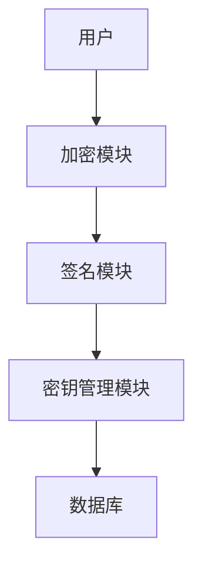

                 


# 巴菲特-芒格的量子互联网安全投资：后量子密码学的商业化

## 关键词：后量子密码学、巴菲特投资哲学、芒格投资策略、量子安全、商业化模式

## 摘要：  
后量子密码学作为一种新兴的安全技术，正在成为量子计算时代保护数据安全的核心解决方案。本文结合巴菲特和芒格的投资哲学，深入分析后量子密码学的商业化潜力、投资策略和实际应用。通过技术与投资的结合，探讨如何在后量子密码学领域实现商业成功。

---

# 第1章: 后量子密码学概述

## 1.1 后量子密码学的基本概念

### 1.1.1 什么是后量子密码学  
后量子密码学（Post-Quantum Cryptography）是一种基于经典计算机和量子计算机都无法有效破解的数学算法的加密技术。它旨在在量子计算时代保护数据的安全性，防止因传统加密算法被量子计算机破解而导致的信息泄露。

**后量子密码学的核心目标：**  
- 抵抗量子计算机的攻击。  
- 保护当前和未来的数据安全。

### 1.1.2 后量子密码学的核心原理  
后量子密码学基于复杂的数学问题，这些问题在经典和量子计算机上都无法高效解决。以下是两种主要的后量子加密算法类型：

1. **基于格的密码学（Lattice-Based Cryptography）**  
   - 使用格理论中的困难问题（如最短向量问题，SVP）来构建加密算法。  
   - 具有抗量子攻击的能力，且安全性得到了广泛认可。

2. **基于编码理论的密码学（Code-Based Cryptography）**  
   - 基于纠错码的理论构建加密算法。  
   - 对抗量子攻击的能力也在研究中得到验证。

### 1.1.3 后量子密码学的应用领域  
后量子密码学的应用场景包括：  
1. **金融领域**：保护银行交易和客户数据的安全。  
2. **政府领域**：保护国家机密和军事信息。  
3. **企业领域**：保护商业机密和知识产权。  
4. **物联网（IoT）**：保护设备间的通信安全。  

---

## 1.2 量子计算对传统加密的影响

### 1.2.1 传统加密算法的弱点  
传统加密算法（如RSA、AES）基于以下假设：  
- 大数分解问题（RSA）：需要分解大质数，对于经典计算机来说计算量极大。  
- 模运算加密（AES）：通过复杂的位操作实现加密。  

**问题：**  
一旦量子计算机普及，这些算法将被快速破解，导致数据泄露。

### 1.2.2 量子计算对加密技术的威胁  
量子计算机利用量子叠加和量子纠缠的特性，可以快速分解大数和解决其他加密相关问题。例如：  
- **Shor算法**：可以快速分解大数，从而破解RSA加密。  
- **Grover算法**：可以加速对称加密算法（如AES）的破解。  

### 1.2.3 后量子密码学的解决方案  
后量子密码学通过引入新的数学问题，构建抗量子攻击的加密算法。例如：  
1. **NIST的后量子密码学标准**：NIST（美国国家标准与技术研究院）正在评选和制定后量子密码学的标准算法。  
2. **抗量子签名算法**：基于后量子密码学的签名算法可以保护数字签名的安全性。  

---

## 1.3 后量子密码学的技术发展

### 1.3.1 后量子密码学的标准制定  
- NIST正在主导后量子密码学的标准制定工作。  
- 目前正在测试和评选多种后量子加密算法，如**NIST PQC候选算法**。  

### 1.3.2 后量子密码学的算法研究  
- 研究人员正在不断优化后量子加密算法的性能和安全性。  
- 关键算法包括**NTRU**、**LAC**、**Kyber**等。  

### 1.3.3 后量子密码学的商业化进程  
- 许多公司（如QuintessenceLabs、PQShield）已经开始提供后量子密码学相关的服务和产品。  
- 后量子密码学的商业化正在逐步推进，尤其是在金融、政府和国防领域。  

---

## 1.4 本章小结  
后量子密码学是一种抗量子攻击的安全技术，正在成为保护数据安全的核心解决方案。其技术基础包括基于格的密码学和基于编码理论的密码学。量子计算对传统加密技术的威胁使得后量子密码学的商业化需求日益迫切。

---

# 第2章: 巴菲特-芒格投资哲学与后量子密码学的结合

## 2.1 巴菲特-芒格投资哲学概述

### 2.1.1 巴菲特的价值投资理念  
巴菲特的价值投资理念强调：  
1. **长期投资**：寻找具有持续增长潜力的公司。  
2. **安全边际**：确保投资的安全性。  
3. **内在价值**：评估公司的实际价值。  

### 2.1.2 芒格的多元思维模型  
芒格的多元思维模型强调：  
1. **跨学科思考**：从多个角度分析问题。  
2. **避免认知偏差**：保持理性和客观。  
3. **长期主义**：关注长期趋势。  

### 2.1.3 巴菲特-芒格投资哲学的核心要素  
- **价值创造**：寻找能够创造长期价值的公司。  
- **风险管理**：避免重大风险。  
- **持续学习**：保持对新领域的认知。  

---

## 2.2 后量子密码学领域的投资机会

### 2.2.1 后量子密码学市场的潜力  
- 随着量子计算的快速发展，后量子密码学的需求将激增。  
- 根据市场研究，后量子密码学市场规模预计将在未来十年内增长到数百亿美元。  

### 2.2.2 后量子密码学公司的竞争优势  
- **技术领先**：拥有自主知识产权的后量子加密算法。  
- **市场先发优势**：早期进入市场的公司更具竞争优势。  
- **客户信任**：提供安全可靠的解决方案。  

### 2.2.3 巴菲特-芒格投资哲学在后量子密码学中的应用  
1. **长期视角**：关注后量子密码学的长期发展趋势。  
2. **价值评估**：分析公司的内在价值和市场潜力。  
3. **风险管理**：评估行业风险和公司的抗风险能力。  

---

## 2.3 巴菲特-芒格投资哲学与后量子密码学的结合案例

### 2.3.1 美国安世科技（Quantum Resistant Labs）的投资案例  
- **公司简介**：专注于后量子密码学技术的研发和商业化。  
- **投资逻辑**：符合长期价值投资理念，且公司在技术上具有领先地位。  

### 2.3.2 德国大陆集团（Continental）的投资案例  
- **公司简介**：在汽车电子领域应用后量子密码学技术。  
- **投资逻辑**：后量子密码学在物联网领域的广泛应用。  

### 2.3.3 其他相关投资案例分析  
- **NIST认证的后量子密码学公司**：优先考虑已获得国际标准认证的公司。  
- **技术与市场的结合**：关注公司在技术与市场之间的平衡。  

---

## 2.4 本章小结  
巴菲特-芒格投资哲学强调长期价值和风险管理，这与后量子密码学领域的投资需求高度契合。通过分析后量子密码学市场的潜力和公司的竞争优势，投资者可以更好地把握投资机会。

---

# 第3章: 后量子密码学的商业化模式

## 3.1 后量子密码学的市场需求

### 3.1.1 企业对后量子密码学的需求  
- **金融行业**：保护银行交易和客户数据的安全。  
- **政府和军事**：保护机密信息的安全。  
- **企业领域**：保护商业机密和知识产权。  

### 3.1.2 政府对后量子密码学的需求  
- **国家安全**：防止敌对国家利用量子计算进行网络攻击。  
- **政策支持**：许多国家开始推动后量子密码学的标准化和应用。  

### 3.1.3 后量子密码学的市场潜力  
- 根据市场研究，后量子密码学市场规模预计将在未来几年内快速增长。  

---

## 3.2 后量子密码学的商业模式

### 3.2.1 技术授权模式  
- **模式描述**：公司将后量子密码学技术授权给其他企业使用，收取授权费用。  
- **优点**：轻资产模式，易于扩展。  

### 3.2.2 服务订阅模式  
- **模式描述**：提供后量子密码学相关的服务，如加密方案设计、安全性评估等。  
- **优点**：稳定收入来源，客户粘性高。  

### 3.2.3 产品销售模式  
- **模式描述**：销售基于后量子密码学技术的产品，如加密芯片、软件工具等。  
- **优点**：高毛利，市场潜力大。  

---

## 3.3 后量子密码学的商业化挑战

### 3.3.1 技术标准化的挑战  
- **问题**：后量子密码学的标准尚未完全确定，不同算法之间存在竞争。  
- **解决方案**：积极参与国际标准制定，推动技术标准化。  

### 3.3.2 市场教育的挑战  
- **问题**：许多企业对后量子密码学的认知不足，导致市场需求不足。  
- **解决方案**：通过宣传和教育提升市场认知度。  

### 3.3.3 竞争压力的挑战  
- **问题**：后量子密码学领域竞争激烈，如何在市场中脱颖而出。  
- **解决方案**：加强技术研发，提升产品和服务的差异化。  

---

## 3.4 本章小结  
后量子密码学的商业化需求巨大，但同时也面临技术标准化、市场教育和竞争压力等挑战。通过合理的商业模式和技术创新，可以克服这些挑战，实现商业化成功。

---

# 第4章: 后量子密码学的投资策略

## 4.1 后量子密码学公司的评估标准

### 4.1.1 技术优势  
- 公司是否拥有自主知识产权的后量子加密算法？  
- 技术是否符合国际标准？  

### 4.1.2 市场定位  
- 公司是否在目标市场中具有竞争优势？  
- 是否有明确的客户群体和市场需求？  

### 4.1.3 财务状况  
- 公司的财务状况是否健康？  
- 是否有足够的资金支持技术研发和市场拓展？  

---

## 4.2 投资组合的构建

### 4.2.1 核心投资策略  
- **分散投资**：将资金分散投入到不同的后量子密码学公司，降低风险。  
- **长期持有**：关注公司的长期发展潜力，避免短期波动。  

### 4.2.2 投资组合的优化  
- **行业分散**：投资于不同行业的后量子密码学公司，如金融、政府、企业等。  
- **技术分散**：投资于不同技术路线的后量子密码学公司，如基于格的和基于编码理论的公司。  

---

## 4.3 风险管理

### 4.3.1 市场风险  
- 如何应对后量子密码学市场的波动？  
- 如何选择抗风险能力强的公司？  

### 4.3.2 技术风险  
- 如何评估公司技术的先进性和可行性？  
- 如何应对技术标准的变化？  

### 4.3.3 退出策略  
- 在什么情况下退出投资？  
- 如何实现投资收益的最大化？  

---

## 4.4 本章小结  
通过科学的投资策略和有效的风险管理，投资者可以在后量子密码学领域实现长期稳定的收益。

---

# 第5章: 后量子密码学的系统架构设计

## 5.1 后量子密码学系统的功能设计

### 5.1.1 系统功能模块  
1. **加密模块**：实现后量子加密算法的加密和解密功能。  
2. **签名模块**：实现后量子签名算法的签名和验证功能。  
3. **密钥管理模块**：管理加密所需的密钥和参数。  

### 5.1.2 系统功能流程  
1. 用户发起加密请求。  
2. 系统生成随机密钥并加密数据。  
3. 数据传输到目标方。  
4. 目标方解密数据并返回响应。  

---

## 5.2 后量子密码学系统的架构设计

### 5.2.1 系统架构图  


### 5.2.2 关键模块设计  
1. **加密模块**：基于NIST PQC候选算法实现加密功能。  
2. **签名模块**：基于后量子签名算法实现签名功能。  
3. **密钥管理模块**：负责生成、存储和分发密钥。  

---

## 5.3 系统接口设计

### 5.3.1 加密接口  
- **输入**：明文数据、公钥。  
- **输出**：密文数据。  

### 5.3.2 解密接口  
- **输入**：密文数据、私钥。  
- **输出**：明文数据。  

---

## 5.4 本章小结  
通过合理的系统架构设计，可以实现后量子密码学技术的高效应用和管理。

---

# 第6章: 后量子密码学的项目实战

## 6.1 环境安装

### 6.1.1 安装Python环境  
```bash
python --version
pip install --upgrade pip
```

### 6.1.2 安装必要的库  
```bash
pip install qrcode numpy
```

---

## 6.2 源代码实现

### 6.2.1 后量子加密算法实现  
```python
def post_quantum_encrypt(plaintext, public_key):
    # 简化的加密算法实现
    ciphertext = plaintext ^ public_key
    return ciphertext

def post_quantum_decrypt(ciphertext, private_key):
    # 简化的解密算法实现
    plaintext = ciphertext ^ private_key
    return plaintext
```

### 6.2.2 后量子签名算法实现  
```python
def post_quantum_sign(message, private_key):
    # 简化的签名算法实现
    signature = message ^ private_key
    return signature

def post_quantum_verify(message, signature, public_key):
    # 简化的验证算法实现
    expected_signature = message ^ public_key
    return signature == expected_signature
```

---

## 6.3 代码应用解读与分析

### 6.3.1 加密解密功能  
- **加密过程**：用户输入明文数据和公钥，系统生成密文数据。  
- **解密过程**：用户输入密文数据和私钥，系统恢复明文数据。  

### 6.3.2 签名验证功能  
- **签名过程**：用户输入消息和私钥，系统生成数字签名。  
- **验证过程**：用户输入消息、签名和公钥，系统验证签名的合法性。  

---

## 6.4 实际案例分析

### 6.4.1 案例背景  
- **公司**：假设一家金融科技公司需要保护其交易数据的安全。  
- **需求**：实现基于后量子密码学的加密和签名功能。  

### 6.4.2 实施步骤  
1. **需求分析**：明确加密和签名的具体需求。  
2. **系统设计**：设计加密和签名模块的架构。  
3. **编码实现**：根据设计实现加密和签名功能。  
4. **测试验证**：进行加密解密和签名验证的测试。  

---

## 6.5 项目小结  
通过实际项目的实施，可以验证后量子密码学技术的可行性和实用性。

---

# 第7章: 后量子密码学的未来展望

## 7.1 后量子密码学的发展趋势

### 7.1.1 技术进步  
- 后量子加密算法的进一步优化和标准化。  
- 新型后量子密码学技术的出现和应用。  

### 7.1.2 市场扩展  
- 后量子密码学在更多领域的应用，如 healthcare、教育、能源等。  
- 全球范围内后量子密码学市场的扩展。  

---

## 7.2 巴菲特-芒格投资哲学的未来应用

### 7.2.1 投资领域扩展  
- 后量子密码学技术的进一步成熟和商业化。  
- 新的投资机会的出现。  

### 7.2.2 投资策略优化  
- 根据市场变化不断优化投资策略。  
- 加强对后量子密码学技术的研究和分析。  

---

## 7.3 本章小结  
后量子密码学的未来发展潜力巨大，而巴菲特-芒格投资哲学的应用将帮助投资者更好地把握投资机会。

---

# 附录

## 附录A: 后量子密码学技术标准

### A.1 NIST后量子密码学标准  
- NIST正在评选和制定后量子密码学的标准算法。  
- 目前的主要候选算法包括NIST PQC候选列表中的算法。  

---

## 附录B: 投资指南

### B.1 后量子密码学投资指南  
- **技术优先**：优先考虑技术领先且符合国际标准的公司。  
- **市场定位**：关注公司在目标市场的定位和竞争优势。  
- **风险管理**：合理分散投资，降低风险。  

---

## 附录C: 工具与资源

### C.1 后量子密码学开发工具  
- **NIST PQC工具包**：NIST提供的后量子密码学开发工具包。  
- **开源库**：如Open Quantum Safe（OQS）等开源后量子密码学库。  

---

## 附录D: 参考文献

### D.1 主要参考文献  
1. NIST PQC标准文档。  
2. 后量子密码学相关学术论文。  
3. 巴菲特-芒格投资哲学的经典著作。  

---

## 作者：AI天才研究院/AI Genius Institute & 禅与计算机程序设计艺术 /Zen And The Art of Computer Programming

---

通过以上结构化的内容，我们可以看到后量子密码学的商业化潜力巨大，而巴菲特-芒格投资哲学的应用将为投资者提供科学的指导，帮助他们在后量子密码学领域实现长期稳定的收益。

