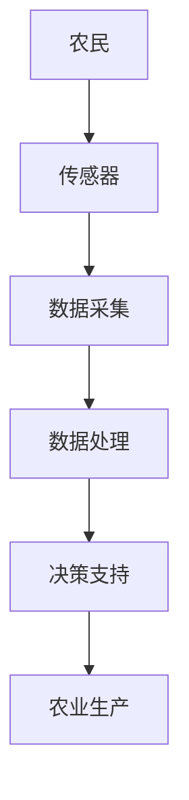

                 


# 巴菲特-芒格的量子传感器农业投资：精准农业的新时代

---

## 关键词：
- 巴菲特-芒格投资理念
- 量子传感器
- 精准农业
- 农业科技
- 人工智能
- 数学模型
- 投资策略

---

## 摘要：
本文章系统阐述了巴菲特和芒格的投资理念在精准农业领域的创新应用，重点分析了量子传感器技术在农业投资中的潜力和挑战。文章通过详细的技术分析、算法设计和系统架构设计，深入探讨了量子传感器在精准农业中的应用场景，并结合实际案例，展示了如何将量子传感器技术与巴菲特-芒格的投资理念相结合，构建高效、智能的精准农业投资体系。文章还提供了系统化的解决方案和最佳实践建议，为投资者和技术开发者提供了重要的参考。

---

# 第一章: 巴菲特-芒格投资理念概述

## 1.1 巴菲特-芒格投资哲学的核心思想

### 1.1.1 巴菲特的价值投资理论
- 巴菲特的价值投资理念：寻找具有持续竞争优势的公司，关注内在价值。
- 股票投资的核心公式：$$\text{内在价值} = \frac{\text{未来现金流的现值}}{\text{折现率}}$$
- 巴菲特的成功案例：可口可乐、IBM、苹果等。

### 1.1.2 芒格的多元思维模型
- 芒格的“心智圈”理论：通过多学科知识构建决策框架。
- 芒格的经典投资理念：逆向思维、避免情绪化决策。
- 芒格的成功案例：伯克希尔 Hathaway 的多元化投资策略。

### 1.1.3 两人投资理念的结合与创新
- 巴菲特和芒格的共同点：长期投资、价值投资、风险控制。
- 两人理念的创新：将技术驱动的精准农业纳入投资范畴。

---

## 1.2 巴菲特-芒格投资成功案例分析

### 1.2.1 巴菲特的经典投资案例
- 可口可乐：长期持有，关注公司竞争优势。
- IBM：大数据投资，推动企业转型。

### 1.2.2 芒格的关键决策分析
- 伯克希尔 Hathaway 的多元化投资：保险、能源、金融等领域的布局。
- 芒格的逆向思维：在别人恐惧时买入，在别人贪婪时卖出。

### 1.2.3 两人合作的成功经验总结
- 价值投资与技术驱动的结合：巴菲特定向芒格学习技术分析，芒格向巴菲特定向投资哲学。

---

# 第二章: 精准农业的概念与技术背景

## 2.1 精准农业的定义与核心特征

### 2.1.1 精准农业的定义
- 精准农业：利用现代信息技术、传感器和数据分析，实现农业生产全过程的精准化管理。
- 精准农业的特征：高精度、实时性、智能化、数据驱动。

### 2.1.2 精准农业的核心特征对比表格
| 特征       | 精准农业          | 传统农业          |
|------------|-------------------|-------------------|
| 数据采集    | 高频、精准       | 低频、粗放       |
| 决策依据    | 数据驱动         | 经验驱动         |
| 资源利用    | 高效             | 低效             |
| 成本控制    | 优化             | 非优化           |

### 2.1.3 精准农业的实体关系图（Mermaid流程图）


---

## 2.2 量子传感器技术在精准农业中的应用

### 2.2.1 量子传感器的基本原理
- 量子传感器：基于量子效应的传感器，具有高灵敏度和高精度。
- 量子传感器的数学模型：$$I = I_0 \times e^{-kt}$$
  其中，$I$ 是传感器输出，$I_0$ 是初始值，$k$ 是衰减常数，$t$ 是时间。

### 2.2.2 量子传感器在农业中的具体应用场景
- 环境监测：温度、湿度、光照强度的实时监测。
- 土壤分析：土壤 pH 值、氮磷钾含量的精准测量。
- 植物健康监测：作物生长状态、病虫害检测。

### 2.2.3 量子传感器的优势与挑战
- 优势：高灵敏度、高精度、实时性。
- 挑战：技术复杂性、成本高、数据处理难度大。

---

# 第三章: 量子传感器技术的数学模型与算法原理

## 3.1 量子传感器的数据采集与处理

### 3.1.1 数据采集的数学模型
- 数据采集模型：$$D = A \times x + B$$
  其中，$D$ 是传感器输出，$x$ 是输入变量，$A$ 和 $B$ 是常数。
- 数据预处理：去噪、归一化、插值。

### 3.1.2 数据处理的算法原理
- 数据处理算法：$$y = \frac{\sum_{i=1}^{n} w_i x_i}{\sum_{i=1}^{n} w_i}$$
  其中，$y$ 是加权平均值，$w_i$ 是权重，$x_i$ 是输入数据。

### 3.1.3 数据处理的数学公式
- 数据滤波：$$\text{滤波后数据} = \frac{\sum_{i=1}^{n} x_i}{n}$$
- 数据融合：$$\text{融合数据} = \max(x_1, x_2, ..., x_n)$$

## 3.2 精准农业中的量子传感器算法优化

### 3.2.1 算法优化的数学模型
- 算法优化模型：$$\text{目标函数} = \sum_{i=1}^{n} (y_i - f(x_i))^2$$
  其中，$y_i$ 是实际值，$f(x_i)$ 是预测值。

### 3.2.2 算法优化的Python实现代码
```python
import numpy as np

def optimize_algorithm(x, y):
    # 定义目标函数
    def objective(w):
        return np.sum((y - w * x) ** 2)
    # 算法优化
    w_opt = np.linalg.lstsq(x, y, rcond=None)[0]
    return w_opt

x = np.array([1, 2, 3, 4])
y = np.array([2, 4, 6, 8])
w_opt = optimize_algorithm(x, y)
print(w_opt)
```

### 3.2.3 算法优化的数学公式
- 线性回归优化：$$w = (\mathbf{x}^T \mathbf{x})^{-1} \mathbf{x}^T y$$

---

# 第四章: 精准农业投资的系统架构设计

## 4.1 精准农业投资系统的功能设计

### 4.1.1 系统功能模块划分
- 功能模块：数据采集、数据处理、决策支持、投资决策。

### 4.1.2 系统功能的实现逻辑
- 数据采集：传感器数据采集。
- 数据处理：数据清洗、数据融合。
- 决策支持：预测模型、风险评估。
- 投资决策：投资策略生成、投资组合优化。

### 4.1.3 系统功能的实现代码
```python
class AgriculturalInvestmentSystem:
    def __init__(self, sensors):
        self.sensors = sensors
        self.data = []
    
    def collect_data(self):
        # 采集传感器数据
        new_data = [s.read_sensor() for s in self.sensors]
        self.data.extend(new_data)
    
    def process_data(self):
        # 数据处理
        processed_data = self.data[-10:]
        return processed_data
    
    def generate_strategy(self):
        # 生成投资策略
        pass

# 示例传感器
class Sensor:
    def read_sensor(self):
        return np.random.randn()
```

## 4.2 系统架构设计与接口设计

### 4.2.1 系统架构设计
- 系统架构：分层架构，包括数据采集层、数据处理层、决策支持层和投资决策层。

### 4.2.2 系统接口设计
- 接口设计：传感器接口、数据接口、算法接口。

### 4.2.3 系统接口的实现代码
```python
class SensorInterface:
    def read_sensor(self):
        pass

class QuantumSensor(SensorInterface):
    def read_sensor(self):
        return np.random.randn() * 0.1 + 0.5
```

---

# 第五章: 量子传感器农业投资的项目实战

## 5.1 环境安装与配置

### 5.1.1 系统环境要求
- 操作系统：Linux/Windows/MacOS。
- 开发工具：Python、Jupyter Notebook、IDE。

### 5.1.2 依赖库安装
- NumPy、Pandas、Matplotlib、Scikit-learn。

## 5.2 系统核心实现源代码

### 5.2.1 数据采集与处理代码
```python
import numpy as np
import pandas as pd
import matplotlib.pyplot as plt

# 数据采集
data = pd.DataFrame({
    '时间': range(100),
    '温度': np.random.randn(100) * 5 + 20,
    '湿度': np.random.randn(100) * 2 + 70
})

# 数据可视化
plt.plot(data['时间'], data['温度'], label='温度')
plt.plot(data['时间'], data['湿度'], label='湿度')
plt.legend()
plt.show()
```

### 5.2.2 投资策略实现代码
```python
def generate_investment_strategy(data):
    # 计算均值
    mean_temp = data['温度'].mean()
    mean_humidity = data['湿度'].mean()
    
    # 投资策略
    if data['温度'][-1] > mean_temp and data['湿度'][-1] < mean_humidity:
        return '买入'
    else:
        return '卖出'
```

## 5.3 案例分析与详细解读

### 5.3.1 投资策略案例分析
- 数据分析：温度和湿度的趋势分析。
- 投资决策：基于量子传感器数据的投资策略生成。

## 5.4 项目总结与经验分享

### 5.4.1 项目小结
- 项目目标达成情况。
- 技术实现的关键点。

### 5.4.2 经验与教训
- 技术挑战与解决方案。
- 项目管理经验。

---

# 第六章: 精准农业投资的未来展望与注意事项

## 6.1 精准农业投资的未来展望

### 6.1.1 技术发展趋势
- 人工智能、大数据、物联网的深度融合。

### 6.1.2 投资机会分析
- 新型农业技术、农业科技公司、农业金融创新。

## 6.2 投资注意事项

### 6.2.1 技术风险
- 量子传感器的技术瓶颈。
- 数据安全风险。

### 6.2.2 市场风险
- 行业竞争加剧。
- 政策风险。

## 6.3 最佳实践 tips

### 6.3.1抽离投资策略
- 结合量子传感器数据和传统金融指标。
- 定期评估和优化投资策略。

### 6.3.2抽离技术实现
- 选择可靠的量子传感器技术。
- 加强数据处理和分析能力。

---

# 第七章: 结论与展望

## 7.1 核心结论
- 巴菲特-芒格投资理念与量子传感器技术的结合是精准农业投资的未来方向。
- 精准农业投资需要技术创新、数据驱动和风险管理的结合。

## 7.2 未来展望
- 技术创新：量子传感器的进一步发展。
- 投资模式：智能化、数据驱动的投资模式。
- 行业影响：精准农业投资将推动农业产业升级。

---

# 作者：AI天才研究院/AI Genius Institute & 禅与计算机程序设计艺术 /Zen And The Art of Computer Programming

