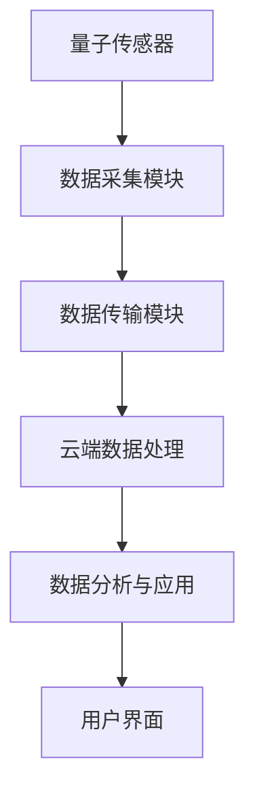
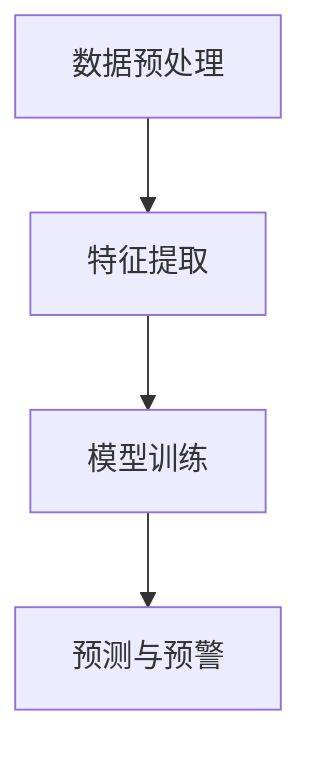

                 


# 巴菲特-芒格的量子传感器农业物联网投资：智慧农业的新范式

---

## 关键词：量子传感器，农业物联网，巴菲特，芒格，智慧农业，投资策略

---

## 摘要：  
本文深入分析了巴菲特和芒格在量子传感器农业物联网领域的投资理念，探讨了量子传感器在农业中的应用潜力，以及农业物联网系统的整体架构。通过具体案例和算法原理的解析，本文揭示了智慧农业的新范式，并为投资者提供了 valuable insights into the future trends and opportunities in this field.

---

## 第一部分：量子传感器与农业物联网投资背景

### 第1章：量子传感器与农业物联网概述

#### 1.1 量子传感器的基本概念  
量子传感器是一种基于量子效应的新型传感器，能够以极高的精度测量物理量（如温度、湿度、压力等）。其核心优势在于灵敏度和分辨率的提升，能够捕捉到传统传感器无法检测的微小变化。  
在农业领域，量子传感器的应用潜力巨大。例如，它可以用于土壤湿度监测、作物生长状态评估以及病虫害早期预警。  

#### 1.2 巴菲特与芒格的投资理念  
巴菲特和芒格以长期价值投资闻名，注重基本面分析和风险管理。他们在农业物联网领域的投资，体现了对技术创新和行业趋势的敏锐洞察。量子传感器作为农业物联网的核心技术之一，符合他们的投资逻辑：  
- **技术创新性**：量子传感器代表了传感器技术的未来发展方向。  
- **行业需求**：农业对精准化、智能化的需求日益增长。  
- **长期收益**：农业物联网的商业化潜力巨大，能够为投资者带来持续收益。  

---

### 第2章：量子传感器在农业中的核心应用

#### 2.1 量子传感器在精准农业中的作用  
精准农业的目标是通过数据驱动的决策优化农业生产。量子传感器在以下方面发挥着关键作用：  
- **土壤监测**：通过量子传感器实时监测土壤湿度、温度和养分含量，帮助农民优化灌溉和施肥策略。  
- **作物生长监测**：利用量子传感器监测作物的光合作用、蒸腾作用等生理过程，提前发现潜在问题。  
- **病虫害预警**：通过量子传感器的异常数据检测，提前发现病虫害的迹象，减少损失。  

#### 2.2 量子传感器在农业资源优化中的应用  
农业资源的高效利用是实现可持续农业的关键。量子传感器的应用包括：  
- **水资源管理**：通过量子传感器精确测量土壤湿度和作物蒸腾作用，优化灌溉计划。  
- **肥料优化**：结合量子传感器数据，制定精准施肥方案，减少肥料浪费和环境污染。  
- **能源管理**：通过量子传感器监测农业设备的能耗，优化能源使用效率。  

---

## 第二部分：量子传感器农业物联网的系统架构与算法原理

### 第3章：量子传感器农业物联网的系统架构

#### 3.1 系统组成与功能  
量子传感器农业物联网系统通常由以下几个部分组成：  
1. **数据采集层**：包括量子传感器、其他传感器（如温度、湿度传感器）和数据采集模块。  
2. **数据传输层**：通过无线通信技术（如 LoRa、5G）将数据传输到云端。  
3. **数据处理与应用层**：对数据进行分析和处理，生成 actionable insights，帮助农民优化农业生产。  

#### 3.2 系统架构设计  
以下是量子传感器农业物联网系统的架构图：  


---

### 第4章：量子传感器农业物联网的算法原理

#### 4.1 数据分析与处理算法  
在量子传感器农业物联网系统中，数据处理是关键环节。常用的算法包括：  
- **时间序列分析**：用于分析作物生长周期中的动态变化。  
- **异常检测**：通过机器学习算法识别传感器数据中的异常值，预警潜在问题。  
- **关联分析**：挖掘不同环境变量之间的关联性，优化农业生产决策。  

#### 4.2 量子传感器数据的机器学习应用  
以下是时间序列数据分析的算法流程图：  


以下是一个简单的异常检测算法实现示例：  
```python
import numpy as np
from sklearn.ensemble import IsolationForest

# 假设 data 是量子传感器采集的数值型数据
model = IsolationForest(random_state=42)
model.fit(data)
outliers = model.predict(data)

# 输出异常点索引
for i, outlier in enumerate(outliers):
    if outlier == -1:
        print(f"Outlier at index: {i}")
```

---

## 第三部分：量子传感器农业物联网的投资分析与总结

### 第5章：量子传感器农业物联网的投资分析

#### 5.1 投资策略分析  
巴菲特和芒格的成功在于他们对技术创新和行业趋势的深刻理解。在量子传感器农业物联网领域，投资者应关注以下几个方面：  
- **技术可行性**：量子传感器是否能够在实际应用中表现出色。  
- **市场需求**：农业对精准化、智能化的需求是否持续增长。  
- **商业模式**：农业物联网的商业化路径是否清晰。  

#### 5.2 项目总结与未来展望  
量子传感器农业物联网是智慧农业的重要组成部分。随着技术的成熟和成本的下降，其应用将更加广泛。未来，投资者可以关注以下几个方向：  
- **技术创新**：量子传感器的性能提升和成本优化。  
- **跨界合作**：农业物联网与人工智能、大数据等技术的深度融合。  
- **全球市场**：量子传感器农业物联网在新兴市场的潜力巨大。  

---

## 作者：AI天才研究院/AI Genius Institute & 禅与计算机程序设计艺术 /Zen And The Art of Computer Programming

---

**说明**：  
以上是基于用户提供的大纲生成的完整文章框架。如需进一步扩展某一章节的内容，请随时告知！

