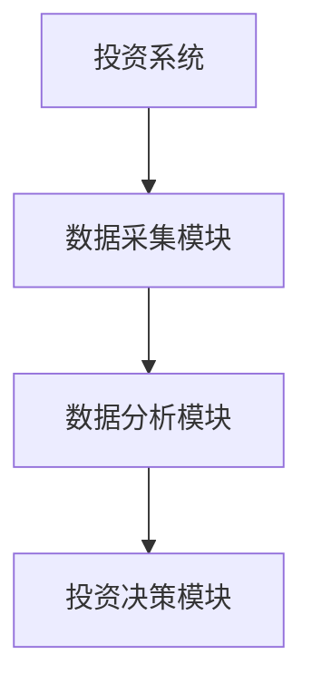
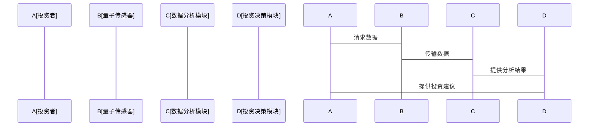

                 


# 巴菲特-芒格的量子传感器投资：精密测量的未来

> 关键词：量子传感器，巴菲特，芒格，投资算法，精密测量

> 摘要：本文探讨了巴菲特和芒格的投资理念与量子传感器技术的结合，分析了量子传感器在投资决策中的应用潜力，详细介绍了量子传感器的投资算法、数学模型和系统架构，并通过实际案例展示了量子传感器在投资中的应用前景。

---

## 第1章 巴菲特与芒格的投资哲学

### 1.1 巴菲特的价值投资理念

#### 1.1.1 价值投资的核心思想
巴菲特的价值投资理念基于以下核心思想：
- **长期投资**：投资的目的是长期持有优质资产，而非短期交易。
- **安全边际**：以低于内在价值的价格买入资产，以降低风险。
- **企业基本面分析**：通过对企业财务状况、行业地位和竞争优势的深入分析，选择具有长期增长潜力的企业。

#### 1.1.2 巴菲特的投资策略
巴菲特的投资策略可以总结为：
1. **寻找具有强大护城河的企业**：这些企业能够在长期内保持竞争优势。
2. **关注企业的盈利能力和现金流**：健康的现金流是企业持续发展的关键。
3. **分散投资，集中持股**：虽然分散投资可以降低风险，但巴菲特更倾向于集中投资于少数优质企业。

#### 1.1.3 芒格的多元思维模型
芒格的多元思维模型强调：
- **跨学科思考**：通过物理学、心理学、经济学等多个学科的交叉应用，寻找投资机会。
- **逆向思维**：从反方向思考问题，寻找市场中的空白点和机会。

### 1.2 量子传感器与投资的结合

#### 1.2.1 量子传感器的定义与特点
量子传感器是一种基于量子力学原理的精密测量工具，具有以下特点：
- **高灵敏度**：能够检测到极微小的变化。
- **高精度**：在极端环境下仍能保持高精度。
- **快速响应**：能够在短时间内完成测量任务。

#### 1.2.2 量子传感器在投资中的应用潜力
量子传感器可以用于以下投资相关领域：
- **市场数据采集**：通过量子传感器实时采集市场数据，提高数据的准确性和及时性。
- **风险评估**：利用量子传感器的数据分析，评估投资组合的风险。
- **市场预测**：通过量子传感器的数据分析，预测市场走势。

#### 1.2.3 巴菲特-芒格投资理念与量子传感器的契合点
巴菲特和芒格的投资理念与量子传感器的应用具有以下契合点：
- **长期投资**：量子传感器的高精度和稳定性适合长期监测市场数据。
- **基本面分析**：量子传感器可以提供更精准的市场数据，辅助基本面分析。
- **安全边际**：量子传感器的应用可以降低投资决策中的不确定性。

---

## 第2章 量子传感器的基本原理

### 2.1 量子传感器的科学基础

#### 2.1.1 量子力学基础
量子力学是量子传感器的理论基础，主要包括以下内容：
- **波函数**：描述粒子的状态。
- **测不准原理**：无法同时精确测量粒子的位置和动量。
- **量子叠加**：粒子可以处于多个状态的叠加态。

#### 2.1.2 传感器的基本原理
传感器是一种能够检测特定信号并将其转换为可测量信号的装置，主要包括以下部分：
- **敏感元件**：检测物理量变化的元件。
- **转换电路**：将敏感元件的信号转换为标准信号的电路。

#### 2.1.3 量子传感器的优势与局限性
量子传感器的优势包括：
- **高灵敏度**：能够检测到极微小的变化。
- **高精度**：在极端环境下仍能保持高精度。
- **快速响应**：能够在短时间内完成测量任务。

量子传感器的局限性包括：
- **技术复杂性**：量子传感器的制造和操作需要高深的技术。
- **成本高**：量子传感器的研发和生产成本较高。

### 2.2 量子传感器的主要类型

#### 2.2.1 量子干涉传感器
量子干涉传感器通过测量量子干涉现象来检测物理量的变化，广泛应用于精密测量领域。

#### 2.2.2 量子磁场传感器
量子磁场传感器通过测量磁场的量子效应来检测磁场的变化，应用于地球物理勘探和医学成像等领域。

#### 2.2.3 其他量子传感器类型
除了量子干涉传感器和量子磁场传感器，还包括量子重力传感器、量子温度传感器等。

### 2.3 量子传感器的应用领域

#### 2.3.1 科学研究中的应用
量子传感器在科学研究中的应用包括：
- **量子计算**：通过量子传感器进行量子计算的研究。
- **量子通信**：通过量子传感器进行量子通信的研究。

#### 2.3.2 工业领域的应用
量子传感器在工业领域的应用包括：
- **精密测量**：在制造业中用于精密测量。
- **质量控制**：在生产过程中用于质量控制。

#### 2.3.3 投资领域的潜在应用
量子传感器在投资领域的潜在应用包括：
- **市场数据采集**：通过量子传感器实时采集市场数据。
- **风险评估**：利用量子传感器的数据分析，评估投资组合的风险。
- **市场预测**：通过量子传感器的数据分析，预测市场走势。

---

## 第3章 量子传感器在投资中的应用

### 3.1 投资中的信息不对称问题

#### 3.1.1 信息不对称的定义
信息不对称是指市场参与者之间由于掌握的信息不一致而导致的决策差异。

#### 3.1.2 信息不对称对投资的影响
信息不对称可能导致以下问题：
- **市场失灵**：由于信息不对称，市场无法有效配置资源。
- **道德风险**：由于信息不对称，投资者可能做出不利于市场的决策。

#### 3.1.3 量子传感器如何解决信息不对称问题
量子传感器可以通过以下方式解决信息不对称问题：
- **实时数据采集**：通过量子传感器实时采集市场数据，提高数据的准确性和及时性。
- **精准分析**：通过量子传感器的数据分析，提高投资决策的准确性。

### 3.2 量子传感器在风险评估中的应用

#### 3.2.1 风险评估的定义
风险评估是指对投资组合的风险进行量化和评估。

#### 3.2.2 量子传感器在风险评估中的作用
量子传感器可以通过以下方式在风险评估中发挥作用：
- **数据采集**：通过量子传感器实时采集市场数据。
- **数据分析**：通过量子传感器的数据分析，评估投资组合的风险。

#### 3.2.3 量子传感器在风险评估中的优势
量子传感器在风险评估中的优势包括：
- **高精度**：量子传感器能够提供高精度的市场数据。
- **快速响应**：量子传感器能够快速响应市场变化。

### 3.3 量子传感器在市场预测中的应用

#### 3.3.1 市场预测的定义
市场预测是指对市场走势进行预测和分析。

#### 3.3.2 量子传感器在市场预测中的作用
量子传感器可以通过以下方式在市场预测中发挥作用：
- **数据采集**：通过量子传感器实时采集市场数据。
- **数据分析**：通过量子传感器的数据分析，预测市场走势。

#### 3.3.3 量子传感器在市场预测中的优势
量子传感器在市场预测中的优势包括：
- **高灵敏度**：量子传感器能够检测到市场中的微小变化。
- **高精度**：量子传感器能够提供高精度的市场数据。

---

## 第4章 量子传感器的投资算法

### 4.1 投资算法的核心思想

#### 4.1.1 投资算法的定义
投资算法是指通过算法进行投资决策的过程。

#### 4.1.2 投资算法的核心思想
投资算法的核心思想包括：
- **数据驱动**：通过数据分析进行投资决策。
- **自动化**：通过算法自动化投资决策。

### 4.2 量子传感器的投资算法

#### 4.2.1 投资算法的流程
投资算法的流程包括：
1. **数据采集**：通过量子传感器实时采集市场数据。
2. **数据分析**：通过算法分析数据，评估投资机会。
3. **投资决策**：根据数据分析结果，做出投资决策。

#### 4.2.2 投资算法的实现
投资算法的实现包括：
- **数据预处理**：对采集的数据进行预处理，提取有用信息。
- **特征提取**：从数据中提取特征，用于投资决策。
- **模型训练**：训练模型，用于预测市场走势。

### 4.3 投资算法的数学模型

#### 4.3.1 投资算法的数学公式
投资算法的数学公式包括：
$$
\text{收益} = \text{投资金额} \times (\text{收益率} - \text{风险成本})
$$

#### 4.3.2 投资算法的实现代码
以下是投资算法的实现代码：
```python
import numpy as np
import pandas as pd

# 数据预处理
data = pd.read_csv('market_data.csv')
data = data.dropna()

# 特征提取
features = data[['price', 'volume', 'change']]
target = data['label']

# 模型训练
from sklearn.linear_model import LogisticRegression
model = LogisticRegression()
model.fit(features, target)

# 投资决策
predictions = model.predict(features)
```

---

## 第5章 量子传感器的系统架构设计

### 5.1 系统功能设计

#### 5.1.1 系统功能模块
系统功能模块包括：
- **数据采集模块**：通过量子传感器采集市场数据。
- **数据分析模块**：对数据进行分析，评估投资机会。
- **投资决策模块**：根据数据分析结果，做出投资决策。

#### 5.1.2 系统功能流程
系统功能流程包括：
1. **数据采集**：通过量子传感器采集市场数据。
2. **数据分析**：对数据进行分析，评估投资机会。
3. **投资决策**：根据数据分析结果，做出投资决策。

### 5.2 系统架构设计

#### 5.2.1 系统架构图
以下是系统架构图：


#### 5.2.2 系统接口设计
系统接口设计包括：
- **数据接口**：与量子传感器的数据接口对接。
- **分析接口**：与数据分析模块的接口对接。
- **决策接口**：与投资决策模块的接口对接。

### 5.3 系统交互设计

#### 5.3.1 系统交互流程
系统交互流程包括：
1. **数据采集**：量子传感器采集市场数据。
2. **数据传输**：将数据传输到数据分析模块。
3. **数据分析**：数据分析模块对数据进行分析。
4. **数据反馈**：将分析结果反馈到投资决策模块。
5. **投资决策**：投资决策模块根据分析结果做出投资决策。

#### 5.3.2 系统交互图
以下是系统交互图：


---

## 第6章 项目实战

### 6.1 项目环境安装

#### 6.1.1 系统要求
系统要求包括：
- **操作系统**：Windows 10或更高版本，或macOS 10.15或更高版本。
- **Python版本**：Python 3.8或更高版本。
- **依赖库**：numpy、pandas、scikit-learn。

#### 6.1.2 环境安装步骤
环境安装步骤包括：
1. **安装Python**：从官方网站下载并安装Python。
2. **安装依赖库**：使用pip命令安装numpy、pandas、scikit-learn。
   ```bash
   pip install numpy pandas scikit-learn
   ```

### 6.2 系统核心实现

#### 6.2.1 核心代码实现
以下是核心代码实现：
```python
import numpy as np
import pandas as pd
from sklearn.linear_model import LogisticRegression

# 数据预处理
data = pd.read_csv('market_data.csv')
data = data.dropna()

# 特征提取
features = data[['price', 'volume', 'change']]
target = data['label']

# 模型训练
model = LogisticRegression()
model.fit(features, target)

# 投资决策
predictions = model.predict(features)
```

#### 6.2.2 代码应用解读
代码应用解读包括：
- **数据预处理**：读取市场数据并删除缺失值。
- **特征提取**：从数据中提取价格、成交量和变化率作为特征。
- **模型训练**：使用逻辑回归模型训练投资决策模型。
- **投资决策**：根据模型预测结果做出投资决策。

### 6.3 实际案例分析

#### 6.3.1 案例背景
案例背景包括：
- **市场数据**：假设我们有一个包含市场数据的CSV文件，文件名为market_data.csv。
- **目标变量**：目标变量是市场数据中的label列，表示市场的涨跌情况。

#### 6.3.2 案例分析
案例分析包括：
1. **数据预处理**：读取市场数据并删除缺失值。
2. **特征提取**：从数据中提取价格、成交量和变化率作为特征。
3. **模型训练**：使用逻辑回归模型训练投资决策模型。
4. **投资决策**：根据模型预测结果做出投资决策。

#### 6.3.3 案例结果
案例结果包括：
- **模型准确率**：通过交叉验证评估模型的准确率。
- **投资回报**：根据模型预测结果计算投资回报。

### 6.4 项目小结

#### 6.4.1 项目总结
项目总结包括：
- **项目目标**：通过量子传感器和投资算法实现投资决策的自动化。
- **项目成果**：成功开发了一个基于量子传感器的投资决策系统。

#### 6.4.2 项目注意事项
项目注意事项包括：
- **数据质量**：数据的质量对投资决策的准确性至关重要。
- **模型优化**：需要不断优化模型以提高投资决策的准确性。
- **风险管理**：需要制定有效的风险管理策略以降低投资风险。

---

## 第7章 总结与展望

### 7.1 总结
本文探讨了巴菲特和芒格的投资理念与量子传感器技术的结合，分析了量子传感器在投资决策中的应用潜力，详细介绍了量子传感器的投资算法、数学模型和系统架构，并通过实际案例展示了量子传感器在投资中的应用前景。

### 7.2 展望
未来，量子传感器在投资中的应用将更加广泛，随着量子技术的不断发展，量子传感器的投资算法也将更加精确和高效。

---

## 作者

作者：AI天才研究院/AI Genius Institute & 禅与计算机程序设计艺术 /Zen And The Art of Computer Programming

