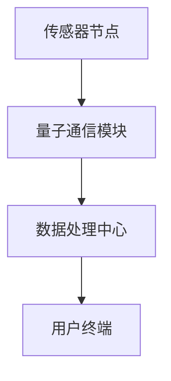
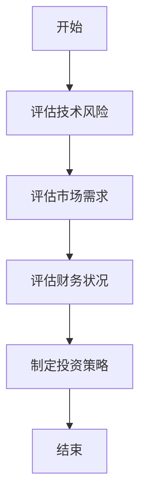
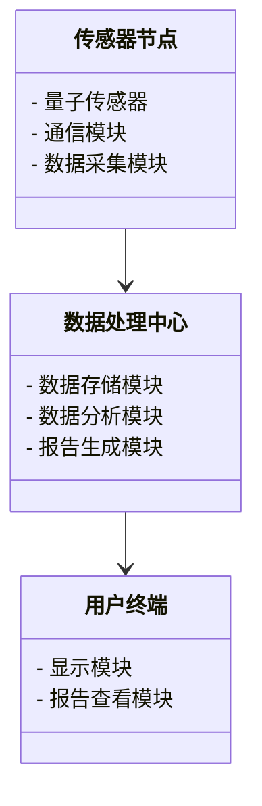

                 

# 巴菲特-芒格的量子传感器网络投资：物联网的下一代

## 关键词
量子传感器网络，巴菲特，芒格，物联网，投资策略，量子技术

## 摘要
量子传感器网络作为物联网的下一代技术，结合了量子技术和传感器网络的双重优势，为投资领域带来了全新的机遇。本文将从量子传感器网络的背景与概述出发，深入探讨巴菲特和芒格的投资理念，分析量子传感器网络的核心技术与投资价值，构建投资决策模型，并通过实际案例展示量子传感器网络在物联网中的应用。最后，本文将总结量子传感器网络的投资机会与风险管理策略，展望未来的技术发展趋势。

---

## 第一部分: 量子传感器网络的背景与概述

### 第1章: 量子传感器网络的基本概念

#### 1.1 量子技术的基本原理
量子技术是基于量子力学原理的一种新兴技术，主要涵盖量子计算、量子通信和量子传感等领域。与经典技术相比，量子技术具有更高的计算效率和更强的安全性。

- **量子计算**：利用量子位（qubit）的叠加态和纠缠态进行计算，能够在某些特定问题上远超经典计算机的性能。
- **量子通信**：利用量子纠缠实现信息的超安全传输，能够抵御传统通信中的窃听攻击。
- **量子传感**：通过测量量子系统的状态变化来感知外部环境的变化，具有极高的灵敏度和精度。

#### 1.2 传感器网络的定义与特点
传感器网络是由多个传感器节点组成的分布式网络，能够感知、采集和传输环境数据。其特点包括：

1. **分布式部署**：传感器节点可以广泛部署在不同的位置，形成覆盖范围广的感知网络。
2. **实时性**：传感器节点能够实时采集数据，并通过网络进行传输。
3. **自组织能力**：传感器网络通常具有自组织能力，节点能够自动调整网络结构以适应环境变化。

#### 1.3 量子传感器网络的优势与应用场景
量子传感器网络结合了量子技术和传感器网络的特点，具有以下优势：

1. **极高的灵敏度**：量子传感器能够检测到极微小的变化，适用于高精度测量场景。
2. **超强的安全性**：量子通信技术能够确保数据传输的安全性，防止数据被篡改或窃取。
3. **分布式感知**：量子传感器网络能够实现大范围的分布式感知，适用于智慧城市、环境监测等领域。

量子传感器网络的主要应用场景包括：

- **智慧城市**：用于交通流量监测、环境质量监测等。
- **医疗健康**：用于患者生命体征监测、医疗设备精准控制等。
- **工业物联网**：用于设备状态监测、生产过程优化等。

### 第2章: 物联网的现状与发展

#### 2.1 物联网的基本架构
物联网的基本架构包括感知层、网络层和应用层三个部分：

1. **感知层**：由传感器节点和通信模块组成，负责采集环境数据并进行初步处理。
2. **网络层**：由路由器、交换机等网络设备组成，负责数据的传输和路由。
3. **应用层**：由服务器和应用程序组成，负责数据的存储、分析和展示。

#### 2.2 物联网的演进历程
物联网的发展经历了多个阶段：

1. **单点感知阶段**：单个传感器节点独立工作，无法与其他节点通信。
2. **网络化阶段**：传感器节点通过无线通信技术实现网络化，能够进行数据传输。
3. **智能化阶段**：物联网系统具备一定的智能性，能够进行数据分析和决策。

#### 2.3 下一代物联网的核心技术
下一代物联网的核心技术包括：

1. **边缘计算**：将计算能力推向网络边缘，减少数据传输延迟。
2. **人工智能**：利用人工智能技术进行数据分析和决策优化。
3. **区块链技术**：用于物联网设备的身份认证和数据安全。

### 第3章: 巴菲特与芒格的投资理念

#### 3.1 巴菲特的价值投资理论
巴菲特的价值投资理论强调以下几点：

1. **长期投资**：关注企业的长期价值，而不是短期价格波动。
2. **安全边际**：在投资时留有安全边际，即以低于内在价值的价格买入。
3. **企业竞争优势**：投资具有强大竞争优势的企业，能够持续创造价值。

#### 3.2 芒格的多元思维模型
芒格的多元思维模型强调以下几点：

1. **跨学科思维**：将不同学科的知识结合起来，形成全面的思考方式。
2. **逆向思维**：从反方向思考问题，找到解决问题的新思路。
3. **风险管理**：关注潜在风险，制定有效的风险管理策略。

#### 3.3 投资理念与量子传感器网络的结合
量子传感器网络作为一项新兴技术，符合巴菲特和芒格的投资理念：

1. **长期价值**：量子传感器网络具有广阔的应用前景，能够为企业创造长期价值。
2. **竞争优势**：掌握量子传感器技术的企业具有强大的竞争优势，能够在市场中占据领先地位。
3. **风险管理**：量子传感器网络的投资需要关注技术风险和市场风险，制定有效的风险管理策略。

---

## 第二部分: 量子传感器网络的投资价值

### 第4章: 量子传感器网络的市场潜力

#### 4.1 市场规模与增长趋势
量子传感器网络的市场规模正在快速增长，预计在未来几年内将达到数百亿美元。主要驱动力包括：

1. **技术进步**：量子技术的快速发展推动了量子传感器网络的商业化。
2. **市场需求**：各行各业对高精度感知和高效数据处理的需求不断增加。
3. **政策支持**：政府对新兴技术的政策支持为量子传感器网络的发展提供了保障。

#### 4.2 量子传感器网络的行业应用
量子传感器网络的应用领域非常广泛，主要包括：

1. **智慧城市**：用于交通流量监测、环境质量监测等。
2. **医疗健康**：用于患者生命体征监测、医疗设备精准控制等。
3. **工业物联网**：用于设备状态监测、生产过程优化等。

#### 4.3 技术壁垒与竞争优势
量子传感器网络的技术壁垒主要体现在：

1. **技术复杂性**：量子传感器的研发需要深厚的技术积累和创新能力。
2. **成本高昂**：量子传感器的研发和生产成本较高，限制了其大规模应用。
3. **技术更新**：量子技术发展迅速，企业需要不断更新技术以保持竞争优势。

### 第5章: 巴菲特与芒格的投资策略

#### 5.1 长期价值投资的核心要素
巴菲特的长期价值投资策略强调以下几点：

1. **内在价值**：关注企业的内在价值，而不是市场波动。
2. **安全边际**：在投资时留有安全边际，确保投资的稳健性。
3. **竞争优势**：选择具有强大竞争优势的企业进行投资。

#### 5.2 企业竞争优势的分析方法
芒格的多元思维模型提供了以下分析方法：

1. **跨学科分析**：从多个角度分析企业的竞争优势，包括技术、市场、管理等方面。
2. **逆向思维**：从反方向思考问题，寻找企业的潜在优势。
3. **风险管理**：关注企业的潜在风险，制定有效的风险管理策略。

#### 5.3 量子传感器网络企业的估值模型
量子传感器网络企业的估值模型需要考虑以下因素：

1. **技术壁垒**：企业的技术优势和专利布局。
2. **市场需求**：量子传感器网络的应用前景和市场需求。
3. **财务状况**：企业的财务健康状况和盈利潜力。

---

## 第三部分: 量子传感器网络的核心技术

### 第6章: 量子传感器的基本原理

#### 6.1 量子传感器的分类
量子传感器主要分为以下几类：

1. **量子磁场传感器**：用于测量磁场的变化。
2. **量子重力传感器**：用于测量重力场的变化。
3. **量子温度传感器**：用于测量温度的变化。

#### 6.2 量子传感器的工作原理
量子传感器的工作原理基于量子力学效应，主要包括：

1. **量子干涉效应**：通过量子干涉测量物理量的变化。
2. **量子纠缠效应**：利用量子纠缠实现高精度测量。
3. **量子叠加效应**：通过量子叠加实现多参数测量。

#### 6.3 量子传感器的优势
量子传感器的优势主要体现在：

1. **高灵敏度**：能够检测到极微小的变化。
2. **高精度**：测量结果具有极高的准确性。
3. **快速响应**：能够实现快速的数据采集和处理。

### 第7章: 量子传感器网络的架构设计

#### 7.1 量子传感器网络的架构
量子传感器网络的架构主要包括以下部分：

1. **传感器节点**：负责数据的采集和初步处理。
2. **量子通信模块**：负责数据的量子传输和安全保障。
3. **数据处理中心**：负责数据的存储、分析和决策。

#### 7.2 量子传感器网络的通信协议
量子传感器网络的通信协议需要满足以下要求：

1. **安全性**：确保数据传输的安全性，防止数据被篡改或窃取。
2. **实时性**：实现数据的实时传输和处理。
3. **可靠性**：保证数据传输的稳定性，避免数据丢失或延迟。

#### 7.3 量子传感器网络的系统架构
量子传感器网络的系统架构可以用以下Mermaid图表示：

---

## 第四部分: 投资策略与决策模型

### 第8章: 投资决策模型

#### 8.1 投资决策模型的构建
量子传感器网络的投资决策模型需要考虑以下因素：

1. **技术风险**：量子传感器技术的成熟度和可靠性。
2. **市场需求**：量子传感器网络的应用前景和市场需求。
3. **财务状况**：企业的财务健康状况和盈利潜力。

#### 8.2 投资决策模型的实现
量子传感器网络的投资决策模型可以用以下流程图表示：

#### 8.3 投资决策模型的数学公式
量子传感器网络的投资价值可以通过以下数学公式进行评估：

$$
\text{投资价值} = \text{技术风险} \times \text{市场需求} \times \text{财务状况}
$$

---

## 第五部分: 项目实战与案例分析

### 第9章: 量子传感器网络的项目实战

#### 9.1 项目背景
本项目旨在开发一个基于量子传感器网络的智能交通系统，用于实时监测交通流量和道路状况。

#### 9.2 项目需求分析
项目需求包括：

1. **数据采集**：实时采集交通流量和道路状况数据。
2. **数据传输**：通过量子通信模块实现数据的安全传输。
3. **数据分析**：对采集到的数据进行分析，生成交通报告。

#### 9.3 项目系统设计
项目系统设计可以用以下类图表示：

---

## 第六部分: 总结与展望

### 第10章: 总结
量子传感器网络作为物联网的下一代技术，具有广阔的应用前景和巨大的投资价值。本文从量子传感器网络的背景与概述出发，深入探讨了巴菲特和芒格的投资理念，分析了量子传感器网络的核心技术与投资价值，构建了投资决策模型，并通过实际案例展示了量子传感器网络在物联网中的应用。

### 第11章: 展望
未来，量子传感器网络将在更多领域得到广泛应用，成为物联网发展的重要推动力。投资者需要密切关注量子传感器网络的技术发展和市场动态，制定科学的投资策略，抓住投资机遇，规避潜在风险。

---

## 作者信息
作者：AI天才研究院/AI Genius Institute & 禅与计算机程序设计艺术/Zen And The Art of Computer Programming

