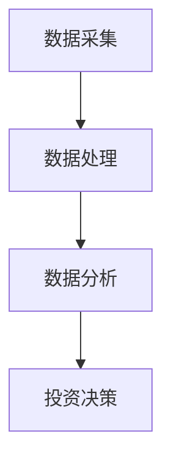
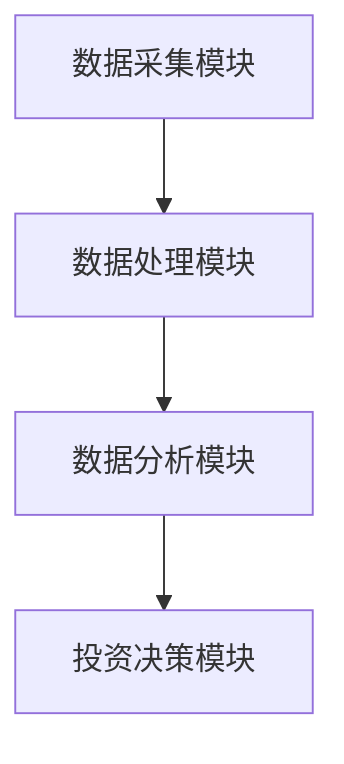
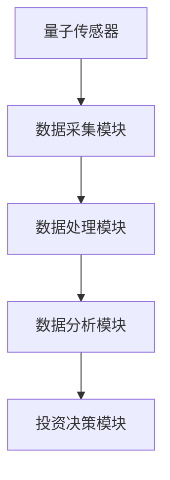
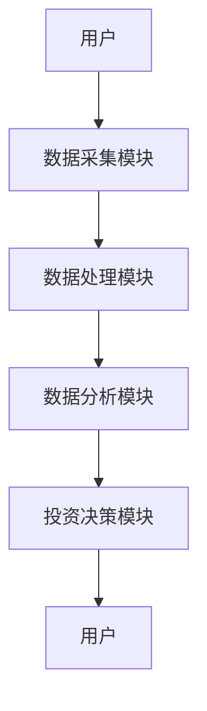

                 


# 巴菲特-芒格的量子传感器网络投资：物联网的革命性升级

---

## 关键词：
- 巴菲特投资理念
- 芒格多元思维模型
- 量子传感器网络
- 物联网技术
- 数据驱动投资

---

## 摘要：
本文探讨了巴菲特和芒格的投资理念如何与量子传感器网络和物联网技术相结合，实现投资决策的革命性升级。文章首先介绍了量子传感器网络和物联网的基本概念及其在投资中的潜力，然后分析了巴菲特和芒格的投资策略，并结合量子传感器网络的特点，提出了新的投资策略。通过具体案例分析，展示了如何利用量子传感器网络的数据优势进行投资决策，并展望了未来的发展趋势。

---

# 第1章: 量子传感器网络与物联网的概述

## 1.1 量子传感器的基本概念

### 1.1.1 量子传感器的定义
量子传感器是一种基于量子效应的传感器，能够以极高的精度测量物理量，如磁场、重力、振动等。与传统传感器相比，量子传感器具有更高的灵敏度和更低的噪声，能够在复杂环境中提供更准确的数据。

### 1.1.2 量子传感器的核心原理
量子传感器的核心原理是利用量子纠缠和超导现象，通过测量量子态的变化来感知外界环境的变化。这种技术在物理测量中具有极高的灵敏度，能够检测到传统传感器无法察觉的微小变化。

### 1.1.3 量子传感器与传统传感器的对比
| 特性          | 量子传感器                  | 传统传感器                  |
|---------------|-----------------------------|-----------------------------|
| 灵敏度        | 极高                        | 较低                        |
| 噪声          | 极低                        | 较高                        |
| 应用领域      | 高精度测量、量子计算等     | 工业检测、环境监测等        |
| 技术复杂性    | 高                         | 较低                        |

---

## 1.2 物联网的革命性升级

### 1.2.1 物联网的基本概念
物联网（IoT）是指通过各种信息传感设备，如传感器、射频识别（RFID）、全球定位系统（GPS）、红外感应器等，按照约定的协议，把任何物品与互联网连接起来，进行信息交换和通信，以实现智能化识别、定位、跟踪、监控和管理。

### 1.2.2 量子传感器在物联网中的应用
量子传感器在物联网中的应用主要体现在以下几个方面：
1. **高精度测量**：量子传感器能够提供更精确的环境数据，如温度、湿度、振动等，为物联网应用提供更可靠的数据支持。
2. **实时监测**：通过量子传感器的实时监测能力，物联网系统能够快速响应环境变化，提高系统的智能化水平。
3. **数据融合**：量子传感器与其他传感器的数据融合，能够提高数据的准确性和丰富性，为后续分析提供更全面的信息。

### 1.2.3 物联网的未来发展趋势
随着技术的进步，物联网将向更智能化、更高效化的方向发展。量子传感器的应用将推动物联网技术的升级，使其在工业、农业、医疗等领域发挥更大的作用。

---

# 第2章: 巴菲特-芒格投资理念的核心要素

## 2.1 巴菲特-芒格投资理念概述

### 2.1.1 巴菲特的价值投资原则
巴菲特的价值投资原则主要包括以下几点：
1. **长期投资**：注重长期回报，而非短期收益。
2. **安全边际**：投资时要留有足够的安全边际，以避免损失。
3. **公司基本面**：关注公司的财务状况、行业地位和竞争优势。

### 2.1.2 芒格的多元思维模型
芒格的多元思维模型强调将不同领域的知识进行交叉融合，形成一个多维度的思考框架。这种思维方式能够帮助投资者更好地理解和分析问题。

### 2.1.3 两人投资理念的结合
巴菲特和芒格的投资理念结合了长期价值投资和多元思维模型，形成了独特的投资策略。他们注重对公司基本面的分析，同时结合多维度的思考，寻找具有长期增长潜力的投资标的。

---

## 2.2 投资理念与量子传感器网络的结合

### 2.2.1 量子传感器网络的投资价值
量子传感器网络的投资价值主要体现在以下几个方面：
1. **数据优势**：量子传感器能够提供更精确、更全面的数据，为投资决策提供更有力的支持。
2. **实时监测**：通过实时监测环境变化，投资者能够更及时地做出反应，抓住投资机会。
3. **技术壁垒**：量子传感器技术具有较高的技术壁垒，能够为投资者提供独特的竞争优势。

### 2.2.2 物联网革命对投资的影响
物联网的革命性升级将对投资领域产生深远影响。通过量子传感器网络，投资者能够更高效地获取和分析数据，从而做出更科学的投资决策。

### 2.2.3 投资策略的创新应用
结合量子传感器网络的特点，投资者可以采用以下创新策略：
1. **数据驱动投资**：利用量子传感器提供的数据，进行精准的投资决策。
2. **动态调整**：根据实时数据的变化，动态调整投资策略。
3. **跨领域应用**：将量子传感器网络应用于多个领域，寻找跨领域的投资机会。

---

# 第3章: 量子传感器网络的投资策略

## 3.1 投资策略的核心要素

### 3.1.1 数据驱动的投资决策
数据驱动的投资决策是量子传感器网络投资的核心要素。通过分析量子传感器提供的数据，投资者可以更准确地评估投资标的的价值。

### 3.1.2 量子传感器网络的数据优势
量子传感器网络的数据优势主要体现在以下几个方面：
1. **高精度**：量子传感器能够提供更精确的数据，为投资决策提供更可靠的支持。
2. **实时性**：量子传感器能够实时监测环境变化，帮助投资者及时做出反应。
3. **全面性**：通过量子传感器网络，投资者可以获取更全面的数据，从而做出更科学的投资决策。

### 3.1.3 投资策略的动态调整
动态调整是量子传感器网络投资的重要特点。根据实时数据的变化，投资者可以随时调整投资策略，以应对市场变化。

---

## 3.2 投资策略的实施步骤

### 3.2.1 数据采集与处理
数据采集与处理是量子传感器网络投资的第一步。通过量子传感器，投资者可以实时采集环境数据，并对其进行处理和分析。

### 3.2.2 数据分析与建模
数据分析与建模是投资决策的关键步骤。通过分析量子传感器提供的数据，投资者可以建立数学模型，预测投资标的的未来走势。

### 3.2.3 投资决策的制定与执行
根据数据分析的结果，投资者可以制定具体的投资策略，并执行投资操作。

---

# 第4章: 量子传感器网络的算法原理

## 4.1 量子传感器网络的算法原理

### 4.1.1 算法的基本原理
量子传感器网络的算法原理主要包括数据采集、数据处理、数据分析和投资决策四个步骤。通过这些步骤，投资者可以实现从数据到决策的全过程。

### 4.1.2 算法流程图


### 4.1.3 算法的数学模型
以下是一个简单的数据预测模型：
$$
y = a_1x_1 + a_2x_2 + \cdots + a_nx_n + b
$$
其中，$y$ 是预测值，$x_i$ 是输入变量，$a_i$ 是系数，$b$ 是截距。

---

## 4.2 算法的实现与优化

### 4.2.1 算法实现
以下是量子传感器网络算法的Python实现：
```python
import numpy as np

# 数据采集
data = np.random.randn(100, 5)

# 数据处理
processed_data = data[:, 0:3]

# 数据分析
from sklearn.linear_model import LinearRegression
model = LinearRegression()
model.fit(processed_data, data[:, 3])

# 投资决策
predictions = model.predict(processed_data)
```

### 4.2.2 算法优化
通过调整模型参数和优化算法，可以提高量子传感器网络的预测精度。例如，使用更复杂的模型或引入更多的数据特征。

---

# 第5章: 系统分析与架构设计

## 5.1 系统功能设计

### 5.1.1 系统功能模块
量子传感器网络系统主要包括以下功能模块：
1. **数据采集模块**：负责采集量子传感器的数据。
2. **数据处理模块**：对采集的数据进行预处理和清洗。
3. **数据分析模块**：对数据进行分析和建模，生成预测结果。
4. **投资决策模块**：根据分析结果，制定投资策略。

### 5.1.2 系统功能流程图


## 5.2 系统架构设计

### 5.2.1 系统架构图


## 5.3 系统接口设计

### 5.3.1 接口描述
1. **数据采集接口**：负责与量子传感器通信，获取数据。
2. **数据处理接口**：对数据进行清洗和预处理。
3. **数据分析接口**：与数据分析模块交互，生成预测结果。
4. **投资决策接口**：根据分析结果，生成投资策略。

## 5.4 系统交互流程图

### 5.4.1 交互流程图


---

# 第6章: 项目实战

## 6.1 项目介绍

### 6.1.1 项目背景
本项目旨在通过量子传感器网络，实现对某个领域的实时监测，并基于数据分析结果，制定投资策略。

### 6.1.2 项目目标
通过量子传感器网络，实现对环境数据的实时采集、处理和分析，并基于分析结果，制定投资策略。

---

## 6.2 项目核心实现

### 6.2.1 环境配置
以下是项目所需的环境配置：
- 操作系统：Linux
- 开发工具：Python、Jupyter Notebook
- 依赖库：numpy、pandas、scikit-learn

### 6.2.2 核心代码实现
以下是项目的Python代码实现：
```python
import numpy as np
import pandas as pd
from sklearn.linear_model import LinearRegression

# 数据采集
data = pd.read_csv('data.csv')

# 数据处理
processed_data = data.dropna()

# 数据分析
model = LinearRegression()
model.fit(processed_data[['feature1', 'feature2']], processed_data['target'])

# 投资决策
predictions = model.predict(processed_data[['feature1', 'feature2']])
```

---

## 6.3 案例分析

### 6.3.1 案例背景
本案例以智能交通系统为例，通过量子传感器网络，实现对交通流量的实时监测，并基于数据分析结果，制定投资策略。

### 6.3.2 数据分析与建模
通过量子传感器网络，实时采集交通流量数据，并使用线性回归模型进行预测。

### 6.3.3 投资决策
根据预测结果，制定投资策略，例如在高峰期增加投资，低谷期减少投资。

---

# 第7章: 总结与展望

## 7.1 总结
本文探讨了巴菲特和芒格的投资理念与量子传感器网络和物联网技术的结合，提出了新的投资策略。通过具体案例分析，展示了如何利用量子传感器网络的数据优势进行投资决策。

## 7.2 未来展望
随着量子传感器技术和物联网技术的不断发展，量子传感器网络在投资领域的应用将更加广泛。未来，投资者可以通过量子传感器网络实现更高效、更精准的投资决策。

---

# 附录

## 附录A: 量子传感器网络相关技术术语

- 量子传感器：基于量子效应的传感器，具有极高的灵敏度和精度。
- 物联网：通过各种信息传感设备，将物品与互联网连接起来，实现智能化识别、定位、跟踪、监控和管理。

---

## 附录B: 巴菲特和芒格的经典语录

- 巴菲特：价格如合理，我就买入；价格如不合理，我就等待。
- 芒格：多元思维模型是理解世界的重要工具。

---

## 作者：
作者：AI天才研究院/AI Genius Institute  
作者：禅与计算机程序设计艺术/Zen And The Art of Computer Programming

