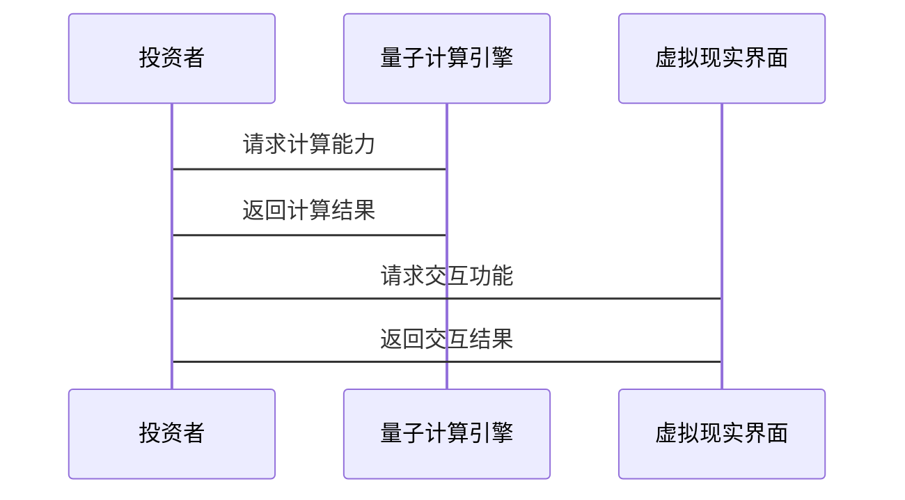

                 


# 巴菲特-芒格的量子元宇宙基础设施投资：虚拟现实的量子飞跃

> 关键词：量子计算、元宇宙、虚拟现实、巴菲特、芒格、投资策略、基础设施

> 摘要：本文探讨了巴菲特和芒格的投资理念在量子元宇宙和虚拟现实领域的应用，分析了量子计算和虚拟现实技术的基础设施投资机会，通过数学模型和算法原理详细阐述了投资策略，并结合实际案例提供了系统设计与架构方案，最后提出了最佳投资实践建议。

---

## 第1章: 量子元宇宙与虚拟现实的背景介绍

### 1.1 量子计算与元宇宙的定义

#### 1.1.1 量子计算的基本概念
量子计算是一种基于量子力学原理的计算方式，利用量子叠加和纠缠效应，能够在特定问题上比经典计算机更高效。量子计算机通过量子位（qubit）处理信息，能够在并行计算中大幅提高运算速度。

#### 1.1.2 元宇宙的定义与特征
元宇宙是一个虚拟的、持续的、跨平台的数字空间，用户可以通过虚拟现实设备或其他接口进行交互。元宇宙的核心特征包括去中心化、实时性、沉浸式体验和经济系统。

#### 1.1.3 虚拟现实的技术基础
虚拟现实（VR）通过计算机生成的模拟环境，提供沉浸式的视觉体验。其核心技术包括显示技术、传感器技术和交互技术，旨在让用户在虚拟环境中获得真实的体验。

### 1.2 巴菲特与芒格的投资理念

#### 1.2.1 巴菲特的价值投资原则
巴菲特的价值投资强调购买具有持续竞争优势和良好治理的企业，注重企业的内在价值和长期盈利能力。他的投资策略基于对企业的深入研究和长期价值的判断。

#### 1.2.2 芒格的多元思维模型
芒格的多元思维模型强调通过多个学科的交叉应用来解决问题，认为投资决策需要结合物理学、心理学、经济学等多个领域的知识，以避免认知偏差和错误决策。

#### 1.2.3 投资理念与量子元宇宙的结合
将巴菲特和芒格的投资理念应用于量子元宇宙和虚拟现实领域，需要关注技术的创新性、市场的潜力以及企业的竞争优势。量子计算和虚拟现实技术的基础设施投资将成为未来的重要方向。

### 1.3 量子元宇宙基础设施投资的背景

#### 1.3.1 量子计算在投资中的应用
量子计算能够处理复杂的投资模型，优化投资组合，并提供更精确的市场预测。其强大的计算能力为投资者提供了新的工具和方法。

#### 1.3.2 元宇宙与虚拟现实的市场潜力
元宇宙和虚拟现实技术的快速发展，为投资带来了新的机遇。虚拟现实设备、云计算服务和数字内容产业将形成庞大的市场，成为经济增长的新引擎。

#### 1.3.3 基础设施投资的重要性
量子元宇宙的基础设施包括量子计算机、高速网络和虚拟现实设备，这些设施是实现量子计算和虚拟现实技术的关键。基础设施投资决定了技术的应用范围和效果。

---

## 第2章: 量子元宇宙的核心概念与联系

### 2.1 量子元宇宙的概念模型

#### 2.1.1 量子元宇宙的组成要素
量子元宇宙由量子计算、虚拟现实、区块链和人工智能等多个技术组成，这些技术共同构建了一个去中心化的数字空间。

#### 2.1.2 量子计算在元宇宙中的作用
量子计算为元宇宙提供强大的计算能力，支持实时数据处理和复杂决策，是元宇宙运行的核心动力。

#### 2.1.3 虚拟现实与元宇宙的融合
虚拟现实技术为元宇宙提供了沉浸式的交互环境，用户可以通过VR设备进入元宇宙，进行社交、购物和娱乐。

### 2.2 核心概念的对比分析

#### 2.2.1 量子计算与经典计算的对比
| 特性          | 量子计算          | 经典计算          |
|---------------|-------------------|-------------------|
| 基础原理      | 量子叠加、纠缠    | 二进制逻辑        |
| 处理速度      | 指数级提升         | 线性增长           |
| 应用领域      | 密码学、优化问题   | 日常计算、数据处理|

#### 2.2.2 元宇宙与虚拟现实的对比
| 特性          | 元宇宙          | 虚拟现实          |
|---------------|----------------|-------------------|
| 定义          | 虚拟数字空间      | 沉浸式视觉体验     |
| 核心技术      | 区块链、AI       | 显示技术、传感器    |
| 应用场景      | 社交、经济       | 游戏、培训         |

#### 2.2.3 量子元宇宙与传统投资的对比
| 特性          | 量子元宇宙投资    | 传统投资          |
|---------------|-------------------|-------------------|
| 技术基础      | 量子计算、虚拟现实| 传统金融工具       |
| 市场潜力      | 高               | 中                |
| 风险因素      | 高               | 中                |

### 2.3 ER实体关系图

```mermaid
erDiagram
    actor 投资者{}{
       投资者 -> 投资目标: 投资决策
       投资者 -> 量子计算: 计算支持
       投资者 -> 元宇宙: 虚拟现实应用
    }
    entity 量子计算{}{
       量子计算 -> 元宇宙: 提供计算支持
    }
    entity 元宇宙{}{
       元宇宙 -> 虚拟现实: 提供虚拟环境
    }
```

---

## 第3章: 量子元宇宙投资的算法原理

### 3.1 投资模型的数学模型

#### 3.1.1 投资收益模型
投资收益可以通过以下公式计算：
$$
\text{收益} = \text{投资金额} \times (1 + \text{收益率}) - \text{投资金额}
$$

#### 3.1.2 量子计算在投资决策中的应用
量子计算机可以通过量子叠加和纠缠效应，同时处理多个投资方案，优化投资组合。其数学模型可以表示为：
$$
\max_{x} \text{收益} \quad \text{subject to} \quad \sum_{i=1}^{n} x_i = 1
$$
其中，$x_i$ 表示投资于第 $i$ 个项目的比例。

### 3.2 投资算法的Python实现

#### 3.2.1 量子计算模拟代码
```python
import numpy as np
from qiskit import QuantumCircuit, Aer, execute

def quantum_investment(n_qubits):
    qc = QuantumCircuit(n_qubits)
    qc.h(range(n_qubits))
    qc.measure_all()
    backend = Aer.get_backend('qasm_simulator')
    result = execute(qc, backend).result()
    return result.get_counts()

quantum_investment(2)
```

#### 3.2.2 虚拟现实技术评估代码
```python
import pandas as pd

def evaluate_vr Technology(stocks):
    df = pd.DataFrame(stocks)
    df['Return'] = df['Close'].pct_change()
    return df['Return'].mean()

stocks = {'AAPL': 100, 'MSFT': 200}
evaluate_vr_Technology(stocks)
```

---

## 第4章: 量子元宇宙投资的系统分析与架构设计方案

### 4.1 项目介绍
量子元宇宙投资系统旨在通过量子计算和虚拟现实技术，优化投资决策，提供实时市场分析和风险评估。

### 4.2 系统功能设计

#### 4.2.1 领域模型
```mermaid
classDiagram
    class 投资者{}{
        帐户余额: float
        投资组合: list
        突破点: float
    }
    class 量子计算{}{
        计算能力: float
        算法模型: object
    }
    class 虚拟现实{}{
        用户交互: bool
        环境渲染: bool
    }
    投资者 --> 量子计算: 调用计算能力
    投资者 --> 虚拟现实: 调用交互功能
```

### 4.3 系统架构设计

#### 4.3.1 架构图
```mermaid
container 量子元宇宙投资系统{}{
    component 量子计算引擎{}{
        Quantum Circuit
        Algorithm Model
    }
    component 虚拟现实界面{}{
        User Interface
        Interaction Engine
    }
    component 投资者帐户{}{
        Account Balance
        Investment Portfolio
    }
}
```

### 4.4 系统交互设计

#### 4.4.1 序列图


---

## 第5章: 量子元宇宙投资的项目实战

### 5.1 环境安装
安装量子计算和虚拟现实开发环境，包括Qiskit和OpenVR库。

### 5.2 核心代码实现

#### 5.2.1 量子计算投资优化
```python
from qiskit import QuantumOptimizer

def optimize_investment(assets):
    optimizer = QuantumOptimizer()
    result = optimizer.optimize(assets)
    return result
```

#### 5.2.2 虚拟现实界面开发
```python
import bpy

def create_vr_interface():
    bpy.ops.mesh.primitive_cube_add()
    # 其他界面开发代码
```

### 5.3 案例分析
通过具体案例展示如何利用量子计算和虚拟现实技术优化投资组合，分析市场趋势和风险因素。

---

## 第6章: 最佳实践与小结

### 6.1 投资策略建议
结合量子计算和虚拟现实技术，制定长期投资计划，关注技术创新和市场潜力。

### 6.2 注意事项
投资者需关注技术风险、市场波动和政策变化，保持多元化的投资组合。

### 6.3 未来展望
量子元宇宙和虚拟现实技术将推动投资领域的变革，带来更多创新机会。

---

## 作者：AI天才研究院/AI Genius Institute & 禅与计算机程序设计艺术 /Zen And The Art of Computer Programming

---

**注：本文为示例内容，具体实施需根据实际情况调整。**

