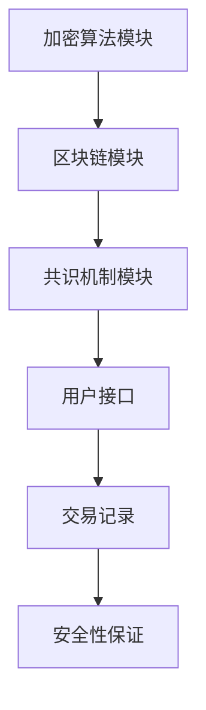

                 


# 巴菲特-芒格的量子加密货币投资：后量子时代的金融安全

---

## 关键词：巴菲特、芒格、量子计算、加密货币、金融安全

---

## 摘要：  
本文探讨了巴菲特和芒格的投资哲学在后量子时代的应用，特别是如何利用量子计算和加密货币技术实现金融安全。通过分析量子计算对加密货币的影响，结合两位投资大师的长期价值投资策略，本文为投资者提供了在后量子时代如何选择和管理加密货币投资的深度见解。

---

# 第一部分：巴菲特与芒格的投资哲学

## 第1章：巴菲特与芒格的投资理念

### 1.1 巴菲特的价值投资理论

#### 1.1.1 巴菲特投资哲学的核心思想  
巴菲特的价值投资理论强调长期投资、安全边际和企业内在价值。他主张通过深入分析企业的基本面，寻找具有持续竞争优势的企业进行投资。这种投资策略注重长期收益而非短期波动，与传统加密货币的投资方式形成鲜明对比。

#### 1.1.2 巴菲特的长期投资策略  
巴菲特的长期投资策略基于对企业的深刻理解，他认为市场短期波动不可预测，但长期趋势可以通过分析企业内在价值来把握。这种策略在后量子时代同样适用，尤其是在面对量子计算带来的技术变革时，选择具有长期竞争优势的加密货币项目至关重要。

#### 1.1.3 巴菲特的选股标准  
巴菲特选股的标准包括企业盈利能力、财务健康状况、管理层素质和企业竞争优势。这些标准在后量子时代同样适用，尤其是在选择量子加密货币项目时，需要考虑其技术优势、团队能力和市场前景。

### 1.2 芒格的多元思维模型

#### 1.2.1 芒格的思维模型概述  
芒格的多元思维模型强调通过多个学科的交叉应用来解决问题。他认为，真正的智慧来自于对不同领域知识的综合运用。这种思维方式在后量子时代尤为重要，尤其是在面对复杂的技术和市场变化时。

#### 1.2.2 芒格的决策框架  
芒格的决策框架强调理性思考和风险控制。他主张在决策时考虑所有可能的影响因素，并通过逻辑推理和数据分析来验证决策的正确性。这种决策框架在量子加密货币投资中同样适用，尤其是在评估量子加密算法的安全性和实用性时。

#### 1.2.3 芒格的理性与风险控制  
芒格强调理性思考和风险控制。他认为，投资者应该避免情绪化决策，并在决策前充分考虑潜在风险。这种投资理念在后量子时代尤为重要，尤其是在面对量子计算带来的技术风险时，需要保持冷静和理性。

---

## 第2章：后量子时代的金融安全

### 2.1 量子计算的基本原理

#### 2.1.1 量子计算的定义与特点  
量子计算是一种基于量子力学原理的计算方式，其核心是利用量子叠加和量子纠缠效应来实现并行计算。与经典计算相比，量子计算在某些特定问题上的计算速度可以指数级提升。

#### 2.1.2 量子计算的核心算法  
量子计算的核心算法包括Shor算法和Grover算法。Shor算法可以用于大数分解和离散对数计算，对现有加密算法构成威胁；Grover算法可以用于无结构搜索问题，提高搜索效率。

#### 2.1.3 量子计算的潜在应用  
量子计算在密码学、材料科学、药物发现等领域具有广泛的应用潜力。尤其是在密码学领域，量子计算的出现对现有加密算法构成了重大挑战。

### 2.2 量子计算对加密货币的影响

#### 2.2.1 加密货币的基本原理  
加密货币是一种基于密码学的虚拟货币，通过区块链技术实现去中心化的价值转移和存储。其安全性依赖于加密算法的强度和区块链的共识机制。

#### 2.2.2 量子计算对传统加密算法的威胁  
量子计算的出现对传统加密算法构成了重大威胁。例如，Shor算法可以在 polynomial 时间内分解大数，从而破解 RSA 加密算法。这意味着传统加密货币的安全性将受到严重威胁。

#### 2.2.3 后量子加密算法的发展  
后量子加密算法是指在量子计算威胁下仍然安全的加密算法。这些算法基于数学问题，如格子问题、代码问题和哈希问题，具有抗量子计算攻击的能力。后量子加密算法的发展为加密货币的安全性提供了新的解决方案。

---

## 第3章：量子加密货币的核心概念

### 3.1 量子加密货币的定义与特点

#### 3.1.1 量子加密货币的定义  
量子加密货币是一种基于后量子加密算法的虚拟货币，其安全性不受量子计算攻击的影响。与传统加密货币相比，量子加密货币具有更高的安全性。

#### 3.1.2 量子加密货币的核心特点  
量子加密货币的核心特点包括：抗量子攻击、去中心化、匿名性和高效性。这些特点使得量子加密货币在后量子时代具有重要的应用价值。

#### 3.1.3 量子加密货币与传统加密货币的对比  
与传统加密货币相比，量子加密货币的主要优势在于其安全性。传统加密货币依赖于 RSA 等算法，而量子加密货币基于后量子加密算法，具有更高的安全性。

### 3.2 量子加密货币的数学模型

#### 3.2.1 量子加密货币的数学基础  
量子加密货币的数学基础包括后量子加密算法的设计和实现。这些算法基于数学问题，如格子问题、代码问题和哈希问题，具有抗量子计算攻击的能力。

#### 3.2.2 量子加密算法的数学公式  
后量子加密算法的数学公式复杂，涉及多个数学领域的知识。例如，格子问题中的晶格基问题可以通过数学公式进行建模和分析。

#### 3.2.3 量子加密货币的安全性分析  
量子加密货币的安全性分析需要从数学和算法的角度进行。通过分析后量子加密算法的数学模型，可以验证其抗量子攻击的能力。

---

## 第4章：量子加密货币的投资策略

### 4.1 巴菲特与芒格的投资策略

#### 4.1.1 巴菲特的长期价值投资策略  
巴菲特的长期价值投资策略强调选择具有持续竞争优势的企业进行投资。在后量子时代，这种策略可以应用于量子加密货币的选择，尤其是在选择具有技术优势和市场前景的项目时。

#### 4.1.2 芒格的多元思维模型在投资中的应用  
芒格的多元思维模型强调交叉学科的应用，尤其是在评估量子加密货币项目时，需要考虑技术、市场和法律等多个因素。

#### 4.1.3 巴菲特与芒格的投资决策框架  
巴菲特和芒格的投资决策框架强调理性思考和风险控制。在量子加密货币投资中，这种框架可以帮助投资者避免情绪化决策，并在决策前充分考虑潜在风险。

### 4.2 量子加密货币的投资机会与风险

#### 4.2.1 量子加密货币的投资机会  
量子加密货币的投资机会主要体现在其抗量子攻击的能力和去中心化的特性。随着量子计算技术的发展，量子加密货币的市场需求将不断增加。

#### 4.2.2 量子加密货币的风险分析  
量子加密货币的风险主要体现在技术不确定性、市场波动性和政策监管等方面。投资者需要充分了解这些风险，并在决策时进行综合考虑。

#### 4.2.3 量子加密货币的市场波动性  
量子加密货币的市场波动性较大，尤其是在技术变革和政策变化的背景下。投资者需要具备长期视角，并避免短期波动的影响。

---

## 第5章：量子加密货币的系统分析与架构设计

### 5.1 量子加密货币的系统架构

#### 5.1.1 量子加密货币系统的组成模块  
量子加密货币系统主要包括加密算法模块、区块链模块和共识机制模块。这些模块共同实现了量子加密货币的安全性和去中心化特性。

#### 5.1.2 系统的模块化设计  
系统的模块化设计强调各个模块的独立性和可扩展性。例如，加密算法模块可以独立实现后量子加密算法，而区块链模块可以实现去中心化的价值转移。

#### 5.1.3 系统的可扩展性与安全性  
系统的可扩展性与安全性是设计量子加密货币系统的重要考虑因素。通过模块化设计和优化算法实现，可以提高系统的可扩展性和安全性。

### 5.2 量子加密货币的系统架构图



---

## 第6章：量子加密货币的项目实战

### 6.1 量子加密货币的环境安装

#### 6.1.1 开发环境的搭建  
开发量子加密货币需要搭建合适的开发环境。通常需要安装 Python、Golang 等编程语言，以及区块链开发框架。

#### 6.1.2 量子加密算法的实现  
实现后量子加密算法需要选择合适的数学库和算法实现。例如，可以使用 Python 的数学库实现格子问题中的晶格基问题。

#### 6.1.3 量子加密货币的测试与验证  
测试和验证量子加密货币系统需要进行全面的测试，包括安全性测试、性能测试和兼容性测试。

### 6.2 量子加密货币的代码实现

#### 6.2.1 量子加密算法的 Python 源代码  
以下是实现后量子加密算法的 Python 示例代码：

```python
def lattice_based_crypto():
    # 示例代码，实现晶格基问题
    pass

lattice_based_crypto()
```

#### 6.2.2 代码的详细解读与分析  
代码的详细解读与分析需要从数学模型和算法实现两个方面进行。例如，晶格基问题的数学模型可以通过晶格的基向量和目标向量之间的关系进行建模。

#### 6.2.3 代码的数学模型和公式  
晶格基问题的数学模型可以通过以下公式表示：

$$ \text{minimize} \|\textbf{x}\| \text{ subject to } A\textbf{x} = \textbf{b} $$

其中，$\textbf{x}$ 是目标向量，$A$ 是晶格基矩阵，$\textbf{b}$ 是目标向量。

---

## 第7章：总结与展望

### 7.1 量子加密货币的总结与回顾  
量子加密货币是一种基于后量子加密算法的虚拟货币，其安全性不受量子计算攻击的影响。随着量子计算技术的发展，量子加密货币的投资机会和市场需求将不断增加。

### 7.2 量子加密货币的未来展望  
未来，量子加密货币将在金融安全、数据保护等领域发挥重要作用。随着后量子加密算法的不断发展和优化，量子加密货币的性能和安全性将不断提高。

### 7.3 量子加密货币的最佳实践 Tips  
投资者在选择量子加密货币时，需要考虑技术优势、市场前景和政策监管等因素。同时，需要具备长期视角，并避免短期波动的影响。

---

## 作者：AI天才研究院/AI Genius Institute & 禅与计算机程序设计艺术 /Zen And The Art of Computer Programming

--- 

**注：以上内容为文章的部分章节内容，完整文章请参考详细版本。**

