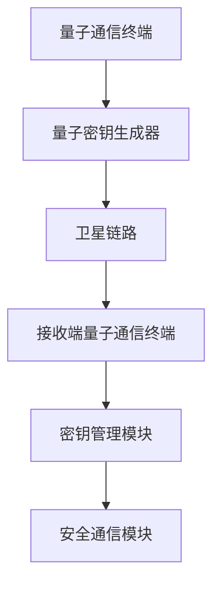

                 


# 巴菲特-芒格的量子加密通信卫星投资：全球安全通信的新标准

> 关键词：巴菲特、芒格、量子加密通信、卫星通信、安全通信、投资策略、量子技术

> 摘要：本文深入探讨了巴菲特和芒格的投资理念与量子加密通信技术的结合，重点分析了量子加密通信卫星的投资价值及其在全球安全通信领域的重要性。文章从量子加密通信的基本原理、卫星通信的优势、投资策略的分析，到系统的架构设计和项目实战，全面解析了这一领域的最新进展和未来趋势。

---

## 第一部分：量子加密通信卫星的背景与意义

### 第1章：量子加密通信技术的背景与优势

#### 1.1 量子加密通信的基本概念
量子加密通信是一种利用量子力学原理进行数据加密的技术，其核心是量子密钥分发（QKD）。与传统加密技术不同，量子加密通信的安全性基于量子力学的不确定性原理，确保密钥只能被合法用户共享，且任何未经授权的窃听都会立即被发现。

#### 1.2 传统加密技术的局限性
传统加密技术依赖于数学算法，其安全性基于计算复杂度。然而，随着量子计算的发展，许多传统加密算法（如RSA、AES）面临被破解的风险。量子加密通信则通过物理原理确保了更高的安全性。

#### 1.3 量子加密通信的优势
1. **不可破解性**：量子密钥分发确保密钥的安全性，任何窃听都会破坏量子态，从而立即被检测。
2. **全球覆盖**：通过卫星通信，量子加密通信可以实现全球范围内的安全通信。
3. **高安全性**：适用于政府、军事、金融等对安全性要求极高的领域。

---

### 第2章：巴菲特-芒格投资理念与量子技术的结合

#### 2.1 巴菲特的价值投资理论
巴菲特的价值投资理论强调长期投资、基本面分析和安全边际。他认为，投资的核心在于找到那些具有长期竞争优势的企业，并以合理的价格买入。

#### 2.2 芒格的多元思维模型
芒格提倡“多元思维模型”，即通过多个学科的交叉应用来解决复杂问题。这种思维方式特别适合应用于新兴技术领域，如量子通信。

#### 2.3 量子通信的投资价值
量子通信技术被视为未来通信领域的重要方向，具有极高的战略价值和市场潜力。巴菲特和芒格的投资理念为量子通信技术的投资提供了独特的视角，特别是在技术和市场的双重驱动下，量子加密通信卫星项目具有巨大的投资价值。

---

## 第二部分：量子加密通信的核心原理与技术

### 第3章：量子密钥分发（QKD）的原理

#### 3.1 QKD的基本概念
量子密钥分发是一种基于量子态传输的密钥分发技术。通过量子态的不可克隆性和不可分割性，确保密钥的安全性。

#### 3.2 QKD的实现过程
1. **量子态生成**：通过量子光源生成单光子脉冲。
2. **量子态传输**：通过光纤或卫星链路传输量子态。
3. **基矢选择**：双方随机选择测量基矢，比较后确定密钥。
4. **密钥提取**：通过贝尔不等式验证密钥的安全性。

#### 3.3 QKD的安全性证明
量子密钥分发的安全性基于量子力学的基本原理，任何窃听都会引入错误，从而被检测。

---

### 第4章：量子加密通信的数学模型与算法原理

#### 4.1 量子密钥生成的数学模型
$$
\text{量子密钥生成} = \text{量子态传输} \oplus \text{基矢选择}
$$

#### 4.2 量子加密算法的实现
通过Python代码实现量子密钥生成的过程：

```python
import random

def generate_quantum_key(length):
    key = []
    for _ in range(length):
        # 随机生成基矢（0表示标准基，1表示对角基）
        basis = random.choice([0, 1])
        if basis == 0:
            # 标准基测量结果
            bit = random.choice([0, 1])
        else:
            # 对角基测量结果
            bit = random.choice([0, 1])
        key.append(str(bit))
    return ''.join(key)

# 示例：生成一个10位的量子密钥
print(generate_quantum_key(10))
```

---

## 第三部分：量子加密通信卫星的系统架构与设计

### 第5章：量子加密通信卫星的系统架构

#### 5.1 系统组成
1. **量子通信终端**：用于生成和传输量子密钥。
2. **卫星链路**：实现量子态的远距离传输。
3. **密钥管理模块**：管理密钥的生成、存储和分发。
4. **安全通信模块**：基于量子密钥实现数据加密。

#### 5.2 系统功能设计
- 量子密钥生成与分发
- 数据加密与解密
- 安全性检测与监控

#### 5.3 系统架构图


---

## 第四部分：量子加密通信卫星的投资策略与实战

### 第6章：量子加密通信卫星的投资策略

#### 6.1 投资背景分析
量子通信技术的市场需求日益增长，特别是在军事、金融和政府领域。卫星通信的全球覆盖能力使其成为量子加密通信的理想选择。

#### 6.2 投资模式分析
1. **直接投资**：投资量子通信技术的研发和商业化。
2. **产业链整合**：通过收购相关企业，构建完整的量子通信产业链。
3. **战略合作**：与其他国家或企业合作，共同推动量子通信技术的发展。

#### 6.3 投资回报分析
量子通信技术具有较高的市场壁垒和技术门槛，但一旦商业化成功，将带来巨大的经济回报。

---

## 第五部分：项目实战与案例分析

### 第7章：量子加密通信卫星的项目实战

#### 7.1 项目环境配置
1. **硬件环境**：量子通信终端、卫星通信设备。
2. **软件环境**：量子密钥生成算法、卫星通信协议。

#### 7.2 核心代码实现
```python
import random

def generate_quantum_key(length):
    key = []
    for _ in range(length):
        basis = random.choice([0, 1])
        if basis == 0:
            bit = random.choice([0, 1])
        else:
            bit = random.choice([0, 1])
        key.append(str(bit))
    return ''.join(key)

def main():
    print("生成量子密钥：")
    print(generate_quantum_key(10))

if __name__ == "__main__":
    main()
```

#### 7.3 项目案例分析
通过实际案例分析，验证量子加密通信卫星在不同场景下的应用效果，并总结经验教训。

---

## 结论

量子加密通信卫星的投资不仅具有技术上的挑战性，更具有巨大的市场潜力。通过巴菲特和芒格的投资理念，我们可以更好地把握量子通信技术的商业价值。未来，随着量子通信技术的进一步发展，量子加密通信卫星将成为全球安全通信的重要支柱。

---

## 参考文献

1. 巴菲特《巴菲特致股东的信》
2. 芒格《穷查理宝典》
3. 量子通信技术相关文献
4. 卫星通信技术相关文献

---

作者：AI天才研究院

