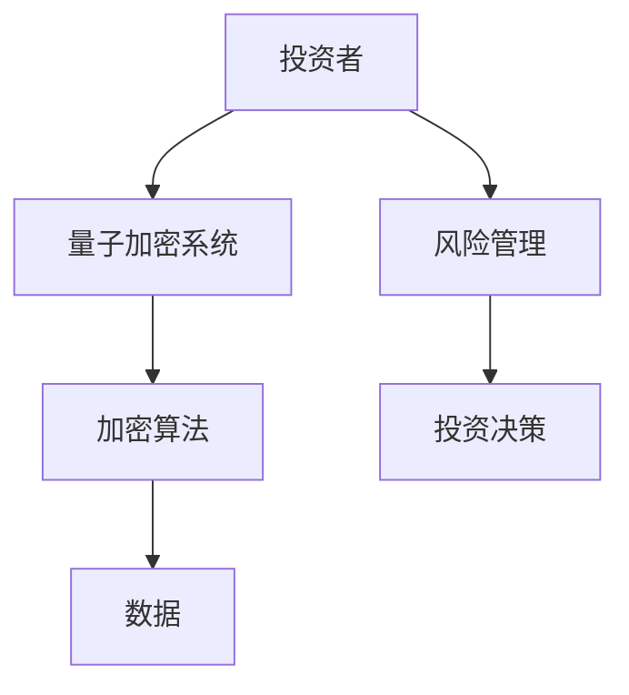
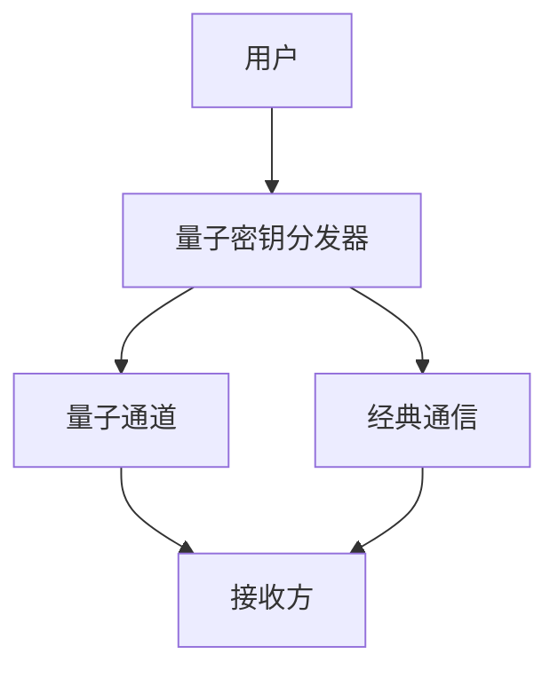

                 


# 巴菲特-芒格的量子加密通信投资：后量子时代的数据安全

## 关键词：量子加密通信，巴菲特，芒格，后量子时代，数据安全，投资策略

## 摘要：本文探讨了巴菲特和芒格的投资理念如何应用于量子加密通信领域，特别是在后量子时代的数据安全背景下。文章详细分析了量子加密的核心原理，介绍了NIST推荐的后量子加密算法，结合投资策略，提供了系统架构设计和项目实战案例，帮助读者理解如何在技术与投资之间找到平衡点。

---

## 第1章: 巴菲特-芒格的量子加密通信投资概述

### 1.1 量子计算与后量子时代的背景

#### 1.1.1 量子计算的基本原理
量子计算利用量子叠加和量子纠缠的特性，通过量子位(qubit)进行并行计算，理论上的计算速度远超经典计算机。量子位可以同时处于多个状态，这种并行性使得某些复杂问题的计算效率大幅提高。

#### 1.1.2 后量子时代的定义与特征
后量子时代指的是在抗量子计算加密算法出现之前及之后的时代，尤其是当现有的加密方法面临量子计算机威胁时，需要采用新的加密技术来保护数据安全。

#### 1.1.3 量子计算对数据安全的影响
量子计算机的出现对现有的经典加密算法构成了威胁，特别是RSA和椭圆曲线加密等公钥加密算法，这些算法在量子计算机面前变得脆弱。因此，开发抗量子加密算法成为当务之急。

### 1.2 巴菲特与芒格的投资理念

#### 1.2.1 巴菲特的价值投资策略
巴菲特的价值投资强调长期持有、注重企业基本面分析和安全边际。他寻找那些具有强大护城河和持续盈利能力的企业进行投资。

#### 1.2.2 芒格的多元思维模型
芒格强调跨学科思维，将各个领域的知识融会贯通，形成多元思维模型，从而做出更明智的投资决策。

#### 1.2.3 投资理念与量子技术的结合
巴菲特和芒格的投资理念强调长期价值和风险管理，这与量子加密技术的发展和应用高度契合，特别是在数据安全领域。

### 1.3 量子加密通信的核心概念

#### 1.3.1 加密通信的基本原理
加密通信通过将明文转换为密文，确保信息在传输过程中不被未授权的第三方窃取。传统的加密方法包括对称加密和公钥加密。

#### 1.3.2 量子加密的独特优势
量子加密通信，特别是量子密钥分发（QKD），利用量子力学原理确保密钥的安全传输，提供理论上不可破解的安全性。

#### 1.3.3 后量子时代的加密算法
后量子加密算法是在量子计算机威胁下依然安全的算法，包括NIST推荐的标准如NIST PQC（NIST Post-Quantum Cryptography）。

---

## 第2章: 量子加密通信的数学基础

### 2.1 量子加密的基本原理

#### 2.1.1 量子叠加与量子纠缠
量子叠加允许量子位同时处于多个状态，而量子纠缠则允许两个或多个量子位之间形成关联，即使相隔很远。

#### 2.1.2 量子密钥分发（QKD）的原理
QKD通过量子态传输密钥，确保只有通信双方能够生成相同的密钥，且任何窃听都会破坏量子态，从而被发现。

#### 2.1.3 量子加密算法的数学模型
量子加密算法通常基于特定的数学结构，例如格点问题（lattice-based cryptography）和哈希签名（Hash-based signatures）。

### 2.2 量子加密与经典加密的对比

#### 2.2.1 经典加密的优缺点
经典加密如RSA和AES虽然已被广泛使用，但面临量子计算机的威胁，尤其是公钥加密算法。

#### 2.2.2 量子加密的安全性分析
量子加密提供理论上的安全性，特别是在QKD中，任何未经授权的访问都会立即被检测。

#### 2.2.3 两种加密方式的对比表格
| 特性               | 经典加密           | 量子加密           |
|--------------------|--------------------|--------------------|
| 抗量子能力         | 无                | 有                |
| 密钥分发方式       | 公钥加密          | QKD               |
| 安全性             | 易受量子攻击       | 理论上不可破解      |

### 2.3 量子加密的实体关系图


---

## 第3章: 巴菲特与芒格的投资策略分析

### 3.1 巴菲特的价值投资策略

#### 3.1.1 长期投资的重要性
巴菲特强调长期投资，避免短期波动的影响，寻找那些具备持续增长潜力的企业。

#### 3.1.2 企业基本面分析
分析企业的财务状况、盈利能力、管理团队等因素，确保投资的安全性。

#### 3.1.3 安全边际的概念
在投资决策中，安全边际是指股票价格低于其内在价值的部分，确保在市场波动中仍能获得收益。

### 3.2 芒格的多元思维模型

#### 3.2.1 多学科视角的重要性
芒格强调跨学科思考，将物理学、心理学、经济学等领域的知识结合起来，以更全面的视角分析问题。

#### 3.2.2 沉淀与复利效应
芒格认为，长期的价值积累和复利效应是投资成功的关键。

#### 3.2.3 投资决策中的风险管理
芒格注重风险控制，避免高风险投资，确保投资组合的稳健性。

### 3.3 量子加密通信的投资机会

#### 3.3.1 技术成熟度评估
评估量子加密技术的成熟度，选择那些技术领先且市场潜力大的企业进行投资。

#### 3.3.2 市场需求分析
随着数据安全需求的增加，量子加密技术的市场需求将快速增长，为投资者带来丰厚回报。

#### 3.3.3 投资策略建议
投资者应关注NIST推荐的后量子加密算法，投资那些在量子加密领域具有领先技术的企业，同时注重风险管理，分散投资组合。

---

## 第4章: 量子加密通信的投资策略

### 4.1 量子加密通信的战略规划

#### 4.1.1 投资目标设定
明确投资目标，如寻找具有技术领先性和市场潜力的量子加密企业。

#### 4.1.2 投资组合配置
将量子加密投资与其他资产类别相结合，分散风险，提高整体投资回报。

### 4.2 风险管理与控制

#### 4.2.1 风险评估
识别量子加密投资中的潜在风险，如技术风险、市场风险和政策风险。

#### 4.2.2 风险控制措施
制定风险管理策略，如定期评估投资组合，分散投资领域，避免过度集中。

### 4.3 投资案例分析

#### 4.3.1 成功案例
分析成功的量子加密投资案例，如某企业在量子加密技术上的突破及其带来的投资回报。

#### 4.3.2 潜在风险
讨论量子加密投资中的潜在风险，如技术未成熟或市场竞争激烈。

---

## 第5章: 量子加密通信的系统架构设计

### 5.1 量子加密通信系统架构

#### 5.1.1 系统组成部分
量子加密系统通常包括量子光源、量子态传输通道、量子测量设备和经典通信部分。

#### 5.1.2 系统功能设计
系统功能包括密钥生成、传输、加密和解密，确保数据的安全传输。

### 5.2 系统架构图


### 5.3 系统接口设计

#### 5.3.1 量子密钥分发接口
负责生成和传输量子密钥，确保密钥的安全性。

#### 5.3.2 经典通信接口
处理明文的加密和解密，确保数据的完整性和机密性。

### 5.4 系统交互流程

#### 5.4.1 量子密钥分发流程
1. 发送方生成量子密钥并通过量子通道传输。
2. 接收方测量量子态，生成相同的密钥。
3. 双方通过经典通信确认密钥的一致性。

#### 5.4.2 数据加密流程
1. 发送方使用量子密钥加密明文。
2. 通过安全通道传输密文。
3. 接收方使用密钥解密密文，恢复原始数据。

---

## 第6章: 项目实战与代码实现

### 6.1 环境安装

#### 6.1.1 安装必要的工具
安装Python和相关库如Qpyl，用于量子加密算法的模拟和实现。

#### 6.1.2 安装步骤
```bash
pip install qpyl
```

### 6.2 量子加密算法实现

#### 6.2.1 密钥生成代码
```python
import qpyl

def generate_quantum_key(n):
    key = qpyl.generate(n)
    return key
```

#### 6.2.2 数据加密与解密
```python
def encrypt(plaintext, key):
    return qpyl.encrypt(plaintext, key)

def decrypt(ciphertext, key):
    return qpyl.decrypt(ciphertext, key)
```

### 6.3 代码应用与分析

#### 6.3.1 代码功能解读
上述代码展示了量子密钥的生成、加密和解密过程，使用Qpyl库实现。

#### 6.3.2 实际案例分析
通过具体案例，展示如何利用量子加密技术保护数据安全，实现安全通信。

---

## 第7章: 总结与展望

### 7.1 投资策略总结

#### 7.1.1 投资要点回顾
量子加密技术在后量子时代的潜力巨大，投资者应关注技术领先和市场需求的企业。

#### 7.1.2 风险管理的重要性
在投资过程中，风险管理是确保收益的关键，需持续监控市场和技术动态。

### 7.2 系统架构总结

#### 7.2.1 系统设计的关键点
量子加密系统的安全性依赖于密钥的安全分发和数据的正确加密，系统架构需简洁高效。

#### 7.2.2 未来发展方向
随着技术的进步，量子加密将更加成熟，应用场景也将不断扩大，如金融、通信和医疗等领域。

---

## 作者：AI天才研究院/AI Genius Institute & 禅与计算机程序设计艺术 /Zen And The Art of Computer Programming

---

这篇博客文章详细探讨了巴菲特和芒格的投资理念如何应用于量子加密通信领域，特别是在后量子时代的数据安全背景下。通过系统的分析和实际案例的讲解，文章为读者提供了在技术与投资之间找到平衡点的思路，帮助他们在未来的量子加密市场中做出明智的投资决策。

