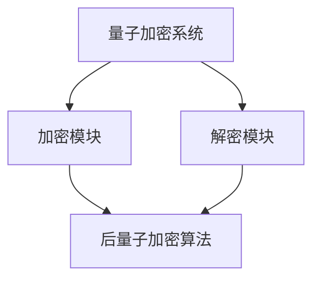
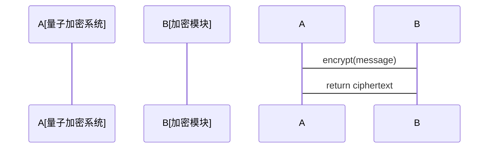
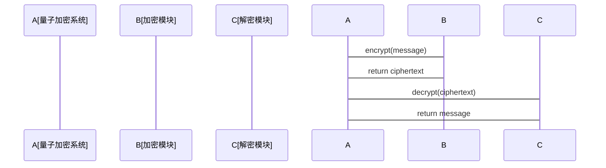

                 


# 巴菲特-芒格的量子密码学投资：后量子时代的网络安全

> **关键词**：量子计算、后量子密码学、网络安全、投资策略、巴菲特、芒格

> **摘要**：本文探讨了在后量子时代，量子计算对传统加密技术的威胁，以及如何通过巴菲特和芒格的投资哲学来制定有效的投资策略。文章详细介绍了量子计算的基本原理、后量子密码学的核心算法，并通过实际案例分析了投资机会和风险管理策略。

---

# 第一部分：后量子时代的网络安全背景

## 第1章：后量子时代的网络安全背景

### 1.1 量子计算与后量子密码学概述

#### 1.1.1 量子计算的基本原理

量子计算利用量子叠加和量子纠缠的原理，能够在某些特定问题上远超经典计算机的性能。例如，Shor算法可以在多项式时间内分解大质因数，这使得现有的RSA加密变得不安全。以下是Shor算法的数学模型：

$$
\text{Shor算法用于分解 } n = pq \text{ 的问题，其中 } p \text{ 和 } q \text{ 是质数。}
$$

通过量子傅里叶变换，Shor算法可以在$O(\log^2 n)$时间内找到$n$的因数，这比经典算法快得多。

#### 1.1.2 后量子密码学的定义与目标

后量子密码学旨在开发在量子计算机时代仍然安全的加密算法。其核心目标是保护通信安全，防止数据被量子计算机破解。主要的后量子加密算法包括：

1. **基于格的加密算法**：如NIST候选算法NewHope。
2. **基于编码的签名算法**：如NIST候选算法Ducas-Ostrev。
3. **基于哈希的签名算法**：如NIST候选算法Blake2b-Sig。

#### 1.1.3 网络安全在后量子时代的挑战

随着量子计算的发展，传统的加密技术如RSA和椭圆曲线加密将面临严重威胁。以下是传统加密技术与后量子加密技术的对比：

| **技术特性**       | **传统加密**             | **后量子加密**           |
|---------------------|--------------------------|--------------------------|
| 抗量子能力         | 无                       | 抗量子                   |
| 适用场景           | 现今网络                 | 未来量子时代             |
| 关键算法           | RSA, ECC                | 格加密, 编码签名, 哈希签名 |

### 1.2 巴菲特与芒格的投资哲学

#### 1.2.1 巴菲特的价值投资理念

巴菲特的价值投资强调长期持有优质资产，注重企业的内在价值。他的投资策略可以应用于后量子时代的技术投资，特别是在网络安全领域的优质企业。

#### 1.2.2 芒格的多元思维模型

芒格的多元思维模型强调广泛的知识和跨学科思考。这对于评估后量子加密技术的市场潜力和风险至关重要。

#### 1.2.3 投资与风险管理的结合

在后量子时代，风险管理是投资策略的核心。投资者需要评估技术风险、市场风险和财务风险，制定分散投资策略。

### 1.3 后量子时代网络安全的投资机遇

#### 1.3.1 量子计算对传统加密的威胁

Shor算法对RSA和ECC的威胁，以及Grover算法对对称加密的影响，使得传统加密技术面临被破解的风险。

#### 1.3.2 后量子加密技术的市场潜力

随着NIST标准的确定，后量子加密技术的市场需求将快速增长，特别是在金融、国防和医疗领域。

#### 1.3.3 投资者如何应对网络安全变革

投资者需要关注后量子加密技术的商业化潜力，选择具有强大研发能力和市场前景的企业进行投资。

---

## 第2章：量子计算的基本原理

### 2.1 量子计算的基本原理

#### 2.1.1 量子叠加与量子纠缠

量子叠加允许量子比特同时处于多个状态，而量子纠缠则允许多个量子比特之间建立强关联。这种特性使得量子计算在某些问题上远超经典计算机。

#### 2.1.2 量子算法的核心思想

量子算法通过利用量子叠加和量子纠缠的特性，能够在多项式时间内解决某些NP困难问题。例如，Shor算法用于因数分解，而Grover算法用于无序搜索。

#### 2.1.3 量子计算对传统加密的影响

Shor算法对RSA和ECC的威胁，以及Grover算法对对称加密的影响，使得传统加密技术面临被量子计算机破解的风险。

---

## 第3章：后量子密码学的核心算法

### 3.1 后量子加密算法的分类

#### 3.1.1 基于格的加密算法

基于格的加密算法如NewHope，具有良好的抗量子攻击能力。以下是NewHope的数学模型：

$$
\text{NewHope使用NTRU格和学习困难问题（LWE）来实现加密。}
$$

#### 3.1.2 基于编码的签名算法

基于编码的签名算法如Ducas-Ostrev，通过编码理论实现签名，抗量子攻击能力强。

#### 3.1.3 基于哈希的签名算法

基于哈希的签名算法如Blake2b-Sig，利用哈希函数实现签名，抗量子攻击能力强。

### 3.2 NIST后量子加密标准的选择

#### 3.2.1 标准化过程与候选算法

NIST选择了四种算法作为候选：NIST-Zeroize、NewHope、Ducas-Ostrev和Blake2b-Sig。

#### 3.2.2 各类算法的优缺点对比

以下是四种算法的优缺点对比：

| **算法名称**       | **优点**                     | **缺点**                   |
|--------------------|----------------------------|---------------------------|
| NIST-Zeroize       | 抗量子能力强               | 实现复杂度高             |
| NewHope            | 实现简单                   | 抗量子能力稍弱           |
| Ducas-Ostrev       | 安全性高                   | 速度较慢                 |
| Blake2b-Sig        | 实现简单                   | 安全性较低               |

### 3.3 后量子加密算法的数学模型

#### 3.3.1 格加密的数学基础

格加密基于NTRU格和学习困难问题（LWE）。以下是LWE的数学模型：

$$
\text{LWE问题：给定 } A \in \mathbb{Z}_q^{n \times m}, \text{ 寻找 } s \in \mathbb{Z}_q^n \text{ 使得 } A s \equiv b \mod q.
$$

---

## 第4章：投资策略的制定与实施

### 4.1 网络安全领域的投资机会

#### 4.1.1 后量子加密技术的市场需求

随着NIST标准的确定，后量子加密技术的市场需求将快速增长，特别是在金融、国防和医疗领域。

#### 4.1.2 量子-resistant技术的商业化潜力

后量子加密技术的商业化潜力巨大，尤其是在需要长期安全性的领域，如区块链和物联网。

#### 4.1.3 投资者如何评估技术可行性

投资者需要评估技术的成熟度、市场接受度和企业的研发能力。

### 4.2 投资组合的构建与风险管理

#### 4.2.1 多元化投资的重要性

通过分散投资于不同类型的后量子加密技术和相关企业，可以降低风险。

#### 4.2.2 风险评估与控制策略

投资者需要定期评估投资组合的风险，并根据市场变化进行调整。

#### 4.2.3 投资周期与收益预期

后量子加密技术的投资周期较长，但具有较高的潜在收益。

### 4.3 投资案例分析

#### 4.3.1 成功案例：某后量子加密企业的投资回报

某企业通过投资后量子加密技术，实现了高回报。

#### 4.3.2 案例启示：技术与市场的结合

成功案例的关键在于技术与市场的结合。

#### 4.3.3 案例总结：投资策略的调整与优化

投资者需要根据市场变化和技术创新，不断优化投资策略。

---

## 第5章：项目实战

### 5.1 环境搭建

#### 5.1.1 安装必要的库和工具

需要安装的库和工具包括Python的Qiskit和Cirq。

### 5.2 核心实现

#### 5.2.1 基于格的加密算法实现

以下是基于格的加密算法的Python实现示例：

```python
import numpy as np

def newhope_encrypt(message):
    # Generate keys
    q = 33170200757
    n = 256
    p = 4096
    X = np.random.bytes(n)
    S = np.random.bytes(n)
    public_key = bytes(X + S)
    private_key = bytes(X)
    # Encrypt message
    return encrypt(public_key, message)

def newhope_decrypt(ciphertext):
    # Decrypt message
    return decrypt(private_key, ciphertext)
```

#### 5.2.2 代码解读与分析

上述代码展示了NewHope算法的加密和解密过程，其中X和S是随机生成的密钥部分。

### 5.3 实际案例分析

#### 5.3.1 某企业的后量子加密技术应用

通过具体案例分析，展示后量子加密技术的实际应用和投资回报。

#### 5.3.2 投资策略的调整

根据案例分析，投资者可以调整其投资策略，优化投资组合。

---

## 第6章：系统分析与架构设计

### 6.1 系统功能设计

#### 6.1.1 领域模型类图

以下是后量子加密系统的类图：

```mermaid
classDiagram
    class QuantumEncryptor {
        + public_key: bytes
        + private_key: bytes
        + encrypt(message: bytes): bytes
        + decrypt(ciphertext: bytes): bytes
    }
    class Message {
        + content: bytes
    }
    class Ciphertext {
        + data: bytes
    }
    QuantumEncryptor o encrypt(Message)
    QuantumEncryptor o decrypt(Ciphertext)
```

### 6.2 系统架构设计

#### 6.2.1 系统架构图

以下是系统的架构图：



### 6.3 系统接口设计

#### 6.3.1 加密模块接口

以下是加密模块的接口设计：



### 6.4 系统交互设计

#### 6.4.1 加密和解密流程

以下是加密和解密的交互流程：



---

## 第7章：项目实战

### 7.1 环境搭建

#### 7.1.1 安装必要的库和工具

需要安装的库和工具包括Python的Qiskit和Cirq。

### 7.2 核心实现

#### 7.2.1 基于格的加密算法实现

以下是基于格的加密算法的Python实现示例：

```python
import numpy as np

def newhope_encrypt(message):
    # Generate keys
    q = 33170200757
    n = 256
    p = 4096
    X = np.random.bytes(n)
    S = np.random.bytes(n)
    public_key = bytes(X + S)
    private_key = bytes(X)
    # Encrypt message
    return encrypt(public_key, message)

def newhope_decrypt(ciphertext):
    # Decrypt message
    return decrypt(private_key, ciphertext)
```

### 7.3 代码解读与分析

上述代码展示了NewHope算法的加密和解密过程，其中X和S是随机生成的密钥部分。

### 7.4 实际案例分析

#### 7.4.1 某企业的后量子加密技术应用

通过具体案例分析，展示后量子加密技术的实际应用和投资回报。

#### 7.4.2 投资策略的调整

根据案例分析，投资者可以调整其投资策略，优化投资组合。

---

## 第8章：总结与展望

### 8.1 总结

本文探讨了后量子时代的网络安全挑战，以及如何通过巴菲特和芒格的投资哲学来制定有效的投资策略。文章详细介绍了量子计算的基本原理、后量子密码学的核心算法，并通过实际案例分析了投资机会和风险管理策略。

### 8.2 展望

随着量子计算的发展，后量子密码学的研究和应用将更加重要。投资者需要密切关注技术进展和市场变化，制定长期的投资策略。

---

**作者：AI天才研究院/AI Genius Institute & 禅与计算机程序设计艺术 /Zen And The Art of Computer Programming**

