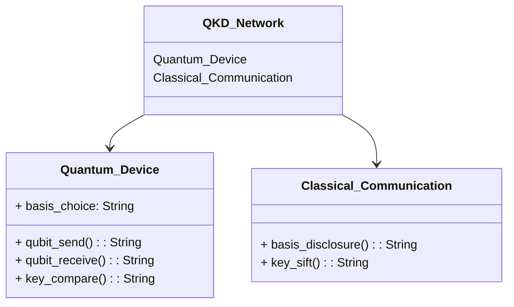
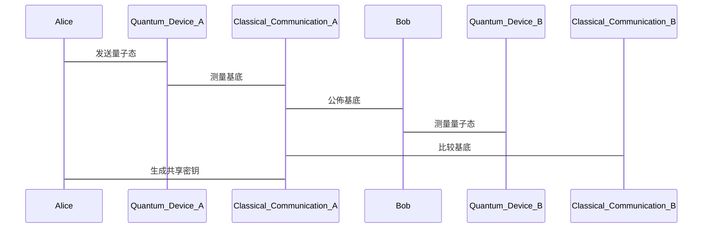

                 


# 巴菲特-芒格的量子密钥分发网络投资：网络安全的终极解决方案

## 关键词：量子密钥分发，网络安全，巴菲特，芒格，投资策略

## 摘要：本文探讨了量子密钥分发技术在网络安全中的应用，并结合巴菲特和芒格的投资理念，分析如何在量子安全领域进行有效的投资，提出了一种基于价值投资和多元思维模型的量子密钥分发网络投资策略，旨在为投资者提供网络安全的终极解决方案。

---

# 第1章 引言

## 1.1 问题背景

### 1.1.1 网络安全的现状与挑战

随着信息技术的飞速发展，网络安全问题日益严重。传统的加密技术面临被量子计算机破解的风险，这使得寻找一种不可被破解的加密方法变得尤为重要。量子密钥分发（Quantum Key Distribution, QKD）作为一种基于量子力学原理的加密技术，被认为是解决这一问题的终极方案。

### 1.1.2 传统加密技术的局限性

传统加密技术如RSA和AES虽然在当前环境下安全，但随着量子计算机的发展，这些算法可能会被破解。因此，寻找一种抗量子攻击的加密技术变得至关重要。

## 1.2 巴菲特和芒格的投资理念

### 1.2.1 巴菲特的价值投资原则

巴菲特的价值投资强调长期投资、安全边际和企业基本面分析。这种投资策略注重选择具有强大护城河和良好管理的公司。

### 1.2.2 芒格的多元思维模型

芒格的多元思维模型强调跨学科思维，通过整合不同领域的知识来做出更明智的决策。这种思维方式在评估新兴技术如QKD的投资机会时尤为重要。

## 1.3 量子密钥分发技术的引入

### 1.3.1 量子密钥分发的基本概念

QKD是一种利用量子力学原理来安全分发加密密钥的技术。它的核心在于利用量子态的不可测量性，确保密钥的分发过程无法被窃听。

### 1.3.2 量子密钥分发的优势与应用

QKD的优势在于其不可被窃听的特性，这使其成为金融、政府和军事等领域网络安全的理想选择。

---

# 第2章 量子密钥分发的背景与原理

## 2.1 量子密钥分发的基本原理

### 2.1.1 量子态与纠缠态

量子态是量子力学中的基本概念，而纠缠态则是两个或多个量子系统之间的特殊关联状态。QKD利用纠缠态的特性来实现密钥的分发。

### 2.1.2 量子密钥的生成过程

量子密钥的生成过程包括量子态的发送、测量和密钥的协商。通过这些步骤，确保密钥的安全分发。

## 2.2 量子密钥分发的技术优势

### 2.2.1 不可被窃听的特性

QKD的核心优势在于其不可被窃听的特性，任何窃听行为都会被检测到，从而确保了密钥的安全性。

### 2.2.2 高安全性与抗量子计算攻击

由于QKD基于量子力学原理，其安全性远高于传统加密技术，能够抵抗量子计算机的攻击。

## 2.3 量子密钥分发的实际应用场景

### 2.3.1 银行与金融领域的应用

在金融领域，QKD可以用于保护交易数据的安全，防止数据被窃取或篡改。

### 2.3.2 政府与军事领域的应用

政府和军事机构可以利用QKD技术来保护敏感信息的安全，确保通信的保密性。

---

# 第3章 巴菲特和芒格的投资策略

## 3.1 巴菲特的价值投资原则

### 3.1.1 长期投资与安全边际

巴菲特强调长期投资和安全边际，认为选择具有强大护城河和良好管理的公司是成功投资的关键。

### 3.1.2 企业基本面分析

企业基本面分析包括对公司的财务状况、盈利能力、管理团队等多方面的评估，以确保投资的稳健性。

## 3.2 芒格的多元思维模型

### 3.2.1 跨学科思维的重要性

芒格的多元思维模型强调跨学科思考，通过整合不同领域的知识来做出更明智的投资决策。

### 3.2.2 投资决策中的心理因素

芒格认为心理因素在投资决策中起着重要作用，投资者应避免情绪化决策，保持理性和冷静。

## 3.3 投资策略在量子技术中的应用

### 3.3.1 识别高潜力技术

通过分析量子技术的市场前景、技术成熟度和应用潜力，识别具有高投资价值的技术。

### 3.3.2 评估技术公司的投资价值

评估量子技术公司的投资价值时，应考虑其技术优势、市场定位、管理团队和财务状况等多方面因素。

---

# 第4章 量子密钥分发的算法与数学模型

## 4.1 量子密钥分发的数学基础

### 4.1.1 量子态的数学表示

量子态可以通过向量和矩阵形式进行数学表示，例如：

$$|\psi\rangle = \alpha|0\rangle + \beta|1\rangle$$

其中，$\alpha$ 和 $\beta$ 是复数，满足 $|\alpha|^2 + |\beta|^2 = 1$。

### 4.1.2 量子纠缠的数学描述

量子纠缠可以通过贝尔态（Bell states）来表示，例如：

$$|\Phi^+\rangle = \frac{1}{\sqrt{2}}(|00\rangle + |11\rangle)$$

## 4.2 量子密钥分发的协议分析

### 4.2.1 BB84协议

BB84协议是QKD的经典协议，包括量子态的发送、测量和密钥协商三个步骤。其流程如下：

1. 量子态的发送：Alice发送一系列量子态（使用两个不同的编码basis：{|0⟩, |1⟩}和{|+⟩, |−⟩}）。
2. 量子态的测量：Bob随机选择测量basis并测量接收到的量子态。
3. 量子态的比较：Alice和Bob公佈测量的basis，并比较，保留使用相同basis测量的部分作为密钥。

### 4.2.2 去除错误和信息泄露的步骤

通过基底比较，Alice和Bob会发现由于传输过程中的噪声或窃听导致的错误，并通过经典信息进行协商，最终得到一致的密钥。

---

# 第5章 系统分析与架构设计方案

## 5.1 问题场景介绍

本章将从系统设计的角度，分析量子密钥分发网络的架构设计和接口设计。

## 5.2 项目介绍

本项目旨在设计一个基于QKD技术的网络安全系统，通过构建量子密钥分发网络，实现数据的安全传输。

## 5.3 系统功能设计

### 5.3.1 领域模型（Mermaid 类图）



## 5.4 系统架构设计

### 5.4.1 系统架构（Mermaid 架构图）


## 5.5 系统接口设计

### 5.5.1 系统接口

系统接口包括量子设备接口和经典通信接口，量子设备接口用于量子态的发送和测量，经典通信接口用于基底比较和密钥协商。

### 5.5.2 系统交互（Mermaid 序列图）



---

# 第6章 项目实战

## 6.1 环境安装

为了实现QKD网络，需要安装量子通信设备和相关软件。推荐使用已有的量子通信平台，如中国的量子保密通信网络。

## 6.2 系统核心实现源代码

以下是一个简化的QKD协议实现代码示例：

```python
import random

def generate_basis():
    return random.choice(['Z', 'X'])

def send_qubit(basis):
    # 模拟量子态的发送
    if basis == 'Z':
        return random.choice(['0', '1'])
    else:
        return random.choice(['+', '-'])

def receive_qubit(basis):
    # 模拟量子态的测量
    if basis == 'Z':
        return random.choice(['0', '1'])
    else:
        return random.choice(['+', '-'])

def compare_bases(a_basis, b_basis):
    return a_basis == b_basis

# 模拟QKD协议
def qkd_protocol():
    key = []
    basis_choice = []
    for _ in range(100):
        a_basis = generate_basis()
        b_basis = generate_basis()
        basis_choice.append((a_basis, b_basis))
        qubit = send_qubit(a_basis)
        measured_qubit = receive_qubit(b_basis)
        if compare_bases(a_basis, b_basis):
            key.append(qubit)
    return ''.join(key), basis_choice

# 运行协议
shared_key, basis_choices = qkd_protocol()
print("共享密钥:", shared_key)
print("基底选择:", basis_choices)
```

---

# 第7章 最佳实践与小结

## 7.1 投资策略 tips

1. **长期投资**：选择具有长期发展潜力的量子技术公司。
2. **安全边际**：确保投资标的具有足够的安全边际。
3. **跨学科分析**：利用多元思维模型进行综合分析。

## 7.2 系统设计 tips

1. **模块化设计**：确保系统各模块的独立性和可扩展性。
2. **安全性评估**：定期进行安全性评估，确保系统免受攻击。
3. **容错设计**：设计合理的容错机制，确保系统的稳定性。

## 7.3 小结

通过结合巴菲特和芒格的投资理念，我们可以找到具有高投资价值的量子技术公司，并利用其技术优势构建安全的量子密钥分发网络。这种投资策略不仅能够实现网络安全的终极解决方案，还能为投资者带来长期的收益。

---

## 作者：AI天才研究院 & 禅与计算机程序设计艺术

---

# 结语

量子密钥分发技术作为网络安全的终极解决方案，不仅能够抵抗量子计算机的攻击，还能为金融、政府和军事等领域提供安全保障。通过结合巴菲特和芒格的投资理念，我们可以更好地识别高潜力技术和公司，实现长期稳健的投资回报。未来，随着量子技术的不断发展，网络安全将更加依赖于像QKD这样的先进技术，而我们也将继续探索和应用这些技术，为社会的安全和稳定做出贡献。

